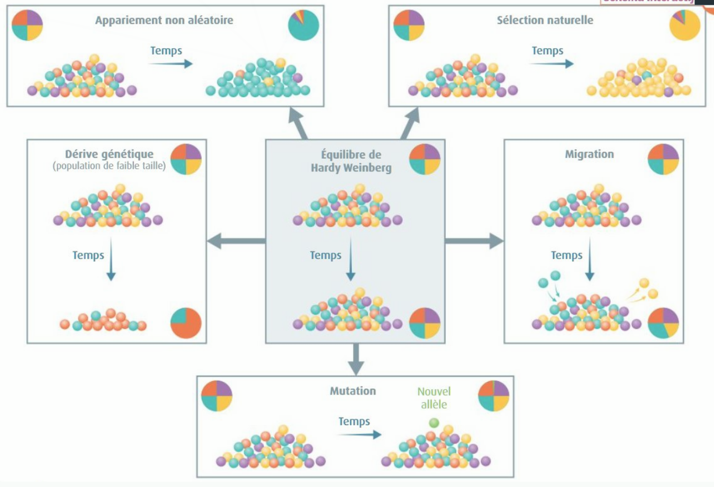
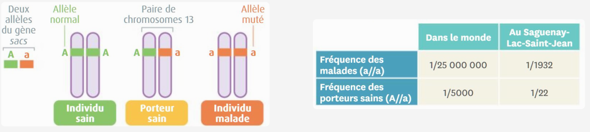
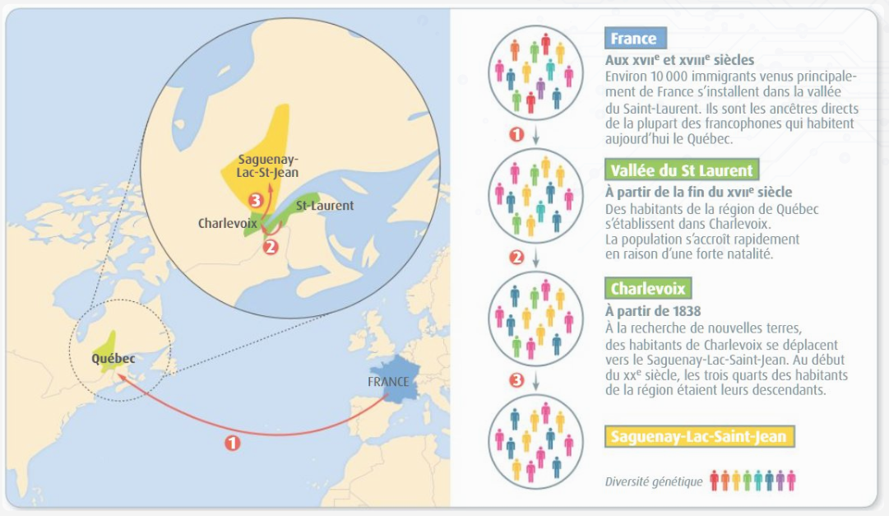

[pdf](./3_3_limite_hardy_weinberg.pdf)

# LES ÉCARTS AU MODÈLE D’HARDY-WEINBERG

_Pour de nombreux gènes dans une population, la loi de Hardy-Weinberg ne peut s’appliquer car les hypothèses de départ ne sont pas respectées. Dans ce cas, la fréquence des allèles évolue au cours du temps._

## 1. Les écarts à l’équilibre de Hardy-Weinberg

> Beaucoup de populations naturelles s’écartent de l’équilibre de Hardy-Weinberg, situation théorique. Un tel écart, quantifiable, est la signature qu’une ou plusieurs hypothèses ne sont pas remplies et qu’une ou plusieurs forces évolutives ont agi. La **reproduction** peut ainsi s’éloigner des accouplements aléatoires, par exemple dans le cas de sélection des partenaires. La sélection, souvent observée, trie parmi les différents caractères ayant une base génétique, liés à la capacité des individus à survivre et/ou se reproduire selon l’environnement. Elle aboutit à la fixation d’un allèle favorable ou à la disparition d’un allèle délétère. La **migration**, mouvement d’individus qui vont se reproduire ou de gamètes entre populations, aboutit à homogénéiser ces populations. Les **mutations**, changement aléatoire de la séquence du gène, créent de nouveaux allèles. Elles sont importantes chez de grandes populations comme les bactéries. Enfin, la **dérive génétique**, en petite population, fixera aléatoirement certains allèles.

_Interview de Christine Vassiliadis -- Maître de conférences à l’Université Paris-Saclay, Orsay (extrait n°1)_

Les billes de différentes couleurs représentent la diversité allélique.

## 2. Documents

### Document 1 : Interview de Christine Vassiliadis -- Maître de conférences à l’Université Paris-Saclay, Orsay (extrait n°2)

> La dérive génétique s’observe lorsque l’une des hypothèses de Hardy-Weinberg n’est pas respectée : la population est trop petite pour être considérée comme infinie. En effet, la reproduction sexuée opère un « tirage au sort » des allèles de chaque gène qui se retrouvent chez les enfants, puisque chaque parent ne transmet qu’un seul de ses deux allèles. Dans les populations de faible effectif, tout se passe comme s’il n’y avait pas suffisamment de tirages au sort pour que les allèles aient la même fréquence à la génération des parents et à la génération des enfants. On peut prendre l’image suivante : lorsqu’on lance seulement 10 fois une pièce non truquée, on pourra par exemple obtenir « pile » avec une fréquence de 0,8. Le « face » sera sous-représenté. Si on lance 1 000 fois la même pièce, la fréquence moyenne obtenue s’écartera peu de 0,5. Avec la reproduction sexuée, il n’est plus question de pile ou de face d’un dé, mais d’allèle d’un gène. Dans les populations de faible effectif, la fréquence d’un allèle peut se trouver fortement augmentée ou diminuée par le seul hasard lié à la reproduction sexuée : c’est la dérive génétique.

### Document 2 : L’ataxie spastique au Québec

La population du Saguenay-Lac-St-Jean au Québec présente un grand nombre d’individus atteints d’une maladie génétique, l’ataxie spastique. Cette pathologie provoque entres autres des troubles de la motricité. Un seul gène, appelé sacs, est impliqué dans la maladie et l’allèle muté est récessif

### Document 3 : Histoire de l’établissement des Français au Saguenay-Lac-St-Jean (Québec).

### Questions

1. [DOC. 1] Déterminez dans quelles conditions la dérive génétique peut avoir lieu.
2. [DOC. 2]

   a) La somme des fréquences génotypiques étant de 1, déterminer $f (A//A)$

   b) Calculer les fréquences de l’allèle muté a puis de l’allèle A dans le monde et au Saguenay-Lac-Saint-Jean

   c) Indiquez en justifiant si l’équilibre de Hardy-Weinberg est respecté pour le gène considéré dans la population du Saguenay-Lac-Saint-Jean

3. [DOC. 3] Expliquez l’origine de la forte présence de cette maladie génétique dans cette région du Canada.

## Exercice

Le phylloxéra (_Daktulosphaira vitifoliae_) est un puceron parasite de la vigne, introduit accidentellement au XIXe siècle en Europe. Il se reproduit par reproduction sexuée ou asexuée. La structure génétique d’une population européenne de phylloxéra a été étudiée en utilisant un gène présentant deux allèles : A1 et A2.

Les résultats sont les suivants :

1. Génotype (A1/A1) : 246
1. Génotype (A2/A2) : 109
1. Génotype (A1/A2) : 138

Cette population vérifie-t-elle l’équilibre de Hardy-Weinberg ? Proposer une explication.
