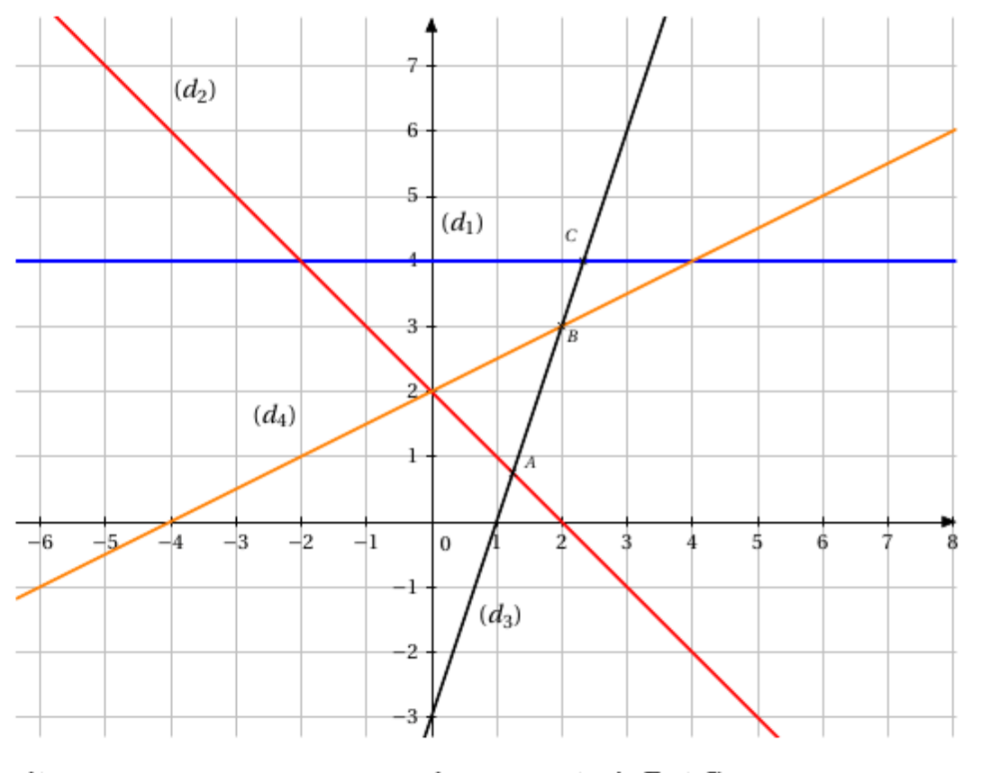

[pdf](./exercices.pdf)

_Ces exercices sont ceux donnés dans les autres sections._

## Chapitre 1: Outils et techniques calculatoires

### Exercice 1.1

Effectuer les opérations suivantes et simplifier au maximum

| $\dfrac{2}{3} + \dfrac{1}{6}$                        | $\dfrac{2}{3} \times \dfrac{1}{6}$                               | $3 \times \dfrac{5}{12}$             | $\dfrac{1}{5} - \dfrac{1}{3}$                 | $3 - \dfrac{3}{10}$                                                 |
| ---------------------------------------------------- | ---------------------------------------------------------------- | ------------------------------------ | --------------------------------------------- | ------------------------------------------------------------------- |
| $\dfrac{1}{5} + \dfrac{2}{3} - \dfrac{4}{15}$        | $\left( \dfrac{1}{2} + \dfrac{2}{5} \right) \times \dfrac{2}{3}$ | $1 + \dfrac{1}{6} - \dfrac{1}{4}$    | $\dfrac{3}{\dfrac{3}{2}}$                     | $\dfrac{\dfrac{3}{5} + \dfrac{1}{3}}{ \dfrac{2}{3} + \dfrac{6}{5}}$ |
| $\dfrac{\dfrac{2}{7} + \dfrac{5}{21}}{\dfrac{6}{7}}$ | $\dfrac{\dfrac{2}{3}}{ \dfrac{1}{6}}$                            | $\dfrac{3}{5} \times \dfrac{12}{21}$ | $\dfrac{5}{21} + \dfrac{1}{7} - \dfrac{5}{3}$ | $\dfrac{2}{3} \left( \dfrac{1}{5} - \dfrac{1}{2} \right)$           |

### Exercice 1.2

1. Sur un pantalon étiqueté à 70€ on bénéficie d’une remise de 30%. À quel prix aura-t-on le pantalon ?
2. Le plein de SP95 d’une voiture coûtait 70€. Après l’augmentation de 20% des prix à la pompe, quel sera le prix d’un plein ?
3. Après réduction de 10% par le concessionnaire, la voiture coûte 18 900€. Quel était le prix d’origine ?
4. Un particulier avait 100L d’eau dans une citerne. Après les pluies, la quantité d’eau dans la citerne a augmenté de 5% mais une sécheresse a suivi et la quantité d’eau a baissé de 15%. Quelle quantité d’eau reste-t-il dans la citerne ?
5. Le prix d’une action augmente de 5% puis baisse de 5%. Globalement, le prix aura-t-il baissé ou augmenté ?

### Exercice 1.3

Simplifier les expressions au maximum

1. $2^3 \times 3^{-2} \times 2^{-5}$
2. $\frac{5^3}{5^2} \times 5^4$
3. $\frac{3^4 \times 3^{-2}}{3^6}$
4. $(2^3)^{-2} \times 2^7 \times 2^{-1}$
5. $(5^3)^2 \times \left(\frac{1}{5}\right)^{-6}$
6. $\dfrac{(4^{-3})^2 \times 3^5}{3^2 \times (2^{-4})^3}$

### Exercice 1.4

Écrire les nombres suivants sous forme scientifique

1. 10 000
2. 0,001
3. 45,200
4. 1287, 34
5. 0,0005
6. 540 000
7. 123
8. $\dfrac{30}{100}$
9. $\frac{45}{1000}$
10. $\frac{126}{3}$

### Exercice 1.5

Résoudre les équations suivantes

1. $x + 4 = 2x - 5$
2. $-3x = x - \frac{1}{3}$
3. $3 - 4x = 4x - 5$
4. $5(x-1) + 2 = x - 4$
5. $\frac{1}{2}(x - 1) = x - \frac{1}{2}$
6. $\frac{2}{5}(x - 1) + x = 1$
7. $\frac{2x - 3}{x} = 1$
8. $\frac{x - 1}{2x} + \frac{x + 1}{x} = 0 \quad \text{pour} \quad x \neq 0$
9. $\frac{x}{x+1} - \frac{x+1}{x-1} = 0 \quad \text{pour} \quad x \neq 1 \quad \text{et} \quad x \neq -1$
10. $(2x - 1)(x + 5) = 0$

### Exercice 1.6

Résoudre

1. $x \times 1.04^{-2} = 3000 \times 1.04^{-4} + 7000 \times 1.04^{-5}$
2. $x \times 0.05 \times \frac{90}{360} = 150$
3. $2000 \times 0.06 \times \frac{x}{360} = 200$
4. $10000 \times 1.08^{-4} = x \times 1.08^{-2} + 2x \times 1.08^{-5}$
5. $x \times 0.06 \times \frac{60}{360} + x = 5050$

### Exercice 1.7

Résoudre les inéquations suivantes (et donner les résultats sous forme d’intervalles)

1. $4x - 2 < x + 1$
2. $5 - x > -3x + 2$
3. $\frac{3}{4}(x - \frac{2}{3}) < x + 1$
4. $2(x-1) - 3x \geq -3$
5. $\frac{2}{3}x + 1 \leq x$
6. $-\frac{1}{5}x \leq \frac{2}{5} + 2x$
7. $(x+2)(x-1) \geq 0$
8. $(1-x)(x+5) < 0$
9. $(x-3)(x+1) \leq 0$
10. $\frac{x}{x+1} - \frac{x+1}{x-1} \geq 0 \quad \text{pour} \quad x \neq 1 \quad \text{et} \quad x \neq -1$

### Exercice 1.8

Factoriser les expressions suivantes en utilisant les identités remarquables

1. $A_1(x) = x^2 + 6x + 9$
2. $A_2(x) = x^2 - 12x + 36$
3. $A_3(x) = 4x^2 - 9$
4. $A_4(x) = 25 - 10x + x^2$
5. $A_5(x) = x^2 - 4x + 3 \quad \text{(on remarquera que 3 = 4-1)}$
6. $A_6(x) = 5x^2 - 20$

### Exercice 1.9

Pour chaque expression $A_i(x)$, développer, factoriser puis résoudre $A_i(x) = 0$.

1. $A_1(x) = (x-5)(2x+1) + (x+5)(2-x)$
2. $A_2(x) = (x+1)^2 - (x+1)(x+4)$
3. $A_3(x) = (2x-1)^2+(5x+1)(2x-1)+ (4x^2-1) \quad \text{on factorisera 4x}^2-1$
   - En choisissant la « bonne » expression, résoudre $A_3(x) = -1$, calculer $A_3(0.5)$.
4. $A_4(x) = (3x+1)^2 - 2(9x^2-1) - (3x+1)(5x+3) \quad \text{on factorisera 9x}^2-1$
5. $A_5(x) = 2(x-2)(x+1) + (x^2-4) - 3(1-x)(4-2x) \quad \text{on factorisera x}^2 - 4 \text{ et } 4 - 2x$
6. $A_6(x) = 2(x+1) - (x+1)(4x+3) + x^2 - 4x + 2x - 4$
7. $A_7(x) = (2x+1)^2 - (x-3)^2$
8. $A_8(x) = (3x-1)^2 - 9x^2+1 - (x-5)(3x-1)$
   - En choisissant la bonne expression, résoudre $A_8(x) > 0$

### Exercice 1.10

Résoudre algébriquement les systèmes

$$
\left\{
\begin{aligned}
2x - y &= 1 \\
-4x + 3y &= 7
\end{aligned}
\right.
$$

$$
\begin{cases}
2x + y = 1 \\
-4x - 2y = -3
\end{cases}
$$

$$
\begin{cases}
2x - 3y = 7 \\
x + 5y = -3
\end{cases}
$$

$$
\begin{cases}
-0.5x + y = 1 \\
2x - 4y = -4
\end{cases}
$$

(Pour ceux qui sont à l’aise, résoudre géométriquement également).

### Exercice 1.11

Dans un magasin, tous les articles d’une même catégorie sont au même prix. Pierre et Clothilde décident d’acheter des DVD et des BD. Ils possèdent chacun 75€. Pierre achète un DVD et 4 BD ; il lui reste 14,50€. Clothilde dépense 73,50€ pour 2 DVD et 3 BD. Calculer le prix de chaque article.

### Exercice 1.12

Une entreprise artisanale fabrique deux types d’objets en bois, notés A et B. Un objet de type A nécessite 3 kg de bois et un objet de type B nécessite 5 kg de bois. Pendant une journée, l’entreprise a utilisé 163 kg de bois pour fabriquer 43 objets. Déterminer le nombre d’objets réalisés pour chaque type.

### Exercice 1.13

Interpréter graphiquement (en termes de parabole – forme, sommet - et d’intersection avec les axes). Mettre chacune des expressions du second degré sous forme canonique.

1. $x^2 - 4x + 3 = 0$ puis $x^2 - 4x + 3 \ge 0$
2. $x^2 - x + 1 = 0$ puis $x^2 - x + 1 < 0$
3. $-x^2 - x + 2 = 0$ puis $-x^2 - x + 2 \le 0$
4. $-2x^2 - 11x + 21 = 0$ puis $-2x^2 - 11x + 21 \le 0$
5. $x^2 - 10x + 25 = 0$ puis $x^2 - 10x + 25 \ge 0$
6. $-x^2 - 2x - 2 = 0$ puis $-x^2 - 2x - 2 < 0$
7. $4x^2 - 4x + 1 = 0$ puis $4x^2 - 4x + 1 > 0$

### Exercice 1.14

1. Factoriser les polynômes $x^2 - x - 6$ et $2x^2 + 3x - 2$
2. Résoudre l’équation

$$
\dfrac{2}{x^2 - x - 6} + \frac{x}{2x^2 + 3x - 2} = 0
$$

### Exercice 1.15

1. a) Résoudre l’équation $2x^2 + 5x + 2 = 0$
   b) En utilisant un changement d’inconnue, en déduire les solutions de l’équation

$$
2x^4 + 5x^2 + 2 = 0
$$

c) En utilisant un changement d’inconnue, en déduire les solutions de l’équation

$$
\frac{2}{(x - 1)^2} + \frac{5}{x - 1} + 2 = 0
$$

2. Par une méthode analogue, résoudre l’équation $x + 5\sqrt{x} - 3 = 0$
3. Par une méthode analogue résoudre $x^4 - 4x^2 + 3 = 0$

### Exercice 1.16

Les questions sont indépendantes

1. On considère le trinôme suivant : $(m+3)x^2 + 2(3m+1)x + (m+3)$

   Pour quelles valeurs de $m$ ce trinôme a-t-il une racine double ? Calculer alors cette racine.

2. On considère le trinôme suivant : $x^2 - (2m+3)x + m^2$

   Pour quelles valeurs de $m$ ce trinôme a-t-il une racine double ? Calculer alors cette racine.

3. On considère l’équation $2x^2 - (m+2)x + m - 2 = 0$

   Calculer $m$ pour que l’une des solutions soit égale à 3. En déduire l’autre solution de l’équation.

### Exercice 1.17

On considère la fonction $f$ définie sur $\mathbb{R}$ par $f(x) = 3x^3 - 4x^2 - 25x + 42$.

1. Montrer que -3 est une solution de $f(x) = 0$.
2. Développer, ordonner et réduire $(x + 3)(ax^2 + bx + c)$.
3. Déterminer trois réels $a$, $b$ et $c$ tels que $f(x) = (x + 3)(ax^2 + bx + c)$ pour tout réel $x$.
4. Résoudre $f(x) = 0$.

### Exercice 1.18

On considère la fonction $g$ définie sur $\mathbb{R}$ par $g(x) = x^3 + 5x^2 - 12x + 6$.

1. Montrer que 1 est solution de $g(x) = 0$.
2. Déterminer trois $a$, $b$ et $c$ tels que $g(x) = (x - 1)(ax^2 + bx + c)$ pour tout réel $x$.
3. En déduire le signe de $g(x)$.

### Exercice 1.19

On considère la fonction $h$ définie sur $\mathbb{R}$ par $h(x) = x^2 - ax + 3$ où $a$ est un nombre réel.

1. Déterminer les valeurs de $a$ pour lesquelles l’équation $h(x) = 0$ admet deux racines distinctes.
2. Déterminer les valeurs de $a$ pour lesquelles l’équation $h(x) = 0$ admet une racine double.
3. Déterminer les valeurs de $a$ pour lesquelles l’équation $h(x) = 0$ n’admet pas de racine.
4. Déterminer les valeurs de $a$ pour lesquelles le minimum de $h$ est strictement inférieur à -1.

## Exercices du chapitre 2 (Droites)

### Exercice 2.1

Tracer les droites suivantes de la manière la plus rapide possible (et indiquer les droites parallèles, perpendiculaires en justifiant) :

- $d_1 : 2x + y = 3$
- $d_2 : x = -1$
- $d_3 : y = \frac{1}{2}$
- $d_4 : y = -\frac{1}{2}x + 3$
- $d_5 : 2y - x - 2 = 0$
- $d_6 : y - \frac{1}{3}x = \frac{5}{3}$
- $d_7 : y - 2x + 5 = 0$
- $d_8 : 2y = 3x$
- $d_9 : -x - y = 0$
- $d_{10} : y - \frac{1}{2}x - 3 = 0$

### Exercice 2.2

Déterminer dans chacun des cas si les droites $d$ et $d'$ sont parallèles ou sécantes.

1. $d$ a pour équation $2x+3y-5=0$ et $d'$ a pour équation $4x+6y+3=0$.
2. $d$ a pour équation $-5x+4y+1=0$ et $d'$ a pour équation $6x-y-2=0$.
3. $d$ a pour équation $7x-8y-3=0$ et $d'$ a pour équation $6x-9y=0$.
4. $d$ a pour équation $9x-3y+4=0$ et $d'$ a pour équation $-3x+y+4=0$.

### Exercice 2.3

On donne les points suivants : $A(2;-1), B(4;2), C(-1;0), D(1;3)$

1. Déterminer une équation cartésienne de $(AB)$ et $(CD)$.
2. Étudier la position relative de ces deux droites.

### Exercice 2.4

Résoudre géométriquement les systèmes :

1.  

    $$
    \begin{cases}
    2x - y = 1 \\
    -4x + 3y = 7
    \end{cases}
    $$
    

2.  

    $$
    \begin{cases}
    2x + y = 1 \\
    -4x - 2y = -3
    \end{cases}
    $$
    

3.  

    $$
    \begin{cases}
    2x - 3y = 7 \\
    x + 5y = -3
    \end{cases}
    $$
    

4.  

    $$
    \begin{cases}
    -0.5x + y = 1 \\
    2x - 4y = -4
    \end{cases}
    $$
    

### Exercice 2.5

1. Par lecture graphique, déterminer l'équation réduite des quatre droites représentées sur ce graphique

   $~$

2. Déterminer par le calcul les coordonnées des points $A, B$ et $C$.
3. Vérifier graphiquement les réponses précédentes.

### Exercice 2.6

On considère les points $A(0, 1)$, $B(3, 3)$ et $C(4, -3)$ :

1. Placer ces points dans un repère orthonormal.
2. Déterminer une équation de la droite $(AB)$ et de la droite $(AC)$.
3. Déterminer, par le calcul, une équation de la droite $(BC)$.
4. Déterminer une équation de la parallèle à $(AB)$ passant par $C$.

### Exercice 2.7

On considère les points $A(-3;4), B(6;1), C(-2,1)$, $D(0;3)$

1. Placer ces points dans un repère orthonormé.
2. Le point $D$ est-il un point de $(AB)$ ? Justifier à l'aide d'un calcul.
3. La parallèle à $(AC)$ passant par $D$ coupe $(BC)$ en $E$.

   a. Déterminer une équaion de la droite $(DE)$.
   b. Déterminer l'équation réduite de la droite $(CB)$.
   c. En déduire les coordonnées du point $E$.

### Exercice 2.8

On suppose que la courbe de demande est décrite par une droite de la forme $q = mp + b$.

Déterminer son équation étant données les informations suivantes : un promoteur découvre que la demande en billets de théâtre est de 1200 lorsque le prix est de 60€ mais chute à 900 lorsque le prix est haussé à 75€.

### Exercice 2.9

La quantité et le prix d’équilibre d’un bien sont déterminés par l’intersection des courbes de l’offre et de la demande. Pour un produit donné, l’offre est déterminée par la droite :

$$
q_{\text{offre}} = 30p - 45
$$

Et la demande, pour ce même produit, par la droite :

$$
q_{\text{demande}} = -15p + 855
$$

Déterminer le prix et la quantité d’équilibre et tracer, sur un même graphique, les courbes de l’offre et de la demande.

### Exercice 2.10

Une compagnie produit des chaussures. Lorsque 30 chaussures sont produites, le coût total de production est de 325€. Lorsque 50 chaussures sont produites, le coût s’élève alors à 485€. Quelle est l’équation du coût $C$ si celui-ci varie de façon linéaire en fonction du nombre de chaussures produites $q$ ?

### Exercice 2.11

Dans chacun des cas, représenter le demi-plan :

1. $x \geq -1$
2. $y < 3$
3. $2x + y \geq 0$
4. $y - 3x + 2 \leq 0$
5. $2y + x - 3 > 0$

## Exercices du Chapitre 3 (Suites)

### Exercice 3.1

Parmi les suites suivantes, indiquer celles qui sont arithmétiques, géométriques.

$$
\begin{cases}
    u_0=7\\
    u_{n+1} = u_n^2
\end{cases}
,\qquad
\begin{cases}
    v_0=100\\
    v_{n+1} = v_n+\dfrac{6}{100}v_n
\end{cases}
,\qquad
\begin{cases}
    w_0=1\\
    w_{n+1} + w_n = 1
\end{cases}
,\qquad
\begin{cases}
    t_0=33\\
    t_{n+1} - t_n = 4
\end{cases}
,\qquad
$$

### Exercice 3.2

1. $\quad 6, 10, 14$ peuvent-ils être les 3 premiers termes d’une suite arithmétique ? Justifier.
2. $\quad 5, 25, 120$ peuvent-ils être les 3 premiers termes d’une suite géométrique ? Justifier.

### Exercice 3.3

On suppose que $(u_n)_{n \in \mathbb{N}}$ est une suite arithmétique.

1. On sait que $u_0 = 2$ et $r = -3$. Calculer $u_{10}$, $u_{20}$.
2. On sait que $u_0 = 2$ et $u_2 = 10$. Calculer $r$, $u_1$, $u_5$.
3. On sait que $u_{20} = -52$ et $u_{51} = -145$. Expliciter $u_n$.
4. On sait que $u_{22} = 15$ et $r=\dfrac{3}{4}$. Expliciter $u_n$.

### Exercice 3.4

On suppose que $(v_n)_{n \in \mathbb{N}}$ est une suite géométrique de raison $q = 0.5$.

1. On sait que $v_0 = 32$. et $r=\dfrac{1}{4}$. Calculer $v_{2}$, $v_8$.
2. On sait que $v_0 = 3$ et $v_2=12$. Calculer $r, v_1$, $v_5$.
3. On sait que $v_1=-1$ et $v_{10}=1$. Expliciter $v_n$ en fonction de $n$.

### Exercice 3.5

Déterminer la nature des suites suivantes (préciser leurs paramètres) :

$$ u_n = (-4)^{2n+1} $$

$$ v_n = 2^n \times \frac{1}{3^{n+1}} $$

$$ w_n = (-1)^n \times 2^{3n+1} $$

$$ z_n = 7 - 3n $$

### Exercice 3.6

Albert place un capital initial $C_0 = 3000€$ à un taux annuel de 6%, les intérêts étant simples, c’est-à-dire que le capital d’une année est égal à celui de l’année précédente augmenté de 6% du capital initial (les intérêts ne sont pas capitalisés chaque année, contrairement aux intérêts composés). On note $C_n$ le capital d’Albert au bout de $n$ années, capital exprimé en euros.

1. Montrer que pour tout entier $n$, $C_{n+1} = C_n + 180$. Qu’en déduit-on ?
2. Pour tout entier $n$, exprimer $C_n$ en fonction de $n$.
3. De quel capital Albert dispose-t-il au bout de 10 ans ?
4. Au bout de combien d’années le capital a-t-il doublé ?
5. Au bout de combien d’années le capital dépasse-t-il 10 000€ ?

### Exercice 3.7

On suppose que chaque année la production d’une usine subit une baisse de 4%. Au cours de l’année 2000, la production a été de 25 000 unités. On note $P_0= 25 000$ et $P_n$ la production prévue au cours de l’année $2000+n$.

1. Déterminer la nature de la suite. Préciser ses paramètres.
2. Si la production descend en dessous de 15 000 unités, l’usine sera en faillite. Quand cela se produira-t-il si la baisse persiste ?

### Exercice 3.8

1. On considère une suite arithmétique de premier terme $U_0 = 2$ et de raison $r = 3$.

   Calculer $S=\sum\limits_{k=0}^{7} U_k$.

2. On considère une suite géométrique de premier terme $V_0 = 2$ et de raison $q = \frac{1}{2}$.

   Calculer $S = \sum\limits_{k=0}^{7} U_k$.

3. On considère une suite arithmétique de premier terme $U_0 = 1$ et de raison $r = -2$.

   Calculer $S = \sum\limits_{k=0}^{15} U_k$.

4. On considère une suite géométrique de premier terme $U_0 = \frac{1}{2}$ et de raison $r = 2$.

   Calculer $S = \sum\limits_{k=0}^{12} U_k$.

5. On considère une suite arithmétique de premier terme $U_0 = 2$ et de raison $r = 3$.

   Déterminer $n$ tel que $S = \sum\limits_{k=0}^{n} U_k = 15~050$.

### Exercice 3.9

Les questions sont indépendantes.

1. En reconnaissant la somme des termes d’une suite arithmétique, calculer $$S = \frac{1}{3} + 1 + \frac{4}{3} + \cdots + \frac{19}{3} + 7$$
2. Calculer la somme des 20 premiers entiers pairs (modéliser le problème à l’aide d’une suite).
3. Démontrer que la somme $S = 1 + 3 + 5 + \cdots + 99$ est le carré d’un entier naturel.
4. Une suite arithmétique $(U_n), n \in \mathbb{N}$ de raison 5 est telle que $U_0 = 2$ et, $n$ étant un nombre entier, $\sum\limits_{i=3}^{i=n} U_i = 6456$. Calculer $n$.
5. En reconnaissant la somme des termes d’une suite géométrique, calculer :
   - $S_1 = 2^7 + 2^8 + \cdots + 2^{21}$
   - $S_2 = 18 + 54 + 162 + \cdots + 39~366$
   - $S_3 = \frac{1}{8} - \frac{1}{16} + \frac{1}{32} + \cdots - \frac{1}{1~048~576}$

### Exercice 3.10

Au 1er janvier 2017, une association sportive compte 900 adhérents. On constate que chaque mois :

- 25% des adhérents de l’association ne renouvellent pas leur adhésion.
- 12 nouvelles personnes décident d’adhérer à l’association.

On modélise le nombre d’adhérents de l’association par la suite $(U_n), n \in \mathbb{N}$ telle que $U_0 = 900$ et pour tout $n \in \mathbb{N}$, $U_{n+1} = 0,75U_n + 12$. Le terme $U_n$ donne ainsi une estimation du nombre d’adhérents de l’association au bout de $n$ mois.

1. Déterminer l’expression de $U_n$ en fonction de $n$ (utiliser la méthode vue en cours).
2. La présidente de l’association assure qu’elle démissionnera si le nombre d’adhérents descend en dessous de 100. Si l’évolution continue, la présidente démissionnera-t-elle ? Si oui, au bout de combien de mois ?

### Exercice 3.11

Une entreprise de téléphonie mobile constate un taux de churn, c’est-à-dire de déperdition de sa clientèle de 16%. Dans le même temps, elle arrive à capter 100 000 nouveaux abonnés par an. On suppose qu’en 2020 le nombre de clients est de 400 000. On note $U_0 = 400 000$.

1. Exprimer le nombre d’abonnés $U_n$ pour l’année 2020+n, en fonction de $n$.
2. Au fil du temps, vers quel nombre d’abonnés l’entreprise se stabilisera-t-elle ?

## Exercices du Chapitre 4

### Exercice 4.1

Montrer par contraposée que

1. si $n^2$ est impair alors $n$ est impair.
2. soit $a$ réel. Si $a^2$ n'est pas un multiple entier de 16, alors $\frac{a}{2}$ n'est pas un entier pair.

### Exercice 4.2

Montrer par l'absurde que

1. pour tout $x$ différent de -3, $\frac{x+1}{x+3} \neq 1$.
2. $\sqrt{n^2 + 1}$ n'est pas un entier ($n$ entier naturel non nul).
3. Si $n$ est le carré d'un nombre entier non nul alors $2n$ n'est pas le carré d'un nombre entier.

### Exercice 4.3

Montrer les propositions suivantes, à l'aide d'un raisonnement par récurrence :

1. Pour tout $n$ entier non nul, $1+ 2^{2n-1} \times 3^{n+2}$ est divisible par 11.
2. $(n+1)! \geq 1! + 2! + \dots + n!$
3. $\sum_{k=1}^{n} k \times k! = (n + 1)! - 1$
4. Soit $x$ un réel supérieur ou égal à -1, $\forall n \in \mathbb{N}, (1 + x)^n \geq 1 + nx$
5. $\sum_{k=1}^{n} k = \frac{n(n+1)}{2} \quad \forall n \in \mathbb{N}^*$
6. $\sum_{k=1}^{n} k^2 = \frac{n(n+1)(2n+1)}{6} \quad \forall n \in \mathbb{N}^*$
7. $\sum_{k=0}^{n} 2^k = 2^{n+1} - 1 \quad \forall n \in \mathbb{N}$ (y a-t-il une autre méthode pour calculer cette somme ?)
8. $\sum_{k=1}^{n} k^3 = \left(\frac{n(n+1)}{2}\right)^2$

### Exercice 4.4

Soit $(x_n), n \in \mathbb{N}$ la suite définie par $x_{n+1} = \frac{2x_n^2-3}{x_n+1}$ et $x_0 = 4$.

1. Montrer que $\forall n \in \mathbb{N}, x_n > 3$.
2. Montrer que $x_{n+1} - 3 - \frac{3}{2}(x_n - 3)$ est positif.
3. Montrer que $\forall n \in \mathbb{N}, x_n \geq \left(\frac{3}{2}\right)^n + 3$.

## Exercices du chapitre 5 (Généralités sur les fonctions)

### Exercice 5.1

Déterminer l'ensemble de définition de chacune des fonctions suivantes :

$f_1(x) = \frac{1}{2}x + 5$

$f_2(x) = 3x^2 + 5x + 2$

$f_3(x) = x^3 + \frac{5}{2}x^2 - 6x + \sqrt{2}$

$f_4(x) = \frac{2}{x^2}$

$f_5(x) = \frac{x + 1}{x - 2}$

$f_5(x) = \frac{2}{x^2 + 2x - 3}$

$f_6(x) = \sqrt{5 - x}$

$f_7(x) = (3x - 2)^3$

$f_7(x) = \sqrt{x^2 + 2x - 3}$

$f_8(x) = \frac{1}{\sqrt{9 - x^2}}$

$f_6(x) = \sqrt{\frac{x + 1}{x - 2}}$

### Exercice 5.2

Soit f la fonction définie par $f(x) = \frac{1}{x+1} - \frac{1}{x^2-1}$.

1. Déterminer l'ensemble de définition de $f$.

2. Quelle est l'image de 0 par $f$ ? l'image de 3 par $f$ ?

3. Déterminer, s'ils existent, le ou les antécédents de 0, 1 et -1 par $f$.

### Exercice 5.3

Pour chacun des couples de fonctions ci-dessous, déterminer le domaine de définition de $f$ et celui de $g$. Expliciter $h = f\circ g$ et $j = g\circ f$. Préciser les ensembles de définition de $h$ et $j$. (Préciser le sens de variation de $h$ et $j$ en utilisant le sens de variation de $f$ et $g$).

1. $f(x) = 2x+3$ et $g(x) = x^2$

2. $f(x) = \frac{2}{x+1}$ et $g(x) = x^2$

3. $f(x) = \frac{2}{x+1}$ et $g(x) = 2x+3$

4. $f(x) = \frac{x-2}{x-1}$ et $g(x) = \sqrt{x}$

### Exercice 5.4

Calculer les dérivées des fonctions suivantes, discuter le signe de la dérivée et dresser le tableau de variations de la fonction. (on précisera les ensembles de définition)

$f_1(x) = \frac{2}{3}x^3 + \frac{x^2}{2} - x$

$f_2(x) = \sqrt{x^2 + 2x - 3}$

$f_3(x) = \frac{x^2 - 1}{x + 2}$

$f_4(x) = (5x - 1)^3$

$f_5(x) = \frac{1}{(x + 1)^3}$

### Exercice 5.5

La fonction f est définie sur $\mathbb{R}^+$ et vérifie $f(3) < f(5)$.

Pour chacune des affirmations, dire si elle est vraie ou fausse.

Justifier les affirmations vraies, construire un contre-exemple graphique des affirmations fausses.

1. $f$ croissante sur $\mathbb{R}^+$

2. $f$ est strictement croissante sur [3 ;5]

3. $f$ n'est pas décroissante sur $\mathbb{R}^+$

### Exercice 5.6

Soit f la fonction définie par $f(x) = \frac{1+x}{x+2}$

1. Déterminer l'ensemble de définition $I$ de $f$.

2. Etudier les variations de $f$.

3. Démontrer que $f$ réalise une bijection de $I$ sur un ensemble $J$ que l'on déterminera.

4. Déterminer $f^{-1}$.

### Exercice 5.7

Donner l'ensemble de définition et étudier la convexité des fonctions suivantes

1. $f(x) = 3x^2 - 1$

2. $f(x) = - 4x^3$

3. $f(x) = 2x^3 + 3x$

4. $f(x) = \sqrt{x}$

5. $f(x) = \frac{1}{x+2}$

6. $f(x) = x\sqrt{2x + 1}$

### Exercice 5.8

Soit f définie sur $]-1 ;+\infty[$ par $f(x) = (1 + x)^n$

a. Ecrire l'équation de la tangente à la courbe en 0.

b. En étudiant la convexité de f, montrer que pour tout $x \geq -1$, $(1 + x)^n \geq 1 + nx$

## Exercices du chapitre 6 (Fonctions usuelles)

### Exercice 6.1

Déterminer les ensembles de définition des fonctions suivantes

$f_1(x) = \ln(2x - 5)$

$f_2(x) = e^{-\frac{1}{\sqrt{x}}}$

$f_3(x) = \ln(x^2 - 4)$

$f_4(x) = \ln(\frac{x + 3}{x^2})$

$f_5(x) = \ln(\frac{x + 3}{x - 2})$

$f_6(x) = e^{-x^2+5x+1}$

$f_7(x) = e^{\frac{3}{x^2+x+1}}$

$f_8(x) = \frac{1}{e^{\frac{2}{3x}}}$

### Exercice 6.2

Soit $f$ la fonction définie par $f(x) = e^{x^2}$

1. Déterminer l'ensemble de définition de $f$.

2. Quelle est l'image de 2 par $f$ ?

3. Déterminer, s'ils existent, le ou les antécédents de 1, et $e$ par $f$.

4. Calculer la dérivée de $f$ et dresser le tableau de variations de $f$.

5. Déterminer une équation de la tangente en $x = 1$.

6. Etudier la convexité de $f$.

### Exercice 6.3

Calculer les dérivées des fonctions suivantes, discuter le signe de la dérivée et dresser le tableau de variations de la fonction. (on précisera les ensembles de définition)

$f_1(x) = \ln(x^2 + 1)$

$f_2(x) = x\ln x$

$f_3(x) = e^{-x^2+5x+1}$

$f_4(x) = (x - 1)e^x$

$f_5(x) = xe^{-x}$

$f_6(x) = \frac{\ln(x)}{x}$

### Exercice 6.4

Résoudre dans $\mathbb{R}$ les équations suivantes (on se préoccupera du domaine de validité)

1. $\ln(x+2) = \ln(2x+5)$

1. $\ln(x+2) = \ln(\frac{x+11}{x+3})$

1. $\ln\sqrt{2x - 3} = \frac{1}{2}\ln x$

1. $\ln(x^2-x) < \ln 6$

1. $e^{x^2-1} = 1$

1. $e^{2x}+e^x = 2$

1. $e^{3x+1} + e^{2x+1} = e^{x+1+\ln 6}$

1. $\frac{e^{x^2}}{e^x} < e^6$

### Exercice 6.5

Soit f la fonction définie par $f(x) = \ln(\frac{1+x}{1-x})$

1. Déterminer l'ensemble de définition I de f.

2. Etudier les variations de f.

3. Démontrer que f réalise une bijection de I sur un ensemble J que l'on déterminera.

4. Déterminer $f^{-1}$.

### Exercice 6.6

Pour chacune des fonctions suivantes, donner l'ensemble de définition et étudier la convexité.

1. $f_1(x) = x^2\ln x - x^2$

2. $f_2(x) = (2 - x)e^x$

3. $f_3(x) = xe^{x-1}$

### Exercice 6.7

Soit $g$ définie sur $\mathbb{R}^{*+}$ par $g(x) = x^3+2x^2\ln x – 3x^2 +1$

1. Soit $f$ définie sur $\mathbb{R}^{*+}$ par $f(x) = 6x + 4\ln x$

   a) Etudier les variations de $f$ sur $\mathbb{R}^{*+}$.

   b) Montrer que l'équation $g(x) = 0$ admet une unique solution $\alpha$, avec $0 < \alpha < 1$

   c) Déduire le signe de $f(x)$ sur $\mathbb{R}^{*+}$.

2. Calculer $g''(x)$ et étudier la convexité de $g$.

### Exercice 6.8

Soit $f$ définie sur $\mathbb{R}$ par $f(x) = e^x$

1. Ecrire l'équation de la tangente à la courbe en 0.

1. En étudiant la convexité de $f$, montrer que pour tout $x$ réel, $e^x \geq 1 + x$
