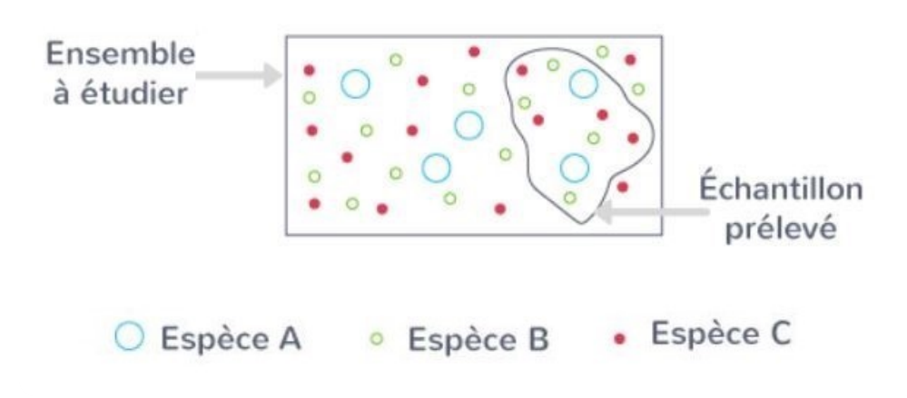
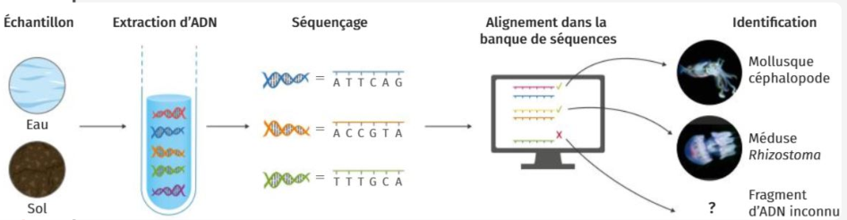
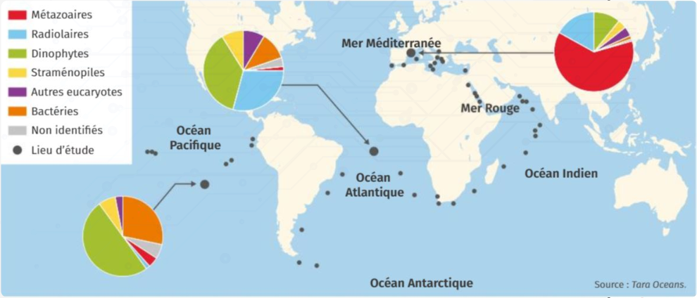
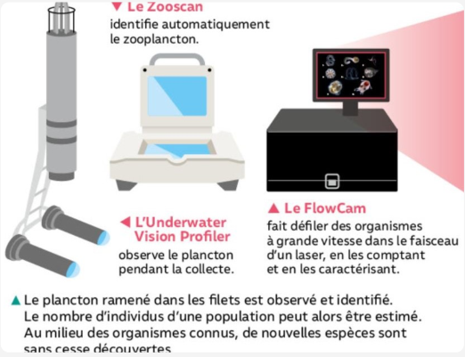
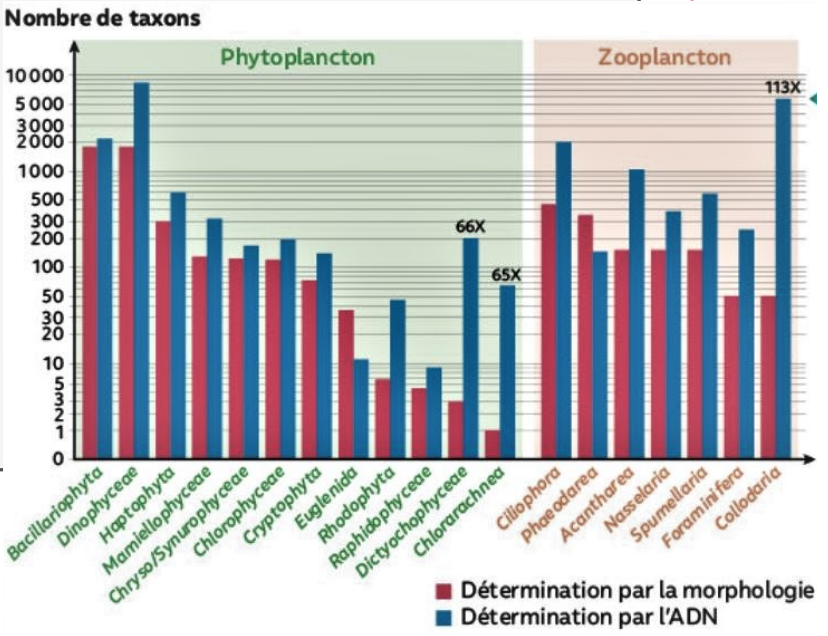
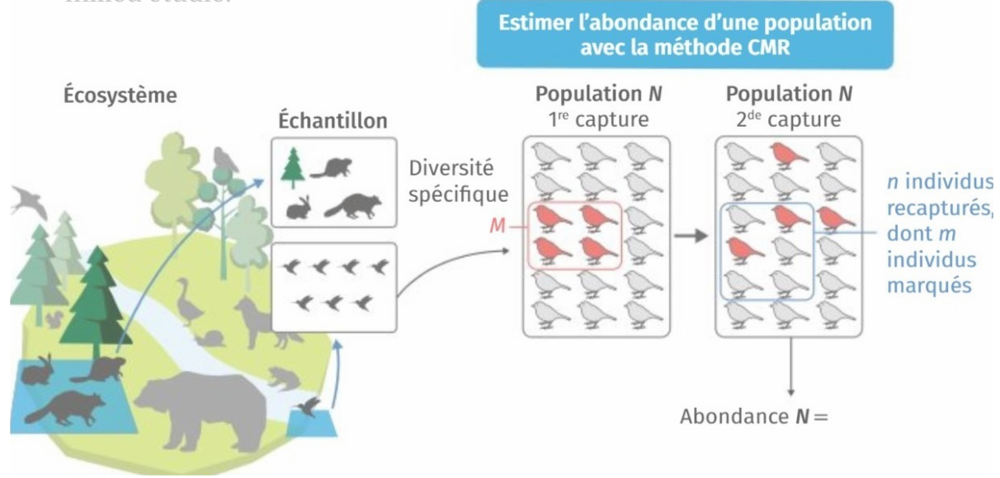
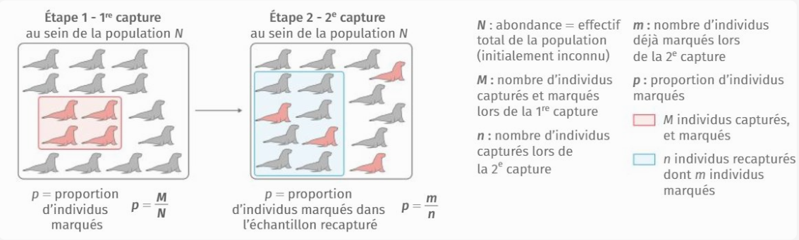
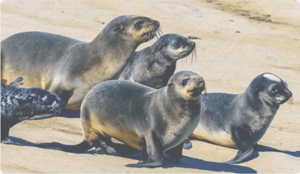

[pdf](./1_cours_cmr_proportionnalite.pdf)

# 1. Échantillonnage

## A. Proportions

**Fréquence observée et proportion**

Une _fréquence_ ou une _proportion_ est un nombre réel compris entre 0 et 1. Elle représente le rapport entre l'effectif d'une catégorie et l'effectif total.

**Exemple**

> Parmi les 120 oiseaux ayant été filmés par une caméra, 30 sont des merles.
>
> L'effectif total est 120, l'effectif des merles est 30 donc leur proportion est $\dfrac{30}{120}=0.25$.

**Questions**

> On a compté 30 lapins albinos lors d'une capture. Leur proportion parmi tous les lapins est 0.15.
>
> Combien de lapins a-t-on capturé ?

> ---
>
> Un sac opaque contient des billes colorées et cinq de ces billes sont bleues. Si on tire une bille au hasard, la probabilité d'obtenir une bille bleue est $\frac{1}{3}$.
>
> Combien de billes y-a-t-il dans le sac ?
>
> - [ ] 5
> - [ ] 15
> - [ ] 20

---

## B. Échantillon

Lors d'une étude scientifique il est généralement impossible d'étudier l'intégralité d'une population.
On prélève alors un _échantillon aléatoire_. Selon le contexte la méthode varie mais on souhaite qu'il représente la population entière.

L’identification des espèces d’un échantillon se fait par une étude des caractéristiques morphologiques
du spécimen (être vivant étudié) et/ou par une analyse de son ADN.

L’échantillonnage est une **méthode statistique** qui consiste à prélever une partie (un échantillon) d’un ensemble. 

La **biodiversité** peut se définir par :

- sa richesse spécifique (nombre d’espèces)
- le nombre moyen d’individus par espèce
- l’abondance relative des groupes

---

## C. Acitivité documentaire

### Doc.1 – Aperçu de la biodiversité spécifique mondiale avec quelques groupes

Le nombre total d’espèces peut être extrapolé à partir du nombre d’espèces connues dans chaque taxon. Les estimations dépendent des méthodes de calcul choisies. Pour des espèces plus difficiles à étudier (petite taille, évolution rapide, etc.) comme les bactéries, l’estimation de ce nombre est moins fiable. Les recherches menées vont dans le sens de plusieurs centaines de milliards d’espèces de bactéries.

| Taxon                           | Nombre d'espèces décrites | Nombre estimé d'espèces |
| ------------------------------- | ------------------------: | ----------------------: |
| Métazoaires (animaux)           |               $1~124~516$ |             $9~920~000$ |
| Eumycètes (champignons)         |                  $44~368$ |               $616~320$ |
| Angoispermes (plantes à fleurs) |                 $224~244$ |               $314~600$ |

### Doc.2 – Des méthodes d’étude modernes de la biodiversité : barcoding moléculaire et metabarcoding

Le _barcoding_ moléculaire consiste à identifier une espèce en comparant une courte séquence de son ADN à toutes les séquences connues d’ADN rassemblées dans une banque de données, comme si l’on "scannait" son code-barres génétique.

En comparant toutes les séquences d’ADN retrouvées dans un échantillon d’eau ou de sol à cette banque de données, les chercheurs peuvent identifier les espèces qui se trouvent dans cet échantillon : c’est le _metabarcoding_. Ces méthodes sont cependant coûteuses et ne peuvent pas remplacer complètement les reconnaissances sur le terrain.

De 2009 à 2013, les équipes de recherche à bord du TARA ont réalisé une étude approfondie par metabarcoding de la diversité des microorganismes marins.

La carte ci-contre présente l’abondance relative des différents taxons dans trois des lieux étudiés.

### Doc.3 – Méthodes d’analyse morphologique et recensement de planctons

{width=50%} {width=50%}

### Exercice n°1 :

1. DOC. 1 -- Tracer un diagramme circulaire donnant l’abondance relative de chaque taxon du tableau.
   Y représenter la partie connue de chaque taxon. Commenter le résultat
2. DOC. 2 -- Comparer et commenter la richesse taxonomique des différents lieux échantillonnés lors de l’expédition TARA OCEANS.
3. DOC. 3 -- Comparer les abondances relatives des taxons sur les groupes de Phytoplancton et Zooplanctons.
4. DOC. 2 -- ET 3 Discuter brièvement de la complémentarité des différentes méthodes d’étude de la biodiversité.

---

## D. Calcul mental - Proportion et effectif :

1. Écrire les nombres suivants sous forme décimale :

   a. $\frac{7}{40}\times 100$ \qquad b. $\frac{111}{200}\times 100$ \qquad c. $\frac{5}{8}\times 100$

2. Déterminer dans chaque cas suivant l’entier naturel $n_E$ :

   a. $0.15 = \frac{n_E}{200}$ \quad b. $0.06=\frac{n_E}{150}$ \quad c. $0.6=\frac{n_E}{40}$

3. Déterminer dans chaque cas suivant l’entier naturel $n$ :

   a. $0.42=\frac{21}{n}$ \quad b. $0.8=\frac{1200}{n}$ \quad c. $0.25=\frac{700}{n}$

---

# 2. La méthode CMR : Estimer une population | Dénombrer des espèces mobiles

## A. Définition

La méthode de **capture-marquage-recapture** consiste à prélever un échantillon de la population étudiée, de marquer ses individus puis de les relâcher dans le milieu étudié afin qu’ils se mélangent aux autres individus.

Quelques temps après, on prélève un nouvel échantillon, à partir duquel on compte le nombre d’individus marqués ainsi que le total d’individus prélevés. Ce rapport permet d’estimer l’abondance de la population dans le milieu étudié.

Afin d’éviter les erreurs, la méthode de capture-marquage-recapture s’applique sous certaines conditions :

- La population doit être fermée, pour que son nombre n’évolue pas entre deux captures (marquage et recapture ). flux migratoires...
- La durée entre la capture et la recapture doit être suffisamment restreinte pour éviter les naissances et les décès. Mais elle doit être suffisamment importante pour assurer un brassage des individus marqués avec l’ensemble de la population.

---

## B. Exercices

### Exercice n°2 : La méthode de capture-marquage-recapture en épidémiologie

L’épidémiologie est un domaine d’étude des problèmes de santé humaine et notamment de la fréquence des maladies. Cette discipline utilise des méthodes d’évaluation d’abondance empruntées à l’écologie pour évaluer la prévalence d’une maladie dans une population. Deux listes de patients souffrant de diabète de type 2 sont obtenues par des sources indépendantes. Les personnes présentes sur les deux listes sont considérées comme étant "recapturées".

1. Expliquer pourquoi la méthode CMR peut être utilisée ici.
1. Estimer le nombre de malades souffrant de diabète de type 2 à Liverpool.

### Exercice n° 3 : Suivi de populations d’écrevisses à pattes blanches

L’écrevisse à pattes blanches est une espèce vivant en eau douce. C’est une espèce menacée sur l’ensemble du territoire français. La population sur le Nant, en Nord Ardèche, fait l’objet d’un suivi. Cinq stations d’études ont été choisies. Ai niveau de chaque station, l’effectif de la population a été déterminé par la méthode « capture-marquage-recapture » et la surface de chaque station a été mesurée.

| Station | Individus capturés et marqués | Total d'individus recapturés | Individus marqués et recapturés | Surface de la station (en m²) |
| ------- | ----------------------------: | ---------------------------: | ------------------------------: | ----------------------------: |
| 1       |                             8 |                            7 |                               4 |                           218 |
| 2       |                            35 |                           36 |                              20 |                           236 |
| 3       |                           380 |                          329 |                             193 |                           189 |
| 4       |                            90 |                           86 |                              37 |                           186 |
| 5       |                            12 |                            8 |                               3 |                           132 |

1. Calculer l’effectif des populations d’écrevisse pour chaque station.
2. Calculer la densité de populations (nombre d’individus par m²) pour chaque station.
3. Discuter de l’intérêt d’étudier la densité.

---

## C. Activité documentaire

### Doc.1 – Principe de la méthode de capture-marquage-recapture (CMR)

En supposant que la population ne se modifie pas entre les deux échantillonnages, la proportion d’individus marqués dans la population reste la même. Cette méthode permet alors d’estimer l’abondance de la population totale par proportionnalité.

### Doc.2 – Principe de la méthode de capture-marquage-recapture (CMR)

En 1992, une équipe de chercheurs a estimé le nombre de jeunes otaries nées dans une population australienne. Lors d’une première capture, les jeunes otaries sont marquées en coupant une mèche de fourrure. Les jeunes de cette colonie sont ensuite recapturés visuellement plusieurs fois, ce qui permet d’estimer leur nombre.

La moyenne indique une population de 2 817 jeunes otaries nées entre 1991 et 1992. L’expérience de capture-marquage-recapture est répétée en 1998 et 1 291 jeunes otaries sont marquées

|                                   | 1    | 2    | 3    | 4    |
| --------------------------------- | ---- | ---- | ---- | ---- |
| Taille de l'échantillon           | 1080 | 1224 | 1107 | 1233 |
| Otaries recapturées déjà marquées | 391  | 378  | 363  | 357  |

### Exercice n°4 :

1. DOC. 1 -- Déterminer la formule qui permet de calculer l’abondance d’une population N dans une CMR.
2. DOC. 1 ET 2 -- Estimer l’abondance d’otaries nées entre 1997 et 1998 à l’aide des données issues de chaque recapture.
3. DOC. 2 -- Calculer la moyenne des quatre abondances obtenues à la question 2. et conclure sur la nécessité de procéder à plusieurs captures.
4. DOC. 2 -- Décrire l’évolution de la population d’otaries à fourrure australienne.
