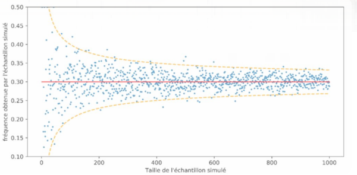
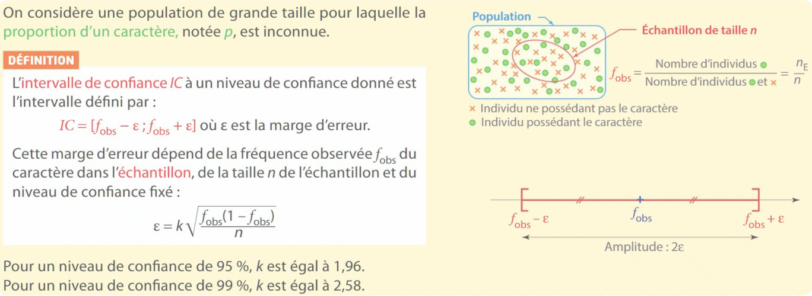
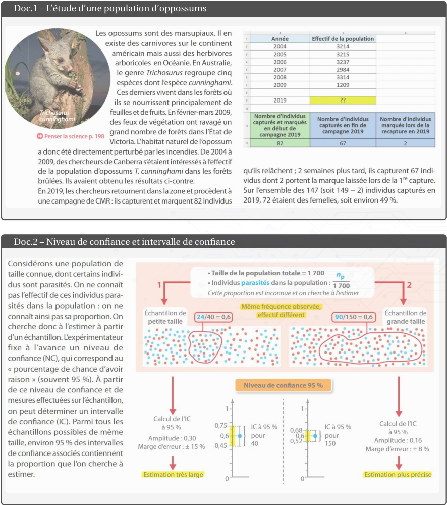
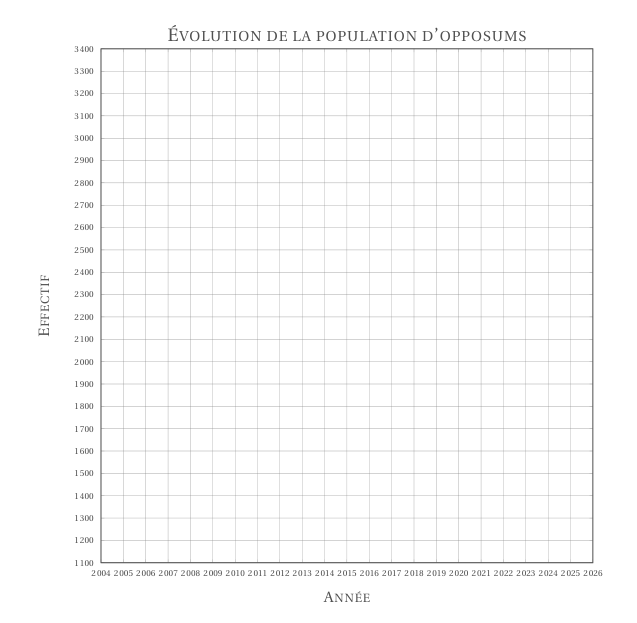
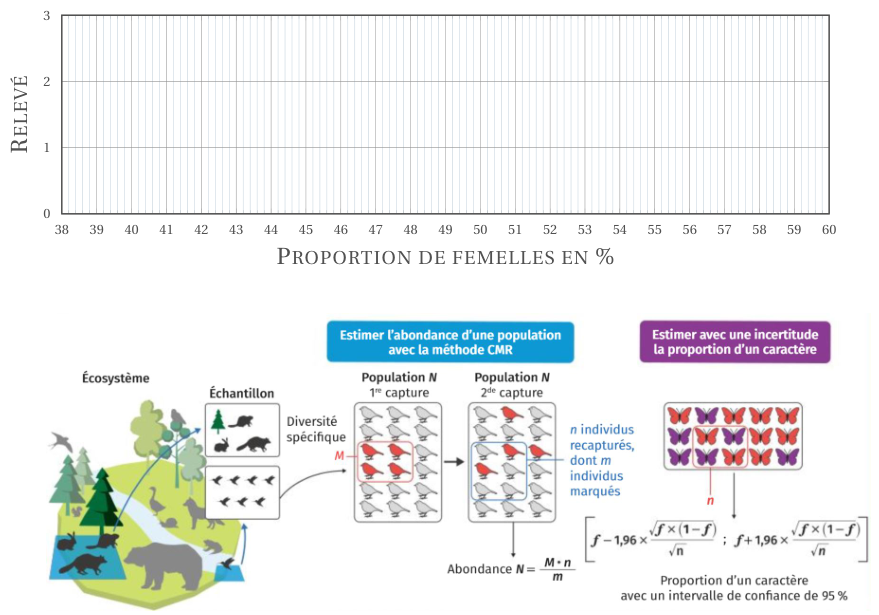

[pdf](./2_cours_estimation.pdf)

_Lors d’estimations de proportions les résultats résultent d’une part d’aléatoire et témoignent donc d’un phénomène appelé ................................... Il est possible d’en tenir compte._

# 3. L'intervalle de confiance

## 1. Loi des grands nombres

Dans une expérience aléatoire, on note $f$ la probabilité d’un évènement (ou probabilité théorique). Plus on répète cette expérience, plus la fréquence de réalisation (............................ $p$) de l’évènement .....................

L’intervalle de confiance quantifie la précision de l’estimation. Il dépend de la taille de l’échantillon : **Plus l’échantillon est grand plus l’amplitude de l’intervalle est faible.**

---

## 2. Définition : Intervalle de confiance

L’intervalle de confiance encadre la valeur estimée sur un échantillon de taille n en donnant
une marge d’erreur

$$I_C = \left[p-\frac{1}{\sqrt{n}}; p+\frac{1}{\sqrt{n}}\right]$$

$I_C$ désigne l’intervalle de confiance, $p = \frac{m}{n}$ la proportion (ou fréquence) d’individus marqués ($m$) dans l’échantillon de recapture (de taille $n$).
$\varepsilon = \dfrac{1}{\sqrt{n}}$ est la marge d’erreur.

La proportion réelle dans la population totale a une probabilité de 95% de se situer dans l’intervalle de confiance encadrant la proportion estimée à partir de l’échantillon.

### Conditions d'application de l'intervalle de confiance

Cette version (il y en a d'autres...) de l'intervalle de confiance n'est valide que si :

$$n\geq 30,\quad n\times f \geq 5 \quad\text{ et }\quad n\times(1-f) \geq 5$$

### Le centre de l'intervalle de confiance est $p$ et la marge d'erreur est la moitié de l'amplitude.

### Exercice 1.

Pour l’exemple précédent des mouettes rieuses en Camargue, la proportion de marquées lors de la recapture était de $p = \dfrac{239}{1200} \approx 0.2$, pour $M = 1000$ mouettes marquées initialement.

1. Déterminer l’intervalle se confiance à 95% de la fréquence pour cette observation.
2. Donner un encadrement à 95% de confiance du nombre $N$ de mouettes rieuses en Camargue à l'aide de la méthode CMR.

3. Donner le centre et la marge d'erreur.

### Plus généralement

## 3. Exercices

### Exercice 2. Myxomatose

On cherche à estimer la proportion de lapins touchés par la myxomatose dans un département. 150 lapins sont prélevés : 12 s'avèrent infectés et subiront un traitement ; les 138 autres seront vaccinés puis remis dans leur milieu.

1. Donner la taille de l'échantillon.
2. Déterminer la fréquence de lapins infectés dans cet échantillon.
3. Sachant que la marge d'erreur est 4.3%, déterminer l'intervalle de confiance au niveau de 95%.

### Exercice 3. Groupe Sanguin

En France, la proportion de personnes de groupe sanguin AB serait de 10% avec une marge d'erreur de 2.94%.

1. Préciser l'intervalle de confiance au niveau de confiance de 95% pour cette proportion.
2. Quelle était la taille de l'échantillon considéré pour déterminer un tel intervalle de confiance ?

### Exercice 4. Vaccication

Le coryza du chat est une maladie virale associée à un syndrome respiratoire qui touche principalement les chatons. Pour estimer la prévalence (proportion de sa présence) dans un département, on a prélevé un échantillon de 145 chatons : 25 s'avèrent porteur de la maladie.

1. Calculer la fréquence observée de chatons porteur du coryza dans cet échantillon.
2. Calculer la marge d'erreur et déterminer l'intervalle de confiance au niveau de confiance de 95% pour l'estimation de la proportion de chatons touchés par cette maladie dans ce département.
3. L'amplitude de cet intervalle étant trop importante, il est décidé de prélever un autre échantillon. Quelle devrait être sa taille pour que la marge d'erreur soit proche de 4% ?

### Exercice 5. La Nouvelle-Zélande face à une espèce invasive

Dès leur arrivée en Nouvelle-Zélande autour de 1200, les être humains y ont introduit de nombreuses espèces. Sans prédateurs naturels, certaines pullulent. Ainsi, de nos jours, la vallée de l'Orgongorongo est confrontée à une invasion de rats noirs, que les autorités essaient de limiter. Un site de la vallée est pris pour étude.

**Résultats de CMR sur la période 2003-2004 dans la vallée de l'Orgongorongo.**

|                              | Session de 2003 | Session de 2004 |
| ---------------------------- | --------------: | --------------: |
| Capturés en début de session |              34 |              28 |
| Capturés en fin de session   |              52 |              60 |
| Marqués dans la recapture    |              26 |              24 |

**Calcul de l'intervalle de confiance ($IC$) pour un niveau de confiance de 95%.**

$$IC = [f-\varepsilon;f+\varepsilon] \quad \text{ où } \quad \varepsilon = 1,96 \times \frac{f\times (1-f)}{n}$$

$f$ : fréquence observée du caractère dans l'échantillon

$n$ : taille de l'échantillon

1. Déterminer la taille de la population au départ de l'étude en 2003.
2. Déterminer la taille de la population en 2004.
3. Le gouvernement craint une croissance de la population. À l'aide des résultats de l'étude, donner des arguments pour confirmer ou modérer cette crainte. Que conseiller d'autre ?
4. Une ville envisage de lancer une campagne massive de dératisation. Les scientifiques veulent estimer l'impact du poison sur la mortalité au sein de la population de rats. Sur 200 rats retrouvés morts depuis le début de l'étude, 100 présentent des signes d'emoisonnement, soit 50%.

   Déterminer si cette fréquence observée est précise à $\pm 3%$ avec un niveau de confance de 95%.

## 4. Activité documentaire

$\,$

### Questions :

1. _DOC. 1 – POPULATIONS D’OPPOSUMS_

   1. Estimer par méthode CMR l’effectif de la population d’opposums en 2019.
   2. Tracer le graphique de l’évolution de la population en fonction du temps.
   3. Déterminer l’effectif moyen des opposums "avant les feux".
   4. En supposant une croissance linéaire de la population à partir de 2009, déterminer graphiquement en quelle année la population d’opossums aura atteint son effectif moyen d’avant les incendies.

      _MATHS SPÉ_ : Utiliser un modèle affine afin de répondre précisément.

      On pourrait estimer que la proportion des marqués est sous-estimée par rapport à la réalité, expliquer
      pourquoi un intervalle de confiance ne peut être fournie par la première formule $\left[p - \frac{1}{\sqrt{n}}; p + \frac{1}{\sqrt{n}}\right]$.

2. _DOC. 1 ET 2 – Le gouvernement australien vous demande d’estimer la taille de la population d’opossums
   dans la forêt en 2019. Pour savoir si la population contient assez de femelles pour continuer à croître, il veut connaître leur proportion le plus précisément possible. Discuter si la valeur de 49% observée est précise à $\pm 10 \\%$._

   1. Calculer la fréquence observée de femelles dans l’échantillon.
   2. Quelles sont les bornes inférieure et supérieure de l’IC pour un niveau de confiance de 95%? Comparer l’intervalle obtenu avec les 49±10% demandés.
   3. Vous décidez de retourner sur le terrain. Vous échantillonnez 384 individus, parmi lesquels 182 sont des femelles. Quelle marge d’erreur pouvez-vous alors annoncer sur l’estimation de la proportion de femelles au niveau de confiance de 95%?
   4. Tracer les deux intervalles de confiances de la proportion de femelles et proposer une nouvelle estimation de la proportion (intervalle).

$\,$
$\,$
