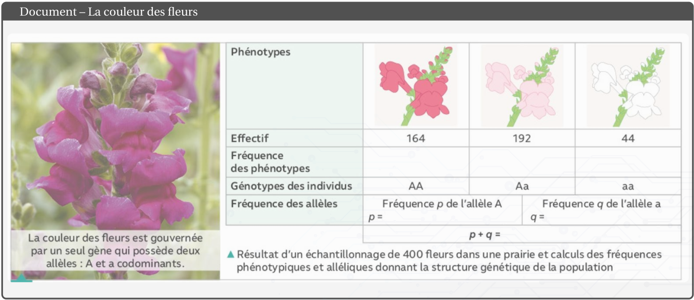
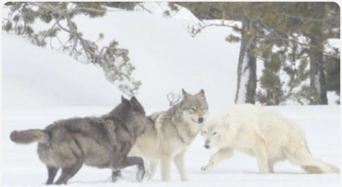
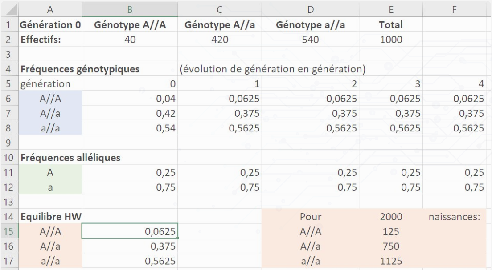
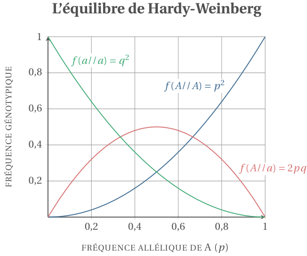
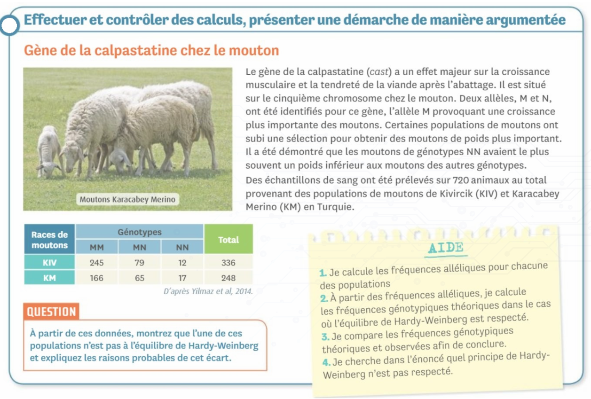
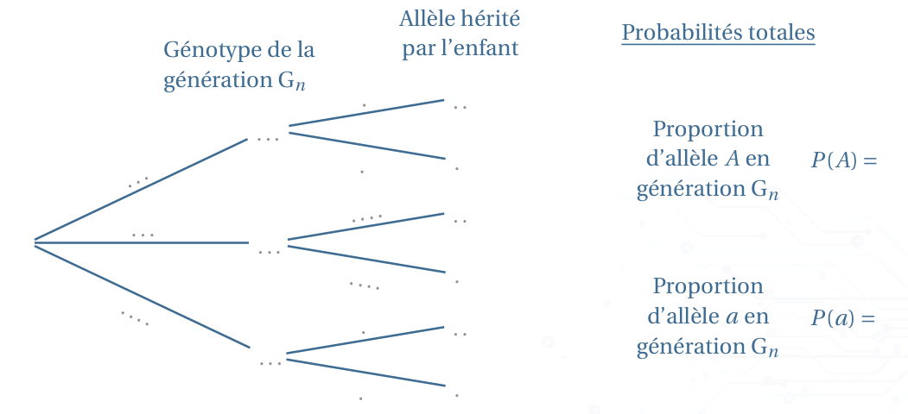
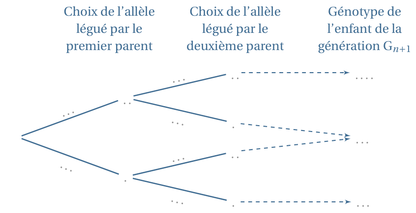

[pdf](./3_1_hardy_weinberg_cours.pdf)

**Évolution génétique des populations**

_Au cours de l’évolution biologique, la composition génétique d’une espèce change de génération en génération. Cependant, le modèle de Hardy-Weinberg prévoit que la structure d’une population reste stable d’une génération à une autre dans certaines conditions. Tout écart par rapport aux résultats de l’équilibre de Hardy-Weinberg est dû aux effets de forces évolutives._

# 1. Le modèle de Hardy-Weinberg

Le modèle de Hardy-Weinberg prédit le maintien des fréquences des alléles au cours des générations.
Cette stabilité est appelée l’équilibre de Hardy-Weinberg.

Un gène hérité de parents peut exister sous plusieurs formes (avec des allèles différents).

- _Génotype_ : composition allélique de l’ensemble des gènes d’un individu.
- _Homozygote_ : individu qui possède deux allèles identiques pour un même gène.
- _Hétérozygote_ : individu qui possède deux allèles différents pour un même gène.

Certaines allèles sont _dominantes_ et s’expriment alors que d’autres sont _récessives_.

## 1. Définitions

La **fréquence génotypique** donne les proportions des différentes combinaisons alléliques possibles (i.e. génotypes).

$$f (\text{génotype}) = \frac{\text{Nombre d’individus de ce génotype}}{\text{Nombre d’individus}}$$

La **fréquence allélique** donne la proportion de chaque allèle. Chez une espèce à deux chromosomes, on a, pour un gène donné, deux fois plus d’allèles que d’individus.

$$
f(\text{allélique}) = \frac{\text{Nombre total de l’alléle donné}}{2\times \text{Nombre d’individus}}
$$

## 2. Document

### Questions :

1. Rappeler la différence entre _génotype_ et _phénotype_.
2. Compléter le tableau ci-dessus en déterminant les différentes fréquences phénotypiques (ou génotypiques) et alléliques.
3. Justifier et vérifier que $f (A) = f (A//A)+ \dfrac{1}{2} f (A//a)$ et en déduire $f (a)$.

## 3. Modèle de Hardy-Weinberg

_Ce modèle a été énoncé indépendamment au début du XXe siècle par le mathématicien anglais Godfrey Harold Hardy et par le médecin allemand Wilhem Weinberg._

Le modèle de Hardy-Weinberg permet d’estimer les fréquences alléliques et génotypiques des générations futures pour un gène à deux allèles dans une population.

Dans cette population, l’allèle $A$ a une fréquence $p$ et l’allèle a une fréquence $q = 1 - p$. Ce modèle s’applique lorsqu’un ensemble d’hypothèses est vérifié :

- une grande population (loi des grands nombres);
- la panximie (reproduction aléatoire des individus) ;
- l’absence de forces évolutives (migration, mutation, sélection naturelle, dérive génétique).

À l’**équilibre** de Hardy-Weinberg, on peut utiliser le _tableau de croisement_ ci-contre, afin de calculer les probabilités des génotypes à partir de la génération 1 en connaissant les fréquences alléliques de la génération 0 (initiale).

|                      | Allèle A (fréq. $p$) | Allèle a (fréq $q$) |
| -------------------- | -------------------- | ------------------- |
| Allèle A (fréq. $p$) | A//A $(p^2)$         | A//a $(pq)$         |
| Allèle a (fréq. $a$) | a//A $(pq)$          | a//a $(q^2)$        |

Quelle que soit la répartition des génotypes dans la population de départ, cette répartition devient **stable dès la 2e génération**. (_voir activité spé Maths_).

La fréquence allélique restant par ailleurs constante quelle que soit la génération considérée, on pourra donc utiliser comme **probabilité génotypique à l’équilibre** :

$$f_{HW}(A//A) = p^2 \qquad f_{HW}(A//a) = 2pq \qquad f_{HW}(a//a) = q^2$$

où la fréquence allélique est déterminée à partir d’une génération quelconque :

$$p = f(A//A) + \frac{1}{2}f(A//a)$$
$$q = f(a//a) + \frac{1}{2}f(A//a)$$

_Remarque_ La somme des fréquences génotypique étant nécessairement égale à 1, on a :

$$p^2 + 2pq + q^2=1$$

## 4. Activité

### Différentes couleurs de fourrures

On a réintroduit une population de loup dans un Parc National. Cette population présente deux couleurs de fourrure : noire ou grise. On sait que la couleur de la fourrure est contrôlée par un gène qui existe sous deux formes (allèle) : A ou a. L’allèle A étant dominante sur a, les loups de génotype A//A et A//a sont noirs tandis que les loups de génotype a//a sont gris.

### Tableur – modélisation de l’évolution génétique

### Questions

1. Indiquer les conditions sous lesquelles on peut prédire les fréquences génotypique de la génération 1 à partir des fréquences alléliques de la génération 0. Ces conditions vous semblent-elles réalistes ?
2. Identifier les cases dans lesquelles les formules suivantes ont été utilisées :

   a. $\tt{=C2/E\$2}$

   b. $\tt{=C6+C7/2}$

   c. $\tt{=1-B11}$

   d. $\tt{=2 * B11*B12}$

   e. $\tt{=B15*E\$14}$

3. Justifier que l’équilibre d’Hardy-Weinberg n’était pas réalisé en génération 0. (préciser les effectifs qu’on devrait observer).
4. On observe une stabilité des fréquences au delà de la seconde génération, montrer qu’en utilisant les fréquences génotypique d’équilibre $(f_{HW})$ les fréquences alléliques sont constantes de génération en génération (indication : utiliser que $q = 1-p$).
5. _Pour l’exemple du cours, sur les fleurs rouges, roses et blanches :_ montrer que les effectifs relevés sont ("presque") à l’équilibre de Hardy-Weinberg.

## 5. Exercices

### Exercice 1 : Vrai / Faux

Lorsqu’une population est à l’équilibre de Hardy-Weinberg on peut déterminer la fréquence génotypique en connaissant la fréquence allélique. Le graphique ci-contre résume la relation entre ces deux fréquences (rappel $q = 1-p$).

D’après ce graphique :

1. la fréquence des individus A//a est la plus élevée lorsque la fréquence $q$ vaut 0.5.
2. lorsque la fréquence $q$ est inférieure à 0,3, il y a plus d’individus A//a que d’individus A//A.
3. il n’existe aucune fréquence $p$ pour laquelle les fréquences des génotypes A//A et A//a sont identiques.
4. lorsque $q$ vaut 1, il n’y a que des individus du génotype a//a.

### Exercice 2

1. Dans la population, à l’équilibre de Hardy-Weinberg, décrite dans le tableau ci-dessous, quelle est la fréquence $p$ de l’allèle A ?

   | Génotype  | AA   | Aa   | aa   |
   | --------- | ---- | ---- | ---- |
   | Fréquence | 0.36 | 0.48 | 0.36 |

2. Pour un gène possédant deux allèles A et a, avec $f (A) = 0,6$, à l’équilibre de Hardy-Weinberg, quelle est la proportion d’hétérozygotes Aa ?

### Exercice 3 - Albinisme

Chez les humains, on considère que le gène de la pigmentation de la peau est présent sous la forme de deux allèles : l’allèle A dominant et l’allèle a responsable de l’albinisme chez les homozygotes a//a.

Des recherches montrent que la fréquence relative de l’allèle a est $q = 0,005%$.

1. Calculer la fréquence p de l’allèle A.
2. En supposant que la population est à l’équilibre de Hardy-Weinberg pour ce gène, calculer la fréquence relative des hétérozygotes A//a, porteurs sains du caractère d’albinisme.

### Exercice 4 - Entrainement

## 6. Activité : spé maths

_ÉVOLUTION GÉNÉTIQUE ET ÉQUILIBRE DE HARDY-WEINBERG_

Dans les cas simples, un gène peut prendre deux formes (ou allèles) A et a. Chaque gène se trouvant en deux exemplaires, un individu peut donc présenter l’un des trois génotypes suivants : A//A, A//a ou a//a. Un enfant hérite d’un allèle de chacun de ses parents, chaque allèle étant choisi au hasard. Ainsi, si l’un des parents est de type A//A et l’autre de type A//a, alors l’enfant peut être de type A//A ou A//a.

On admettra que, dans ce modèle théorique, les couples ont la même capacité de reproduction et qu’ils se forment au hasard indépendamment de leurs génotypes, que l’environnement est stable et que la population est suffisamment grande pour être considérée comme infinie.

Pour tout entier naturel $n$, on note $G_n$ la population à la génération $n$ et,

- $u_n$, $v_n$ et $w_n$ les proportions respectives des génotypes A//A, A//a et a//a dans $G_n$ avec $u_n + v_n + w_n = 1$
- $p_n$ et $q_n$ les proportions respectives des allèles A et a dans $G_n$ avec $p_n + q_n = 1$.

On se propose d’étudier l’évolution de ces différentes proportions au cours des générations.

### A. Lien entre les proportions dans $G_n$

Soit n un entier naturel. On choisit au hasard un allèle parmi ceux de la population Gn.

On note :

- A l’évènement : « l’allèle est du type A »; a l’évènement : « l’allèle est du type a »;
- AA l’évènement : « l’allèle provient d’un individu de génotype A//A »; Aa l’évènement : « l’allèle provient d’un individu de génotype A//a »;
- aA l’évènement : « l’allèle provient d’un individu de génotype a//A »; aa l’évènement : « l’allèle provient d’un individu de génotype a//a ».

On a alors pour tout entier naturel $n$ :

$$P(A) = p_n, P(a) = q_n, P(AA) = u_n, P(Aa) = v_n \text{ et } P(aa) = w_n$$

1. Déterminer toutes les probabilités conditionnelles du type $P_{AA}(A), P_{AA}(a), P_{Aa}(A)$, etc.
2. Compléter l’arbre de probabilités ci-dessous, en faisant intervenir les évènements $A, a, AA, Aa \text{ et } aa$ :

3. À l’aide de la formule des probabilités totales, montrer que pour tout entier naturel $n$,

$$p_n = u_n + \frac{1}{2}v_n \qquad \text{et}\qquad q_n = w_n+\frac{1}{2}v_n$$

### B. D’une génération à la suivante

Soit $n$ un entier naturel. On considère que la population $G_{n+1}$ est constituée uniquement des enfants issus des couples formés en $G_n$.

On choisit au hasard un enfant dans la population Gn+1.

1. Compléter l’arbre suivant afin de déterminer les probabilités génotypique de la génération suivante :

2. En déduire que pour tout entier naturel $n, u_{n+1} = p_n^2, w_{n+1} = q_n^2$ puis que $v_{n+1}=2p_nq_n$

### C. Étude des suites

1. Dans cette question, on pose : $u_0 = 0,7; v_0 = 0,2$ et donc $w_0 = 0,1$. Calculer les 5 premiers termes des suites $u, v, w, p$ et $q$ (_on pourra utiliser les outils de calculatrice adaptés_).
2. Reprendre les calculs précédents en choisissant d’autres valeurs initiales de $u_0$ et $v_0$.

   Émettre une conjecturer sur le comportement de chacune de ces suites.

3. Montrer que pour tout entier naturel $n, p_{n+1} = p_n$ et $q_{n+1} = q_n$.
4. En déduire le comportement des suites $p$ et $q$ puis celui des suites $u, v$ et $w$.
5. Justifier l’utilisation de loi génétique d’Hardy-Weinberg caractérisant ce modèle de population.
