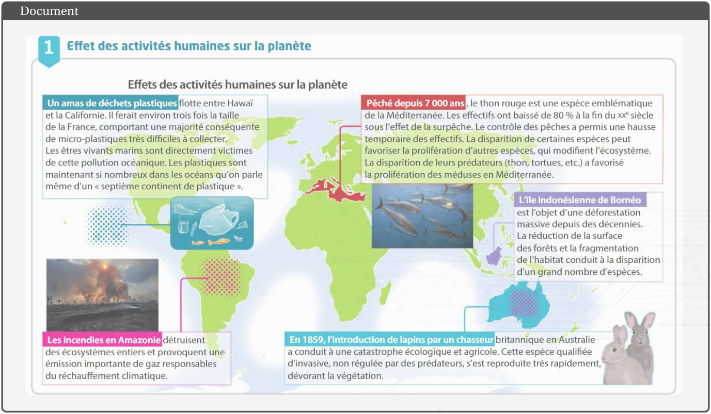
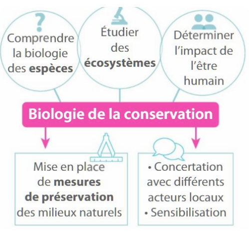
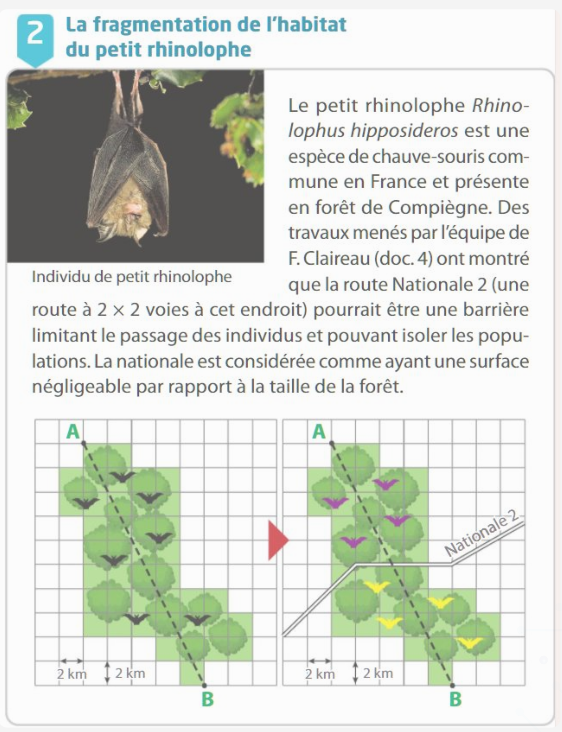
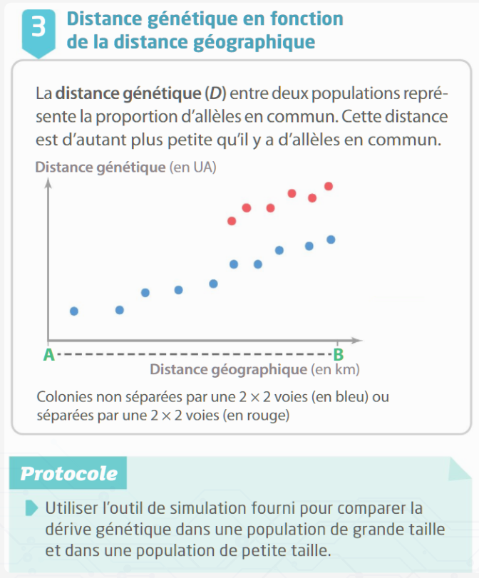
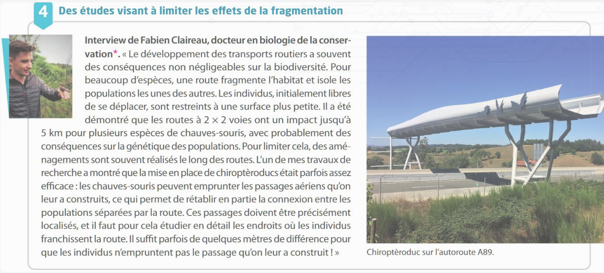

[pdf](./3_2_biodiversite_et_evolution.pdf)

# LES IMPACTS DES ÊTRES HUMAINS SUR LA BIODIVERSITÉ

_En raison de son mode de vie et de la croissance de la population, l’être humain ne cesse d’exploiter les ressources
de la planète : transport, alimentation, loisirs, etc. Cependant, ces ressources ne sont pas illimitées et les conséquences
de ces activités sur la biodiversité sont de plus en plus alarmantes._

## Introduction

_Vidéo à visionner_ : [lien](https://www.hatier-clic.fr/miniliens/mie/2020/9782401073401/EST_c09_act4_ci.mp4).

Dans une population, la fréquence des allèles transmis lors de la reproduction sexuée varie au cours du temps sous l’effet du hasard : c’est la dérive génétique. Son effet est d’autant plus marqué que l’effectif de la population est faible. La fixation ou la disparition d’un allèle se fera donc d’autant plus rapidement.

- Actuellement, de nombreux scientifiques parlent d’une sixième crise biologique pour qualifier l’impact des activités humaines sur l’évolution de la biodiversité et les multiples disparitions qui en découlent.
- La fragmentation d’un habitat, c’est-à-dire le morcellement d’une zone habitable en plusieurs zones plus petites, isole des populations à effectif plus réduit et dont la diversité génétique diminue.

## Document 1

### Questions

1. Caractériser les conséquences des activités humaines sur la biodiversité.
2. Proposer des solutions pour surmonter ces problèmes.

## Documents 2, 3, 4

### Vocabulaire

_Biologie de la conservation :_

Discipline ayant pour objet d’étude la protection des espèces, et visant à mieux comprendre leur biologie. Elle tient compte des facteurs humains présents dans le milieu considéré (urbanisme, agriculture, élevage, etc.) pour proposer les solutions de conservation les plus adaptées

_Outil de simulation_ : [**lien**](https://www.pedagogie.ac-nice.fr/svt/productions/derive-diplo/index.htm)

### Questions

1. Expérimenter l’outil de simulation de dérive génétique.
2. Déterminer l’effet de la fragmentation de l’habitat sur la diversité génétique d’une population et proposer de possibles mesures de protection.
3. Faire un résumé de l’activité sous forme de carte mentale
