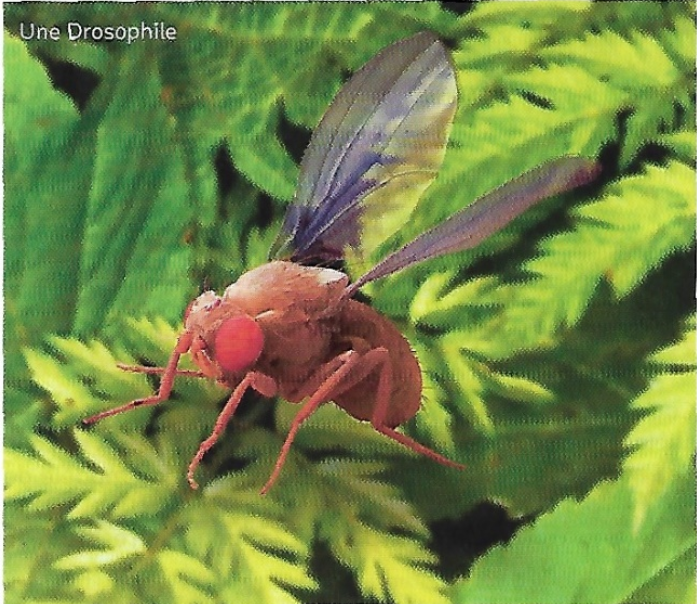
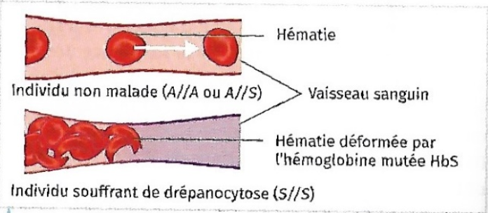

[pdf](./3_4_exercices.pdf)

## Exercice 1 - Molécules à la surface des globules rouges

On cherche à établir si des populations sont à l'équilibre de Hardy-Weinberg concernant un gène codant des molécules à la surface des globules rouges. Il existe deux allèles pour ce gène, l'allèle M et l'allèle N. Une étude menée en 1958 dans la ville minière de Ashibetsu au Japon révèle la répartition suivante des génotypes dans la population.

| Génotype | Nombre d'individus |
| -------- | -----------------: |
| MM       |                406 |
| MN       |                744 |
| NN       |                332 |
| Total    |               1482 |

### Questions

1. Calculer les fréquences des allèles M et N dans la population.
2. À partir des fréquences alléliques, calculez les fréquences génotypiques théoriques, c'est-à-dire si la population était à l'équilibre de Hardy-Weinberg.
3. Comparez les fréquences génotypiques théoriques avec les fréquences génotypiques observées. Déduisez-en si la population respecte l'équilibre de Hardy-Weinberg pour ce gène.

### Indications

1. Comme chaque individu a deux allèles, il y a au total deux fois plus d'allèles que d'individus.
2. Si la population est à l'équilibre de Hardy-Weinberg, les fréquences génotypiques et alléliques sont stables d'une génération à l'autre. On calcule donc les fréquences génotypiques de la génération suivante à partir des fréquences alléliques calculées à la question 1.
3. Si les fréquences génotypiques théoriques (de la génération suivante) sont les mêmes que les fréquences génotypiques observées, alors la population est à l'équilibre de Hardy-Weinberg pour le gène considéré.

## Exercice 2 - Étude d'une population de lamier

_Lamium amplexicaule_ est une plante que l'on trouve dans la région de Montpellier.
Sa population est importante puisqu'on trouve plusieurs centaines d'individus autour de Montpellier.
La particularité de cette plante est qu'elle montre deux types de fleurs :

- des fleurs cléstogames qui restent fermées et imposent l'autofécondation à l'intérieur des fleurs ;
- des fleurs ouvertes dites chasmogames qui permettent une fécondation entre les individus.

Les chercheurs s'intéressent à un gène qui est neutre pour la plante, c'est-à-dire que sa présence n'est ni avantageuse, ni désaventageuse pour un individu. Ce gène existe sous deux formes, les allèles A et a.

Un échantillon de $N=39$ individus est prélevé aléatoirement dans cette population.

| Génotypes          | Homozygote AA | Hétérozygote Aa | Homozygote aa |
| ------------------ | ------------- | --------------- | ------------- |
| Effectifs obesrvés | 4             | 1               | 34            |

### Questions

1. Calculer l'effectif théorique de chaque génotype de l'échantillon dans l'hypothèse où l'équilibre de Hardy-Weinberg serait respecté.
2. Montrer que l'échantillon de _Lamium amplexicaule_ ne respecte pas l'équilibre de Hardy-Weinberg pour le gène étudié.
3. À partir des données de l'énoncé, formuler une hypothèse pour indiquer quelle condition de l'équilibre de Hardy-Weinberg n'est pas respectée. Justifier votre réponse.

## Exercice 3

La couleurs des yeux des mouches drosophiles est due à la présence de pigments. La synthèse de ces pigments est sous contrôle d'un gène possédant deux allèles. L'allèle A confère une couleur rouge vif, l'allèle B une couleur brune. La couleur rouge sombre est due à la présence simultanée des deux pigments.

Soif $p$ la fréquence de l'allèle A et $q$ la fréquence de l'allèle B dans une population ne possédant que ces deux allèles, avec $p+q=1$. Le piégeage de drosophiles a permis de dénombrer la répartition des différents phénotypes dans une population

**Dénombrement des drosophiles de l'échantillon**

| Total analysé | rouge vif | bruns | rouge sombre |
| ------------- | --------- | ----- | ------------ |
| 4365          | 2801      | 560   | 1004         |

### Questions

1. Déterminer le génotype des différents types de mouches.
2. Calculer la fréquence du génotype (A//B) au sein de la population et en déduire un intervalle de confiance au seuil de 95%.
3. Déterminer $p$ et $q$ d'après les effectifs observés.
4. En déduire les fréquences génotypiques attendues dans le modèle de Hardy-Weinberg.
5. Déterminer si la population observée est à l'équilibre de Hardy-Weinberg. Interpréter.

## Exercice 4

La drépanocytose est une maladie génétique résultat d'une mutation d'un gène de l'hémoglobine. L'allèle A code pour une hémoglobine saine HbA, tandis que l'allèle S code pour une hémoglobine mutée HbS. Les individus A//A et A//S ne souffrent pas de la maladie, en revanche les individus S//S sont malades. Il a été montré que les individus A//S présentent une résistance accrue au paludisme. Cela explique que l'allèle S soit répandu en Afrique, en Inde et dans la péninsule arabique, où le paludisme est lui aussi présent.

_Source : Piel (F.-B), et al, Genetics in Medicine, 2016_

**Les hématies des patients atteints de drépanocytose circulent mal dans les vaisseaux sanguins**

**Répartition des génotypes en République démocratique du Congo.**

| Génotype           |    A//A |  A//S | S//S |
| ------------------ | ------: | ----: | ---: |
| Nombre d'individus | $3~182$ | $838$ | $96$ |

**Répartition des génotypes chez les nouveau-nés**

| Génotype           |      A//A |     A//S |    S//S |
| ------------------ | --------: | -------: | ------: |
| Nombre d'individus | $270~550$ | $71~400$ | $8~050$ |

### Questions

1. Expliquer les symptômes de la drépanocytose.
2. Calculer la fréquence de l'allèle S en République démocratique du Congo
3. Utiliser l'équilibre de Hardy-Weinberg pour prédire le nombre d'enfants de chaque génotype dans les $350~000$ naissances par an.
4. Comparer le nombre d'enfants réellement malades à la prédiction calculée précédemment.
