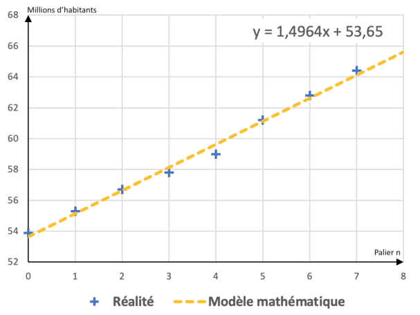

[pdf](./4_1_modeles_mathematiques.pdf)

## 1. Exemple introductif : Population de la France entre 1980 et 2015 (en millions d’habitants)

| Palier numéro $n$ | Année  | Population $u(n)$ | Variation absolue |
| ----------------- | ------ | ----------------- | ----------------- |
| $0$               | $1980$ | $53,9$            |                   |
| $1$               | $1985$ | $55,3$            |                   |
| $2$               | $1990$ | $56,7$            |                   |
| $3$               | $1995$ | $57,8$            |                   |
| $4$               | $2000$ | $59,0$            |                   |
| $5$               | $2005$ | $61,2$            |                   |
| $6$               | $2010$ | $62,8$            |                   |
| $7$               | $2015$ | $64,4$            |                   |

_Sources : Insee_

On considère une population dont l'effectif évolue par palier, passant de la valeur $u(n)$ au palier $n$ à l'effectif $u(n+1)$ au palier $n+1$.

Pour $n \in \mathbb{N}$, on appelle _variation absolue_ la différence $u(n+1)-u(n)$

**Question :**

Compléter le tableau ci-dessus

## 2. Outil mathématique : Évolution linéaire

On parle d'_évolution linéaire_ lorsque pour une population, la **variation absolue** est (presque) **constante** d'un palier à l'autre. En notant $r$ cette constante, on peut modéliser l'évolution par une _suite arithmétique de raison $r$_.
On a $u(n+1)-u(n) = r$, soit $u(n+1)= u(n) + r, \text{ pour tout } n \in \mathbb{N}$.

$$u(0)\xrightarrow{+r} u(1)\xrightarrow{+r} u(2)\xrightarrow{+r} u(3) \xrightarrow{+r} \cdots$$

Le nombre d'habitants s'exprime en fonction de $n$ par : $$u(n) = \phantom{U(0)+N X R .......}$$

[Vidéo](https://youtu.be/Rz1GbWg0TJU) : 

### Graphiquement

Dans le cas d'une évolution linéaire, les points de coordonnées $(n;u_n)$ sont (presque) **alignés**.

On peut alors ajuster le nuage de points par une droite d'équation $y=ax+b$, par exemple :

- à l'aide d'un tableur (outil "courbe de tendance") ou de la calculatrice (outil _RégLin_(ax+b))

- en prenant $a=r$ pour _coefficient directeur_ puis en calculant $b$ à l'aide d'un point de la droite.

## 3. Modélisation mathématique de la population française (1980-2015)

**Modèle 1 : avec une suite arithmétique**

| Palier numéro $n$ | Année  | Population $u(n)$ du modèle | Variation absolue $r$ |
| ----------------- | ------ | --------------------------- | --------------------- |
| $0$               | $1980$ | $53,9$                      |                       |
| $1$               | $1985$ | $55,4$                      | $1,5$                 |
| $2$               | $1990$ | $56,9$                      | $1,5$                 |
| $3$               | $1995$ | $58,4$                      | $1,5$                 |
| $4$               | $2000$ | $59,9$                      | $1,5$                 |
| $5$               | $2005$ | $61,4$                      | $1,5$                 |
| $6$               | $2010$ | $62,9$                      | $1,5$                 |
| $7$               | $2015$ | $64,4$                      | $1,5$                 |

**Modèle 2 : avec une droite d'ajustement**

### Questions

1. **Doc. 1 --** Calculer les variations absolues et compléter la colonne 4 du tableau. Commentez.
1. **Doc. 2 --** Indiquer comment reconnaître une évolution dite linéaire.
1. **Doc. 2 --** Compléter la formule encadrée.
1. **Doc. 1 et 3 --** Pourquoi avoir choisi $r=1,5$ dans le modèle 1 ? Le modèle linéaire est-il adapté ?
1. **Doc. 3 --** En exploitant les modèlisations, estimer le nombre d'habitants en France en 2030. En 2100.
