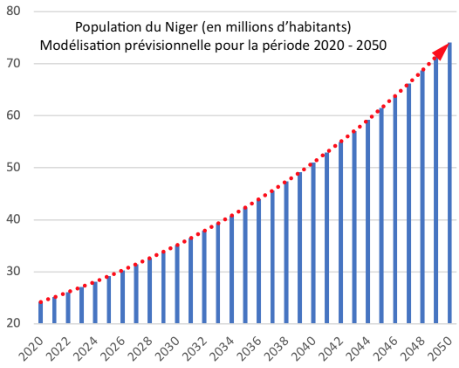

[pdf](./4_2_modele_exponentiel.pdf)

# Le modèle exponentiel

_Enseignement Scientifique - Terminale_

## Doc 1 -- Évolution démographique au Niger entre 2011 et 2019

Sources : _Banque Mondiale_

| Palier numéro $n$ |  Année | Population $u(n)$ | Taux de variation |
| ----------------: | -----: | ----------------: | ----------------- |
|               $0$ | $2011$ |      $17~114~761$ |                   |
|               $1$ | $2012$ |      $17~795~191$ |                   |
|               $2$ | $2013$ |      $18~504~255$ |                   |
|               $3$ | $2014$ |      $19~240~157$ |                   |
|               $4$ | $2015$ |      $20~001~663$ |                   |
|               $5$ | $2016$ |      $20~788~838$ |                   |
|               $6$ | $2017$ |      $21~602~472$ |                   |
|               $7$ | $2018$ |      $22~442~948$ |                   |

Sources : _Ined_

On considère une population dont l'effectif évolue par palier, passant de la valeur $u(n)$ au palier $n$ à l'effectif $u(n+1)$ au palier $n+1$.

Pour $n \in \mathbb{N}$, on appelle _taux de variation_ le quotient : $$\dfrac{u(n+1)-u(n)}{u(n)}$$

| Population au 01/01/2019 | Nombre de décès en 2019 | Taux de mortalité en 2019 | Nombre de naissances en 2019 | Taux de natalité en 2019 | Population au 01/01/2020 | Taux de variation global |
| ------------------------ | ----------------------- | ------------------------- | ---------------------------- | ------------------------ | ------------------------ | ------------------------ |
| $23~310~000$             | $186~400$               |                           |                              | $4.6$                    |

D'après l'INED, le Niger est le pays d'Afrique qui possède le plus fort taux de natalité.

## Doc 2 -- Boîte à outils mathématique

On parle d'_évolution exponentielle_ lorsque pour une population, le **taux de variation** est (presque) **constant** d'un palier à l'autre. En notant $t$ ce taux constant, on peut modéliser l'évolution par une _suite géométrique_ de raison $q=1+t$.

En effet, on a $\dfrac{u(n+1)-u(n)}{u(n)} = t$,

soit $u(n+1)= (1+t) \times u(n), \text{ pour tout } n \in \mathbb{N}$.

$$u(0)\xrightarrow{\times (1+t)} u(1)\xrightarrow{\times (1+t)} u(2)\xrightarrow{\times (1+t)} u(3) \xrightarrow{\times (1+t)} \cdots$$

Le nombre d'habitants s'exprime en fonction de $n$ par : $$u(n) = \ldots\ldots$$

[Vidéo](\href{https://youtu.be/4y201FhO_PE)

## Doc 3 -- Modèle exponentiel et temps de doublement

On fait l'hypothèse que la population du Niger augmentera chaque année de $3.8$ \% à partir de 2020.

Le _temps de doublement_ est le temps nécessaire pour qu'une quantité voie sa valeur initiale doubler.

_Représentation obtenue sur tableur_

> La croissance démographique du Niger est la plus rapide du monde. De $24,2$ millions en $2020$, le Niger pourrait voir, selon la présidence du pays, sa population quasiment doubler d'ici à 2040, passant ainsi à près de 50 millions d'habitants.

d'après _Le Monde_

### Questions

1. **Doc. 1 --** Calculer les taux de variation et compléter ainsi le premier tableau. Commentez.
1. **Doc. 1 --** Compléter le deuxième tableau à l'aide des données de l'INED.
1. **Doc. 2 --** Comment reconnaître une évolution exponentielle ? Compléter la formule encadrée.
1. **Doc. 1, 2 et 3 --** Proposer une expression de $u(n)$ modélisant la population du Niger.
   . **Doc. 3 --** Déterminer le temps de doublement de la population du Niger selon le modèle proposé.
