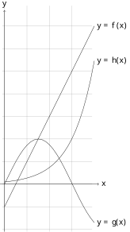
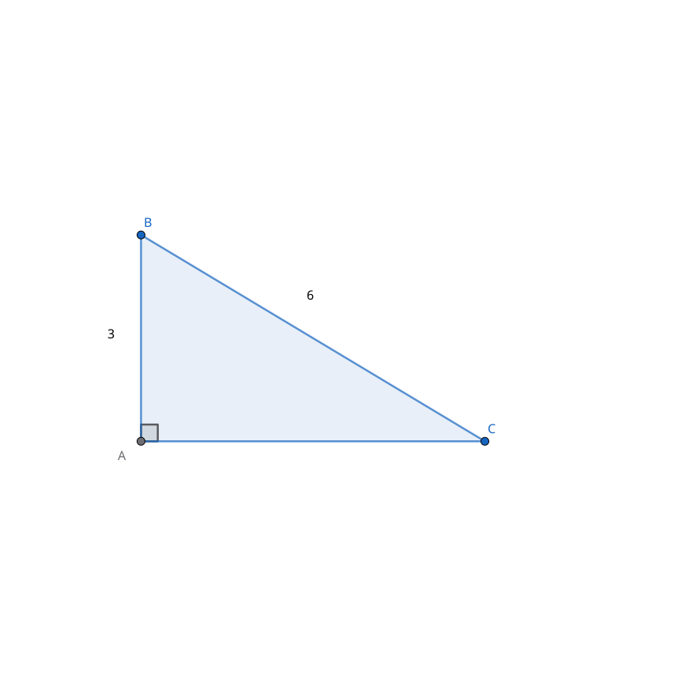
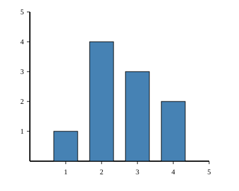
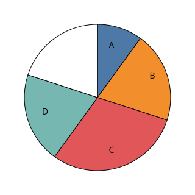

--- 

[pdf](./automatismes.pdf)

---

## 1. Calcul numérique et algébrique

### 1.1. Comparer ($<, >$ ou $=$) deux nombres directement ou par calcul

1. Comparer les nombres $3,14$ et $\pi$.
2. Comparer $\sqrt{10}$ et $3$.
3. Comparer $\frac{7}{3}$ et $2,33$.
4. Comparer $-5,2$ et $-5,19$.
5. Comparer $7,2$ et $\frac{36}{5}$.
6. Comparer $\sqrt{15}$ et $3,87$.
7. Comparer $\frac{13}{6}$ et $2,16$.
8. Comparer $-3,05$ et $-3,1$.
9. Comparer $5,99$ et $\frac{60}{10}$.
10. Comparer $\sqrt{17}$ et $4,12$.
11. Comparer $\frac{19}{8}$ et $2,375$.
12. Comparer $-2,001$ et $-2,01$.

### 1.2. Effectuer des opérations et des comparaisons entre des fractions simples

1. Calculer $\frac{3}{4} + \frac{1}{6}$.
2. Calculer $\frac{5}{8} - \frac{2}{3}$.
3. Comparer $\frac{11}{5}$ et $\frac{23}{10}$.
4. Simplifier $\frac{18}{24}$.
5. Calculer $\frac{7}{12} - \frac{1}{4}$.
6. Calculer $\frac{5}{6} + \frac{2}{9}$.
7. Comparer $\frac{17}{8}$ et $\frac{21}{10}$.
8. Simplifier $\frac{24}{36}$.
9. Calculer $\frac{11}{15} - \frac{2}{5}$.
10. Calculer $\frac{3}{8} + \frac{1}{12}$.
11. Comparer $\frac{13}{6}$ et $\frac{25}{12}$.
12. Simplifier $\frac{36}{48}$.

### 1.3. Effectuer des opérations sur les puissances

1. Calculer $3^2 \times 3^4$.
2. Calculer $\frac{2^8}{2^3}$.
3. Écrire $0,0001$ sous forme d'une puissance de $10$.
4. Calculer $(5^2)^3$.
5. Calculer $2^5 \times 2^{-2}$.
6. Calculer $\frac{10^6}{10^2}$.
7. Écrire $0,00001$ sous forme d'une puissance de $10$.
8. Calculer $(2^3)^4$.
9. Calculer $5^3 \times 5^{-1}$.
10. Calculer $\frac{3^7}{3^4}$.
11. Écrire $0,000001$ sous forme d'une puissance de $10$.
12. Calculer $(4^2)^3$.

### 1.4. Passer d'une écriture d'un nombre à une autre (décimale, fractionnaire, pourcentage)

1. Exprimer $0,75$ en pourcentage.
2. Écrire $\frac{3}{20}$ sous forme décimale.
3. Convertir $125\%$ en nombre décimal.
4. Écrire $2,5$ sous forme de fraction irréductible.
5. Exprimer $0,125$ en pourcentage.
6. Écrire $\frac{7}{25}$ sous forme décimale.
7. Convertir $75\%$ en nombre décimal.
8. Écrire $3,2$ sous forme de fraction irréductible.
9. Exprimer $0,0625$ en pourcentage.
10. Écrire $\frac{9}{20}$ sous forme décimale.
11. Convertir $12,5\%$ en nombre décimal.
12. Écrire $4,8$ sous forme de fraction irréductible.

### 1.5. Estimer un ordre de grandeur

1. Donner un ordre de grandeur de $489 + 213$.
2. Donner un ordre de grandeur de $1\,987 \times 5$.
3. Donner un ordre de grandeur de $\frac{3\,456}{12}$.
4. Donner un ordre de grandeur de $0,002 \times 5\,000$.
5. Donner un ordre de grandeur de $689 + 324$.
6. Donner un ordre de grandeur de $2\,998 \times 4$.
7. Donner un ordre de grandeur de $\frac{5\,678}{25}$.
8. Donner un ordre de grandeur de $0,005 \times 8\,000$.
9. Donner un ordre de grandeur de $789 + 211$.
10. Donner un ordre de grandeur de $3\,999 \times 2$.
11. Donner un ordre de grandeur de $\frac{8\,765}{49}$.
12. Donner un ordre de grandeur de $0,008 \times 1\,200$.

### 1.6. S'assurer de la vraisemblance, de la cohérence d'un résultat

1. Un rectangle a une aire de $24 \, \text{cm}^2$ et une longueur de $8 \, \text{cm}$. La largeur calculée est-elle cohérente si elle vaut $3 \, \text{cm}$ ?
2. Un carré a un périmètre de $20 \, \text{cm}$. La longueur du côté calculée est-elle cohérente si elle vaut $4 \, \text{cm}$ ?
3. Un triangle a des côtés de $5 \, \text{cm}$, $12 \, \text{cm}$ et $13 \, \text{cm}$. Est-il rectangle ?
4. Un cercle a une circonférence de $31,4 \, \text{cm}$. Le rayon calculé est-il cohérent s'il vaut $5 \, \text{cm}$ ?
5. Un rectangle a une aire de $36 \, \text{cm}^2$ et une longueur de $9 \, \text{cm}$. La largeur calculée est-elle cohérente si elle vaut $4 \, \text{cm}$ ?
6. Un carré a un périmètre de $28 \, \text{cm}$. La longueur du côté calculée est-elle cohérente si elle vaut $6 \, \text{cm}$ ?
7. Un triangle a des côtés de $9 \, \text{cm}$, $12 \, \text{cm}$ et $15 \, \text{cm}$. Est-il rectangle ?
8. Un cercle a une circonférence de $62,8 \, \text{cm}$. Le rayon calculé est-il cohérent s'il vaut $10 \, \text{cm}$ ?
9. Un rectangle a une aire de $48 \, \text{cm}^2$ et une longueur de $12 \, \text{cm}$. La largeur calculée est-elle cohérente si elle vaut $3 \, \text{cm}$ ?
10. Un carré a un périmètre de $36 \, \text{cm}$. La longueur du côté calculée est-elle cohérente si elle vaut $8 \, \text{cm}$ ?
11. Un triangle a des côtés de $10 \, \text{cm}$, $24 \, \text{cm}$ et $26 \, \text{cm}$. Est-il rectangle ?
12. Un cercle a une circonférence de $125,6 \, \text{cm}$. Le rayon calculé est-il cohérent s'il vaut $20 \, \text{cm}$ ?

### 1.7. Effectuer des conversions d'unités

1. Convertir $3,5 \, \text{km}$ en mètres.
2. Convertir $250 \, \text{mg}$ en grammes.
3. Convertir $2 \, \text{h} \, 30 \, \text{min}$ en secondes.
4. Convertir $5 \, \text{L}$ en centilitres.
5. Convertir $0,25 \, \text{km}$ en mètres.
6. Convertir $500 \, \text{mg}$ en grammes.
7. Convertir $1 \, \text{h} \, 45 \, \text{min}$ en secondes.
8. Convertir $2,5 \, \text{L}$ en décilitres.
9. Convertir $0,5 \, \text{km}$ en mètres.
10. Convertir $750 \, \text{mg}$ en grammes.
11. Convertir $2 \, \text{h} \, 15 \, \text{min}$ en secondes.
12. Convertir $0,25 \, \text{L}$ en centilitres.

### 1.8. Effectuer un calcul littéral élémentaire

1. Développer $3(x + 2)$.
2. Réduire $5x - 2x + 7x$.
3. Factoriser $12x + 18$.
4. Développer $(x + 4)(x - 4)$.
5. Développer $4(x - 5)$.
6. Réduire $7x + 3x - 5x$.
7. Factoriser $15x + 25$.
8. Développer $(x + 2)(x - 6)$.
9. Développer $5(x - 3)$.
10. Réduire $9x - 4x + 2x$.
11. Factoriser $21x + 28$.
12. Développer $(x + 1)(x - 9)$.

### 1.9. Développer, factoriser, réduire une expression algébrique simple

1. Développer $(2x + 3)^2$.
2. Factoriser $x^2 - 9$.
3. Réduire $4x^2 + 3x - 2x^2 + 5x$.
4. Développer $(x - 1)(x + 5)$.
5. Développer $(3x - 2)^2$.
6. Factoriser $x^2 - 25$.
7. Réduire $6x^2 - 2x + 3x^2 + 4x$.
8. Développer $(x - 3)(x + 8)$.
9. Développer $(4x - 1)^2$.
10. Factoriser $x^2 - 36$.
11. Réduire $8x^2 - 5x + 2x^2 + 7x$.
12. Développer $(x - 4)(x + 10)$.

### 1.10. Résoudre une équation du type : $x^2 = a$, $ax + b = cx + d$ ou $\frac{a}{x} = b$

1. Résoudre $x^2 = 16$.
2. Résoudre $3x + 5 = 2x + 10$.
3. Résoudre $\frac{4}{x} = 8$.
4. Résoudre $5x - 3 = 7x + 1$.
5. Résoudre $x^2 = 25$.
6. Résoudre $4x - 7 = 3x + 5$.
7. Résoudre $\frac{9}{x} = 3$.
8. Résoudre $2x + 8 = 5x - 1$.
9. Résoudre $x^2 = 36$.
10. Résoudre $6x - 5 = 4x + 7$.
11. Résoudre $\frac{16}{x} = 4$.
12. Résoudre $3x + 9 = 6x - 3$.

### 1.11. Isoler une variable dans une égalité

1. Dans l'égalité $3x = 2y - 10$, exprimer $y$ en fonction de $x$.
2. Dans l'égalité $5a - 3b - 20 = 0$, exprimer $a$ en fonction de $b$.
3. Dans l'égalité $2x + 4y = 12$, exprimer $x$ en fonction de $y$.
4. Dans l'égalité $7m - 3n - 14 = 0$, exprimer $n$ en fonction de $m$.
5. Dans l'égalité $2x + 5y = 20$, exprimer $y$ en fonction de $x$.
6. Dans l'égalité $4a + 3b = 30$, exprimer $a$ en fonction de $b$.
7. Dans l'égalité $5x - 2y = 15$, exprimer $x$ en fonction de $y$.
8. Dans l'égalité $3m + 4n = 24$, exprimer $n$ en fonction de $m$.
9. Dans l'égalité $4x + 3y = 24$, exprimer $y$ en fonction de $x$.
10. Dans l'égalité $2a - 5b = 30$, exprimer $a$ en fonction de $b$.
11. Dans l'égalité $7x + 2y - 14 = 0$, exprimer $x$ en fonction de $y$.
12. Dans l'égalité $5m - 4n = 20$, exprimer $n$ en fonction de $m$.

### 1.12. Effectuer une application numérique d'une formule

1. Calculer l'aire d'un rectangle de longueur $8  \text{cm}$ et de largeur $5  \text{cm}$.
2. Calculer le volume d'un cube de côté $4  \text{cm}$.
3. Calculer le périmètre d'un cercle de rayon $3  \text{cm}$.
4. Calculer l'aire d'un triangle de base $6  \text{cm}$ et de hauteur $4  \text{cm}$.
5. Calculer l'aire d'un rectangle de longueur $12  \text{cm}$ et de largeur $7  \text{cm}$.
6. Calculer le volume d'un cube de côté $6  \text{cm}$.
7. Calculer le périmètre d'un cercle de rayon $7  \text{cm}$.
8. Calculer l'aire d'un triangle de base $10  \text{cm}$ et de hauteur $6  \text{cm}$.
9. Calculer l'aire d'un rectangle de longueur $15  \text{cm}$ et de largeur $8  \text{cm}$.
10. Calculer le volume d'un cube de côté $7  \text{cm}$.
11. Calculer le périmètre d'un cercle de rayon $10  \text{cm}$.
12. Calculer l'aire d'un triangle de base $12  \text{cm}$ et de hauteur $9  \text{cm}$.

## 2. Proportions et pourcentages

### 2.1. Calculer, appliquer, exprimer une proportion sous différentes formes

1. Exprimer $0,3$ en pourcentage.
2. Calculer $20\%$ de $150$.
3. Exprimer $\frac{3}{4}$ en pourcentage.
4. Calculer $15\%$ de $200$.
5. Exprimer $0,45$ en pourcentage.
6. Calculer $30\%$ de $200$.
7. Exprimer $\frac{2}{5}$ en pourcentage.
8. Calculer $40\%$ de $150$.
9. Exprimer $0,875$ en pourcentage.
10. Calculer $15\%$ de $240$.
11. Exprimer $\frac{4}{5}$ en pourcentage.
12. Calculer $60\%$ de $180$.

### 2.2. Utiliser une proportion pour calculer une partie connaissant le tout, ou le tout connaissant une partie

1. Dans une classe de $30$ élèves, $40\%$ sont des filles. Combien y a-t-il de filles ?
2. $25\%$ d'un nombre valent $50$. Quel est ce nombre ?
3. Dans un groupe de $45$ personnes, $60\%$ sont des adultes. Combien y a-t-il d'adultes ?
4. $10\%$ d'un nombre valent $20$. Quel est ce nombre ?
5. Dans une classe de $40$ élèves, $60\%$ sont des garçons. Combien y a-t-il de garçons ?
6. $15\%$ d'un nombre valent $45$. Quel est ce nombre ?
7. Dans un groupe de $60$ personnes, $40\%$ sont des enfants. Combien y a-t-il d'enfants ?
8. $25\%$ d'un nombre valent $75$. Quel est ce nombre ?
9. Dans une classe de $50$ élèves, $60\%$ sont des filles. Combien y a-t-il de filles ?
10. $20\%$ d'un nombre valent $80$. Quel est ce nombre ?
11. Dans un groupe de $80$ personnes, $35\%$ sont des enfants. Combien y a-t-il d'enfants ?
12. $40\%$ d'un nombre valent $120$. Quel est ce nombre ?

## 3. Évolutions et variations

### 3.1. Passer d'une formulation additive à une formulation multiplicative

1. Exprimer une augmentation de $10\%$ sous forme de coefficient multiplicateur.
2. Exprimer une diminution de $25\%$ sous forme de coefficient multiplicateur.
3. Exprimer une augmentation de $5\%$ sous forme de coefficient multiplicateur.
4. Exprimer une diminution de $15\%$ sous forme de coefficient multiplicateur.
5. Exprimer une augmentation de $15\%$ sous forme de coefficient multiplicateur.
6. Exprimer une diminution de $30\%$ sous forme de coefficient multiplicateur.
7. Exprimer une augmentation de $8\%$ sous forme de coefficient multiplicateur.
8. Exprimer une diminution de $20\%$ sous forme de coefficient multiplicateur.
9. Exprimer une augmentation de $25\%$ sous forme de coefficient multiplicateur.
10. Exprimer une diminution de $40\%$ sous forme de coefficient multiplicateur.
11. Exprimer une augmentation de $12\%$ sous forme de coefficient multiplicateur.
12. Exprimer une diminution de $35\%$ sous forme de coefficient multiplicateur.

##  4. Fonctions et représentations

### 4.1. Déterminer graphiquement des images et des antécédents

1. Lire graphiquement $f(2)$
2. Lire graphiquement $g(3)$
3. Lire graphiquement $h(3)$
4. Lire graphiquement l'image par f de $3$
5. Lire graphiquement l'image par g de $1$
6. Lire graphiquement l'image par g de $2$
7. Résoudre graphiquement $f(x) = 2$
8. Résoudre graphiquement $g(x) = 0$
9. Résoudre graphiquement $h(x) = 3$
10. Lire graphiquement le ou les antécédents de $4$ par $f$
11. Lire graphiquement le ou les antécédents de $2$ par $g$
12. Lire graphiquement le ou les antécédents de $4$ par $h$

### 4.2. Exploiter une équation de courbe

1. Le point $A(2; 5)$ appartient-il à la courbe d'équation $y = 2x + 1$ ?
2. Le point $B(-1; 3)$ appartient-il à la courbe d'équation $y = x^2 + 2$ ?
3. Le point $C(0; -2)$ appartient-il à la courbe d'équation $y = -3x - 2$ ?
4. Le point $D(4; 10)$ appartient-il à la courbe d'équation $y = \frac{x^2}{2}$ ?
5. Le point $A(3; 7)$ appartient-il à la courbe d'équation $y = 2x + 1$ ?
6. Le point $B(-2; 6)$ appartient-il à la courbe d'équation $y = x^2 + 2$ ?
7. Le point $C(1; -5)$ appartient-il à la courbe d'équation $y = -3x - 2$ ?
8. Le point $D(5; 12,5)$ appartient-il à la courbe d'équation $y = \frac{x^2}{2}$ ?
9. Le point $A(4; 9)$ appartient-il à la courbe d'équation $y = 2x + 1$ ?
10. Le point $B(-3; 11)$ appartient-il à la courbe d'équation $y = x^2 + 2$ ?
11. Le point $C(2; -8)$ appartient-il à la courbe d'équation $y = -4x$ ?
12. Le point $D(6; 18)$ appartient-il à la courbe d'équation $y = \frac{x^2}{2}$ ?

### 4.3. Reconnaître l'expression d'une fonction linéaire, d'une fonction affine

1. La fonction $f(x) = 3x - 2$ est-elle affine ? linéaire ?
2. La fonction $g(x) = -2x$ est-elle affine ? linéaire ?
3. La fonction $h(x) = 5$ est-elle affine ? linéaire ?
4. La fonction $k(x) = \frac{x}{4} + 1$ est-elle affine ? linéaire ?
5. La fonction $f(x) = -4x + 1$ est-elle affine ? linéaire ?
6. La fonction $g(x) = 7x$ est-elle affine ? linéaire ?
7. La fonction $h(x) = -3$ est-elle affine ? linéaire ?
8. La fonction $k(x) = \frac{2x}{5} - 1$ est-elle affine ? linéaire ?
9. La fonction $f(x) = -3x + 2$ est-elle affine ? linéaire ?
10. La fonction $g(x) = 10x$ est-elle affine ? linéaire ?
11. La fonction $h(x) = -7$ est-elle affine ? linéaire ?
12. La fonction $k(x) = \frac{3x}{4} + 2$ est-elle affine ? linéaire ?

## 5. Géométrie

### 5.1. Sur une droite graduée, repérer ou placer un point dont l'abscisse est un nombre relatif

1. Placer le point $A$ d'abscisse $-3$ sur une droite graduée.
2. Placer le point $B$ d'abscisse $2,5$ sur une droite graduée.
3. Lire l'abscisse du point $C$ situé entre $-1$ et $0$ à égale distance de $-1$ et $0$.
4. Lire l'abscisse du point $D$ situé à $4$ unités à droite de l'origine.
5. Placer le point $A$ d'abscisse $-5$ sur une droite graduée.
6. Placer le point $B$ d'abscisse $3,75$ sur une droite graduée.
7. Lire l'abscisse du point $C$ situé entre $2$ et $3$ à égale distance de $2$ et $3$.
8. Lire l'abscisse du point $D$ situé à $6$ unités à gauche de l'origine.
9. Placer le point $A$ d'abscisse $-7$ sur une droite graduée.
10. Placer le point $B$ d'abscisse $4,25$ sur une droite graduée.
11. Lire l'abscisse du point $C$ situé entre $-3$ et $-2$ à égale distance de $-3$ et $-2$.
12. Lire l'abscisse du point $D$ situé à $8$ unités à droite de l'origine.

### 5.2. Dans le plan muni d'un repère orthogonal, lire les coordonnées d'un point donné, placer un point de coordonnées données

1. Lire les coordonnées des points $A, B, C, D, E, F$
2. Lire les coordonnées des points $G, H, I, J, K, L$
3. Lire les coordonnées des points $M, N, O, P, Q, R$
4. Lire les coordonnées du milieu de $[AQ]$
5. Lire les coordonnées du symétrique de $G$ par rapport à $P$
6. Lire les coordonnées du symétrique de $B$ par rapport à $I$
7. Quel est le point dont les coordonnées sont $(1; 3)$ ?
8. Quel est le point dont les coordonnées sont $(3; 2)$ ?
9. Quel est le point dont les coordonnées sont $(4; 2)$ ?
10. Quel est le point dont les coordonnées sont $(4; 1)$ ?
11. Quel est le point dont les coordonnées sont $(6; 2)$ ?
12. Quel est le point dont les coordonnées sont $(5; 3)$ ?

### 5.3. Calculer des périmètres (polygone et cercle), aires (rectangle, triangle et disque) et des volumes

1. Calculer le périmètre d'un carré de côté $7 \, \text{cm}$.
2. Calculer l'aire d'un disque de rayon $5 \, \text{cm}$.
3. Calculer le volume d'un pavé droit de dimensions $3 \, \text{cm}$, $4 \, \text{cm}$ et $5 \, \text{cm}$.
4. Calculer l'aire d'un triangle rectangle de côtés $6 \, \text{cm}$ et $8 \, \text{cm}$.
5. Calculer le périmètre d'un carré de côté $10 \, \text{cm}$.
6. Calculer l'aire d'un disque de rayon $8 \, \text{cm}$.
7. Calculer le volume d'un pavé droit de dimensions $2 \, \text{cm}$, $5 \, \text{cm}$ et $10 \, \text{cm}$.
8. Calculer l'aire d'un triangle rectangle de côtés $9 \, \text{cm}$ et $12 \, \text{cm}$.
9. Calculer le périmètre d'un carré de côté $14 \, \text{cm}$.
10. Calculer l'aire d'un disque de rayon $9 \, \text{cm}$.
11. Calculer le volume d'un pavé droit de dimensions $3 \, \text{cm}$, $6 \, \text{cm}$ et $12 \, \text{cm}$.
12. Calculer l'aire d'un triangle rectangle de côtés $15 \, \text{cm}$ et $20 \, \text{cm}$.

### 5.4. Application simple des théorèmes de Pythagore et de Thalès

1. Dans un triangle rectangle, les côtés de l'angle droit mesurent $6 \, \text{cm}$ et $8 \, \text{cm}$. Calculer l'hypoténuse.
2. Dans un triangle $ABC$ rectangle en $A$, on donne $AB = 5 \, \text{cm}$ et $BC = 13 \, \text{cm}$. Calculer $AC$.
3. Dans un triangle $DEF$, on donne $DE = 4 \, \text{cm}$, $EF = 6 \, \text{cm}$ et $DF = 8 \, \text{cm}$. Le triangle est-il rectangle ?
4. Dans un triangle $GHI$ rectangle en $H$, on donne $GH = 9 \, \text{cm}$ et $GI = 15 \, \text{cm}$. Calculer $HI$.
5. Dans un triangle rectangle, les côtés de l'angle droit mesurent $5 \, \text{cm}$ et $12 \, \text{cm}$. Calculer l'hypoténuse.
6. Dans un triangle $ABC$ rectangle en $A$, on donne $AB = 8 \, \text{cm}$ et $BC = 17 \, \text{cm}$. Calculer $AC$.

7. Dans la figure ci-dessus, $(AD) \parallel (BC)$. On sait que $OD = 7, OC = 12$ et $OA = 6$. Déterminer $OB$
8. Dans la figure ci-dessus, $(AD) \parallel (BC)$. On sait que $OD = 7, DC = 5$ et $AD = 5$. Déterminer $BC$
9. Dans la figure ci-dessus, $(AD) \parallel (BC)$. On sait que $AD = 5, BC = 8$ et $OB = 9$. Déterminer $AB$

10. Dans la figure ci-dessus, $(BC) \parallel (DE)$. On sait que $BC = 7, DE = 14$ et $AB = 3$. Déterminer $AE$
11. Dans la figure ci-dessus, $(BC) \parallel (DE)$. On sait que $BC = 7, DE = 14$ et $AB = 3$. Déterminer $BE$
10. Dans la figure ci-dessus, $(BC) \parallel (DE)$. On sait que $AB = 3, AE = 7$ et $BC = 5$. Déterminer $DE$

### 5.5. Connaître et utiliser les lignes trigonométriques dans le triangle rectangle

1. Dans la figure ci-dessus, calculer $\cos(\widehat{B})$.
2. Dans la figure ci-dessus, calculer $\sin(\widehat{B})$.
3. Dans la figure ci-dessus, calculer $\tan(\widehat{B})$.
4. Dans la figure ci-dessus, justifier que $\sin(\widehat{B}) = \cos(\widehat{C})$.

5. Dans la figure ci-dessus, calculer $\cos(\widehat{B})$.
6. Dans la figure ci-dessus, calculer $\sin(\widehat{C})$.
7. Dans la figure ci-dessus, calculer $AC$ en utilisant la trigonométrie.

8. Dans la figure ci-dessus, calculer $\cos(\widehat{C})$.
9. Dans la figure ci-dessus, calculer $\sin(\widehat{C})$.
10. Dans la figure ci-dessus, calculer $BC$.
11. Dans la figure ci-dessus, calculer $AC$.
12. Dans la figure ci-dessus, calculer $\cos(\widehat{B})$.

## 6. Statistiques

### 6.1. Lire et commenter des graphiques usuels 

1. Dans le diagramme en barre ci-dessus, donner les effectifs de chaque valeur.
2. Dans le diagramme en barre ci-dessus, quelles sont les valeurs dont l'effectif est supérieur ou égal à 3 ?
3. Dans le diagramme en barre ci-dessus, quel est l'effectif de la valeur 2 ?
4. Dans le diagramme en barre ci-dessus, quelle est la proportion de la valeur 2 ?

5. Dans le diagramme ci-dessus, déterminer la proportion de la partie manquante.

6. Dans le diagramme ci-dessus, combien d'élèves ont eu la note 2 ?
7. Dans le diagramme ci-dessus, combien d'élèves ont eu une note inférieure à 3 ?
8. Dans le diagramme ci-dessus, déterminer la moyenne de la série.
9. Dans le diagramme ci-dessus, déterminer la médiane de la série.
10. Dans le diagramme ci-dessus, déterminer les quartiles de la série.

### 6.2. Calculer et interpréter des indicateurs statistiques

$$
\begin{array}{|c|c|c|c|c|c|c|c|c|c|}
\\hline 
3 & 5 & 1 & 9 & 7 & 1 & 3 & 7 & 7 & 9 \\\\
\\hline 
\end{array}
$$

1. Calculer la moyenne de la série ci-dessus.
2. Calculer la médiane de la série ci-dessus.
3. Calculer les quartiles de la série ci-dessus.
4. Calculer l'étendue de la série ci-dessus.
5. Une série statistique comporte 100 valeurs. Sa moyenne est 12. Quel est le total des valeurs ?
6. Une série statistique comporte 100 valeurs. La médiane est 30. Combien de valeurs environ sont supérieures à 30 ?
7. Une série statistique comporte 100 valeurs. Les quartiles sont 20 et 70. Combien de valeurs environ sont entre 20 et 70 ?
8. Une série statistique comporte 100 valeurs. Sa moyenne est 12. On augmente toutes les valeurs de 5. Quelle est la nouvelle moyenne ?

$$
\begin{array}{|c|c|c|c|c|c|c|c|c|c|}
\\hline 
 0 & 2 & 6 & 6 & 8 & 2 & 4 & 0 & 8 & 6 \\\\
\\hline 
\end{array}
$$

9. Calculer la moyenne de la série ci-dessus.
10. Calculer la médiane de la série ci-dessus.
11. Calculer les quartiles de la série ci-dessus.
12. Calculer l'étendue de la série ci-dessus.

## 7. Probabilités

### 7.1. Savoir qu'une probabilité est un nombre entre 0 et 1

1. Une probabilité peut-elle être égale à $1,2$ ?
2. Une probabilité peut-elle être égale à $-0,5$ ?
3. Une probabilité peut-elle être égale à $0$ ?
4. Une probabilité peut-elle être égale à $1$ ?
5. Une probabilité peut-elle être égale à $1,5$ ?
6. Une probabilité peut-elle être égale à $-0,2$ ?

### 7.2. Savoir calculer la probabilité de l'événement contraire

1. La probabilité d'un événement $A$ est $0,3$. Quelle est la probabilité de $\overline{A}$ ?
2. La probabilité d'un événement $B$ est $0,75$. Quelle est la probabilité de $\overline{B}$ ?
3. La probabilité d'un événement $C$ est $\frac{2}{5}$. Quelle est la probabilité de $\overline{C}$ ?
4. La probabilité d'un événement $D$ est $\frac{3}{4}$. Quelle est la probabilité de $\overline{D}$ ?
5. La probabilité d'un événement $A$ est $0,4$. Quelle est la probabilité de $\overline{A}$ ?
6. La probabilité d'un événement $B$ est $0,8$. Quelle est la probabilité de $\overline{B}$ ?

### 7.3. Calculer la probabilité d'un événement comme somme des probabilités des issues qui le composent

1. On lance un dé équilibré à 6 faces. Quelle est la probabilité d'obtenir un nombre pair ?
2. On tire une carte au hasard dans un jeu de 32 cartes. Quelle est la probabilité de tirer un roi ?
3. Une urne contient 5 boules rouges, 3 boules bleues et 2 boules vertes. Quelle est la probabilité de tirer une boule rouge ou bleue ?
4. On lance deux dés équilibrés à 6 faces. Quelle est la probabilité d'obtenir une somme égale à 7 ?
5. On lance un dé équilibré à 6 faces. Quelle est la probabilité d'obtenir un nombre impair ?
6. On tire une carte au hasard dans un jeu de 32 cartes. Quelle est la probabilité de tirer une dame ?
7. Une urne contient 4 boules rouges, 5 boules bleues et 1 boule verte. Quelle est la probabilité de tirer une boule rouge ou verte ?
8. On lance deux dés équilibrés à 6 faces. Quelle est la probabilité d'obtenir une somme égale à 5 ?
9. On lance un dé équilibré à 6 faces. Quelle est la probabilité d'obtenir un nombre supérieur ou égal à 4 ?
10. On tire une carte au hasard dans un jeu de 32 cartes. Quelle est la probabilité de tirer un valet ?
11. Une urne contient 6 boules rouges, 4 boules bleues et 2 boules vertes. Quelle est la probabilité de tirer une boule rouge ou bleue ?
12. On lance deux dés équilibrés à 6 faces. Quelle est la probabilité d'obtenir une somme égale à 8 ?

### 7.4. Utiliser la relation $P(A) = \frac{\text{Card}(A)}{\text{Card}(U)}$ dans le cas de l'équiprobabilité

1. Une urne contient 10 boules numérotées de 1 à 10. On tire une boule au hasard. Quelle est la probabilité de tirer un multiple de 3 ?
2. Un sac contient 8 billes : 3 rouges, 2 bleues et 3 vertes. Quelle est la probabilité de tirer une bille bleue ?
3. On lance un dé à 12 faces. Quelle est la probabilité d'obtenir un nombre premier ?
4. Une classe compte 25 élèves, dont 10 filles. On choisit un élève au hasard. Quelle est la probabilité de choisir une fille ?
5. Une urne contient 12 boules numérotées de 1 à 12. On tire une boule au hasard. Quelle est la probabilité de tirer un multiple de 4 ?
6. Un sac contient 10 billes : 4 rouges, 3 bleues et 3 vertes. Quelle est la probabilité de tirer une bille bleue ?
7. On lance un dé à 20 faces. Quelle est la probabilité d'obtenir un nombre pair ?
8. Une classe compte 30 élèves, dont 12 filles. On choisit un élève au hasard. Quelle est la probabilité de choisir un garçon ?
9. Une urne contient 15 boules numérotées de 1 à 15. On tire une boule au hasard. Quelle est la probabilité de tirer un multiple de 5 ?
10. Un sac contient 12 billes : 5 rouges, 4 bleues et 3 vertes. Quelle est la probabilité de tirer une bille rouge ?
11. On lance un dé à 10 faces. Quelle est la probabilité d'obtenir un nombre pair ?
12. Une classe compte 28 élèves, dont 14 filles. On choisit un élève au hasard. Quelle est la probabilité de choisir un garçon ?

