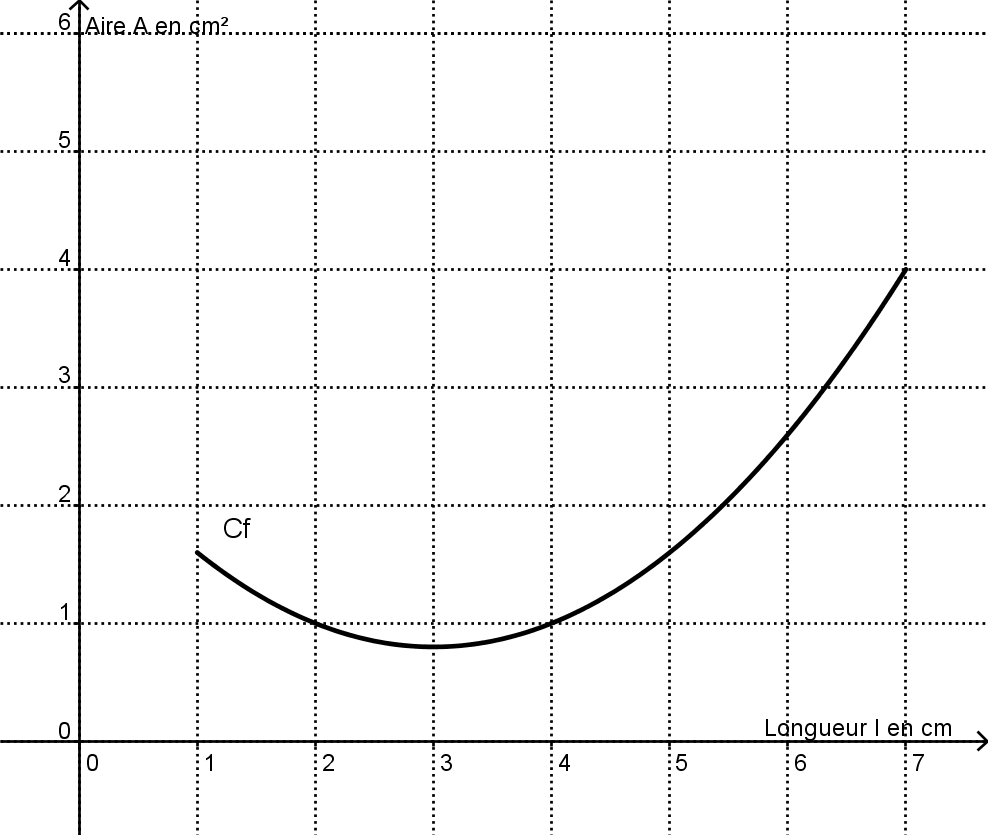
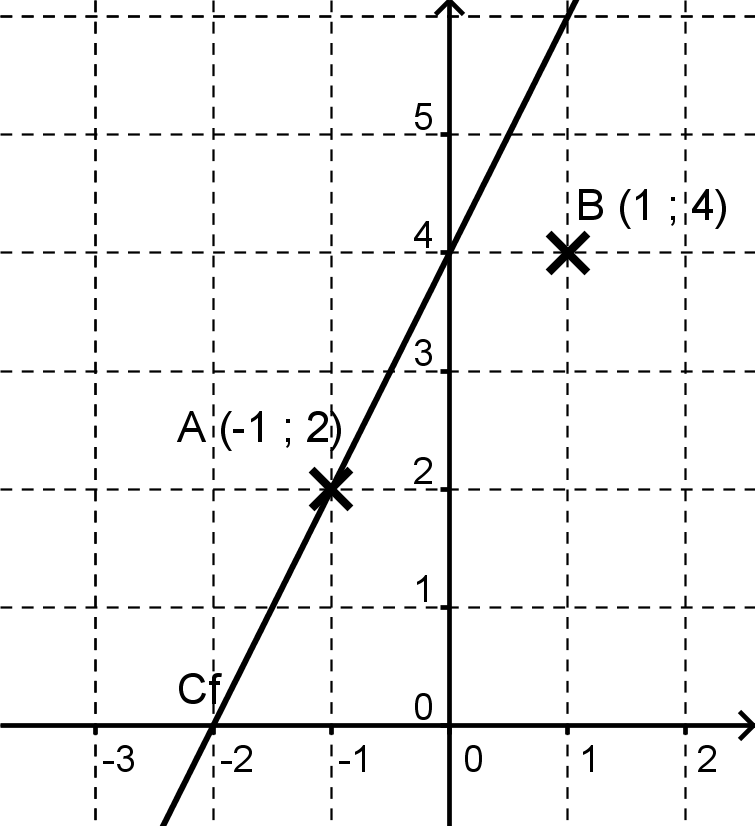
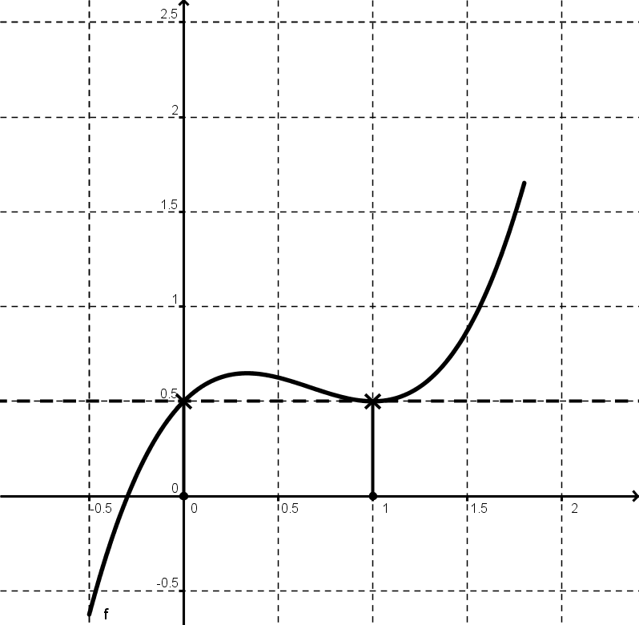
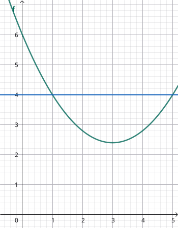

---

[pdf](./02_fonctions.pdf)

---

## 1. Modéliser par une fonction

Deux quantités peuvent varier tout en étant liées. Ce lien peut s'exprimer par un tableau de données, une formule ou un graphique (courbe ou nuage de points). Dans certains cas, on peut **modéliser** ce lien par une **fonction**.

### Définition 1
Soit $\mathcal{D}$ un ensemble de nombres. On définit une fonction $f$ sur $\mathcal{D}$ en associant à chaque nombre $x$ appartenant à $\mathcal{D}$ un seul nombre $y$ ; $f$ est une **fonction** de la **variable** $x$.

Il existe plusieurs manières de modéliser une fonction :

### 1.1. Fonctions données par un tableau de valeurs

À chaque taille de pied, on associe une seule pointure.
On introduit la fonction $p : \text{taille de pied} \mapsto \text{pointure}$.

| **Taille du pied en cm** | 23 | 24   | 25 |
|--------------------------|----|------|----|
| **Pointure**             | 36 | 37.5 | 39 |

### 1.2. Fonction donnée par une courbe

La variable figure sur l'axe des abscisses, c'est $l$.
À chaque longueur $l$ (en cm) comprise entre 1 et 7, on associe une seule aire $A$ (en $\text{cm}^2$). On considère donc la fonction $f: l \mapsto A$.

### 1.3. Fonction donnée par une formule

Un scooter roule à la vitesse constante de $50 \text{ km}.\text{h}^{-1}$.
À chaque durée de trajet $t$ (en h) correspond une distance parcourue $d$ (en km) : $d = 50t$.
On définit la fonction $g: t \mapsto d$. La variable est la durée $t$.

## 2. Vocabulaire et notations

### Définition 2
À chaque nombre $x$ appartenant à $\mathcal{D}$, la fonction $f$ associe un **seul** nombre $y$.

$$
f: \mathcal{D} \rightarrow \mathbb{R}
$$
$$
x \mapsto y
$$

### Remarque 1
- $\mathcal{D}$ est **l'ensemble de définition** de $f$.
  $\mathcal{D}$ est l'ensemble des nombres auxquels on peut appliquer $f$.
  On dit que $f$ est définie sur $\mathcal{D}$.

- $y$ est **l'image** de $x$ par $f$.
  On le note $f(x)$ et on lit *« $f$ de $x$ »*.

- $x$ est un **antécédent** de $y$ par $f$.

### Exemple 1
- Dans l'exemple des aires, la variable $l$ prend toutes les valeurs entre 1 et 7 ; l'ensemble de définition est l'intervalle $\mathcal{D} = [1;7]$.

- Dans l'exemple des chaussures, l'image de 23 est 36. On note $p(23) = 36$.
  23 est un antécédent de 36 par $p$... et il y en a bien d'autres !

## 3. Courbe d'une fonction

Le plan est muni d'un repère $(O, I, J)$.

### Définition 3
La **représentation graphique** d'une fonction, qu'on appelle aussi la **courbe** d'une fonction, est l'ensemble des points $M(x, y)$ du plan dont les coordonnées vérifient la relation :
$$
f(x) = y
$$
On note $\mathcal{C}$ la courbe de $f$.

### Définition 4
Un point $M(x, y)$ est sur la courbe si et seulement si ses coordonnées vérifient **l'équation** $f(x) = y$.

### Définition 5
Quand une fonction est donnée par une formule, on dit que $f(x)$ est **l'expression** de cette fonction.

### Exemple 2

Pour tout $x$ de $\mathbb{R}$, $f: x \mapsto 2x + 4$.
L'expression est $f(x) = 2x + 4$.

**Tracer** la courbe de $f$, c'est représenter les points du plan vérifiant cette relation.
Les points qui sont en dehors de la courbe ne vérifient donc pas l'équation $f(x) = y$.

- $A(-1; 2)$ vérifie $f(-1) = 2 \times (-1) + 4 = 2$.
  $A$ appartient à $\mathcal{C}$.

- $B(1; 4)$ ne vérifie pas cette relation ; en effet $f(1) = 2 \times 1 + 4 = 6 \neq 4$.
  $B$ n'est pas sur $\mathcal{C}$.

**Remarque** : Dans cet exemple, la fonction $f$ est **affine** et sa courbe est une **droite**.

## 4. Résolution graphique d'équations et d'inéquations

### Remarque 2
La *résolution graphique* est toujours soumise à la précision du graphique.
Sans information supplémentaire, on n'obtient donc que des réponses *approchées*.

### 4.1. Résolution graphique de $f(x) = k$

#### Définition 6
Pour *résoudre graphiquement* l'équation $f(x) = k$, on cherche tous les points de $\mathcal{C}$ dont **l'ordonnée** est $k$.
Les solutions sont les **antécédents** de $k$ par $f$.

#### Méthode 1 : Résoudre graphiquement $f(x) = 0,5$

1. On place 0,5 sur l'axe des ordonnées.
2. On trace la parallèle à $Ox$ passant par l'ordonnée 0,5 (*horizontale*). Elle coupe $\mathcal{C}$ en deux points.
3. Pour chaque point, on repère l'abscisse correspondante (*déplacement vertical*). Ce sont les solutions.
4. $f(x) = 0,5$ a deux solutions : $0$ et $1$.

### Exemple 3
Résoudre graphiquement les équations $f(x) = 1$ et $f(x) = -0,5$ dans l'exemple précédent.

### 4.2. Résolution graphique d'une inéquation : $f(x) < k$

#### Remarque 3
Nous allons nous intéresser d'abord à l'inégalité $<$. Pour les autres inégalités, la démarche est similaire.

#### Définition 7
Pour résoudre graphiquement l'inéquation $f(x) < k$, on cherche tous les points de $\mathcal{C}$ dont **l'ordonnée est inférieure** à $k$.
Les solutions sont les abscisses de ces points.

#### Remarque 4
Les solutions d'une inéquation forment généralement un intervalle ou une réunion d'intervalles.

#### Méthode 2 : Résoudre graphiquement $f(x) < 4$

1. On place $4$ sur l'axe des ordonnées.
2. On trace la parallèle à $Ox$ passant par l'ordonnée $4$. Elle coupe $\mathcal{C}$ en deux points.
3. Pour chaque point, on repère l'abscisse correspondante. Ici, on lit $1$ et $5$.
4. L'inégalité est $<$ : on cherche donc les points de $\mathcal{C}_f$ qui sont *strictement en dessous* de la droite.
5. $f(x) < 4$ a pour ensemble de solution l'intervalle $]1; 5[$.
   L'inégalité $<$ étant stricte, les bornes sont *exclues*.

