--- 

[pdf](./03_vecteurs_1.pdf)

---

## 1. Repères et coordonnées

### 1.1. Repères du plan

Dans le plan, trois points non alignés $O$, $I$ et $J$ déterminent un repère $(O, I, J)$.
Dans ce repère, tout point $M$ du plan est repéré par son couple de coordonnées $(x; y)$.

### 1.2. Trois types de repères

#### 1.2.1. Orthogonal

**Définition 1**
Si $(OI)$ est perpendiculaire à $(OJ)$, on dit que le repère $(O, I, J)$ est **orthogonal**.

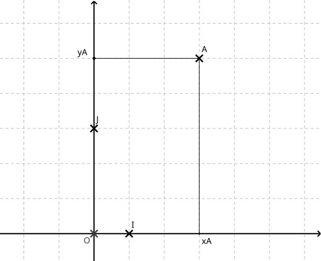

#### 1.2.2. Orthonormé

**Définition 2**
Si $(OI)$ est perpendiculaire à $(OJ)$ et que $OI = OJ$, on dit que le repère $(O, I, J)$ est **orthonormé**.

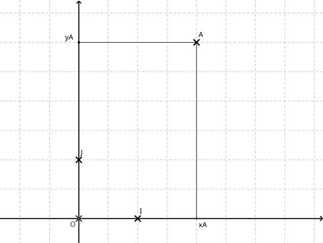

#### 1.2.3. Quelconque

**Définition 3**
Sinon, le repère est dit **quelconque**.

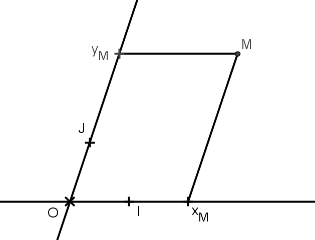

#### 1.2.4. Propriétés communes à tous les repères

**Propriété 1**
Dans n'importe quel type de repère $(O, I, J)$, on a :
- Les coordonnées : $O(0; 0)$, $I(1; 0)$ et $J(0; 1)$.
- Deux points qui ont les mêmes coordonnées sont confondus.

### 1.3. Milieu d'un segment

**Théorème 1**
Dans le repère $(O, I, J)$, soit $A(x_A, y_A)$ et $B(x_B, y_B)$.
Le milieu $K$ du segment $[AB]$ a pour coordonnées :
$$
K\left( \frac{x_A + x_B}{2}; \frac{y_A + y_B}{2} \right).
$$
Cette formule est valable dans **tout type de repère**.

**Exemple 1**
Soit $A(-2; 3)$ et $B(4; 2)$, alors :
$$
x_K = \frac{-2 + 4}{2} = 1 \quad \text{et} \quad y_K = \frac{3 + 2}{2} = \frac{5}{2}.
$$

**Remarque 1**
Le milieu $K$ est le *« point moyen »* de $A$ et $B$.
Son abscisse est la **moyenne des abscisses**, son ordonnée est la **moyenne des ordonnées**.

### 1.4. Distance en repère orthonormé

**Théorème 2**
Dans un repère **orthonormé**, soit $A(x_A, y_A)$ et $B(x_B, y_B)$.
La **distance** $AB$ est donnée par :
$$
AB = \sqrt{(x_B - x_A)^2 + (y_B - y_A)^2}.
$$

**Exercice 1**
Soit $A(1; -2)$ et $B(4; 2)$. Démontrer que $B$ appartient au cercle de centre $A$ et de rayon $5$.

**Solution**
$B$ appartient au cercle de centre $A$ et de rayon $5$ si $AB = 5$.
D'après la propriété :
$$
AB = \sqrt{(4 - 1)^2 + (2 + 2)^2} = \sqrt{9 + 16} = 5.
$$
Ainsi, $B$ appartient au cercle.

**Preuve : Distance en repère orthonormé**
La preuve s'appuie sur le théorème de **Pythagore**.

Considérons le point $C(x_B; y_A)$. On suppose $x_A \neq x_B$ et $y_A \neq y_B$.
Les axes du repère sont perpendiculaires, donc le triangle $ABC$ est **rectangle** en $C$.
D'après le théorème de Pythagore :
$$
AB^2 = AC^2 + BC^2.
$$
Or $AC = x_B - x_A$ ou $x_A - x_B$, dans tous les cas $AC^2 = (x_A - x_B)^2$.
De même, $BC^2 = (y_B - y_A)^2$.
On remplace :
$$
AB^2 = (x_A - x_B)^2 + (y_B - y_A)^2.
$$
Donc :
$$
AB = \sqrt{(x_A - x_B)^2 + (y_B - y_A)^2}.
$$
On vérifie que la formule reste vraie si $x_A = x_B$ ou si $y_A = y_B$.

## 2. Translation et vecteurs

### 2.1. Vecteurs du plan

**Définition 4**
Soient $A$ et $B$ deux points du plan. À tout point $C$ du plan, on associe l'unique point $D$ tel que $[AD]$ et $[BC]$ aient le même milieu.
On dit que $D$ est l'image de $C$ par la translation qui envoie $A$ sur $B$.

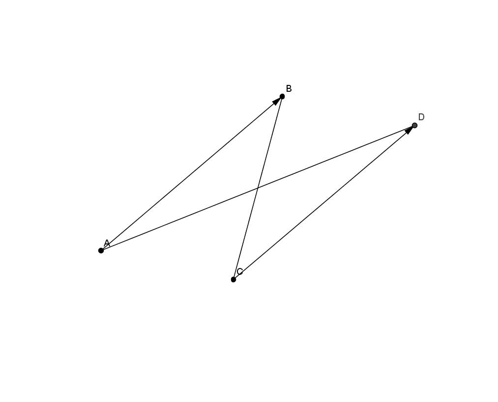

Si $C$ n'est pas aligné avec $A$ et $B$, $D$ est l'unique point tel que $ABDC$ soit un parallélogramme.

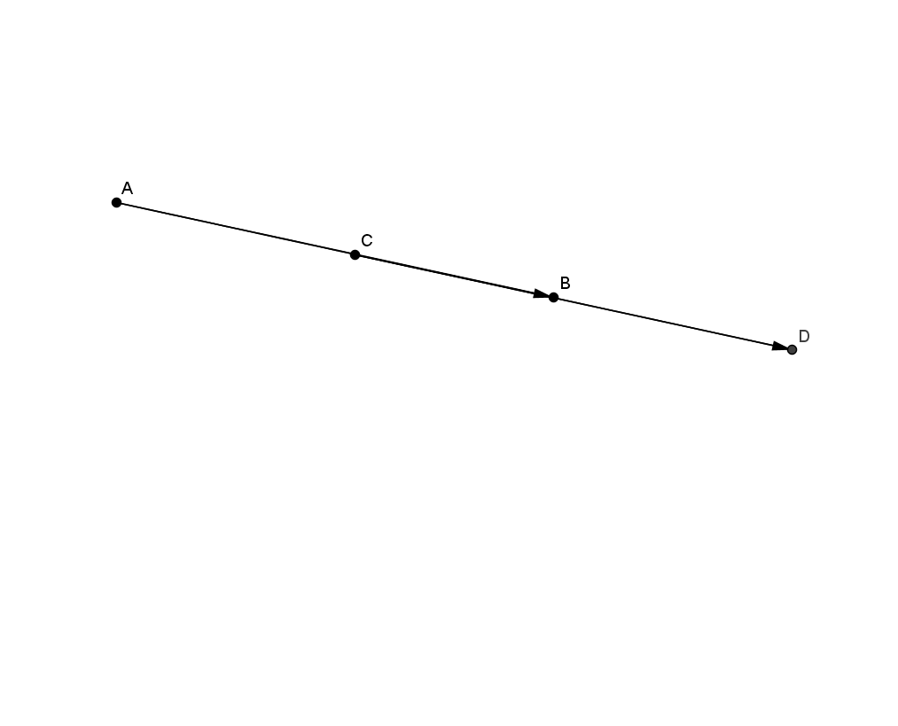

Si $C$ est aligné avec $A$ et $B$, le parallélogramme $ABDC$ est aplati.

**Remarque 2**
**Attention à l'ordre** : le parallélogramme est $AB\underline{DC} \neq AB\underline{CD}$ !

La translation qui envoie $A$ sur $B$ est aussi appelée la translation de vecteur $\overrightarrow{AB}$.
Si $A \neq B$, on représente le vecteur $\overrightarrow{AB}$ par une flèche d'origine $A$ et d'extrémité $B$.

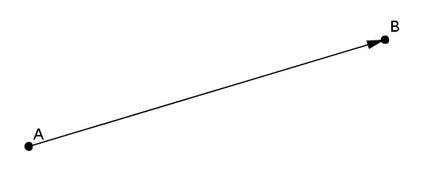

Visuellement, ce vecteur donne l'idée d'un déplacement :
- Il en indique la **direction**, celle de la droite $(AB)$,
- le **sens**, de $A$ vers $B$,
- et la **longueur** $AB$.

### 2.2. Égalité de deux vecteurs

**Propriété 2**
Dire que $\overrightarrow{AB} = \overrightarrow{CD}$ signifie que $D$ est l'image de $C$ par la translation de vecteur $\overrightarrow{AB}$.
Autrement dit :
- $\overrightarrow{AB} = \overrightarrow{CD}$ si et seulement si $[AD]$ et $[BC]$ ont le même milieu.
- $\overrightarrow{AB} = \overrightarrow{CD}$ si et seulement si $ABDC$ est un parallélogramme.

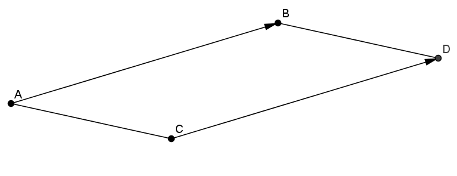

**Remarque 3**
- Visuellement, $\overrightarrow{AB}$ et $\overrightarrow{CD}$ sont égaux s'ils donnent l'idée du même déplacement. Les translations de vecteur $\overrightarrow{AB}$ et de vecteur $\overrightarrow{CD}$ sont identiques.
- Si $\overrightarrow{AB} = \overrightarrow{AC}$, alors $B = C$.

**Propriété 3**
Le point $I$ est le milieu de $[AB]$ si et seulement si $\overrightarrow{AI} = \overrightarrow{IB}$.

![$I$ milieu de $[AB]$](./vecteurs-fig5.png)

### 2.3. Représentant d'un vecteur, vecteur nul, opposé d'un vecteur

**Définition 5 : Représentant**
Le vecteur $\overrightarrow{AB}$ peut être représenté à partir de n'importe quel point.
Partant du point $C$, on aura $\overrightarrow{AB} = \overrightarrow{CD}$.
On peut le représenter avec une seule lettre : $\overrightarrow{u} = \overrightarrow{AB} = \overrightarrow{CD} = \overrightarrow{EF} = \cdots$.
On dit que $\overrightarrow{AB}$ est le représentant de $\overrightarrow{u}$ d'origine $A$, $\overrightarrow{EF}$ celui d'origine $E$, etc.

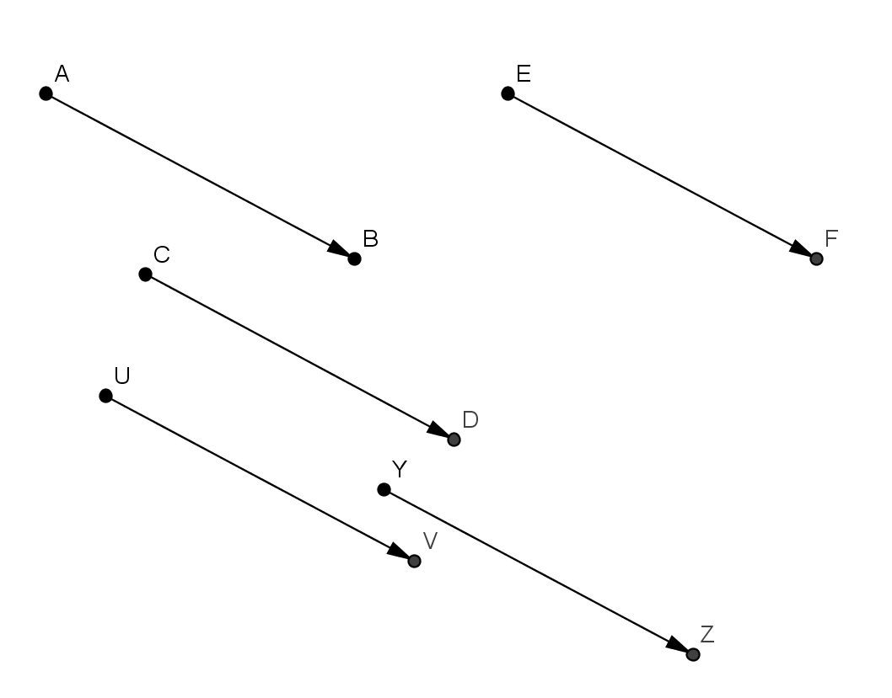

**Définition 6 : Vecteur nul**
Si $A = B$, le déplacement de $A$ vers $B$ est considéré comme nul.
On note $\overrightarrow{AA} = \overrightarrow{BB} = \overrightarrow{0} = \cdots$.

**Définition 7 : Opposé d'un vecteur**
Le vecteur $\overrightarrow{BA}$ et le vecteur $\overrightarrow{AB}$ sont opposés.
On note $\overrightarrow{BA} = -\overrightarrow{AB}$.
$\overrightarrow{BA}$ et $\overrightarrow{AB}$ ont la même direction et la même longueur, mais des sens opposés.
La translation de vecteur $\overrightarrow{BA}$ est la *translation réciproque* à celle de vecteur $\overrightarrow{AB}$.

### 2.4. Norme d'un vecteur

**Définition 8**
La norme du vecteur $\overrightarrow{AB}$ est la longueur $AB$. On la note $\left| \left| \overrightarrow{AB} \right| \right|$.

**Propriété 4**
Deux vecteurs sont égaux s'ils ont : même direction, même sens et même norme.
Ainsi, $\overrightarrow{AB} = \overrightarrow{CD}$ si et seulement si :
- $(AB) \parallel (CD)$,
- $\overrightarrow{AB}$ et $\overrightarrow{CD}$ ont le même sens,
- $AB = CD$.

## 3. Coordonnées d'un vecteur, base d'un repère

### 3.1. Coordonnées d'un vecteur

**Définition 9**
Dans un repère, les coordonnées d'un vecteur $\overrightarrow{u}$ sont les coordonnées du point $M$ tel que $\overrightarrow{OM} = \overrightarrow{u}$.
Si $M(x, y)$, on note $\begin{pmatrix} x \\\ y \end{pmatrix}$ les coordonnées de $\overrightarrow{u}$.

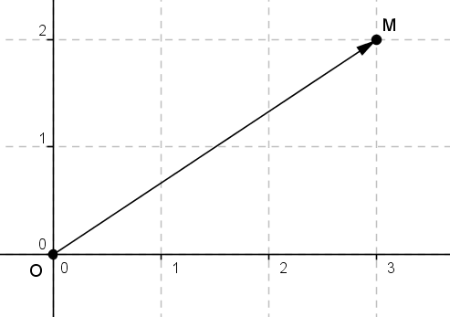

**Propriété 5**
Dans un repère, si $A(x_A, y_A)$ et $B(x_B, y_B)$, le vecteur $\overrightarrow{AB}$ a pour coordonnées :
$$
\overrightarrow{AB} \begin{pmatrix} x_B - x_A \\\ y_B - y_A \end{pmatrix}.
$$

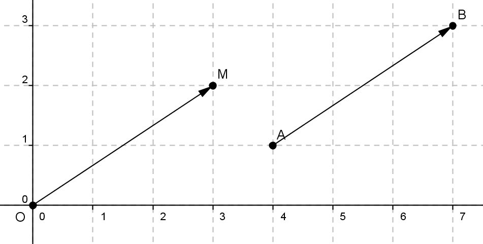

**Exemple 2**
- Si $A(1; 3)$ et $B(4; -1)$, on obtient :
  $$
  \overrightarrow{AB} \begin{pmatrix} 4 - 1 \\\ -1 - 3 \end{pmatrix} = \begin{pmatrix} 3 \\\ -4 \end{pmatrix}.
  $$

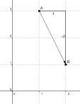

- Dans le repère $(O, I, J)$, on a :
  $$
  \overrightarrow{OI} \begin{pmatrix} 1 \\\ 0 \end{pmatrix} \quad \text{et} \quad \overrightarrow{OJ} \begin{pmatrix} 0 \\\ 1 \end{pmatrix}.
  $$
- Le vecteur $\overrightarrow{0}$ a pour coordonnées $\begin{pmatrix} 0 \\\ 0 \end{pmatrix}$.

**Preuve**
Les coordonnées de $\overrightarrow{AB}$ sont les coordonnées $(x, y)$ du point $M$ tel que $\overrightarrow{OM} = \overrightarrow{AB}$.
Alors $[OB]$ et $[AM]$ ont le même milieu.
Les coordonnées du milieu de $[OB]$ sont $\left( \frac{x_B}{2}, \frac{y_B}{2} \right)$ et celles du milieu de $[AM]$ sont $\left( \frac{x_A + x}{2}, \frac{y_A + y}{2} \right)$.
Donc :
$$
\frac{x_A + x}{2} = \frac{x_B}{2} \quad \text{et} \quad \frac{y_A + y}{2} = \frac{y_B}{2}.
$$
D'où :
$$
x = x_B - x_A \quad \text{et} \quad y = y_B - y_A.
$$

**Propriété 6**
Deux vecteurs du plan sont égaux si, et seulement s'ils ont les mêmes coordonnées dans un repère du plan.

### 3.2. Base d'un repère

**Définition 10**
Deux vecteurs $\overrightarrow{i}$ et $\overrightarrow{j}$ forment une **base** s'ils ne sont pas portés par des droites parallèles.

**Remarque 4**
On dira plus tard que deux vecteurs *portés par des droites parallèles* sont *colinéaires*.

**Définition 11 : Base d'un repère**
La **base** du repère $(O, I, J)$ est le couple $(\overrightarrow{i}, \overrightarrow{j})$, où $\overrightarrow{i} = \overrightarrow{OI}$ et $\overrightarrow{j} = \overrightarrow{OJ}$.

**Remarque 5**
Comme pour les repères, on distingue trois types de bases :
- Base **orthogonale** quand les vecteurs $\overrightarrow{i}$ et $\overrightarrow{j}$ sont portés par des droites perpendiculaires,
- Base **orthonormée** quand la base est orthogonale et que $\overrightarrow{i}$ et $\overrightarrow{j}$ ont la même norme,
- Base **quelconque** dans tous les autres cas.

**Remarque 6**
On note généralement le repère $(O, \overrightarrow{i}, \overrightarrow{j})$.

**Propriété 7 : Coordonnée d'un point dans une base repérée**
Si les coordonnées du point $M$ sont $(x, y)$, on a :
$$
\overrightarrow{OM} = x \overrightarrow{i} + y \overrightarrow{j}.
$$

## 4. Somme de deux vecteurs

### 4.1. Relation de Chasles

**Définition 12**
En enchaînant la translation de vecteur $\overrightarrow{u}$ et celle du vecteur $\overrightarrow{v}$, on obtient une nouvelle translation.
Le vecteur qui lui est associé est appelé la **somme des vecteurs** $\overrightarrow{u}$ et $\overrightarrow{v}$ et est noté $\overrightarrow{u} + \overrightarrow{v}$.
L'ordre n'a pas d'importance, autrement dit :
$$
\overrightarrow{v} + \overrightarrow{u} = \overrightarrow{u} + \overrightarrow{v}.
$$
On peut enchaîner trois vecteurs, et le vecteur qu'on obtient est $\overrightarrow{u} + \overrightarrow{v} + \overrightarrow{w}$.

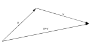

**Propriété 8 : Relation de Chasles**
Pour tous points du plan $A$, $B$ et $C$ :
$$
\overrightarrow{AB} + \overrightarrow{BC} = \overrightarrow{AC}.
$$

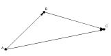

### 4.2. Coordonnées de la somme de deux vecteurs

**Propriété 9**
Dans un repère du plan, si $\overrightarrow{u} \begin{pmatrix} x \\\ y \end{pmatrix}$ et $\overrightarrow{v} \begin{pmatrix} x' \\\ y' \end{pmatrix}$, alors :
$$
\overrightarrow{u} + \overrightarrow{v} \begin{pmatrix} x + x' \\\ y + y' \end{pmatrix}.
$$

### 4.3. Règle du parallélogramme

**Propriété 10**
Si $\overrightarrow{AB}$ et $\overrightarrow{AC}$ ont la même origine, alors :
$$
\overrightarrow{AB} + \overrightarrow{AC} = \overrightarrow{AD},
$$
où $D$ est l'unique point tel que $ABDC$ est un parallélogramme.

### 4.4. Différence de deux vecteurs

**Définition 13 : Opposé d'un vecteur**
- Le vecteur $-\overrightarrow{v}$ vérifie $\overrightarrow{v} + (-\overrightarrow{v}) = \overrightarrow{0}$.
- La différence $\overrightarrow{u} - \overrightarrow{v}$ est définie par $\overrightarrow{u} + (-\overrightarrow{v})$.

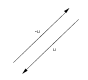

**Définition 14 : Différence de deux vecteurs**
Dans un repère du plan, si $\overrightarrow{u} \begin{pmatrix} x \\\ y \end{pmatrix}$ et $\overrightarrow{v} \begin{pmatrix} x' \\\ y' \end{pmatrix}$, alors :
$$
\overrightarrow{u} - \overrightarrow{v} \begin{pmatrix} x - x' \\\ y - y' \end{pmatrix}.
$$

