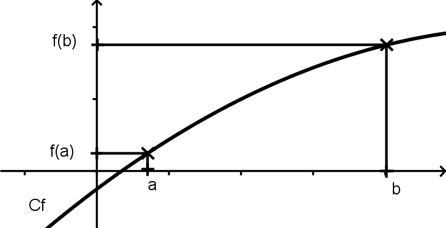
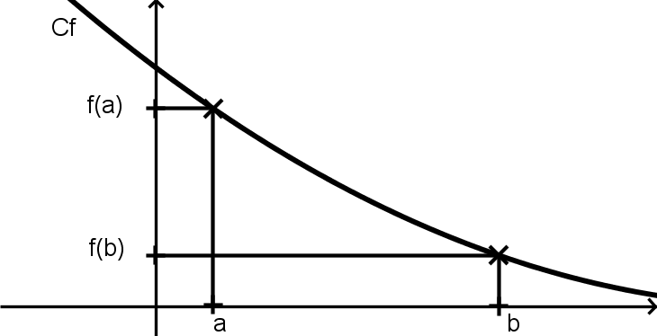
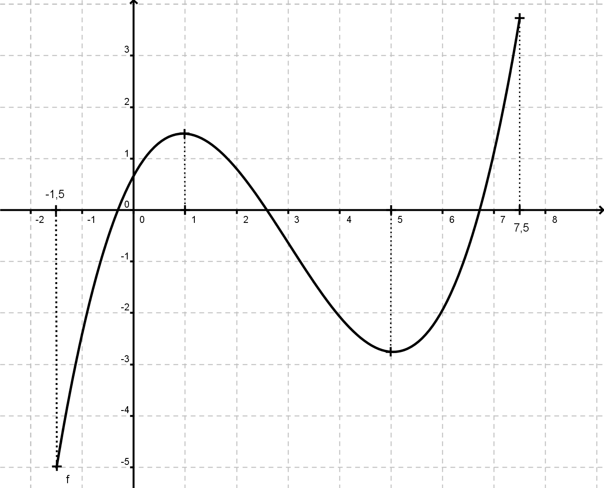
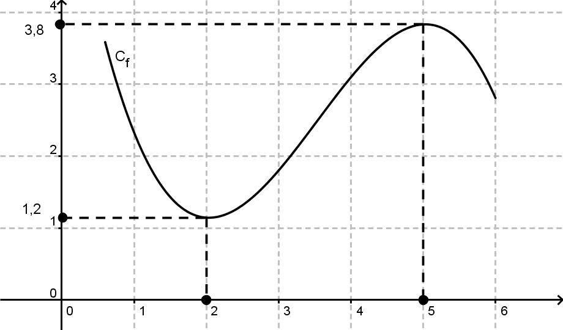

--- 

[pdf](./05_variations.pdf)

---

## 1. Variations

Certaines fonctions ont des courbes qui ont des allures particulières : en les parcourant **de la gauche vers la droite**, on *« monte »* tout le temps ou on *« descend »* tout le temps.
Ce sont des fonctions **croissantes** ou **décroissantes**.

### 1.1. Fonction croissante

**Définition 1 : Fonction croissante**

Dire qu'une fonction $f$ est **croissante** sur un intervalle $I$, c'est dire que quand la variable $x$ augmente dans $I$, alors son image $f(x)$ augmente aussi.
De la gauche vers la droite, la courbe de $f$ *« monte »*.

### 1.2. Fonction décroissante

**Définition 2 : Fonction décroissante**

Dire qu'une fonction $f$ est **décroissante** sur un intervalle $I$, c'est dire que quand la variable $x$ augmente dans $I$, alors son image $f(x)$ diminue aussi.
De la gauche vers la droite, la courbe de $f$ *« descend »*.

### 1.3. Croissance et ordre

La définition d'une **fonction croissante** peut se traduire ainsi :
Pour tout $a$ et $b$ dans $I$, si $a < b$, alors $f(a) < f(b)$.
On dit que $f$ **conserve l'ordre**.

La définition d'une **fonction décroissante** peut se traduire ainsi :
Pour tout $a$ et $b$ dans $I$, si $a < b$, alors $f(a) > f(b)$.
On dit que $f$ **change l'ordre**.

### 1.4. Fonction constante

On rencontre aussi des fonctions **constantes**, comme $f$ définie sur $\mathbb{R}$ par $f(x) = 3$.

### 1.5. Sens de variation d'une fonction

Étudier le sens de variation d'une fonction, c'est repérer les intervalles sur lesquels la fonction est croissante ou décroissante. Pour lire graphiquement le sens de variation, on découpe sa courbe en plusieurs parties.

**Exemple 1**
$f$ est définie sur l'intervalle $[-1,5; 7,5]$.
- $f$ est croissante sur $[-1,5; 1]$,
- $f$ est décroissante sur $[1; 5]$,
- $f$ est croissante sur $[5; 7,5]$.

### 1.6. Tableau de variations

**Définition 3 : Tableau de variations**

On résume le sens de variation d'une fonction $f$ par un **tableau de variations** qui schématise la courbe représentative de $f$.

On remonte en première ligne les valeurs de $x$. Cette ligne indique les bornes de l'ensemble de définition et les abscisses des changements de variation.
La ligne inférieure contient les flèches indiquant les variations et les images $f(x)$.

$$
\begin{array}{|c|ccccccr|}
\hline
x & -1,5 & & 1 & & 5 & & 7,5 \\\
\hline
 & & & 1,5 & & & & 3,8 \\\
f(x) & &\nearrow & &\searrow & &\nearrow & \\\
 & -5 & & & & -2,8 & & \\\
\hline
\end{array}
$$

## 2. Maximum et minimum

### 2.1. Exemple

Le **maximum** d'une fonction est **la plus grande des valeurs** atteintes par la fonction sur un intervalle.
Le **minimum** d'une fonction est **la plus petite des valeurs** atteintes sur un intervalle.

Dans l'exemple ci-contre, le maximum de $f$ est atteint en $x = 5$ et vaut $f(5) = 3,8$.
Le minimum de $f$ est atteint en $x = 2$ et vaut $f(2) = 1,2$.

**Définition 4**

- Le **maximum $M$** de la fonction $f$ sur l'intervalle $I$, lorsqu'il existe, est égal à **la plus grande image** atteinte par $f$ pour un nombre appartenant à $I$.
- Le **minimum $m$** de la fonction $f$ sur l'intervalle $I$, lorsqu'il existe, est égal à **la plus petite image** atteinte par $f$ pour un nombre appartenant à $I$.
- Rechercher les **extrema** de la fonction $f$ sur un intervalle $I$, c'est déterminer le minimum et le maximum de $f$ sur $I$ (lorsqu'ils existent).

**Remarque 1**

- Dire que $f$ atteint son maximum $M$ en $a$ sur l'intervalle $I$ signifie que $f(x) \leq f(a)$ pour tout $x$ de l'intervalle $I$.
- Dire que $f$ atteint son minimum $m$ en $b$ sur l'intervalle $I$ signifie que $f(x) \geq f(b)$ pour tout $x$ de l'intervalle $I$.
