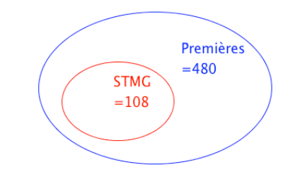
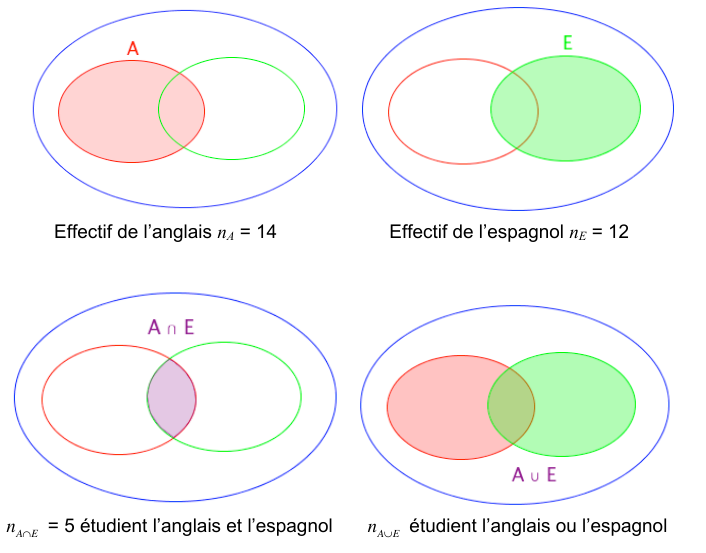
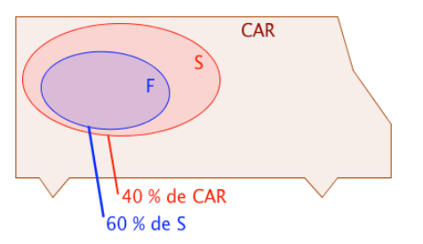
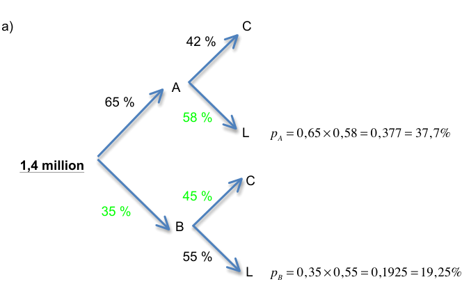

--- 

[pdf](./07_proportions_evolutions.pdf)

---

## I. Proportions

### 1. Proportion et pourcentage

#### 1) Proportion d’une sous-population

_Exemple_ :

Sur les 480 élèves inscrits en classe de première, 108 d’entre eux ont choisi la filière STMG.

{width=400px}

La population totale des élèves de première, notée $N$, est égale à 480. C’est la population de référence. La sous-population des élèves de STMG, notée $n$, est égale à 108. La proportion d’élèves de STMG parmi tous les élèves de première, notée $p$, est :

$$p = \dfrac{n}{N} = \dfrac{108}{480} = \dfrac{9}{40} = 0,225$$

Cette proportion peut s’exprimer en pourcentage : $p = 22,5 \\%$.

#### 2) Pourcentage d’un nombre

_Exemple_ :

Parmi les 480 élèves de première, 15 % ont choisi la spécialité SES. 

$$15\\% \times 480 = \dfrac{15}{100} \times 480 = 72$$

72 élèves de première ont choisi la spécialité SES.

_Méthode_ : Associer proportion et pourcentage

Une société de 75 employés compte 12 % de cadres et le reste d’ouvriers. 35 employés de cette société sont des femmes et 5 d’entre elles sont cadres.

Questions :

a) Calculer l’effectif des cadres.

b) Calculer la proportion de femmes dans cette société.

c) Calculer la proportion, en %, de cadres parmi les femmes. Les femmes cadres sont-elles sous ou surreprésentées dans cette société ?

Réponses :

a) 12 % de 75 = $\dfrac{12}{100} \times 75 = 9$. Cette société compte 9 cadres.

b) $n = 35$ femmes et $N = 75$ employés. La proportion de femmes est donc égale à $p = \dfrac{35}{75} = \dfrac{7}{15} \approx 0,47$.

c) $n = 5$ femmes cadres et $N = 35$ femmes. La population de référence n’est plus la même. La proportion de cadres parmi les femmes est égale à $p = \dfrac{5}{35} = \dfrac{1}{7} \approx 0,14 = 14\\%$. 14 % > 12 % donc les femmes cadres sont surreprésentées dans cette société.

### 2. Union et intersection de sous-populations

Exemple :

Dans une classe de 35 élèves, 14 élèves étudient l’anglais, 12 élèves étudient l’espagnol et 5 élèves étudient les deux.

{width=600px}

L’ensemble $A \cup E$ contient les élèves qui étudient l’anglais, ceux qui étudient l’espagnol et ceux qui étudient les deux.

Ainsi, en effectuant 14 + 12, on compte deux fois ceux qui étudient les deux langues. Et donc, $n_{A \cup E} = 14 + 12 - 5 = 21$. 21 élèves étudient l’anglais ou l’espagnol.

En terme de proportion, on a :

- Proportion des élèves qui étudient l’anglais : $p_A = \dfrac{n_A}{N} = \dfrac{14}{35} = 0,4 = 40\\%$

- Proportion des élèves qui étudient l’espagnol : $p_B = \dfrac{n_B}{N} = \dfrac{12}{35} \approx 0,343 = 34,3\\%$

- Proportion des élèves qui étudient les deux : $p_{A \cap E} = \dfrac{n_{A \cap E}}{N} = \dfrac{5}{35} = \dfrac{1}{7} \approx 0,143 = 14,3\\%$

- Proportion des élèves qui étudient l’anglais ou l’espagnol : $p_{A \cup E} = p_A + p_E - p_{A \cap E} \approx 40\\% + 34,3\\% - 14,3\\% = 60\\%$

**Propriété :**

Soit A et B deux sous-populations d’une même population. La proportion de $A \cup B$ est donnée par : $p_{A \cup B} = p_A + p_B - p_{A \cap B}$

**Remarque :**

Si A et B n’ont pas d’élément en commun, alors l’ensemble $A \cap B$ est vide et dans ce cas : $p_{A \cup B} = p_A + p_B$

**Méthode : Calculer la proportion d’une union ou d’une intersection**

Un glacier vend 24 % de ses glaces au parfum chocolat, 14 % au parfum vanille et 10 % des ventes sont aux deux parfums à la fois.

Questions :

a) Calculer la proportion de ventes de glaces au chocolat ou à la vanille.

b) En déduire la proportion de glaces vendues à aucun des deux parfums, chocolat ou vanille.

Réponses :

a) $p_C = 24\\%$, $p_V = 14\\%$ et $p_{C \cap V} = 10\\%$. On déduit que $p_{C \cup V} = 24\\% + 14\\% - 10\\% = 28\\%$. La proportion de glaces au chocolat ou à la vanille est égale à 28 %.

b) La proportion de glaces ni au chocolat, ni à la vanille est égale à : $100\\% - 28\\% = 72\\%$

### 3. Proportions échelonnées

#### 1) Inclusion

Exemple :

Dans un car, il y a 40 % de scolaires. Et parmi les scolaires, 60 % sont des filles.

$~${width=400px}

L’ensemble $F$ est inclu dans l’ensemble $S$ et on a : $p_F = 60\\%$ de $S$. L’ensemble $S$ est inclu dans l’ensemble $CAR$ et on a : $p_S = 40\\%$ de $CAR$.

La proportion de fille dans le $CAR$ est donc égale à : $60\\% \times 40\\% = 60\\% \times 40\\% = 0,6 \times 0,4 = 0,24 = 24\\%$.

**Propriété :**

Si $A \subset B$ et $B \subset C$. Si $p_1$ est la proportion de $A$ dans $B$. Si $p_2$ est la proportion de $B$ dans $C$. 

Alors $p = p_1 \times p_2$ est la proportion de $A$ dans $C$.

**Méthode : Calculer une proportion échelonnée**

Sur 67 millions d’habitants en France, 66 % de la population est en âge de travailler (15-64 ans). La population active représente 70 % de la population en âge de travailler.

Questions :

a) Calculer la proportion de population active par rapport à la population totale.

b) Combien de français compte la population active ?

Réponses :

a) $F$ est la population française. $T$ est la population en âge de travailler. $A$ est la population active. La proportion de $A$ dans $T$ est 70 %. La proportion de $T$ dans $F$ est 66 %. La proportion de $A$ dans $F$ est donc égale à :

$$70\\% \times 66\\% = 0,7 \times 0,66 = 0,462 = 46,2\\%$$
    
46,2 % des français sont actifs.

b) 46,2 % de 67 = $0,462 \times 67 = 30,954$. La France compte environ 31 millions d’actifs.

#### 2) Tableaux

**Méthode : Représenter une situation par un tableau**

Dans une entreprise qui compte 360 employés, on compte 60 % d’hommes et parmi ceux-là, 12,5 % sont des cadres. Par ailleurs, 87,5 % des femmes de cette entreprise sont ouvrières ou techniciennes.

On distingue deux catégories d'employés : "_cadres_" et "_ouvriers ou techniciens_".

Questions :

a) Compléter le tableau.

|        | Cadres | Ouvriers, techniciens | Total |
|--------|--------|-----------------------|-------|
| Hommes |        |                       |       |
| Femmes |        |                       |       |
| Total  |        |                       |       |

b) À l’aide de ce tableau, déterminer :

- la proportion de cadres,
- la proportion d’hommes cadres,
- la proportion d’employés hommes 
- la proportion d’hommes dans les cadres.

Réponses :

a) Tableau

|        |                   Cadres |     Ouvriers, techniciens |                    Total |
|--------|-------------------------:|--------------------------:|-------------------------:|
| Hommes | $12,5\\% \times 216 = 27$ |          $216 - 27 = 189$ | $60 \\% \times 360 = 216$ |
| Femmes |         $144 - 126 = 18$ | $87,5\\% \times 144 = 126$ |        $360 - 216 = 144$ |
| Total  |           $27 + 18 = 45$ |         $189 + 126 = 315$ |                      360 |

Les calculs sont menés dans cet ordre :

1. total = 360 
2. total des hommes = $60 \\% \times 360 = 216$
3. total des femmes = $360 - 216 = 144$
4. hommes cadres = $12,5\\% \times 216 = 27$
5. hommes ouvriers ou techniciens = $216 - 27 = 189$
6. femmes ouvrières ou techniciennes = $87,5\\% \times 144 = 126$
7. femmes cadres = $144 - 126 = 18$
8. total des femmes = $27 + 18 = 45$
9. total des hommes = $189 + 126 = 315$
10. vérification du total = $45 + 315 = 360$.

b)

- Proportion de cadres : $p_C = \dfrac{45}{360} = 0,125 = 12,5\\%$
- Proportion d’hommes cadres : $p_{H \cap C} = \dfrac{27}{360} = 0,075 = 7,5\\%$
- Proportion d’employés hommes ou cadres : $p_H + p_C - p_{H \cap C} = 60\\% + 12,5\\% - 7,5\\% = 65\\%$
- Proportion d’hommes dans les cadres : $\dfrac{27}{45} = 0,6 = 60\\%$

#### 3) Arbres

**Méthode : Représenter une situation par un arbre**

Deux fabricants de calculatrices se partagent le marché. 65 % des calculatrices proviennent du fabricant A. Pour le fabricant A, 42 % des calculatrices vendues sont des modèles pour le collège. Pour le fabricant B, 55 % des calculatrices vendues sont des modèles pour le lycée.

Questions :

a) Représenter la situation à l’aide d’un arbre pondéré.

b) Cette année, le marché représentait 1,4 million de calculatrices. Déterminer le nombre de modèles vendus pour le lycée.

Réponses :

$~${width=600px}

D'abord on dessine l'arbre. Ensuite on place les valeurs de l'énoncé (en noir). On calcule les valeurs des branches restantes (en vert) en faisant $100\\% - \text{valeur connue}$. Exemple, pour le modèle B: $100\\% - 65\\%=35\\%$.

Enfin, on calcule les valeurs des proportions demandées en effectuant les produits, comme détaillé ci-dessous.

b) Pour le fabriquant A :

Proportion de modèles vendus pour le lycée : $p_A = 0,65 \times 0,58 = 0,377 = 37,7\\%$

Pour le fabriquant B :

Proportion de modèles vendus pour le lycée : $p_B = 0,35 \times 0,55 = 0,1925 = 19,25\\%$

Nombre de modèles vendus pour le lycée :

- Pour le fabricant A : $37,7\\% \times 1~400~000 = 527~800$

- Pour le fabricant B : $19,25\\% \times 1~400~000 = 269~500$

Nombre total de modèles vendus pour le lycée : 527 800 + 269 500 = 797 300.

## II. Évolutions

### 1. Appliquer une évolution en pourcentage

*Rappel du collège*

Pour calculer une évolution en pourcentage, on a deux approches.

**Exemple** : $V_D = 300$ (valeur de départ) augmenté de 20%. Calculer $V_A$ (valeur d'arrivée).

**Approche numéro 1** :
$$
V_A = V_D + 20\\% \times V_D = 300 + 20\\% \times 300 = 300 + \dfrac{20}{100} \times 300 = 300 + 60 = 360
$$

**Approche numéro 2** :
$$
V_A = V_D \times \left(1 + \dfrac{20}{100}\right) = 300 \times \left(1 + \dfrac{20}{100}\right) = 300 \times 1.2 = 360
$$

La seconde approche fait apparaître le nombre $1 + \dfrac{20}{100}$, appelé **coefficient multiplicateur**.
Elle est plus efficace.

**Exercice 1**

En utilisant la seconde approche, calculer les coefficients multiplicateurs et les valeurs d'arrivée dans les évolutions suivantes :
1. 450 augmenté de 13%
2. 850 diminué de 40%
3. 245 augmenté de 16%
4. 84 diminué de 100% - doit-on être surpris du résultat obtenu dans ce cas ?
5. 1030 augmenté de 100% - même question.

**Résumé** :

- Pour **augmenter** une quantité de $t\\%$, on la multiplie par $1 + \dfrac{t}{100}$.
- Pour **diminuer** une quantité de $t\\%$, on la multiplie par $1 - \dfrac{t}{100}$.
- Les nombres $1 + \dfrac{t}{100}$ et $1 - \dfrac{t}{100}$ sont appelés **coefficients multiplicateurs**.

### 2. Évolution exprimée en pourcentage

Quand une quantité évolue, on distingue **l'évolution absolue** du **taux d'évolution**.

**Exemple** : Entre 2024 et 2025, le salaire de M. Dupont passe de $V_D = 2000$ € à $V_A = 2300$ €.

- **L'évolution absolue** est $V_A - V_D = 300$ €. Le salaire de M. Dupont a augmenté de 300 €.
- **Le taux d'évolution** est $\dfrac{V_A - V_D}{V_D} = \dfrac{300}{2000} = 0.15 = 15\\%$. Le salaire de M. Dupont a augmenté de 15%.
- **Le coefficient multiplicateur** est $\dfrac{V_A}{V_D} = \dfrac{2300}{2000} = 1.15$. Le salaire de M. Dupont a été multiplié par 1.15.

**Exercice 2**
Calculer les évolutions absolues, les taux d'évolution et les coefficients multiplicateurs des situations suivantes :

1. Entre 2009 et 2013, le prix du mètre carré dans le 16ème arrondissement de Paris est passé de 7120 € à 9220 €.
2. En juillet 2025, le prix d'un ticket de métro à Lille est passé de 1.70 € à 1.80 €.
3. En 2008, Apple sortait l'iPhone 3g 8Go au tarif de 350 €, en 2018 sortait l'iPhone XS Max 256Go à 1099 €.
4. En 2008, produire un iPhone 3g 8Go coûtait 174.33 $ à Apple. En 2018, produire un iPhone XS Max 256Go coûte 448 $ à Apple.
   Calculer l'évolution absolue et le taux d'évolution en € de la marge (= prix de vente - coût) réalisée par Apple en supposant qu'un $ coûtait 1.39 € en 2008 et coûte 1.14 € en 2018.

### 3. Évolutions successives

#### 3.1. Une hausse de $t\\%$ suivie d'une baisse de $t\\%$ ne se compensent pas.

**Exemple** : En 2023, un menu Kebab-Frites-Boisson chez Raoul-Snack coûtait 6 €, en 2024 le menu augmente de 20%, en 2025 il baisse de 20%.

- 2023 : 6 €
- 2024 : $6 \times \left(1 + \dfrac{20}{100}\right) = 6 \times 1.2 = 7.2$ €
- 2025 : $7.2 \times \left(1 - \dfrac{20}{100}\right) = 7.2 \times 0.8 = 5.76$ €

On **ne retrouve pas** la valeur de départ en appliquant une hausse de $t\\%$ suivie d'une baisse de $t\\%$.

#### 3.2. Évolutions successives

On peut calculer directement le résultat de plusieurs évolutions successives.

**Exemple** : Chaque week-end, Antoine travaille comme serveur dans un estaminet.
Le premier mois, il a gagné 150 € de pourboires.
Le mois suivant, ses pourboires ont augmenté de 20%. Le troisième mois, ils ont augmenté de 15%.
Calculer ses pourboires après deux mois.

- Étape par étape : 1er mois : 150 € ; 2ème : $150 \times 1.2 = 180$ € ; 3ème : $180 \times 1.15 = 207$ €.
- En une seule fois : 1er mois : 150 € ; 3ème mois : $150 \times 1.2 \times 1.15 = 207$ €.
  Le coefficient multiplicateur global est $1.2 \times 1.15 = 1.38$.
  En deux mois, ses pourboires ont augmenté de 38%.

**Propriété 1** : Si une grandeur subit des évolutions successives, alors le **coefficient multiplicateur global** est égal aux **produits des coefficients multiplicateurs de chaque évolution**.

**Exercice 3** : Calculer les coefficients multiplicateurs globaux et les valeurs d'arrivée :

1. 300 augmenté de 30% puis diminué de 20%.
2. 280 augmenté de 16% puis diminué de 30%.
3. 7035 diminué de 15% trois fois de suite.
4. 1.035 augmenté de 4% cinq fois de suite.

#### 3.3. Évolution réciproque

On considère une évolution de $V_D$ à $V_A$.
**L'évolution réciproque** est l'évolution permettant de revenir à la valeur de départ.

*Ainsi qu'on l'a déjà dit, l'évolution réciproque d'une hausse de $t\\%$ **n'est pas** une baisse de $t\\%$.*

On pose les calculs en notant $C$ le coefficient multiplicateur :

$$
\begin{array}{ccccc}
V_D   & \longrightarrow & V_A & \longrightarrow       & V_D \\\
      & \times C        &     &  \times \dfrac{1}{C}  &
\end{array}
$$

**Exemple** : Un ménage a consommé $V_D = 150$ sacs poubelle en 2022. En 2023, cette valeur a augmenté de 25%. En 2024, elle est revenue à la valeur de 2022.
Calculer le taux d'évolution entre 2023 et 2024.

$$
\begin{array}{ccccc}
V_D=150  & \longrightarrow & V_A & \longrightarrow             & V_D \\\
         & \times 0.8      &     &  \times \dfrac{1}{0.8}=1.25 &
\end{array}
$$

Le coefficient multiplicateur entre 2023 et 2024 est de 0.8, ce qui correspond à une baisse de 20%.

**Exercice 4** : Calculer les taux d'évolution réciproque des évolutions suivantes :

1. Augmenter de 30%
2. Diminuer de 10%
3. Doubler (= augmenter de 100%)
4. Diminuer de 90%

### 4. Exercices

#### 4.1. Appliquer une évolution en pourcentage

**Exercice 5**

Dans chaque cas, calculer la valeur d'arrivée.
1. $V_D = 145$ augmenté de 13%
2. $V_D = 450$ diminué de 20%
3. $V_D = 780$ augmenté de 3%
4. $V_D = 0.387$ diminué de 2% (donner la valeur la plus précise possible).
5. $V_D = 37$ et le coefficient multiplicateur vaut 1.08 ; quel est le pourcentage d'évolution ?

#### 4.2. Calculer un taux d'évolution ou un coefficient multiplicateur

**Exercice 6**

Dans chaque cas, calculer le coefficient multiplicateur et le taux d'évolution. Arrondir à deux décimales.
1. $V_D = 180$ et $V_A = 200$
2. $V_D = 45$ et $V_A = 35$
3. $V_D = 1085$ et $V_A = 1250$
4. $V_D = 1.53$ et $V_A = 1.38$
5. $V_D = 2521$ et $V_A = 4443$
6. $V_D = 1942$ et $V_A = 1837$

**Exercice 7**

Pour chaque évolution en pourcentage, donner le coefficient multiplicateur associé.
1. Augmenter de 40%
2. Diminuer de 20%
3. Augmenter de 300% (Remarque : peut-on **diminuer** de 300% ?)
4. Diminuer de 88%
5. Augmenter de 2%
6. Diminuer de 3%

**Exercice 8**

Retrouver le taux d'évolution en pourcentage à partir des coefficients multiplicateurs :
1. $C_m = 1.3$
2. $C_m = 0.9$
3. $C_m = 4$
4. $C_m = 1.05$
5. $C_m = 0.7$
6. $C_m = 0.97$

**Exercice 9**

1. Lors d'une évolution du prix d'un appartement, son prix a été multiplié par 1.055.
   Donner la nature de cette évolution et le pourcentage de cette évolution.
2. L'étude démographique d'une ville montre que la population a été multipliée par 0.82.
   Donner la nature de cette évolution et le pourcentage de cette évolution.

**Exercice 10**

La survie des éléphants d'Afrique est menacée par le braconnage (*chasse illégale*).
En l'absence de braconnage, on estime le taux de croissance de la population d'éléphants d'Afrique à 1.5% par an.
La population totale d'éléphants d'Afrique était estimée à 470 000 individus en 2013.
1. Donner la valeur du coefficient multiplicateur associé à cette évolution annuelle.
2. Calculer le nombre d'éléphants d'Afrique en 2014 en l'absence de braconnage.

#### 4.3. Retrouver la valeur de départ

**Exercice 11** : *Valeur de départ*

Dans chaque cas, retrouver la valeur de départ.
1. Un prix a subi une hausse de 14% et vaut maintenant 228 €.
2. Un ordinateur a baissé de 9% pour atteindre 1125 €.
3. La consommation de carburants routiers a baissé de 1.2% entre 2011 et 2012 pour atteindre 50 millions de m$^3$.

**Exercice 12**

Le tableau ci-dessous donne le nombre d'habitants en millions de la population française en fonction de l'année.

Population française

| Année                          | 2000 | 2002 | 2004 | 2006 | 2008 | 2010 |
|--------------------------------|------|------|------|------|------|------|
| Nombre d'habitants en millions | ...  | 61.4 | 62.3 | 63.2 | 63.9 | 64.6 |

Sachant que le pourcentage d'évolution globale, sur la période 2000 à 2010, a pour valeur 6.78%, déterminer le nombre d'habitants en millions, arrondi au dixième, de la population française en 2000.

**Exercice 13** : *Retour sur la TVA*

*La TVA (taxe sur les valeurs ajoutées) est un impôt indirect sur la consommation. C'est la recette fiscale la plus importante de la France, s'élevant à 141.2 milliards d'euros (près de la moitié du prélèvement fiscal).*
*Il existe quatre taux de TVA (2.1% taux super réduit, 5.5% taux réduit, 10% taux intermédiaire et 20% taux majoré).*
*On distingue donc deux prix lors d'un achat : le prix Hors Taxe (Prix HT) dont l'intégralité revient au marchand et le prix réellement payé par le consommateur (Prix Toutes Taxes Comprises, Prix TTC).*

**Exemple** : Martin achète une place de cinéma à 11.08 €. C'est le prix TTC. Le taux de TVA est de 5.5% pour les biens culturels. Quel était le prix HT ?
On cherche la valeur de départ : $11.08 = 1.055 \times V_D \Longleftrightarrow V_D = \dfrac{11.08}{1.055} = 10.5$ €.
Le cinéma empochera donc 10.5 € et la TVA s'élève à $11.08 - 10.5 = 0.58$ €.

En reprenant les taux indiqués ci-dessus, répondre aux questions suivantes :
1. Un sac à dos est vendu 16 € HT avec un taux de TVA intermédiaire. Calculer le prix TTC.
2. Un stylo de luxe coûte 180 € TTC avec un taux de TVA étant normal. Calculer le prix HT.
3. Une boîte de brosses à dents contient 100 brosses et le montant de la TVA est de 16 €.
   Elles sont vendues avec un taux de TVA normal.
   Déterminer le prix TTC de la boîte de brosses à dents.

**Exercice 14** : *Recette, bénéfice et évolutions*

Un entrepreneur lance sur le marché de nouvelles coques haut de gamme pour les téléphones mobiles. En notant $x$ le nombre de produits fabriqués exprimé en centaines d'unités, on modélise :
- les recettes, en milliers d'euros, par la fonction $R$ définie sur $[0; 7]$ par $R(x) = -2x^3 + 4.5x^2 + 62x$,
- les coûts, en milliers d'euros, par la fonction $C$ définie sur $[0; 7]$ par $C(x) = 20x + 10$.

En décembre 2017, l'entreprise a produit 300 coques alors qu'en janvier 2018, l'entreprise n'a produit que 150 coques.
1. Déterminer les bénéfices réalisés par l'entreprise pour les mois de décembre 2017 et janvier 2018.
2. Déterminer le taux d'évolution, arrondi au millième près, du bénéfice sur cette période ainsi que le coefficient multiplicateur associé.

#### 4.4. Évolutions successives

**Exercice 15** : *Déterminer la valeur finale*

1. Donner le coefficient multiplicateur associé à une augmentation de 5% ?
2. Compléter le diagramme ci-dessous en indiquant :
   - le coefficient multiplicateur permettant de passer de la *« valeur 0 »* à la *« valeur 1 »*,
   - le coefficient multiplicateur permettant de passer de la *« valeur 1 »* à la *« valeur 2 »*.

3. En déduire le coefficient multiplicateur global associé aux deux augmentations successives de 5% (permettant de passer de la *« valeur 0 »* à la *« valeur 2 »*).

**Exercice 16** : *Calculer la valeur d'arrivée*

Préciser le coefficient multiplicateur global et le taux d'évolution global.
1. 143 augmenté de 13% puis de 25%
2. 448 diminué de 35% puis augmenté de 56%
3. 758 augmenté de 34% puis diminué de 16%
4. 1550 augmenté 6 fois de 12%
5. 1234 diminué 4 fois de 9%

**Exercice 17** : *Diabète de Type I*

*Le diabète de type 1 est une maladie qui apparaît le plus souvent durant l'enfance ou l'adolescence.*
*Les individus atteints par cette maladie produisent très peu ou pas du tout d'insuline, hormone essentielle pour l'absorption du glucose sanguin par l'organisme.*
*En 2016, 542 000 enfants dans le monde étaient atteints de diabète de type 1. Des études récentes permettent de supposer que le nombre d'enfants diabétiques va augmenter de 3% par an à partir de 2016.*

Déterminer le nombre d'enfants atteints de diabète de type 1 au cours des quatre premières années de l'étude :

Nombre d'enfants diabétiques

| Année                        | 2016    | 2017 | 2018 | 2019 |
|------------------------------|---------|------|------|------|
| Nombre d'enfants diabétiques | 542 000 |      |      |      |

**Exercice 18**
Compléter le tableau ci-dessous :

Coût d'un litre d'essence super SP 95

| Année                                 | 1985  | 1990    | 1995   | 2000  | 2005  | 2010  | 2015    |
|---------------------------------------|-------|---------|--------|-------|-------|-------|---------|
| Coût d'un Litre d'essence super SP 95 | 0.612 | 0.496   |        | 0.766 | 1.036 | 1.236 |         |
| Taux d'évolution sur 5 ans            | X     | -18.95% | 24.40% |       |       |       | -16.18% |

*La ligne *« Taux d'évolution sur 5 ans »* donne le taux d'évolution depuis 5 ans. Par exemple, entre 1985 et 1990, le coût a baissé de 18.95%.

1. Calculer le taux d'évolution des décennies 1990-2000 et 2000-2010.
2. Obtient-on le taux d'évolution 1990-2000 **en ajoutant** les taux d'évolution 1990-1995 et 1995-2000 ? Expliquer.
3. Retrouver le résultat du 2. en **multipliant les coefficients multiplicateurs** $C_{1990-1995}$ et $C_{1995-2000}$.
4. Calculer le taux d'évolution entre 1985 et 2015. Peut-on retrouver ce résultat en n'utilisant que les coefficients multiplicateurs ?

#### 4.5. Évolution successives : déterminer la valeur initiale

**Exercice 19** : *Déterminer une valeur initiale*

Après deux hausses successives de 20% chacune, le prix d'un article atteint 432 €.
En vous aidant du diagramme ci-dessous, retrouver la valeur de départ $V_0$.

**Exercice 20** : *Apiculteur*

Un apiculteur constate qu'entre le 1er mars 2014 et le 1er mars 2016, la population d'abeilles adultes de sa ruche a diminué de 15% par an. Au 1er mars 2016, l'apiculteur dénombre 55 200 abeilles adultes dans sa ruche. À combien peut-on estimer le nombre d'abeilles adultes, arrondi à la centaine, qui peuplaient la ruche au 1er mars 2014 ?

**Exercice 21** : *SMIC*
Le tableau ci-dessous donne le montant du SMIC mensuel net au 1er septembre de chaque année :

Montant du SMIC mensuel net

| Année            | 2010 | 2011 | 2012    | 2013    |
|------------------|------|------|---------|---------|
| Montant en euros | ...  | ...  | 1118.29 | 1120.43 |

1. Déterminer le taux d'évolution du SMIC entre les années 2012 et 2013.
   *On arrondira la valeur à $10^{-5}$ près.*
2. On suppose constant le taux annuel d'évolution entre les années 2010 et 2013.
   Déterminer le montant du SMIC au 1er septembre 2010.

#### 4.6. Évolutions réciproques

**Exercice 22** : *Déterminer une évolution réciproque*
En vous aidant du diagramme ci-dessous, déterminer le taux d'évolution réciproque d'une baisse de 16%.

**Exercice 23**

Calculer le taux d'évolution réciproque des évolutions suivantes :
1. Une augmentation de 35%
2. Une diminution de 40%
3. Une augmentation de 24%
4. Une diminution de 35%

#### 4.7. Tableur

**Exercice 24** : *Voitures électriques*

Dans une ville, on estime qu'à partir de 2013, le nombre de voitures électriques en circulation augmente de 12% par an.
Au 1er janvier 2013, cette ville propose 148 places de parking spécifiques avec borne de recharge. La commune prévoit de créer chaque année 13 places supplémentaires.

Voitures électriques et places de parking

| A                              | B            | C            | D            | E            | F            | G            | H            |
|--------------------------------|--------------|--------------|--------------|--------------|--------------|--------------|--------------|
| Date                           | janvier 2013 | janvier 2014 | janvier 2015 | janvier 2016 | janvier 2017 | janvier 2018 | janvier 2019 |
| Nombre de voitures électriques | 100          | 112          |              |              |              |              |              |
| Nombre de places spécifiques   | 148          | 161          |              |              |              |              |              |

1. Préciser une formule qui, entrée en cellule C2, permet, par recopie vers la droite, d'obtenir le contenu des cellules de la plage C2:H2.
2. Préciser une formule qui, entrée en cellule C3, permet, par recopie vers la droite, d'obtenir le contenu des cellules de la plage C3:H3.
3. Déterminer le pourcentage global d'évolution du nombre de voitures électriques en circulation entre 2013 et 2016, arrondi à 0.1%.

#### 4.8. Vers le taux moyen

**Exercice 25**

Le prix d'un objet a augmenté de 44% en deux ans.
En supposant que l'évolution a été constante pendant ces deux ans, nous allons déterminer le pourcentage de cette évolution sur chaque année.
1. Déterminer le coefficient multiplicateur global $C$.
2. On note $C_{\text{moyen}}$ le coefficient multiplicateur de chaque année. Montrer que $(C_{\text{moyen}})^2 = 1.44$.
3. En déduire la valeur de $C_{\text{moyen}}$ puis le taux d'évolution de chaque année.

**Remarque** : $C_{\text{moyen}}$ est le **coefficient multiplicateur moyen** de l'évolution.
S'il y a $n$ évolutions successives conduisant à une évolution globale de coefficient multiplicateur $C$,
le coefficient multiplicateur moyen est $C_{\text{moyen}} = C^{\frac{1}{n}}$.

*Exemple* : Après trois évolutions, un prix est passé de 20 000 € à 43 940 €.
Le coefficient multiplicateur global est $C = \dfrac{43\,940}{20\,000} = 2.197$.
Le coefficient multiplicateur moyen est $C_{\text{moyen}} = C^{\frac{1}{3}} = 2.197^{\frac{1}{3}} = 1.3$.
Le taux d'évolution moyen est donc de 30%.

**Exercice 26**

Entre 2015 et 2022, le prix d'un article est passé de 22 € à 48 €.
Déterminer le taux d'évolution annuel de cet article.

