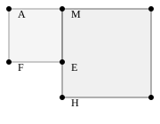

--- 

[pdf](./08_calcul_litteral.pdf)

---

## 1. Égalité *"pour tout $x$"* et équation

### 1.1. Égalité *"pour tout $x$"*

Un nombre possède plusieurs écritures.
Par exemple : $0,5 = \frac{1}{2} = \frac{2}{4} = \frac{50}{100}$. Ce sont différentes écritures d'un même nombre.

De même, plusieurs expressions algébriques peuvent correspondre à la même fonction.

- Quelle que soit la valeur par laquelle on remplace $x$ dans les expressions $(x-3)(x+1)-5$, $x^2-2x-8$, $(x-4)(x+2)$, on obtient le même résultat.

- On écrit : **pour tout $x$ réel**, $(x-3)(x+1)-5 = x^2-2x-8 = (x-4)(x+2)$.

- Soit $f$ la fonction définie sur $\mathbb{R}$ par $f(x) = (x-3)(x+1)-5$.

  On a aussi $f(x) = x^2-2x-8$ et $f(x) = (x-4)(x+2)$ **pour tout réel $x$**.
- Pour calculer des images ou des antécédents par $f$ ou étudier des propriétés de $f$, on peut utiliser l'une ou l'autre de ces expressions, **la mieux adaptée**.

### 1.2. Exemple

- On calcule facilement $f(0)$ avec $x^2-2x-8$ :

  $f(0) = 0 - 0 - 8 = -8$.

### 1.3. Équation

Les expressions $2x-1$ et $x^2-4$ ne sont pas égales pour toutes les valeurs de $x$.

Par exemple, pour $x = 0$, $2x-1$ prend la valeur $-1$ tandis que $x^2-4$ prend la valeur $-4$.

En revanche, pour $x = 3$, on a $2x-1 = 5$ et $x^2-4 = 5$.

- Quand $x$ prend la valeur 3, on a bien l'égalité $2x-1 = x^2-4$.

  On dit que $3$ est **une solution de l'équation $2x-1 = x^2-4$**.
- **Résoudre une équation**, c'est chercher **toutes** les solutions de cette équation.

## 2. Développer, factoriser

**Développer** une expression, c'est l'écrire sous la forme d'une somme.

**Factoriser** une expression, c'est l'écrire sous la forme d'un produit.

### 2.1. Distributivité

Pour tous réels $k, a, b, c, d$ :

- **Simple distributivité** :
  $$
  k \times (a + b) = k \times a + k \times b
  $$

- **Double distributivité** :
  $$
  (a + b) \times (c + d) = a \times c + a \times d + b \times c + b \times d
  $$

### 2.2. Identités remarquables

$$
\begin{array}{rcl}
(a + b)^2 &=& a^2 + 2ab + b^2 \\
(a - b)^2 &=& a^2 - 2ab + b^2 \\
(a + b)(a - b) &=& a^2 - b^2
\end{array}
$$

**Attention aux confusions** :
$$
3x^2 \neq (3x)^2
$$
$$
(3x)^2 = 3^2 \times x^2 \neq (3 + x)^2 = 9 + 6x + x^2
$$
D'ailleurs, $(3 + x)^2 \neq 9 + x^2$ !

### 2.3. Application : développer puis choisir la bonne forme

**Énoncé**
$AB = 8$ et $M$ appartient à $[AB]$. $AMEF$ et $MBGH$ sont des carrés. On pose $x = AM$ avec $x \in [0; 8]$.

1. Vérifier que l'aire totale est $A(x) = x^2 + (8 - x)^2$.
2. Démontrer que, pour tout $x$ de $[0; 8]$, $A(x) = 2x^2 - 16x + 64$ puis que $A(x) = 32 + 2(x - 4)^2$.
3. Calculer $A(4)$ puis montrer que $A(x) \geq A(4)$ pour tout $x$ de $[0; 8]$.
   Interpréter ce résultat en terme d'aire.

**Solution**

1. L'aire du carré $AMEF$ est $x^2$. La longueur $MB$ vaut $AB - AM = 8 - x$, donc l'aire de $MBGH$ est $(8 - x)^2$. Il vient $A(x) = x^2 + (8 - x)^2$.

2. Développons l'expression $A(x)$.
   On utilise la seconde identité remarquable et il vient, pour tout $x$ de $[0; 8]$ :
   $$
   \begin{array}{rl}
   A(x) &= x^2 + (8 - x)^2  \\
   &= x^2 + 8^2 - 2 \times 8 \times x + x^2 \\
   &= 2x^2 - 16x + 64.
   \end{array}
   $$
   De même, pour tout $x$ de $[0; 8]$,
   $$
   \begin{array}{rl}
   32 + 2(x - 4)^2 &= 32 + 2(x^2 - 8x + 16)  \\
   &= 2x^2 - 16x + 64.
   \end{array}
   $$
   On retrouve la même expression, donc pour tout $x$ de $[0; 8]$, $A(x) = 32 + 2(x - 4)^2$.

3. Utilisons la dernière expression de $A(x)$.
   $A(4) = 32 + (4 - 4)^2 = 32$.
   Un carré est toujours positif, donc $2(x - 4)^2$ l'est.
   On en déduit que $32 + 2(x - 4)^2 \geq 32$, donc que $A(x) \geq A(4)$ pour tout $x$ de $[0; 8]$.
   L'aire est minimale quand $x = 4$, donc quand $M$ est le milieu de $[AB]$.

## 3. Factoriser en pratique

### 3.1. Méthode

Pour factoriser une expression *" à la main "*, on analyse sa structure et on se pose un certain nombre de questions.

- **Q1 :** Est-ce une somme (ou une différence) ? De combien de termes ?
- **Q2 :** Chaque terme est-il un produit ? Ou peut-il être écrit comme un produit ?
  Quels sont les facteurs de chaque terme ? Y a-t-il un facteur commun ?
- **Q3 :** Sinon, peut-on utiliser une identité remarquable ?
- **Q4 :** Sinon, peut-on factoriser une partie de l'expression pour faire apparaître un facteur commun ou une identité remarquable ?
- **Q5 :** Sinon, on développe en espérant pouvoir factoriser ensuite.

### 3.2. Exemples

#### 3.2.1. Exemple 1

Factoriser $f(x) = (x + 1)(2x - 3) + 4(x + 1)$.

- **Q1 :** Cette expression est la somme de deux termes.
- **Q2 :** Chaque terme est un produit de deux facteurs.
- **Q2 :** $(x + 1)$ est un facteur commun aux deux termes.
- **Q2 :** On factorise : $f(x) = (x + 1) \times [(2x - 3) + 4]$.
- **Q2 :** On réduit le second facteur : $f(x) = (x + 1)(2x + 1)$, pour tout $x$.

#### 3.2.2. Exemple 2

Factoriser $g(x) = 16x^2 - (x + 1)^2$.

- **Q1 :** C'est la différence de deux termes.
- **Q2 :** Les termes sont des produits sans facteur commun.
- **Q3 :** On a une différence de deux carrés $a^2 - b^2$ : $g(x) = (4x)^2 - (x + 1)^2$.
  On utilise $a^2 - b^2 = (a - b)(a + b)$.
  On factorise $g(x) = [4x - (x + 1)][4x + (x + 1)]$ et on réduit chaque facteur.
  Pour tout $x$,
  $$
  g(x) = (3x - 1)(5x + 1).
  $$

#### 3.2.3. Exemple 3

Factoriser $h(x) = x^2 - 9 + 3(x - 3)$.

- **Q1, Q2, Q3 :** $h(x)$ est une somme de trois termes, on ne voit ni facteur commun, ni identité remarquable.
- **Q4 :** On peut factoriser $x^2 - 9 = (x - 3)(x + 3)$.
  Cela fait apparaître $x - 3$ comme facteur commun : $h(x) = (x - 3)(x + 3) + 3(x - 3)$.
  On factorise : $h(x) = (x - 3) \times [(x + 3) + 3]$.
  On réduit : $h(x) = (x - 3)(x + 6)$, pour tout $x$.

### 3.3. Exercice

Factoriser :

- $f(x) = 4x^3 - x$,
- $g(x) = (x + 1)(x - 4) + 3x + 3$,
- $h(x) = 2x^2 - 20x + 50$,
- $k(x) = 9x^2 - 12x + 4$.

### 3.4. Remarque

- Certaines expressions **ne peuvent pas se factoriser**. C'est le cas de $x^2 + 1$.

  Il **n'existe pas** de meilleure *" factorisation "* de cette expression avec des coefficients réels.

- Parfois, une meilleure factorisation **existe**, mais **les méthodes vues précédemment ne permettent pas de l'obtenir**.

  Par exemple, si on part de $f(x) = x^2 - 8x + 41$, aucune des méthodes précédentes ne permet d'aboutir...

  Mais, si on part d'une autre écriture de $f(x) = (x - 4)^2 - 25$, on peut factoriser en utilisant $a^2 - b^2 = (a - b)(a + b)$ et écrire : $f(x) = (x - 4 - 5)(x - 4 + 5)$, qui devient $f(x) = (x - 9)(x + 1)$.

- Une méthode générale pour factoriser les expressions du second degré sera présentée en première.

  Il est toujours possible d'utiliser un **logiciel de calcul formel** pour obtenir les factorisations... quand elles existent !

## 4. Résoudre algébriquement une équation

### 4.1. Équations équivalentes

Deux équations sont dites **équivalentes** quand elles ont les mêmes solutions.

Résoudre :
$$
\begin{array}{lrl}
&2(x + 3) - 4 &= 5x - 1 \\
\Leftrightarrow &2x + 2 &= 5x - 1 \\
\Leftrightarrow &2x - 5x &= -1 - 2 \\
\Leftrightarrow &-3x &= -3 \\
\Leftrightarrow &x &= 1.
\end{array}
$$
Cette équation a pour unique solution $x = 1$.

### 4.2. Propriété

Pour transformer une équation en une équation équivalente, on peut utiliser les propriétés suivantes :
- Développer, factoriser, réduire certains termes,
- Ajouter ou soustraire un même nombre à chaque membre de l'équation,
- Multiplier ou diviser chaque membre par un même nombre **non nul**.

### 4.3. Degré de l'équation

**Premier degré** : Les équations du premier degré sont celles qui peuvent s'écrire sous la forme $ax + b = cx + d$ où $a, b, c, d$ sont des réels. L'exemple est une équation du premier degré.
Elles se résolvent directement en appliquant les transformations ci-dessus.

**Autres équations** :
- Si après développement l'équation est équivalente à une équation du premier degré, on applique la méthode précédente.
- Sinon, on transforme l'équation pour obtenir un second membre nul et on factorise pour pouvoir appliquer l'un des résultats suivants :

### 4.4. Propriétés

- **Théorème du produit nul** :
  Un **produit** de facteurs est nul si l'un de ses facteurs est nul.
  $$
  P \times Q = 0 \quad \text{si et seulement si} \quad P = 0 \text{ ou } Q = 0.
  $$

- **Théorème du quotient nul** :
  Un **quotient** de facteurs est nul si le numérateur est nul et le **dénominateur est non nul**.
  $$
  \frac{P}{Q} = 0 \quad \text{si et seulement si} \quad P = 0 \text{ et } Q \neq 0.
  $$

### 4.5. Exercice

Résoudre graphiquement puis par le calcul :

1. $(E_1) \quad 3x^2 + 3x - 2 = -x - 2$,
2. $(E_2) \quad (x - 1)^2 + 3x = x^2 - 1$.

