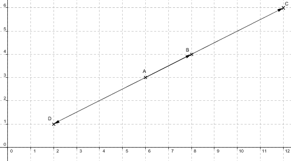
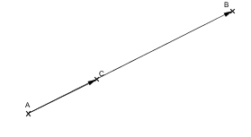
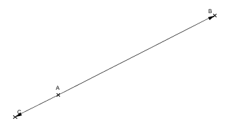
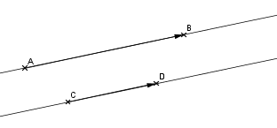
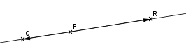

 
---

[pdf](./09_vecteurs_2.pdf)

---

## 1. Produit d'un vecteur par un nombre réel

### 1.1. Définition

Soit $\overrightarrow{u}$ un vecteur et $k$ un nombre réel. Si $\overrightarrow{u}\begin{pmatrix} x \\ y \end{pmatrix}$ dans un repère, le vecteur noté $k\overrightarrow{u}$ est le vecteur de coordonnées :
$$
k\overrightarrow{u}\begin{pmatrix} kx \\ ky \end{pmatrix}
$$

### 1.2. Exemple

Soit $\overrightarrow{AB}\begin{pmatrix} 2 \\ 1 \end{pmatrix}$ et les points $C$ et $D$ tels que $\overrightarrow{AC} = 3\overrightarrow{AB}$ et $\overrightarrow{AD} = -2\overrightarrow{AB}$.

- $3\overrightarrow{AB}\begin{pmatrix} 3 \times 2 \\ 3 \times 1 \end{pmatrix}$ donc $\overrightarrow{AC}\begin{pmatrix} 6 \\ 3 \end{pmatrix}$,
- $-2\overrightarrow{AB}\begin{pmatrix} -2 \times 2 \\ -2 \times 1 \end{pmatrix}$ donc $\overrightarrow{AD}\begin{pmatrix} -4 \\ -2 \end{pmatrix}$.

### 1.3. Propriétés

Si $k$ et $k'$ sont deux nombres réels et $\overrightarrow{u}$ et $\overrightarrow{v}$ deux vecteurs, alors :

- $(k + k')\overrightarrow{u} = k\overrightarrow{u} + k'\overrightarrow{u}$,
- $k(k'\overrightarrow{u}) = (kk')\overrightarrow{u}$,
- $k(\overrightarrow{u} + \overrightarrow{v}) = k\overrightarrow{u} + k\overrightarrow{v}$.

### 1.4. Exemple

- $-\overrightarrow{u} - \overrightarrow{u} = -2\overrightarrow{u}$,
- $\overrightarrow{AB} = 3\overrightarrow{AC}$ revient à $\overrightarrow{AC} = \frac{1}{3}\overrightarrow{AB}$.

De façon générale, à l'aide de ces propriétés, on peut construire géométriquement le vecteur $k\overrightarrow{AB}$.

### 1.5. Construction

- Si $\overrightarrow{AC} = k\overrightarrow{AB}$ avec $k > 0$ : $\overrightarrow{AC}$ et $\overrightarrow{AB}$ sont de même sens, et $AC = k \times AB$,
- Si $\overrightarrow{AC} = k\overrightarrow{AB}$ avec $k < 0$ : $\overrightarrow{AC}$ et $\overrightarrow{AB}$ sont de sens opposés, et $AC = -k \times AB$.

## 2. Vecteurs colinéaires et application en géométrie

### 2.1. Vecteurs colinéaires

Deux vecteurs sont **colinéaires** si l'un est le produit de l'autre par un réel.

### 2.2. Exemple

$\overrightarrow{u}\begin{pmatrix} 2 \\ -4 \end{pmatrix}$ et $\overrightarrow{v}\begin{pmatrix} -3 \\ 6 \end{pmatrix}$ sont colinéaires car $\overrightarrow{v} = -\frac{3}{2}\overrightarrow{u}$.
Le vecteur $\overrightarrow{0}$ est colinéaire à tous les autres vecteurs car $\overrightarrow{0} = 0\overrightarrow{u}$.

### 2.3. Théorème et définition

Dans un repère, les vecteurs $\overrightarrow{u}\begin{pmatrix} x \\ y \end{pmatrix}$ et $\overrightarrow{v}\begin{pmatrix} x' \\ y' \end{pmatrix}$ sont colinéaires :

- si et seulement si leurs coordonnées sont proportionnelles,
- si et seulement si $xy' - x'y = 0$.

La quantité $xy' - x'y$ est le **déterminant** du couple de vecteurs $\overrightarrow{u}\begin{pmatrix} x \\ y \end{pmatrix}$ et $\overrightarrow{v}\begin{pmatrix} x' \\ y' \end{pmatrix}$.

### 2.4. Application en géométrie

#### 2.4.1. Parallélisme

Deux droites $(AB)$ et $(CD)$ sont parallèles si et seulement si les vecteurs $\overrightarrow{AB}$ et $\overrightarrow{CD}$ sont colinéaires.

#### 2.4.2. Alignement

Trois points $P$, $Q$ et $R$ sont alignés si et seulement si les vecteurs $\overrightarrow{PQ}$ et $\overrightarrow{PR}$ sont colinéaires.

### 2.5. Exemple

Soit $A(2, -1)$ et $B(-3, 1)$ dans un repère. Un point $M(x, y)$ appartient à $(AB)$ si et seulement si $\overrightarrow{AM}\begin{pmatrix} x - 2 \\ y + 1 \end{pmatrix}$ et $\overrightarrow{AB}\begin{pmatrix} -5 \\ 2 \end{pmatrix}$ sont colinéaires.

Donc $M(x, y)$ appartient à $(AB)$ si et seulement si $(x - 2) \times 2 - (y + 1) \times (-5) = 0$, ce qui devient :
$$
y = -\frac{2}{5}x - \frac{1}{5}.
$$
On retrouve ainsi une équation de la droite $(AB)$.
