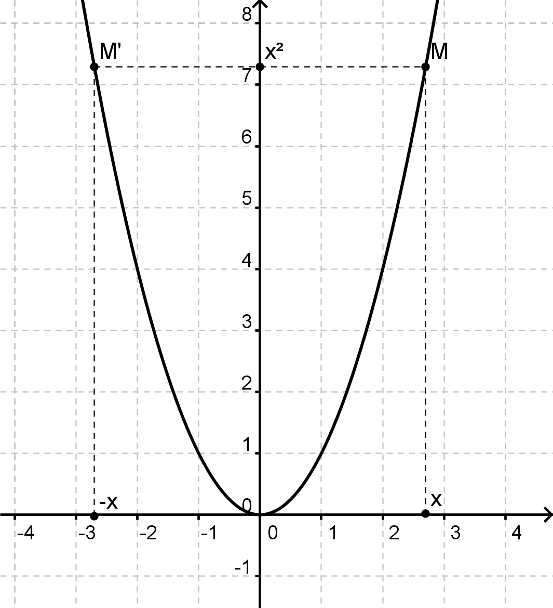
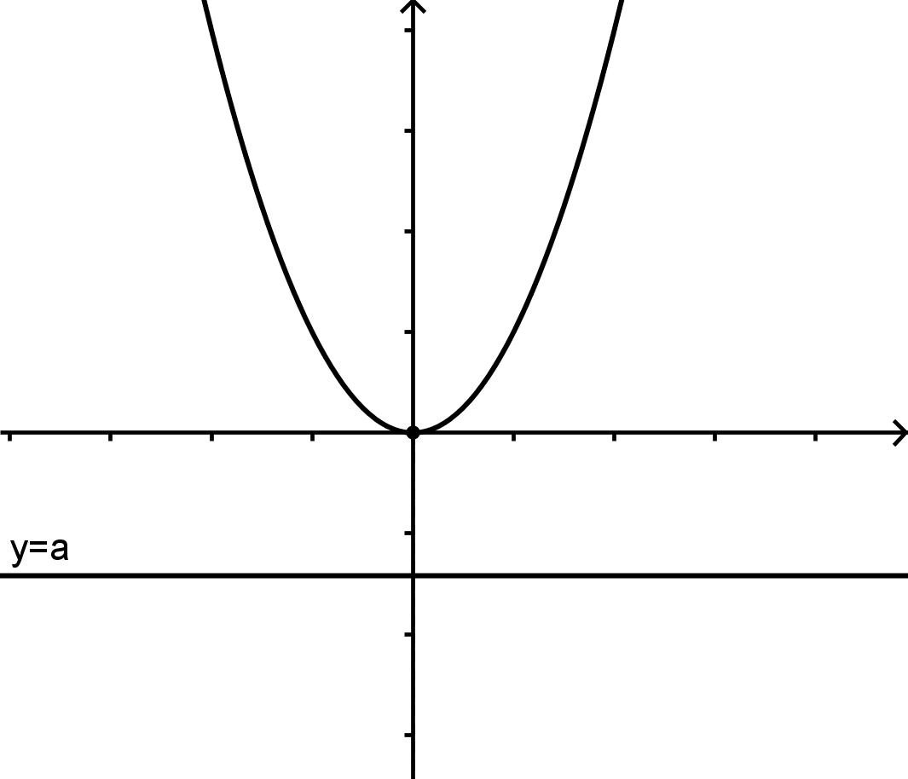
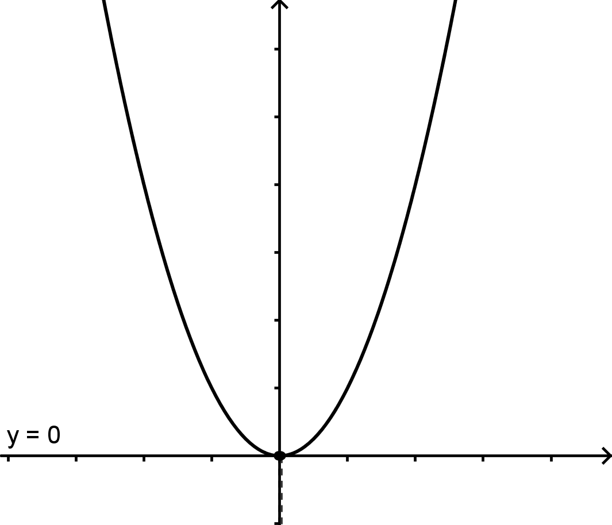
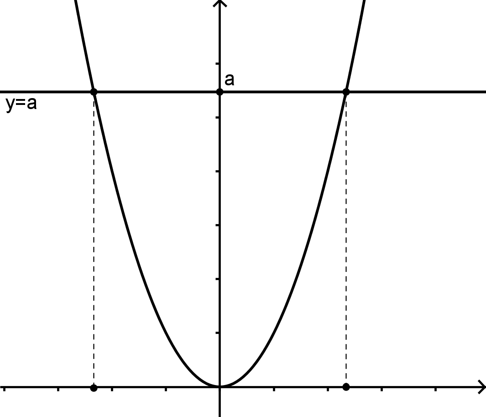
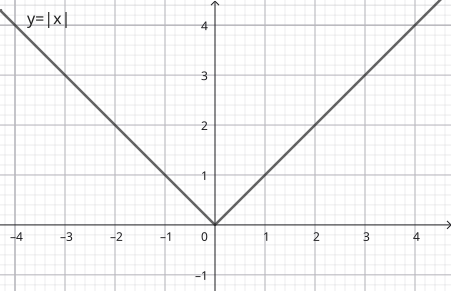

 
---

[pdf](./12_carre_valeur_absolue.pdf)

---

## 1. La fonction carré : $x \mapsto x^2$

### 1.1. Définition et propriétés

**Définition 1**
La fonction carré est définie sur $\mathbb{R}$ par $f(x) = x^2$.

**Propriété 1**
La fonction carré est :
- strictement décroissante sur $]-\infty; 0]$,
- strictement croissante sur $[0; +\infty[$.

La fonction carré n'est ni linéaire, ni affine.

$$
\begin{array}{c|ccccc}
x & -\infty & & 0 & & +\infty \\\
\hline
x^2 &           & \searrow &           & \nearrow & \\\
    &           &          & \text{0}  &
\end{array}
$$

### 1.2. Parabole d'équation $y = x^2$

La fonction carré est représentée par une courbe appelée **parabole**. Elle est constituée de tous les points $M(x, x^2)$ et a pour équation $y = x^2$.
Le point $O(0, 0)$ est son **sommet**.
La fonction carré est *paire*.

**Propriété 2**
Dans un repère orthogonal, la parabole d'équation $y = x^2$ admet l'axe des ordonnées comme axe de symétrie.

**Démonstration**
Pour n'importe quel réel $x$, on a $(-x)^2 = x^2$.
Les points $M(x; x^2)$ et $M'(-x; x^2)$ appartiennent tous les deux à la courbe et sont symétriques par rapport à l'axe des ordonnées. L'axe des ordonnées est donc un axe de symétrie de cette parabole.

### 1.3. Équations $x^2 = a$

#### 1.3.1. N'oublions pas les solutions négatives !

**Exemple 1**
La démarche *« naturelle »* qui consiste à résoudre l'équation $x^2 = 4$ en $x = 2$ est fausse.
En effet, on attend **TOUTES** les solutions et on a oublié $-2$, qui vérifie pourtant $(-2)^2 = 4$.

D'où vient cette erreur ?
Des applications du théorème de Pythagore ! En effet, souvenons-nous :
Si $ABC$ est rectangle en $A$ et que $AB = 3$ et $AC = 4$, alors le théorème de Pythagore s'applique et il vient :
$$
\begin{array}{rl}
AB^2 + AC^2 &= BC^2 \\
4^2 + 3^2 &= BC^2 \\
25 &= BC^2
\end{array}
$$
On en déduit que $BC = 5$, car $BC$ est une distance, donc un **nombre positif**. La solution $BC = -5$ est exclue, car **impossible**.
Rien n'indique dans l'équation $x^2 = 4$ que $x$ soit positif... donc rien ne permet d'exclure $x = -2$ !

#### 1.3.2. Cas général \newline



Si $a < 0$, $x^2 = a$ **n'a pas** de solution.

**Démonstration**
$x^2 \geq 0$ pour tout réel $x$. Donc $x^2$ ne peut jamais être égal à un nombre strictement négatif.

<--->
Si $a = 0$, $x^2 = 0$ a une **unique solution** $x = 0$.

**Démonstration**
$x^2 = 0$ signifie $x \times x = 0$. Un produit est nul si et seulement si l'un de ses facteurs est nul. $0$ est donc la seule solution.

<--->
Si $a > 0$, $x^2 = a$ a **deux solutions** : $x = -\sqrt{a}$ et $x = \sqrt{a}$.

**Démonstration**
$x^2 = a$ revient à $x^2 - a = 0$. Comme $a$ est positif, il est le carré de $\sqrt{a}$. L'équation s'écrit $(x + \sqrt{a})(x - \sqrt{a}) = 0$.
Soit $x = -\sqrt{a}$ ou $x = +\sqrt{a}$.



## 2. La fonction valeur absolue : $x \mapsto |x|$

### 2.1 Définition et propriétés 

**Définition 2**

La fonction **valeur absolue** est définie sur $\mathbb{R}$ par :

$$|x| = \left\\{ 
\begin{array}{rcl}
x &\text{ si } &x\geq0 \\\
-x &\text{ si} &x < 0
\end{array}
\right.$$

**Exemple 2**

- $|0| = 0 \text{ car } 0 \geq 0$ 
- $|3| = 3 \text{ car } 3 \geq 0$ 
- $|-2| = -(-2) = 2 \text{ car } -2 < 0$ 
- $|-5| = 5 \text{ car } -5 < 0$ 

**Propriété 3**

La valeur absolue est toujours positive. Pour tout $x\in\mathbb{R}$, on a $|x| \geq 0$.

Autrement dit, la courbe de la valeur absolue est située au dessus de l'axe des abscisses.

**Propriété 4**

La valeur absolue est décroissante sur $]-\infty; 0]$ et croissante sur $[0; +\infty[$.

$$
\begin{array}{c|ccccc}
x & -\infty & & 0 & & +\infty \\\
\hline
|x| &           & \searrow &           & \nearrow & \\\
    &           &          & \text{0}  &
\end{array}
$$

### 2.2 Représentation graphique

La courbe de la valeur absolue est constituée de deux demi-droites sécantes à l'origine.

