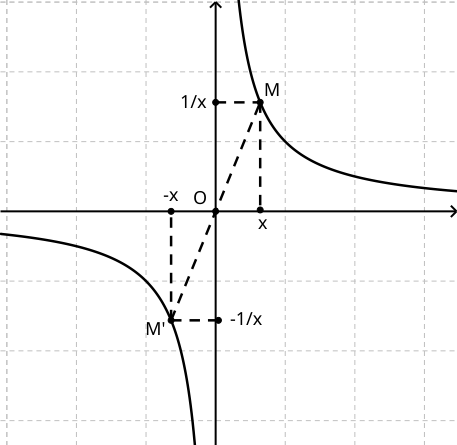
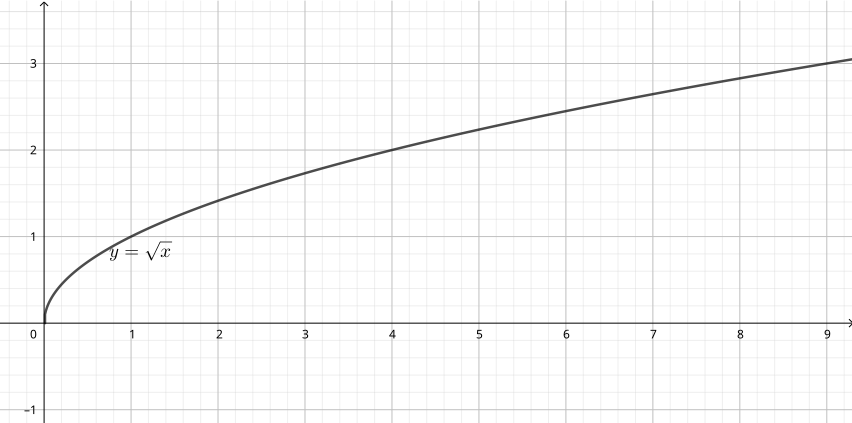

 
---

[pdf](./14_racine_inverse.pdf)

---

## 1. Fonction Inverse

### 1.1. Étude de la fonction $x \mapsto \dfrac{1}{x}$

**Définition 1**
La fonction inverse est définie sur $\mathbb{R}^*$ par $f(x) = \dfrac{1}{x}$.
$\mathbb{R}^*$ est l'ensemble des réels non nuls.

**Exemple 1**

- $f(-2) = \dfrac{1}{-2} = -0.5$,
- $f(3) = \dfrac{1}{3}$,
- $f\left(\dfrac{5}{3}\right) = \dfrac{1}{\dfrac{5}{3}} = \dfrac{3}{5}$,
- $f\left(10^5\right) = \dfrac{1}{10^5} = 10^{-5}$,
- $f\left(10^{-3}\right) = \dfrac{1}{10^{-3}} = 10^3$.

Mais attention, $0$ n'a pas d'image par $f$.

**Définition 2**
On dit que $x = 0$ est une **valeur interdite** de la fonction inverse.

**Propriété 1**

La fonction inverse est :

- strictement décroissante sur $]-\infty; 0[$,
- strictement décroissante sur $]0; +\infty[$.

$$
\begin{array}{c|ccccccc}
x & -\infty & & & 0 & & & +\infty \\\
\hline
\dfrac{1}{x} & & \searrow & & \text{||} & & \searrow & \\\
\end{array}
$$

**Remarque 1**
La fonction inverse n'est ni linéaire, ni affine.
L'inverse d'une somme n'est pas la somme des inverses : $\frac{1}{2} + \frac{1}{5} \neq \frac{1}{2 + 5}$.

### 1.2. Hyperbole d'équation $y = \frac{1}{x}$

La fonction inverse est représentée par une courbe appelée **hyperbole**. Elle est constituée de tous les points $M\left(x, \frac{1}{x}\right)$, pour $x \neq 0$, et a pour équation $y = \frac{1}{x}$.
Comme $0$ n'a pas d'image, il n'y a pas de point d'abscisse $0$ sur l'hyperbole d'équation $y = \frac{1}{x}$.

**Propriété 2**

- L'hyperbole d'équation $y = \frac{1}{x}$ admet l'origine comme centre de symétrie.
- La fonction inverse est impaire sur $\mathbb{R}^*$.

**Démonstration**
Pour n'importe quel réel $x$ non nul, on a $\frac{1}{-x} = -\frac{1}{x}$.
Les points $M\left(x; \frac{1}{x}\right)$ et $M'\left(-x; -\frac{1}{x}\right)$ appartiennent tous les deux à la courbe et sont symétriques par rapport à l'origine.
L'origine est donc un centre de symétrie de cette hyperbole.

## 2. Fonction Racine Carrée

### 2.1. Étude de la fonction $x \mapsto \sqrt{x}$

**Définition 3**
Soit $x$ un nombre réel positif ou nul.
La *racine carrée* de $x$, notée $\sqrt{x}$, est l'unique réel positif ou nul qui, élevé au carré, donne $x$.
On a donc, pour tout $x \geq 0$, $\sqrt{x} \geq 0$ et $\sqrt{x}^2 = x$.

**Définition 4**
La fonction racine carrée est définie sur $\mathbb{R}_+ = [0; +\infty[$ par $f(x) = \sqrt{x}$.

**Exemple 2**

- $\sqrt{-2}$ n'est pas défini car $-2 < 0$,
- $\sqrt{1} = 1$,
- $\sqrt{4} = 2$ et, pour tout nombre s'écrivant $x = p^2$, avec $p \geq 0$, $\sqrt{x} = p$,
- $\sqrt{2} \approx 1.41421$,
- $\sqrt{100} = 10$,
- $\sqrt{1000} \approx 31.623$,
- $\sqrt{0.25} = 0.5$.

**Propriété 3**
La fonction racine carrée est strictement croissante sur $[0; +\infty[$.

$$
\begin{array}{c|cccc}
x & 0 & & & +\infty \\\
\hline
\sqrt{x} &  & \nearrow & & \\\
 & 0 &  & & \\\
\end{array}
$$

**Remarque 2**
- La fonction racine carrée n'est ni linéaire, ni affine.
- Elle n'est pas non plus paire ou impaire.

### 2.2. Courbe d'équation $y = \sqrt{x}$

La courbe de la fonction racine carrée est une moitié de parabole qui a subi une rotation de 45°.

## 3. Compléments sur la racine carrée

### 3.1. Propriétés algébriques

**Propriété 4**
Pour tout réel positif $x$ s'écrivant $x = p^2$ avec $p \in \mathbb{N}$, $\sqrt{x} = p$.

**Exemple 3**
- $\sqrt{16} = 4$,
- $\sqrt{30} \approx 5.477$.

**Propriété 5**
Pour tout $a \geq 0$, $\sqrt{a^2} = a$.
Pour tout $a \in \mathbb{R}$, $\sqrt{a}^2 = a$.

**Propriété 6 : Racine carrée et produits**
Pour tout $a$ et $b$ positifs, on a :
- $\sqrt{a \times b} = \sqrt{a} \times \sqrt{b}$,
- si $b \neq 0$, $\sqrt{\dfrac{a}{b}} = \dfrac{\sqrt{a}}{\sqrt{b}}$.

**Exemple 4**
- $\sqrt{400} = \sqrt{4} \times \sqrt{100} = 2 \times 10 = 20$,
- $\sqrt{\dfrac{1}{16}} = \dfrac{\sqrt{1}}{\sqrt{16}} = \dfrac{1}{4}$.

**Remarque 3**
Généralement, $\sqrt{a + b} \neq \sqrt{a} + \sqrt{b}$ et $\sqrt{a - b} \neq \sqrt{a} - \sqrt{b}$.

### 3.2. Irrationalité de $\sqrt{2}$

**Propriété 7**
$\sqrt{2} \notin \mathbb{Q}$.
Autrement dit, il n'existe aucun couple d'entiers naturels $p$ et $q$ vérifiant $\sqrt{2} = \dfrac{p}{q}$.

**Remarque 4**
- On peut obtenir une égalité *approchée* aussi fine que l'on veut de $\sqrt{2}$ par des rationnels.
- On dit que $\sqrt{2}$ est *irrationnel*. Il existe une infinité de nombres irrationnels, comme $\pi$ ou $\sqrt{3}$, etc.

**Preuve : $\sqrt{2}$ est irrationnel**

Supposons le contraire. Nous allons démontrer que c'est impossible.
On suppose donc disposer de deux entiers naturels $p$ et $q$ vérifiant $\dfrac{p}{q} = \sqrt{2} \quad (E)$.
On suppose de plus que cette fraction est *irréductible*. On peut toujours simplifier une fraction jusqu'à ce qu'elle le devienne.

D'après ce qu'on a vu plus haut, il est possible d'élever au carré pour simplifier la racine carrée. On élève l'égalité $(E)$ au carré :
$$
\left(\dfrac{p}{q}\right)^2 = \sqrt{2}^2 \Leftrightarrow \dfrac{p^2}{q^2} = 2 \Leftrightarrow p^2 = 2 q^2 \quad (E)
$$

Pour démontrer que cette égalité est impossible, nous allons nous intéresser au chiffre des unités des deux membres de l'égalité $p^2 = 2 q^2$.
Le membre de gauche est un carré.
Le membre de droite est le double d'un carré. On sait déjà que le chiffre des unités du membre de droite est $0, 2, 4, 6$ ou $8$, mais nous allons pousser plus loin ce raisonnement.

Notons $u$ le chiffre des unités du nombre $p$. On sait donc que $p = 10a + u$, où $a$ est un entier.
Par exemple, si $p = 31$, $p = 10 \times 3 + 1$.
Dans tous les cas, $p^2 = (10a + u)^2 = 100a^2 + 20a \times u + u^2 = 10 \times (10a^2 + 2a \times u) + u^2$.
Donc le dernier chiffre de $p^2$ est le même que le dernier chiffre de $u^2$.

| $u$                      | 0 | 1 | 2 | 3 | 4  | 5  | 6  | 7  | 8  | 9  |
|--------------------------|---|---|---|---|----|----|----|----|----|----|
| $u^2$                    | 0 | 1 | 4 | 9 | 16 | 25 | 36 | 49 | 64 | 81 |
| Dernier chiffre de $p^2$ | 0 | 1 | 4 | 9 | 6  | 5  | 6  | 9  | 4  | 1  |

Le raisonnement précédent s'applique aussi au nombre $q^2$, qui est aussi le carré d'un entier.
Nous allons maintenant donner le tableau pour le dernier chiffre du nombre $2q^2$.
En notant $v$ le chiffre des unités de $q$ :

| $v$                       | 0 | 1 | 2 | 3 | 4 | 5 | 6 | 7 | 8 | 9 |
|---------------------------|---|---|---|---|---|---|---|---|---|---|
| Dernier chiffre de $q^2$  | 0 | 1 | 4 | 9 | 6 | 5 | 6 | 9 | 4 | 1 |
| Dernier chiffre de $2q^2$ | 0 | 2 | 8 | 8 | 2 | 0 | 2 | 8 | 8 | 2 |

Revenons maintenant à l'égalité $p^2 = 2q^2$.
On remarque dans le tableau précédent que la seule colonne qui soit possible est celle de $0$.
Dans ce cas, le dernier chiffre de $p$ et le dernier chiffre de $q$ doit être égaux à $0$.
Cela signifie que $p$ et $q$ se terminent par $0$ et sont des multiples de $10$. Or, nous avons supposé que la fraction $\dfrac{p}{q}$ était *irréductible*, c'est-à-dire que son numérateur et son dénominateur ne peuvent avoir de facteur commun.
Il n'existe donc aucune valeur possible pour l'égalité $p^2 = 2q^2$. La supposition initiale est fausse.
Nous avons démontré que $\sqrt{2}$ est irrationnel.
