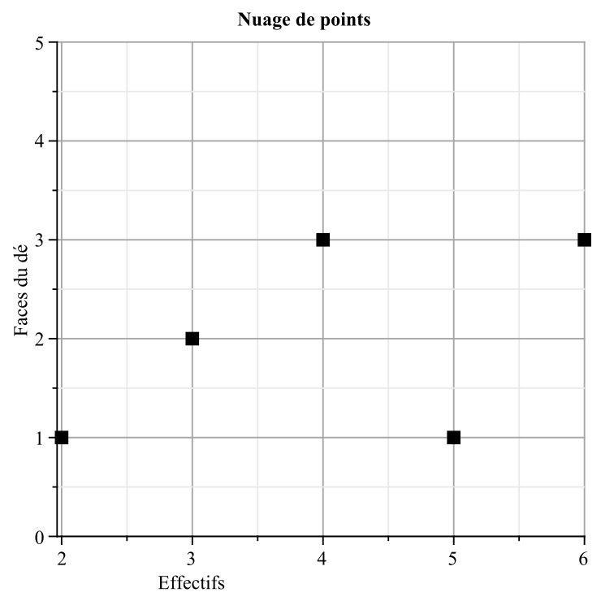
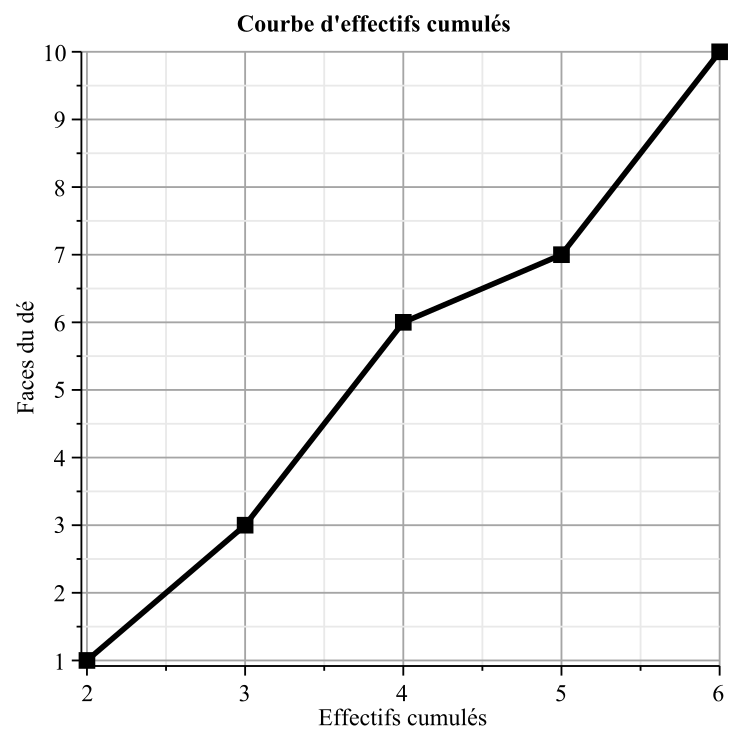

 

---

[pdf](./15_statistiques.pdf)

---

## 1. Effectifs et fréquences

### 1.1. Définition

Dans une série statistique :

- l'**effectif** d'une valeur est le nombre de données correspondant à cette valeur,
- la **fréquence** d'une valeur est $f = \dfrac{\text{effectif de la valeur}}{\text{effectif total}}$.

### 1.2. Exemple

En lançant dix fois un dé, on obtient : 2 ; 2 ; **6** ; **6** ; 3 ; 4 ; 4 ; 5 ; 3 ; 6.
L'effectif total est 10.
La valeur **6** apparaît 3 fois : son effectif est 3, sa fréquence est $\dfrac{3}{10} = 0.3$.

Effectifs et fréquences

| **Valeur** $x_i$    | 2   | 3   | 4   | 5   | 6   |
|---------------------|-----|-----|-----|-----|-----|
| **Effectif** $n_i$  | 1   | 2   | 3   | 1   | 3   |
| **Fréquence** $f_i$ | 0.1 | 0.2 | 0.3 | 0.1 | 0.3 |

Quand on cherche le nombre de valeurs de la série inférieures ou égales à une valeur donnée, on est amené à ajouter (cumuler) les effectifs :

Effectifs cumulés

| **Valeur** $x_i$    | 2 | 3     | 4     | 5     | 6      |
|---------------------|---|-------|-------|-------|--------|
| **Effectif** $n_i$  | 1 | 2     | 3     | 1     | 3      |
| **Effectif cumulé** | 1 | 1+2=3 | 3+3=6 | 6+1=7 | 7+3=10 |

On retrouve en dernière case l'effectif total : 10.
Il y a 6 valeurs de la série inférieures ou égales à 4.

## 2. Graphiques

Le choix d'un graphique dépend du type de série et de ce que l'on veut montrer :

- Un **diagramme en bâtons** (pour des valeurs discrètes ou qualitatives) et un **histogramme** (pour des valeurs numériques regroupées en classes) représentent les effectifs ou fréquences pour chaque valeur ou classe,
- Un **diagramme circulaire** montre la part de chaque valeur ou classe.

On utilisera aussi les graphiques suivants (relatifs à l'exemple précédent) :



<--->



## 3. Indicateurs de position

### 3.1. Moyenne

Soit $x$ une série statistique résumée dans le tableau ci-dessous :

**Définition 1**
La **moyenne** $\overline{x}$ d'une série statistique est :
$$
\overline{x} = \frac{n_1 \times x_1 + n_2 \times x_2 + \cdots + n_k \times x_k}{n_1 + \cdots + n_k} = f_1 \times x_1 + f_2 \times x_2 + \cdots + f_k \times x_k
$$
On peut aussi retenir :
$$
\overline{x} = \frac{\text{somme des (effectifs } \times \text{ valeurs)}}{\text{somme des effectifs}}
$$

Série statistique

| **Valeurs**    | $x_1$ | $x_2$ | $\dots$ | $x_k$ |
|----------------|-------|-------|---------|-------|
| **Effectifs**  | $n_1$ | $n_2$ | $\dots$ | $n_k$ |
| **Fréquences** | $f_1$ | $f_2$ | $\dots$ | $f_k$ |

### 3.2. Médiane

**Définition 2**
La **médiane** $Me$ d'une série statistique de $n$ valeurs **ordonnées** est la plus petite valeur de la série telle qu'au moins 50% des valeurs de la série lui soient inférieures ou égales.

### 3.3. Remarques

1. Environ la moitié des valeurs sont inférieures ou égales à la médiane et environ la moitié des valeurs sont supérieures ou égales à la médiane.
2. La médiane ne dépend que de l'ordre des valeurs... il est indispensable de les avoir classées et ordonnées.
3. La médiane dépend très peu des valeurs extrêmes. Ce n'est pas le cas de la moyenne, qui est fortement influencée par les valeurs extrêmes.

### 3.4. Exemple

**Énoncé**
Ce tableau donne les salaires mensuels des 185 employés d'une entreprise.

Salaires mensuels

| **Salaire brut**      | 1405 | 1480 | 1554 | 1870 | 2739 | 4215 |
|-----------------------|------|------|------|------|------|------|
| **Effectifs**         | 40   | 15   | 81   | 35   | 9    | 5    |
| **Effectifs cumulés** | 40   | 55   | 136  | 171  | 180  | 185  |

1. Déterminer le salaire moyen de cette entreprise.
2. Déterminer le salaire médian.
3. Peut-on affirmer ici que la moitié des salariés gagnent moins que la moyenne ?

**Solution**

1. $\overline{x} = \dfrac{40 \times 1405 + 15 \times 1480 + \cdots}{40 + 15 + \cdots} = \dfrac{315\,451}{185} \approx 1,705.14$ €.
2. Le salaire médian est situé *"au milieu"*, donc à la 93ème valeur. La 93ème valeur est 1554 €, donc $Me = 1554$ €.
3. Oui, car la moitié des salariés gagnent moins que la médiane (1554 €) et celle-ci est inférieure à la moyenne.

## 4. Indicateurs de dispersion

### 4.1. Étendue

**Définition 3**
L'**étendue** d'une série statistique est la différence entre les valeurs maximale et minimale.

### 4.2. Variance et écart-type

**Définition 4**
La **variance** d'une série statistique est la moyenne des carrés des écarts à la moyenne.

**Définition 5**
L'**écart-type** d'une série statistique est la racine carrée de la variance.

**Propriété 1**
L'écart-type est un **indicateur de dispersion** d'une série statistique.
Plus il est élevé, plus la série est dispersée.

**Notation** : La variance est notée $V$ et l'écart-type $\sigma$ (se lit *sigma*).

**Exemple 1**
On considère la série donnée dans le tableau ci-dessous. On a ajouté les lignes permettant le calcul de la variance.

Calcul de la variance

| Valeurs                       | 0  | 1  | 3 | 5 |
|-------------------------------|----|----|---|---|
| Effectifs                     | 2  | 4  | 2 | 2 |
| Écarts à la moyenne           | -2 | -1 | 1 | 3 |
| Carré de l'écart à la moyenne | 4  | 1  | 1 | 9 |

On calcule la moyenne :
$$
\overline{x} = \dfrac{2 \times 0 + 4 \times 1 + 2 \times 3 + 2 \times 5}{4 + 3 + 1 + 2} = 2
$$
La troisième ligne du tableau est obtenue en calculant les écarts entre les valeurs et la moyenne. Par exemple, pour $x = 0$, l'écart est $0 - 2 = -2$.
La quatrième ligne contient les carrés de la troisième.
On calcule ensuite la moyenne des carrés des écarts à la moyenne :
$$
V(x) = \dfrac{2 \times 4 + 4 \times 1 + 2 \times 1 + 2 \times 9}{10} = 3.2
$$
L'écart-type :
$$
\sigma = \sqrt{V} = \sqrt{3.8} \approx 1.79
$$

**Formule simplifiée de la variance**
Il est possible de simplifier cette démarche à l'aide de la formule suivante :
$$
V(x) = \overline{x^2} - \overline{x}^2
$$
Pour les calculs à la main, cela permet d'éviter de calculer les écarts à la moyenne puis leurs carrés.
On doit cependant toujours ajouter une ligne au tableau, pour les carrés de $x$.

### 4.3. Les Quartiles

**Définition 6**
Les **quartiles** découpent la série en quatre parties ordonnées et de même effectif.

- $Q_1$ est le **premier quartile**. $Q_1$ est la plus petite valeur de la série telle que 25% des valeurs lui soient inférieures ou égales.
- $Q_3$ est le **troisième quartile**. $Q_3$ est la plus petite valeur de la série telle que 75% des valeurs lui soient inférieures ou égales.

**Définition 7**
L'**écart inter-quartile** est la différence $Q_3 - Q_1$.

**Remarque 1**
La médiane est donc le deuxième quartile.

### 4.4. Diagramme en boîtes

On représente toutes ces informations dans un diagramme particulier.
L'axe des abscisses représente les valeurs ordonnées.
On ne représente que les valeurs minimales et maximales, les quartiles, la médiane et, parfois, la moyenne.
Le rectangle contient 50% des valeurs.

### 4.5 Lecture du diagramme en boite

Dans la figure :

- La valeur minimale est 11,
- Le premier quartile est 12,
- La médiane est 16,
- Le troisième quartile est 18
- La valeur maximale est 21,

On a donc environ : 

- 25% des valeurs entre 11 et 12,
- 25% des valeurs entre 12 et 16,
- 25% des valeurs entre 16 et 18,
- 25% des valeurs entre 18 et 21,

### 4.5. Exemple

**Énoncé**

1. Déterminer l'étendue et les quartiles de la série de l'exemple 3.4.
2. Représenter l'étendue, les quartiles et la médiane sur un même diagramme.

**Solution**

1. L'étendue est $4215 - 1405 = 2810$ €.
   Il y a 185 données. Or $185 \times \frac{1}{4} = 46.25$ et $185 \times \frac{3}{4} = 138.75$.
   Le premier quartile est donc la 47ème valeur de la série ordonnée et le troisième quartile la 139ème valeur.
   $Q_1 = 1480$ € et $Q_3 = 1870$ €. L'écart inter-quartile est 390 €.
2. Diagramme en boîtes à faire.

**Remarques** : Cette série est **asymétrique**. L'écart inter-quartile est sept fois plus petit que l'étendue (très sensible au plus gros salaire).
