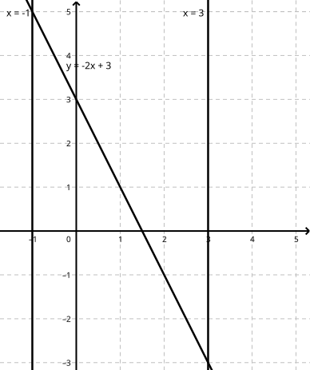
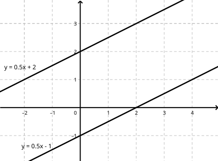
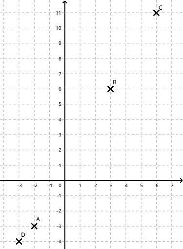
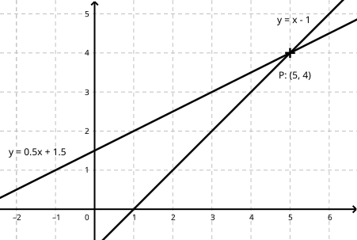

 

---

[pdf](./16_droites.pdf)

---

## 1. Équation de droite et fonction affine

Dans tout le chapitre, le plan est muni d'un repère $(O, \vec{i}, \vec{j})$.

### 1.1. Relation

**Propriété 1**

1. La représentation graphique de la fonction affine $f: x \mapsto ax + b$ est une droite $d$ qui n'est pas parallèle à l'axe des ordonnées.
2. **Réciproquement**, toute droite $d$ non parallèle à l'axe des ordonnées admet une équation du type $y = ax + b$. Cette droite représente la fonction affine $f: x \mapsto ax + b$ associée.

**Remarque 1**
Si $d = (AB)$, on rappelle que le coefficient directeur $a$ vérifie $a = \frac{y_B - y_A}{x_B - x_A}$, et que $d$ passe par $(0, b)$.
Autrement dit, l'ordonnée à l'origine $b$ vérifie $b = y_A - a x_A$.

*Démonstration* :
La première propriété a déjà été démontrée. Prouvons la seconde.

Soit $d$ une droite non parallèle à l'axe des ordonnées. Elle coupe donc l'axe des ordonnées en un point qu'on note $A$. Les coordonnées de $A$ sont $(0; y_A)$. Il existe un point d'abscisse $1$ sur $d$ (pour la même raison). On le note $B$ et ses coordonnées sont $B(1; y_B)$.

Soit $f$ la fonction affine définie par $f(x) = (y_B - y_A)x + y_A$.

Alors $f(0) = y_A$ et $f(1) = y_B - y_A + y_A = y_B$. Autrement dit, la courbe de $f$ est une droite qui contient $A$ et $B$. C'est la droite $(AB) = d$ !

### 1.2. Équation réduite

**Propriété 2**

1. Une droite $d$ non parallèle à l'axe des ordonnées admet une équation de la forme $y = ax + b$.
2. Une droite $d$ parallèle à l'axe des ordonnées admet une équation de la forme $x = c$.

C'est ce qu'on appelle **l'équation réduite** de la droite $d$.

### 1.3. Équation cartésienne

**Définition 1**
Soit $a, b, c$ trois nombres réels. Une équation du type $ax + by + c = 0$ est une **équation cartésienne**.

**Exemple 1**
$4x + 2y - 6 = 0$ est une équation cartésienne. Elle est équivalente à $2y = -4x + 6$, donc à $y = -2x + 3$.

**Propriété 3**
Toutes les équations cartésiennes $ax + by + c = 0$ ont pour ensemble de solutions $M(x; y)$ des droites du plan.
Qui plus est, elles peuvent toutes se réduire soit en $y = c$, soit en $y = mx + p$.
Autrement dit, il est toujours possible de **réduire** une équation cartésienne.

## 2. Droites parallèles, droites sécantes

### 2.1. Parallélisme

**Théorème 1**
Deux droites $d$ et $d'$ d'équations respectives $y = ax + b$ et $y = a'x + b'$ sont parallèles si et seulement si $a = a'$.
Autrement dit, elles sont parallèles si et seulement si elles ont le même coefficient directeur.

**Exemple 2**
Les droites $d$ et $d'$ d'équations respectives $y = \frac{1}{2}x + 2$ et $y = \frac{1}{2}x - 1$ sont parallèles.

### 2.2. Alignement

**Théorème 2**
Trois points $A, B$ et $C$ sont alignés :

- si et seulement si les coordonnées de $C$ vérifient l'équation de $(AB)$,
- si et seulement si $(AB)$ et $(AC)$ ont le même coefficient directeur.

**Exemple 3**
Soit $A(-2; -3)$, $B(3; 6)$, $C(6; 11)$ et $D(-3; -4)$ :

- Les coefficients directeurs de $(AB)$ et $(AC)$ sont $\frac{y_B - y_A}{x_B - x_A} = \frac{9}{5}$ et $\frac{y_C - y_A}{x_C - x_A} = \frac{7}{4}$. Donc $A, B$ et $C$ ne sont pas alignés.
- Les coefficients directeurs de $(BC)$ et $(BD)$ sont égaux à $\frac{5}{3}$, donc $B, C, D$ sont alignés.

### 2.3. Droites sécantes

Dire que deux droites du plan sont sécantes signifie qu'elles ne sont pas parallèles[^1].
Si elles ont toutes deux une équation de la forme $y = ax + b$ et $y = a'x + b'$, elles sont sécantes si et seulement si $a' \neq a$.
Chercher le point d'intersection de $d$ et $d'$ c'est chercher le point qui vérifie les deux équations à la fois.

[^1]: Est-ce toujours si simple ? Dans *l'espace* à trois dimensions, deux droites peuvent n'être ni sécantes ni parallèles !

## 3. Systèmes de deux équations à deux inconnues

### 3.1. Introduction

Un système d'équations est une série d'équations délimitées par une accolade $\Big\{$.
Une solution doit vérifier toutes les équations à la fois.
Résoudre un tel système, c'est en donner toutes les solutions.

Par exemple, le système :

$$
\left\\{
\begin{array}{rcl}
x + y & = & 7 \\\
x - y & = & 1
\end{array}
\right.
$$

a deux équations $L1$ et $L2$ et deux inconnues $x$ et $y$.
Les équations étant affines, on dira que c'est un **système linéaire de deux équations à deux inconnues**.
On peut remarquer que $(x = 4; y = 3)$ est une solution du système, car ces nombres vérifient les deux équations à la fois.
Par contre, $(x = 6; y = 1)$ ne vérifie que $L1$ et n'est pas une solution du système.

**Exemple 4**
Système linéaire de 3 équations à 3 inconnues :
$$
\left\\{
\begin{array}{rcl}
3x + 2y - z & = & 5 \\\
x - 2y + 3z & = & 4 \\\
3x + 4y - 7z & = & 1
\end{array}
\right.
$$

Système de 2 équations à 2 inconnues mais non linéaire :
$$
\left\\{
\begin{array}{rcl}
x^2 + y^2 & = & 4 \\\
x - y & = & 1
\end{array}
\right.
$$

**Remarque 2**
En seconde, on résout les systèmes linéaires de deux équations à deux inconnues.

### 3.2. Définition

**Définition 2**
Un **système de deux équations à deux inconnues** $(S)$ est donné par deux équations à deux inconnues du type :
$$
(S): \left\\{
\begin{array}{rcl}
ax + by & = & c \\\
a'x + b'y & = & c'
\end{array}
\right.
$$
où $a, b, c, a', b', c'$ sont des nombres fixés.

### 3.3. Nature des solutions

**Théorème 3**
Soit
$$
(S): \left\\{
\begin{array}{rcl}
ax + by & = & c \\\
a'x + b'y & = & c'
\end{array}
\right.
$$
Un système de deux équations à deux inconnues.
Il peut se représenter comme la recherche du point d'intersection des droites $d1$ et $d2$ d'équations cartésiennes : $ax + by = c$ et $a'x + b'y = c'$.
Il y a donc trois cas de figure :

- Si $d1$ et $d2$ sont sécantes en $P(x_P, y_P)$, alors $(x_P, y_P)$ est l'unique solution du système.
- Si $d1$ et $d2$ sont strictement parallèles, alors le système n'a pas de solution.
- Si $d1$ et $d2$ sont confondues, alors toute la droite $d1$ est solution.

### 3.4. En pratique : graphiquement

**Exemple 5**
Résoudre graphiquement le système :
$$
\left\\{
\begin{array}{rcl}
2x - 4y & = & -6 \\\
-x + y & = & -1
\end{array}
\right.
$$

**Solution**
1. On réduit chaque équation. $2x - 4y = -6$ se réduit en $y = \frac{1}{2}x + \frac{3}{2}$ et $-x + y = -1$ en $y = x - 1$. Elles n'ont pas le même coefficient directeur.
   Résoudre le système revient à trouver le point d'intersection de ces deux droites **sécantes**.
2. On trace les droites $d1$ et $d2$ dans le même repère.
3. Leur point d'intersection $P(5; 4)$ nous donne la solution du système : $x = 5; y = 4$.

### 3.5. En pratique : algébriquement

**Exemple 6**
Résoudre par le calcul le système :
$$
\left\\{
\begin{array}{rcl}
2x - 4y & = & -6 \\\
-x + y & = & -1
\end{array}
\right.
$$

Il existe deux méthodes pour résoudre les systèmes d'équations linéaires.

#### 3.5.1. Par combinaison linéaire

On multiplie chaque membre de $L2$ par 2 pour faire apparaître des coefficients correspondants en $x$ :
$$
\left\\{
\begin{array}{rcl}
2x - 4y & = & -6 \\\
-2x + 2y & = & -2
\end{array}
\right.
$$
On ajoute ensuite $L1$ et $L2$ afin de faire disparaître les termes en $x$ :
$$
\left\\{
\begin{array}{rcl}
2x - 4y & = & -6 \\\
-2y & = & -8
\end{array}
\right.
\Longleftrightarrow
\left\\{
\begin{array}{rcl}
2x - 4y & = & -6 \\\
y & = & 4
\end{array}
\right.
$$
On remplace ensuite $y = 4$ dans $L1$ et il vient :
$$
\left\\{
\begin{array}{rcl}
x & = & 5 \\\
y & = & 4
\end{array}
\right.
$$
L'unique solution du système est bien $(5; 4)$.

#### 3.5.2. Par substitution

Nous allons isoler la variable $y$ dans l'équation la plus simple, $L2$ :
$$
\left\\{
\begin{array}{rcl}
2x - 4y & = & -6 \\\
y & = & x - 1
\end{array}
\right.
$$
On remplace ensuite $y$ par $x + 1$ dans $L1$. On obtient alors une équation d'une seule variable qu'on peut résoudre :
$$
\left\\{
\begin{array}{rcl}
2x - 4(x - 1) & = & -6 \\\
y & = & x - 1
\end{array}
\right.
\Longleftrightarrow
\left\\{
\begin{array}{rcl}
-2x + 4 & = & -6 \\\
y & = & x - 1
\end{array}
\right.
$$
On résout alors cette équation en $x$ et on remplace enfin dans $L2$ pour obtenir $y$ :
$$
\left\\{
\begin{array}{rcl}
x & = & 5 \\\
y & = & 4
\end{array}
\right.
$$
L'unique solution du système est bien $(5; 4)$.
