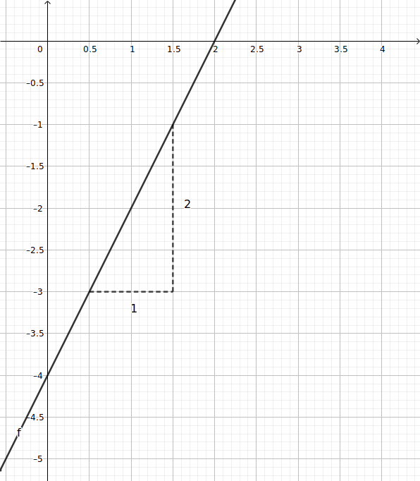
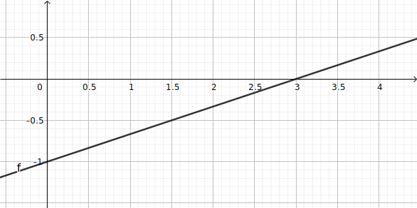
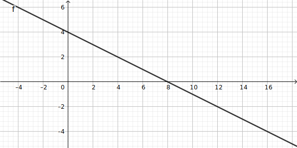
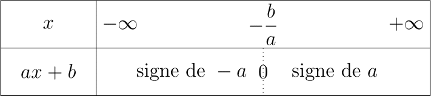

[pdf](./06-fct-affines.pdf)

## 1. Rappels : définitions et propriétés

### 1. Définition

Une **fonction affine** est une fonction définie sur $\mathbb{R}$ dont l'expression
peut s'écrire $f(x)=ax+b$.

Les réels $a$ et $b$ sont constants.

$a$ est **le coeficient directeur**, $b$ est **l'odonnée à l'origine**.

### 2. Exemples

On donne $f(x) = 2x - 4$, $g(x) = (1 -x)^2$ et $h(x) = x^2 - (x+1)^2$.

* $f$ est affine avec $a = 2$ et $b = -4$.
* $g$ n'est pas affine. On peut développer $g(x) = 1 -2x + x^2$ et on ne peut se débarasser du terme en $x^2$
* $h$ est affine, en effet $h(x)=x^2 - (x^2 + 2x+1)=-2x-1$. Ainsi $a=-2$ et $b=-1$.

### 3. Théorème

La représentation graphique d'une fonction affine **est une droite**.

Pour la représenter on peut choisir deux valeurs de $x$ :

| $x$    | 0  | 1  |
|--------|----|----|
| $2x-4$ | -4 | -2 |

## 2. Coefficient directeur et ordonnée à l'origine

### 1. Lecture graphique

* L'ordonnée à laquelle la courbe de la fonction $f$ définie par $f(x)=ax+b$ coupe l'axe des ordonnées est $b$.
* Le coefficient directeur se lit en choisissant deux points de la droite, séparés d'un en absissce. L'écart sur les ordonnées entre le point de gauche et le point de droite est $a$.

### 2. Par le calcul

Pour deux points distincts $A(x_A, y_A)$ et $B(x_B, y_B)$ de la droite $d$, on a 

$$a = \frac{y_B - y_A}{x_B - x_A} \text{ et } b = y_A - ax_A$$

## 3. Sens de variation des fonctions affines

Soit $f$ la fonction affine $f: x \mapsto ax+b$ alors :

* si $a>0$, $f$ est **strictement croissante** sur $\mathbb{R}$,
* si $a<0$, $f$ est **strictement décroissante** sur $\mathbb{R}$,
* si $a=0$, $f$ est **constante** sur $\mathbb{R}$.

 

**Remarque :** si $b=0$, la fonction est dite _linéaire_ et sa courbe passe par l'origine.

## 4. Signe d'une fonction affine

$f(x) = \dfrac{1}{3}x-1$ est affine avec $a = \dfrac{1}{3} > 0$ donc est strictement croissante sur $\mathbb{R}$. 

De plus, $f(3) = 0$ donc :

* pour tout $x < 3$, $f(x) < 0$
* pour tout $x > 3$, $f(x) > 0$

### Théorème 

Le signe d'une fonction affine $f(x) = ax+b$ avec $a\neq b$ est déterminé par deux éléments :

* Le signe de $a$
* la valeur de $-\frac{b}{a}$

Il se résume ainsi :

