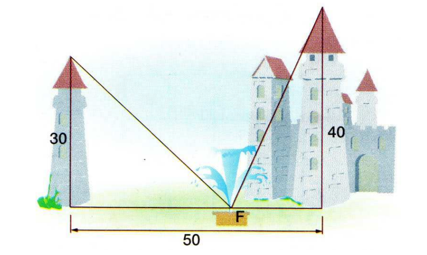

[pdf](./ch16.pdf)

# Exercice 1 : systèmes - substitution

Résoudre les systèmes suivants _par substitution_

1. $$\left\\{\begin{array}{rcl}2x+5y=7 \\\ 3x-2y=10\end{array}\right.$$

2. $$\left\\{\begin{array}{rcl}4x+4y=12 \\\ 3x-9y=20\end{array}\right.$$

3. $$\left\\{\begin{array}{rcl}5x+7y=10 \\\ 12x-11y=21\end{array}\right.$$

3. $$\left\\{\begin{array}{rcl}9x+7y=8 \\\ 2x-6y=12\end{array}\right.$$

# Exercice 2 : systèmes - combinaison linéaire

Résoudre les systèmes suivants _par combinaison linéaire_

1. $$\left\\{\begin{array}{rcl}3x+4y=7 \\\ 2x-1y=11\end{array}\right.$$

2. $$\left\\{\begin{array}{rcl}5x+3y=12 \\\ 2x-8y=19\end{array}\right.$$

3. $$\left\\{\begin{array}{rcl}6x+6y=10 \\\ 11x-10y=22\end{array}\right.$$

4. $$\left\\{\begin{array}{rcl}10x-7y=8 \\\ 3x-5y=11\end{array}\right.$$

# Exercice 3 : systèmes - résolution graphique 

Résoudre le système suivant par _lecture graphique_.

$$\left\\{\begin{array}{rcl}4x-2y=10 \\\ 3x+y=10\end{array}\right.$$

1. Tracer les deux droites 
2. Lire leur point d'intersection
3. Vérifier que la solution est juste

# Exercice 4 : reconnaître une équation cartesienne de droite 

Parmi les équations suivantes, lesquelles ne sont pas des équations cartesiennes de droite ?

1. $2x+7y=16$

1. $3x-4y^2=3$

1. $4x+9xy=2$

1. $x -\dfrac{1}{y}=\dfrac{1}{4}$

# Exercice 5 : utiliser une équation cartésienne 

Tracer les droites suivantes sur une même figure :

1. $d_1 : 2x+6y = 10$
1. $d_2 : -x-3y = 5$
1. $d_3 : 4x-3y = 7$

# Exercice 6 : déterminer une équation cartesienne de droite 

Déterminer une équation cartesienne de la droite $(AB)$

1. $A(2;1),\; B(5;2)$
2. $A(-2;10),\; B(7;4)$
2. $A(-6;9),\; B(5;3)$

# Exercice 7

La somme des nombres $x$ et $y$ vaut $133$.
Si on les augmente chacun de $5$, leur rapport est $\dfrac{4}{7}$.

Que valent ces nombres ? 

# Exercice 8

La somme de deux nombres $x$ et $y$ est 29. La différence de leur carré est $145$.

Que valent ces nombres ?

# Exercice 9

Trouver les dimensions d'un triangle rectangle d'hypothénuse 13 cm et d'aire 30 cm$^2$.

# Exercice 10 

Le responsable d’un groupe d’adultes et d’enfants désire organiser un voyage et demande les tarifs à deux compagnies de transport A et B qui proposent les conditions suivantes :

|             | Prix adulte | Prix enfant | Prix total |
|-------------|-------------|-------------|------------|
| Compagnie A | 280€        | 200€        | $13~360$€     |
| Compagnie B | 320€        | 160€        | $14~720$€     |

Déterminer le nombre d’adultes et d’enfants qui participent au voyage.

# Exercice 11 

_Léonard de Pise, connu sous le nom de Fibonacci (XIIe siècle), raconte :_

"Deux tours élevées l’une de 30 pas et l’autre de 40 pas sont distantes de 50 pas.
Entre les deux se trouve une fontaine F vers laquelle deux oiseaux descendant des
sommets des deux tours se dirigent du même vol et parviennent dans le même
temps."

Quelles sont les distances horizontales du centre de la fontaine aux deux tours ?
Sous quel angle voit-on de la fontaine F chacune des deux tours ?

$\qquad\qquad\qquad\qquad\qquad\qquad$
