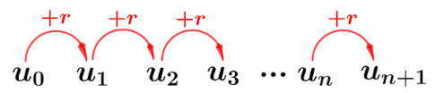

[pdf](./1_suites_arithmetiques.pdf)

# Suites arithmétiques

## Rappels

#### Suite


Une _suite numérique_ est une collection numérotée de nombres.



L'_indice_ d'un élément de la suite est un entier, le premier indice est généralement 0.



Ainsi, la _suite des entiers naturels pairs_ : $0, 2, 4, 6$ etc. peut être notée : $u_0 = 0, u_1=2, u_3=4$ etc.

Ou plus simplement : $u_n = 2n$.


#### Suite arithmétique


Une suite est _arithmétique_ si la différence de deux termes consécutifs est constante.

Lorsque c'est le cas, cette différence est appelée la _raison_ de la suite et est notée $r$.



#### Définition 



Une suite $u$ est arithmétique de raison $r$ si, pour tout $n\in \mathbb{N}$, $u_{n+1} = u_n + r$.



#### Exemples


* La suite $u$ définie par $u_0=4$ et $u_{n+1} = u_{n} + 5$ est arithmétique de raison 5.
* La suite $v$ définie par $v_0=5$ et $v_{n+1} = 2 v_{n}$ n'est pas arithmétique.


#### Méthodes



Pour vérifier qu'une suite **n'est pas arithmétique** on se contente généralement de contredire la propriété sur les premiers termes.


Pour la suite $v$, $v_0=5, v_1=10, v_2=20$. Les différences successives sont : 5 (entre $v_0$ et $v_1$) et 10 (entre $v_1$ et $v_2$). $5 \neq 10$ donc la suite $v$ n'est pas arithmétique




Pour démontrer qu'une suite **est arithmétique** il faut le prouver pour un indice quelconque.


Considérons $w_n = 3 + 7n$. Prouvons que cette suite est arithmétique.

1. On exprime $w_{n+1}$ :

    $w_{n+1} = 3 + 7(n+1) = 3 + 7n + 7 = 10 + 7n$
2. On calcule $w_{n+1} - w_n$ : 

    $w_{n+1} - w_{n} = (10 + 7n) - (3 + 7n) = 10 + 7n - 3 - 7n = 7$
3. Si la différence est constante (ne dépend pas de $n$), la suite est arithmétique. Sinon elle
    ne l'est pas.

    7 ne dépend pas de $n$ donc $w_n$ est arithémtique de raison 7.


#### Graphiquement



Les termes d'une suite arithmétique sont alignés. On parle de **croissance linéaire**



_Lorsqu'on représente une suite on place en abscisse (horizontal) les indices et en ordonnée (vertical) les valeurs._

#### Représenter une suite sur la Numworks

Lorsqu'on dispose de la relation $u_{n+1} = u_n + r$ :

Par exemple avec $u_3$ et $u_{n+1} = u_n + 5$.


Menu **Suites**, ajouter une suite, **Récurrente d'ordre 1**, $u_{n+1} = u_{n} + 5$


Ensuite graphique :

 

### Variations

_Exprimer les variations d'une suite c'est dire si elle est croissante, décroissante ou ni l'un ni l'autre._



* Une suite arithmétique de raison $r>0$ est croissante.
* Une suite arithmétique de raison $r<0$ est décroissante.



## Terme général

_Le terme général d'une suite est son expression en fonction de $n$_



**Le terme général d'une suite arithmétique est de la forme $u_n = u_0 + n \times r$**





Toute suite dont le terme général s'exprime ainsi est arithmétique


## Somme des termes

_La somme des termes consécutifs d'une suite est la somme :_ $u_0 + u_1 + u_2 + \cdots + u_{n-1} + u_n$.


$u_0 + u_1 +  u_2 + u_3$ : il y a **4** termes.

De l'indice 0 à l'indice $n$ il y a $n+1$ termes. 



#### La somme des termes consécutifs d'une suite arithmétique


$$S_n = u_0 + u_1+ u_2+ \cdots +u_n$$
$$S_n= \text{nb de termes} \times \frac{\text{1er} + \text{dernier terme}}{2}$$



#### Exemple

On considère la suite $u$ donnée par $u_0=3$ et $u_{n+1} = u_n + 5$. 

Calculer la somme $S = u_0 + u_1 + \cdots + u_{10}$


1. La suite est arithmétique de raison 5 donc la formule s'applique.
2. La somme s'étend de l'indice 0 à l'indice 10 donc comporte 11 termes.
3. Le dernier terme de la somme est $u_{10}$ qu'on calcule avec le terme général :

    $$u_{10} = u_0 + 10 \times r = 3 + 10 \times 5 = 53$$
4. On remplace dans la formule :

    $$S = 11 \times \dfrac{u_0 + u_{10}}{2} = 11 \times \dfrac{3 + 53}{2} = 11 \times \dfrac{56}{2} = 11 \times 28 = 308$$


#### Numworks

Pour calculer la somme des termes avec la calculatrice Numworks il faut connaitre le terme général.


Menu **calculs**, touche **paste**, choisir **Analyse** puis **Somme**


$$\sum_{i=0}^{10}(3 + 5 \times i) = 308$$

## Résumé

| **Résumé** | Cours                                                                         | Exemple                                                                               |
|------------|-------------------------------------------------------------------------------|---------------------------------------------------------------------------------------|
| Définition | $(u_n)$ arithmétique  -- de raison $r$ -- de premier terme $u_0$              | $r=-0.5$, $u_0=6$                                                                     |
| Propriété  | $u_{n+1} = u_n + r$                                                           | $u_{n+1} = u_n - 0.5$                                                                 |
| Propriété  | $u_{n} = u_0 + n\times r$                                                     | $u_{n} = 6 - 0.5r$                                                                    |
| Variations | Si $r>0$, $u$ est croissante -- Si $r<0$, $u$ est décroissante                | $r=-0.5$ -- La suite est décroissante                                                 |
| Somme      | $S = \text{nb de termes} \times \dfrac{\text{1er} + \text{dernier terme}}{2}$ | $u_2+\cdots+u_9 = 8\dfrac{u_2+u_8}{2}$                                                |
| Graphe     | Les points de la représentation graphique sont alignés                        |                                                                                       |
|            | On parle de croissance linéaire                                               |  |
