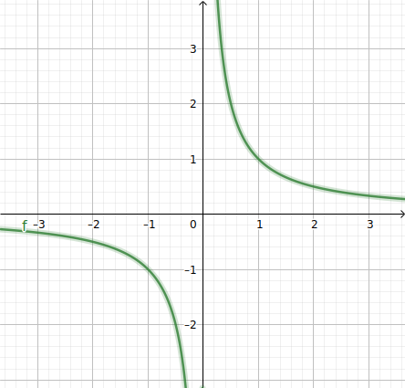
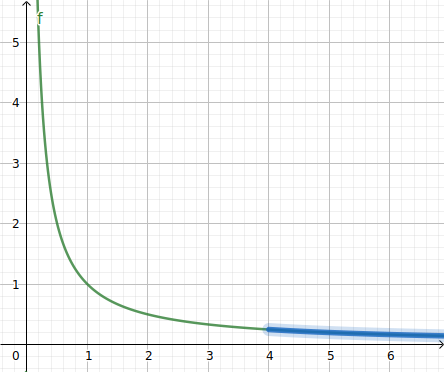
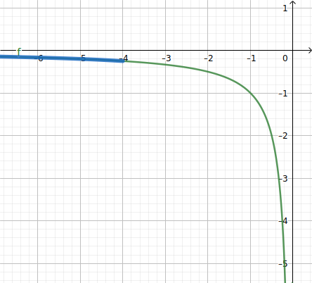
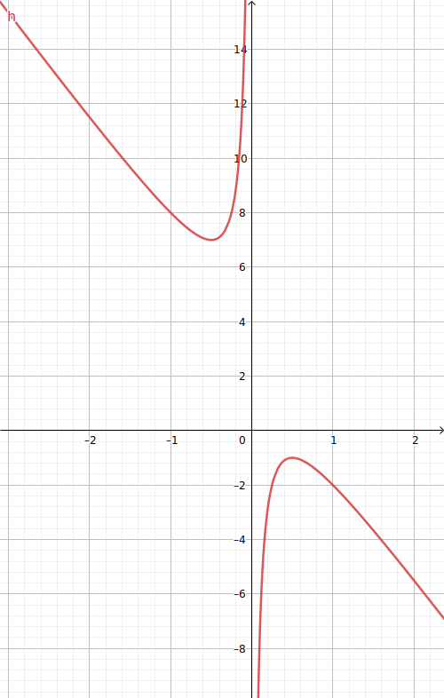

[pdf](./2_fonction_inverse.pdf)

# Fonction inverse

## Définition et représentation graphique

#### Définition



La fonction inverse est définie sur $\mathbb{R} \setminus \{0\}$ par $f(x) = \dfrac{1}{x}$.



#### Valeurs


| $x$            | -2   | -1 | -0.5 | 0 | 0.5 | 1 | 2   |
|----------------|------|----|------|---|-----|---|-----|
| $\dfrac{1}{x}$ | -0.5 | -1 | -2   | x | 2   | 1 | 0.5 |




#### Représentation graphique




Le graphe de la fonction inverse est une _hyperbole_ de centre $O$, symétrique par rapport à l'origine.


## Dérivée et variations

#### Dérivée



La fonction dérivée de la fonction inverse : $\left( \dfrac{1}{x} \right)' = -\dfrac{1}{x^2}$





#### Démonstration

Avec $f(x) = \dfrac{1}{x}$.

Calculons le taux d'accroissement entre $a$ et $a+h$ :

$$\dfrac{f(a + h) - f(a)}{h} = \dfrac{\frac{1}{a+h} - \frac{1}{a}}{h} = \dfrac{\frac{a}{a(a+h)} - \frac{a+h}{a(a+h)}}{h} = \frac{\frac{-h}{a(a+h)}}{h} = \frac{-h}{ah(a+h)}=\frac{-1}{a(a+h)}$$

Lorsqu'on fait tendre $h$ vers 0, l'expression précédente tend vers $-\dfrac{1}{a^2}$


#### Variations



La fonction inverse est décroissante sur $]-\infty; 0[$ et est décroissante sur $]0; +\infty[$.



## Limites : comportement à l'infini

### En $+\infty$



Lorsque $x$ devient grand, $\dfrac{1}{x}$ devient proche de 0.


_Pensez le ainsi : vous avez 1 gateau à diviser en $x$ invités._

_Avec 3 invités, ça va, chacun mange un tiers, avec 1000 invités, chacun mange $\dfrac{1}{1000} = 0.001$ gateau..._

| $x$            | 1   | 10  | 100  | 1000  | 10000  |
| -------------- | --- | --- | ---- | ----- | ------ |
| $\dfrac{1}{x}$ | 1   | 0.1 | 0.01 | 0.001 | 0.0001 |

Graphiquement : plus $x$ devient grand, plus la courbe s'approche de l'axe des abscisses.


### En $-\infty$


Lorsque $x$ devient grand "chez les négatifs", $\frac{1}{x}$ devient proche de 0 (_mais toujours négatif_).

Graphiquement : plus $x$ devient négatif, plus la courbe s'approche de l'axe des abscisses.


#### L'axe des abscisses est une asymptote à la courbe de la fonction inverse en $+\infty$ et $-\infty$.

## Étude d'une fonction

Soit $f(x) = 3 - 4x - \dfrac{1}{x}$ définie sur $\mathbb{R} \setminus \{0\}$.

1. Calculer la dérivée de $f$
2. Factoriser la dérivée et étudier son signe
3. Construire le tableau de variations
4. Représenter $f$ dans un repère.



### Formules de dérivation


| Formule | Dérivée |
|-------------------------------|----------------|
| Somme | $(f+g)'=f'+g'$ |
| Produit par une constante $k$ | $(k f)'=k f'$ |



| Fonction $f$ | Dérivée $f'$ |
|----------------|--------------|
| $a$, constant | 0 |
| $x$ | 1 |
| $x^2$ | $2x$ |
| $x^3$ | $3x^2$ |






1.  On applique la formule et :

    $$f'(x) = 0 - 4 - \dfrac{-1}{x^2}$$

2.  On factorise la dérivée après l'avoir réduite au même dénominateur :

    $$f'(x) = -4 + \dfrac{1}{x^2} = \dfrac{-4x^2+1}{x^2} = \dfrac{1-4x^2}{x^2} = \dfrac{(1-2x)(1+2x)}{x^2}$$

    On résout $f(x)=0$, on a $(1-2x)(1+2x)=0$ et $x^2 \neq 0$ donc $x=\dfrac{1}{2}$ ou $x=-\dfrac{1}{2}$.

    Au numérateur, la fonction du second degré est de coefficient $a=-4$.

    Elle est du signe de $-4$ à l'extérieur des racine $\dfrac{1}{2}$ et $\dfrac{1}{2}$.

    Au dénominateur, tout est positif.

    Donc :

    - sur $]-\infty; -\frac{1}{2}[$, $f'(x) < 0$

    - sur $]-\frac{1}{2}; 0[$, $f'(x) > 0$

    - sur $]0; \frac{1}{2}[$, $f'(x) > 0$

    - sur $]\frac{1}{2}; +\infty[$, $f'(x) < 0$

3.  Variations de $f$

    - sur $]-\infty; -\frac{1}{2}[$, $f$ est décroissante,

    - sur $]-\frac{1}{2}; 0[$, $f$ est croissante,

    - sur $]0; \frac{1}{2}[$, $f$ est croissante,

    - sur $]\frac{1}{2}; +\infty[$, $f$ est décroissante.

4.  Figure

        

    
