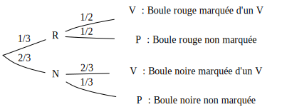
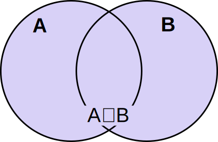

[pdf](./3_probas_conditionnelles.pdf)

# Probabilités conditionnelles

## 1. Rappels sur les probabilités



Lorsqu'on rencontre un phénomène _aléatoire_ (appelé _expérience_) on définit des _événéments_ (ensembles de _résultats possibles_).

On mesure la _probabilité_ d'un événement comme étant la chance qu'il se réalise.

Si tous les résultats ont la même probabilité d'apparaître (_équiprobabilité_) alors la probabilité d'un 
événement $A$ est $$P(A) = \dfrac{\text{Nombre d'issues de} A}{\text{Nombre total d'issues}}$$

* Les probabilités sont comprises entre 0 et 1.
* Le complémentaire de $A$, noté $\bar{A}$ vérifie $P(\bar{A}) = 1 - P(A)$.



---

## 2. Notion de probabilité conditionnelle

#### Définition 



Soit $A$ et $B$ deux événements avec $P(A) \neq 0$.
On appelle **probabilité conditionnelle** de $B$ sachant $A$ la probabilité que l'événement $B$
se réalise sachant que l'événement $A$ est réalisé. Elle est notée $P_A(B)$ et est définie par : 
$$P_A(B) = \dfrac{P(A \cap B)}{P(B)}$$



#### Exemple

Considérons une urne contenant 30 boules donc 10 sont rouges et 20 sont noires.

* 5 boules rouges sont marquées d'un "V".
* 15 boules noires sont marquées d'un "V".
* Les autres boules ne sont pas marquées.

On prélève une boule au hasard dans l'urne.

* On note "V" l'événement : "La boule est marquée d'un 'V'",
* On note "P" l'événement : "La boule n'est pas marquée d'un 'V'",
* On note "R" l'événement : "La boule est rouge",
* On note "N" l'événement : "La boule est noire".

1. **Quelle est la probabilité que La boule soit marquée sachant qu'elle est rouge ?**

    

    Ainsi $R \cap V$ désigne l'événement : "La boule est rouge et est marquée d'un 'V'".

    La probabilité de $R$ est $P(R) = \dfrac{10}{30} = \dfrac{1}{3}.$

    La probabilité de $R \cap V$ est $\dfrac{5}{30} = \dfrac{1}{6}.$

    La probabilité de l'événement : "La boule est marquée sachant qu'elle est rouge" est :

    $$P_R(V) = \dfrac{P(R \cap V)}{P(V)} = \dfrac{\frac{1}{6}}{\frac{1}{3}} = \frac{3}{6} = \frac{1}{2}$$

    _On peut aussi inverser la condition :_ 
    

2. **Quelle est la probabilité que la boule soit rouge sachant qu'elle est marquée ?**

    

    Il nous faut calculer la probabilité que la boule soit marquée : $P(V) = \dfrac{5+15}{30}=\dfrac{2}{3}.$

    La probabilité de l'événement : "La boule est rouge sachant qu'elle est marquée" est :

    $$P_V(R) = \dfrac{P(R \cap V)}{P(R)} = \dfrac{\frac{1}{6}}{\frac{2}{3}} = \frac{3}{12} = \frac{1}{4}$$
    

#### Propriété



Si $P(A) \neq 0$ alors $P(A \cap B) = P(A) P_A(B)$



---

## 3. Arbre pondéré

#### Exemple


En reprenant l'exemple précédent, qu'on peut résumer ainsi :






#### Propriété


La somme des branches issues d'un même noeud vaut 1.

Par exemple, en partant du noeud $N$ on a $P_N(V) + P_N(P) = \dfrac{2}{3} + \dfrac{1}{3}$.


#### Commentaires

* Le noeud tout à gauche représente l'univers tout entier : toutes les issues possibles.

* On indique _les probabilité conditionnelles_ des événements issue d'un noeud.

* Généralement l'énoncé permet de construire _un_ arbre probabilisé...\newline
    Mais _il en existe toujours deux_ : selon qu'on conditionne par un critère (la couleur) ou l'autre (être marqué d'un "V").

#### Propriété



La probabilité d'une feuille (extrémité d'un chemin) est égale au produit des probabilités des branches menant à cette feuille.


Ainsi, $P(N \cap V) = \dfrac{2}{3} \times \dfrac{2}{3} = \dfrac{4}{9}$.


#### Formule des probabilités totales



La probabilité d'un événement apparaissant dans plusieurs feuilles est la somme des probabilités
de ces feuilles.


Par exemple, $P(P) = P(R \cap P) + P(N \cap P) = \dfrac{1}{3} \times \dfrac{1}{2} + \dfrac{2}{3} \times \dfrac{1}{3} = \dfrac{1}{6} + \dfrac{2}{9} = \dfrac{7}{18}$


* On repère toutes les feuilles associées à l'événement.
* On calcule la probabilité de chacune
* On ajoute. Et voilà !

---

## 4. Indépendance

_L'indépendance est une notion fondamentale qui permet de simplifier des situations complexes. Elle mesure l'influence d'un phénomène sur un autre._

### Définition



Deux événements $A$ et $B$ de probabilité non nulle sont _indépendants_ si $P_A(B) = P(B)$.


Réciproquement, $A$ et $B$ sont _indépendants_ si $P_B(A) = P(A)$.


#### Intuition

Certains événements sont "intuitivement indépendants" comme "j'arrive à l'heure au lycée" et "la prochaine personne que je croise est un homme". Il n'y aucune _influence_ de mon trajet sur la probabilité de rencontrer des hommes ou des femmes.

Par contre, d'autres ont "intuitivement" une influence l'un sur l'autre comme "il neige aujourd'hui" et "j'arrive à l'heure au lycée". S'il neige, le bus (ou mon train) risque plus souvent d'être en retard.

#### Exemple : l'urne


En reprenant l'exemple précédent, on a $P(P) = \dfrac{7}{18}$ et $P_R(P) = \dfrac{1}{6}$. 

$\dfrac{1}{6} \neq \dfrac{7}{18}$, les événements "Tirer une boule rouge" et "Tirer une boule non marquée" ne sont pas indépendants.

Il y a une influence de l'apparition de la _couleur_ sur l'apparition d'une boule _marquée ou non_.


#### Exemple : les cartes

On considère un jeu de 32 cartes.[^1] On tire une carte au hasard.

On note $A$ l'événement : "Tirer un as" et $P$ l'événement : "Tirer un pique".

Ces événements sont-ils indépendants ?


* $P(A) = \dfrac{4}{32} = \dfrac{1}{8}$
* $P_P(A) = \dfrac{P(A \cap P)}{P(P)} = \dfrac{\dfrac{1}{32}}{\dfrac{8}{32}} = \dfrac{1}{8}$

Ces événements sont indépendants.


Il n'y a pas d'influence de la _couleur_ sur le fait d'avoir ou non un as.

#### Exemple : les cartes, mais je triche

Imaginons maintenant que je triche et laisse l'As de carreau dans la boite... 

Posons-nous la même question : $A$ et $P$ sont-ils indépendants ?


* $P(A) = \dfrac{3}{31}$
* $P_P(A) = \dfrac{P(A \cap P)}{P(P)} = \dfrac{\dfrac{1}{31}}{\dfrac{8}{31}} = \dfrac{1}{8}$

$\dfrac{3}{31} \neq \dfrac{1}{8}$ donc les événements $A$ et $P$ ne sont pas indépendants.


#### Indépendance $\neq$ incompatible



* indépendant = pas d'influence : $P(A \cap B) = P(A) \times P(B)$
* incompatible = l'intersection est impossible : $P(A \cap B) = 0$



Par exemple, les événements "j'arrive à l'heure" et "mon reveil n'a pas sonné" sont _incompatibles_. 

[^1]: Un jeu de 32 cartes comporte 4 couleurs (pique, coeur, carreau, trefle) qui comportent chacune 8 cartes : 7, 8, 9, 10, Valet, Dame, Roi, As.

---
## 5. Utiliser l'indépendance

#### Exemple 

Une chaîne d'assemblage produit des pièces qui peuvent avoir un défaut $A$ ou un défaut $B$.

On prélève une pièce au hasard à l'issue de la production.

On note $A$ : "Avoir un défaut A" et $B$ : "Avoir un défaut B".

**On suppose que les événements $A$ et $B$ sont indépendants.**

On a mesuré que la probabilité du défaut $A$ est $\dfrac{1}{1000}$ et celle du défaut $B$ est $\dfrac{1}{2000}$.

1. Quelle est la probabilité qu'une pièce présente les deux défauts ?
2. Quelle est la probabilité qu'une pièce présente au moins un défaut.



1. On veut calculer $P(A \cap B)$.

    $P(A \cap B) = P(A) \times P_A(B) = P(A) \times P(B)$ car $A$ et $B$ sont indépendants.

    $P(A \cap B) = 0.001 \times 0.0005 = 0.000005$.

    

2. On veut calculer $P(A \cup B)$. Utilisons $P(A \cup B) = P(A) + P(B) - P(A \cap B)$

    $P(A \cup B) = 0.001 + 0.0005 - 0.000005 = 0.0014995$

    

