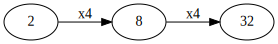
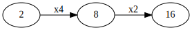
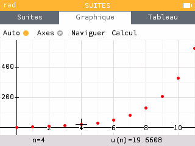
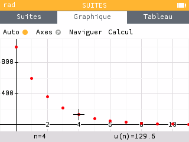
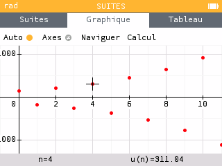
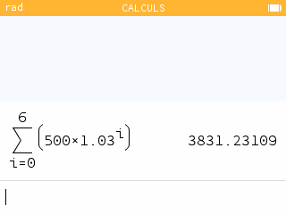
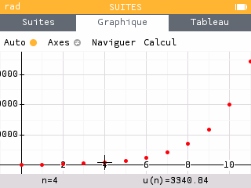

# Suites géométriques

## 1. Termes consécutifs 

$2, 8, 32$ sont-ils trois termes consécutifs d'une suite géométrique ?




 Pour répondre on calcule les quotients $\dfrac{8}{2} = 4$ et $\dfrac{32}{8} = 4$. La réponse est oui, ce sont trois termes consécutifs d'une suite géométrique de raison $q = 4$.

 



 Lorsque ces quotients sont différents (comme pour 2, 8 et 16) alors ce ne sont pas trois termes consécutifs d'une suite géométrique.

 



---

## 2. Définition & formule explicite

### Définition



Une suite $(v_n)$ vérifiant $v_{n+1} = q v_{n}$ est géométrique de raison $q$.

La raison doit être _constante_ (indépendante de $n$).



#### Démontrer qu'une suite est géométrique

On l'a vu, pour démontrer qu'une suite _n'est pas géométrique_, il suffit de le vérifier sur trois termes.


Mais pour **démontrer qu'une suite est géométrique, il faut le faire pour tous les termes**.


Considérons $v_n = 7 \times 4^n$. Prouvons qu'elle est géométrique.


On peut vérifier que les trois premiers termes progressent géométriquement : $v_0 = 7, v_1 = 28, v_2 = 112$ qui progressent avec un facteur $q=4$.

Prouvons le :

$v_{n+1} = 7 \times 4^{n+1}$ et 

$$\dfrac{v_{n+1}}{v_n} = \dfrac{7 \times 4^{n+1}}{7 \times 4^n} = \dfrac{4^n \times 4}{4^n} = 4 \Longrightarrow v_{n+1} = 4 v_n$$

$(v_n)$ est une suite géométrique de raison $4$.


### Formule explicite



Si $(v_n)$ est une suite géométrique de raison $q$ alors, pour tout $n \in \mathbb{N}$, on a : $v_n = v_0 q^n$.


Par exemple, si $v_{n+1} = 0.5 v_n$ et $v_0=17$, on a $v_n = 17 \times 0.5^n$.


#### Réciproque



Toute suite dont le terme général s'écrit sous la forme $v_n = v_0 q^n$ est géométrique de raison $q$.



#### Exemple

On a placé un capital de 1000€ en 2010 sur un compte bloqué rapportant 1.5% d'intérêts composés annuels [^1].

1. Exprimer la relation entre le capital à l'année $n$ et celui à l'année $n+1$.
2. Calculer le montant en 2022.



1. D'une année $n$ à la suivante, le capital est augmenté de 1.5%. Il est donc multiplié par 1.015. On a donc $v_{n+1} = 1.015 v_n$. C'est une suite géométrique de raison $1.015$.

    On a aussi $v_n = 1000 \times 1.015^n$
2. En 2022, 12 ans se sont écoulés depuis le placement. Il y aura donc $1000 \times 1.015^{12} \approx 1195.62$ €.


[^1]: Les _intérêts composés_ génèrent des intérêts. D'une année à l'autre le capital est augmenté par les intérêts avant de calculer les intérêts de l'année suivante. Ce n'est pas le cas des _intérêts simples_ où les intérêts sont fixes.

---

## 3. Représentation graphique

_Lorsqu'on représente une suite on place en abscisse (horizontal) les indices et en ordonnée (vertical) les valeurs._


#### Représenter une suite sur la Numworks

Par exemple avec $u_3$ et $u_{n+1} = 1.6 \times u_n$.

Menu **Suites**, ajouter une suite, **Récurrente d'ordre 1**, $u_{n+1} = 1.6 \times u_{n}$



#### Cas d'une raison entre plus grande que 1


Lorsque la raison d'une suite géométrique est plus grande que 1, les termes _divergent_ rapidement vers $+\infty$.


Lorsqu'on trace les termes d'une suite géométrique on remarque une _progression exponentielle_.

#### Cas d'une raison entre 0 et 1


Lorsque la raison d'une suite géométrique est entre 0 et 1, les termes _convergent_ rapidement vers 0.

Par exemple pour $v_n = 1000 \times 0.6^n$


#### Cas d'une raison négative


Lorsque la raison est négative, les valeurs de la suite géométrique changent de signe à chaque terme.

Par exemple pour $v_n = 150 \times (-1.2)^n$


### Variations


Si $(v_n)$ est géométrique de raison $q$ et de premier terme $v_0$

* si $v_0 > 0$ et $q > 1$ la suite $(v_n)$ est _croissante_,
* si $v_0 > 0$ et $0< q < 1$ la suite $(v_n)$ est _décroissante_,
* Les autres cas ne sont pas à retenir.


---

## 4. Somme des termes consécutifs d'une suite géométrique

#### Propriété



La somme $S_n$ des termes consécutifs d'une suite géométrique 

$$S_n = v_0 + v_1 + \cdots + v_n = \sum_{k=0}^n v_k = v_0 \dfrac{1 - q^{n+1}}{1-q}$$



#### Exemples

1. Calculer la somme des 10 premiers termes de la suite géométrique de raison 2 et de premier terme 5.
2. Chaque début d'année on place un capital de 500€ sur un compte à intérêts composés avec un taux annuel de 3%. Calculer le capital après 7 ans.


**Réponses**

1. Les _dix_ premiers termes donc pour $k$ allant de 0 à **9** (_vérifiez en comptant sur vos doigts à partir de 0_)

    On applique la formule et 
    $$S =  \sum_{k=0}^{9} 5 \times 2^k = 5 \times \dfrac{1 - 2^{10}}{1-2} = 5 \times 1023 = 5115$$
2. Attention ! Contrairement à l'exemple bancaire précédent, cette fois on _place de l'argent tous les ans._
    
    Le capital _total_ ne suit plus une progression géométrique.

    On considère $v_n$ _la valeur acquise pour 500€ placés après $n$ années_.

    $v_n$ est une suite géométrique de raison 1.03 (intérêts composés) et de premier terme 500.

    Donc $v_n = 500 \times 1.03 ^ n$

    * Le premier versement reste placé 7 ans, donc rapporte $v_7 = 500 \times 1.03 ^ 7$
    * Le second versement reste placé 6 ans, donc rapporte $v_6 = 500 \times 1.03 ^ 6$
    * $\cdots$
    * Le sixième versement reste placé 2 ans, donc rapporte $v_2 = 500 \times 1.03 ^ 2$
    * Le septième versement reste placé 1 an, donc rapporte $v_1 = 500 \times 1.03 ^ 1$

    Après 7 années, le capital est donc 

    $$v_0 + v_1 + \cdots v_6 = \sum_{k=0}^6 v_k = \sum_{k=0}^6 500 \times 1.03^k = 500 \dfrac{1 - 1.03^7}{1-1.03} = 3831.23\text{€}$$


#### Calculer une somme sur la Numworks

On reprend le dernier exemple :


Menu **Calculs**, touche **Paste**, choisir **Analyse** puis **Somme** et saisir :



---

## Résumé

| **Résumé** | Cours                                                         | Exemple                                         |
|------------|---------------------------------------------------------------|-------------------------------------------------|
| Définition | $(v_n)$ géométrique                                           | $q=1.7$, $v_0=400$                              |
|            | - de raison $q$,                                              |                                                 |
|            | - de premier terme $v_0$                                      |                                                 |
| Propriété  | $v_{n+1} = q \times v_n$                                      | $v_{n+1} = 1.7 \times v_n$                      |
| Variations | Si $q>1$ et $v_0 >$ $(v_n)$ est croissante                    | $q=1.7>1$ et $v_0 >0$                           |
|            | Si $q \in ]0, 1[$ et $v_0 > 0$, $v$ est décroissante          | La suite est croissante                         |
| Somme      | $S = v_0 \times \dfrac{1 - q^{n+1}}{1-q}$                     | $v_0+\cdots+v_9 = 400\dfrac{1-1.7^{10}}{1-0.7}$ |
| Graphe     | Les points de la représentation graphique ne sont pas alignés |                                                 |
|            | On parle de croissance exponentielle                          |        |
