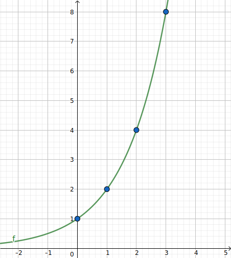
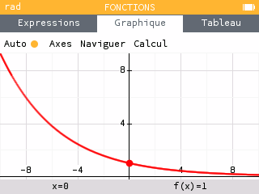
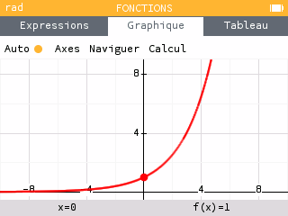
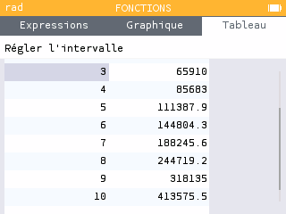
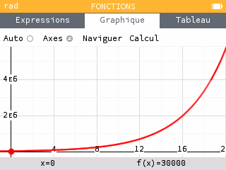

[pdf](./5_fonction_exponentielle.pdf)

# Fonctions exponentielles

## 1. Définition & propriétés

#### Introduction

On considère la suite géométrique de raison $a$, définie par $u_n=a^n$.
Elle est définie pour tout $n \in \mathbb{N}$.
On peut prolonger son ensemble de définition à $\mathbb{R}$ tout entier avec $f(x)=a^x$.

On peut ainsi donner une image à des nombres non entiers comme 3.5.

#### Définition

La fonction $f,$ définie sur $\mathbb{R}$ avec $a>0$ est la **fonction exponentielle de base $a$**.

#### Exemple

La fonction exponentielle de base 2 est définie par $f(x)=2^x$.

#### Propriétés algébriques

* La fonction exponentielle de base $a$ est toujours positive.

* Pour tout $x$ dans $\mathbb{R}$, $a^{-x}=\dfrac{1}{a^x}$.
* $a^0 = 1$, $a^1=a$
* $a^{x+y} = a^x \times a^y$
* $a^{x-y} = \dfrac{a^x}{a^y}$
* $(a^{x})^y = a^{xy}$

---

## 2. Variations

##### Si $0 < a < 1$, $x \mapsto a^x$ est décroissante sur $\mathbb{R}$

##### Si $a > 1$, $x \mapsto a^x$ est croissante sur $\mathbb{R}$

---

## 3. Utiliser une fonction exponentielle

#### Hz. capitale du monde

La population d'Hz. cesse de croitre ! L'attrait indéniable de son lycée
en fait une des villes les plus attractives du monde.

Suite à des relevés très précis, le maire décide de modéliser la population
d'Hz. avec la fonction exponentielle $f(x) = 30000 \times 1.3^x$ où $x$ est
le nombre d'année après 2020.

1. Quel est le sens de variation de la population d'apèrs ce modèle ?
1. Calculer la population d'Hz. en 2021, en 2022
2. Calculer les valeurs successives jusqu'à dépasser $100~000$ habitants puis $1~000~000$

Hz. en force !

1. La fonction exponentielle de base 1.3 est croissante, multiplier par $30~000$ ne change
    pas les variations donc la population est croissante.
1. En 2021, la population d'Hz. s'élève à $f(1) = 30000 \times 1.3^1 = 39000$

    En 2022, la population s'élève à $f(2) = 30000 \times 1.3^2 = 50700$

2. En zappant quelques valeurs intermédiaires on a :

    | $x$ |      $f(x)$ |
    |-----|------------:|
    | 4   |    $85~683$ |
    | 5   |   $111~388$ |
    | ... |         ... |
    | 13  |   $908~626$ |
    | 14  | $1~181~213$ |

    La population d'Hz. dépassera $100~000$ en 2025 et un million en $2034$.

    
    

_Ce modèle, totalement irréalise, illustre une propriété de la fonction exponentielle de base $a>1$ :
elle explose rapidement vers l'infini !_

#### Les bactéries inarrétables

Le nombre de bactéries présentes dans un organisme suite à une infection est modélisé par $f(x) = 50000 \times 1.5^x$ où $x$ est en heures.

1. Donner un arrondi au millier du nombre de bactéries après 30 minutes et après 1h30
2. Déterminer les variations de $f$ sur [0; 10]
3. Déterminer le temps nécessaire pour que la population double.

**Réponses**

1. Après 30 minutes, soit 0.5 heures, le nombre de bactéries est $f(0.5) = 61000$ environ.

    Après 1h30, soit 1.5 heures, le nombre de bactéries et de $f(1.5) = 92000$ environ.

2. La fonction exponentielle de base $1.5$ est croissante donc $f$ aussi.
3. On a remarqué que $f(1.5)$ est presque le double de 50000.

    Essayons $f(2) = 111000$ environ et $f(1.71) = 100000$ environ.

    Il faut donc 1.7 heures = 1h et $0.7 \times 60$ minutes, soit 1h42 pour doubler la population (environ...)

_Cette modélisation est beaucoup plus réaliste. Elle peut durer jusqu'à une infection complète de l'hôte._

## 4. Taux d'évolution moyen

Les fonctions exponentielles permettent de modéliser facilement des accélérations.

#### Exemple

Entre 2012 et 2015, le prix du gaz a augmenté de 25%. Calculer le taux d'évolution annuel moyen.

Notons $t$ ce taux, le coefficient multiplicateur d'une augmentation annuelle est $1 + \dfrac{t}{100}$.

Le coefficient multiplicateur de trois augmentations successives est 

$$\left(1+\dfrac{t}{100}\right)\left(1+\dfrac{t}{100}\right)\left(1+\dfrac{t}{100}\right) = \left(1+\dfrac{t}{100}\right)^3$$

Une augmentation de 25% correspond à un coefficient multiplicateur de 1.25 donc on peut 
poser une équation :

$$\left(1+\dfrac{t}{100}\right)^3 = 1.25 \Longleftrightarrow 1 + \dfrac{t}{100} = 1.25^{\frac{1}{3}}$$
$$\Longleftrightarrow \dfrac{t}{100} = 1.25^{\frac{1}{3}} - 1 \Longleftrightarrow t = 100 \times (1.25^{\frac{1}{3}} - 1)$$
$$\Longleftrightarrow t \approx 7.72%$$

Le prix du gaz a augmenté d'environ $7.72%$ par an entre 2012 et 2015.

#### Remarque

On a utilisé la formule suivante :

Pour tout $a>0$ et $x>0$, on a $a^n=x \Longleftrightarrow a = x^{\frac{1}{n}}$

$x^{\frac{1}{n}}$ est la racine énième de $x$.
