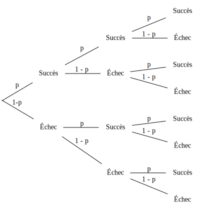
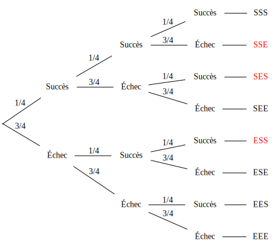
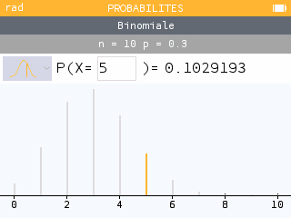
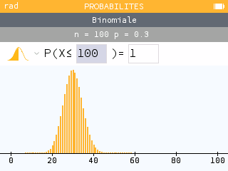
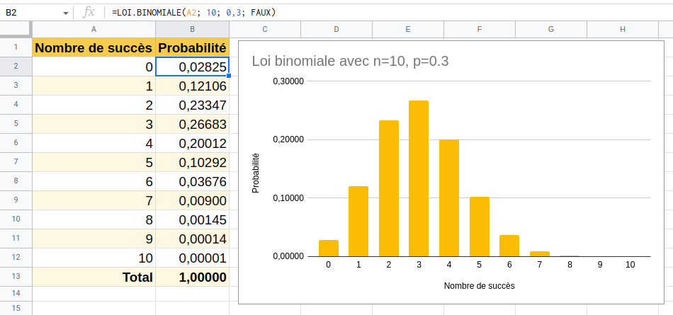
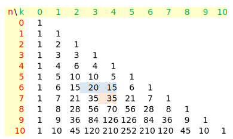

[pdf](./6_variables_aleatoires_loi_binomiale.pdf)

# Variables aléatoires, Loi binomiale

## 1. Espérance d'une variable aléatoire

#### Définition



L'espérance d'une variable aléatoire est la moyenne que l'on peut espérer si l'on répète
l'expérience un grand nombre de fois.



#### Formule



L'espérance d'une variable aléatoire $X$ est :

$$E(x) = x_1 P(X=x1) + x_2 P(X=x2) + \cdots + x_n P(X=xn) = \sum_{i=1}^n x_i P(X = x_i)$$




#### Exemple

On lance un dé. 

* Si tire un 6, on gagne 10€.
* Si on tire un 5 on gagne 3€.
* Sinon, on perd 2€.

On note $G$ la variable correspondant au gain (positif ou négatif) du joueur.

1. Déterminer la loi de probabilité de la variable aléatoire $G$.
2. Calculer l'espérance de $G$. Ce jeu est-il profitable au joueur ?


**Réponses**

1. Les faces sont _équiprobables_, on peut leur associer un gain et une probabilité :

    | Face  | 1              | 2              | 3              | 4              | 5              | 6              |
    |-------|----------------|----------------|----------------|----------------|----------------|----------------|
    | Gain  | -2             | -2             | -2             | -2             | 3              | 10             |
    | Proba | $\dfrac{1}{6}$ | $\dfrac{1}{6}$ | $\dfrac{1}{6}$ | $\dfrac{1}{6}$ | $\dfrac{1}{6}$ | $\dfrac{1}{6}$ |

    On peut maintenant regrouper les valeurs du gain :

    | Gain  | -2             | 3              | 10             |
    |-------|----------------|----------------|----------------|
    | Faces | 1, 2, 3, 4     | 5              | 6              |
    | Proba | $\dfrac{4}{6}$ | $\dfrac{1}{6}$ | $\dfrac{1}{6}$ |

    Résumons :

    Lorsqu'on joue à ce jeu, on a 4 chances sur 6 de perdre 2€, 1 chance sur 6 de gagner 3€ et 1 chance sur 6 de gagner 10€.

2. Pour calculer l'espérance du gain $E(G)$ on applique la formule :

    $$E(G) = -2 \times \dfrac{4}{6} + 3 \times \dfrac{1}{6} + 10 \times \dfrac{1}{6} = \dfrac{-8 +3 + 10}{6} = \dfrac{5}{6} \text{€}$$

    En moyenne le joueur gagne $\dfrac{5}{6}$€ par partie. L'espérance du gain est _positive_ donc le jeu est profitable au joueur.



---

## 2. Schéma de Bernoulli et Loi Binomiale

### 1. Épreuve de Bernoulli



Une _épreuve de Bernoulli_ est une épreuve aléatoire qui présente deux issues possibles. On les appelle "Succès" et "Échec".
On note $p$ la probabilité du succès.



#### Exemples


* Lancer une pièce : succès Pile, échec Face, $p=0.5$
* Lancer un dé **et regarder si l'on tire 6 ou autre chose** : succès 6, échec le reste, $p=\dfrac{1}{6}$
* Lancer un dé **et regarder si la face est 1, 2 ou autre chose** : succès 1 ou 2, échec le reste, $p=\dfrac{1}{3}$

Par contre :

* Lancer un dé **et regarder la face** _n'ést pas une épreuve de Bernoulli_ ! Il y a 6 résultats possibles et non 2.


### 2. Schéma de Bernoulli



Un _schéma de Bernoulli_ est la répétition de $n$ épreuves de Bernoulli _identiques_ (la même expérience aléatoire) et _indépendantes_ (sans influence l'une sur l'autre)
de probabilité de succès $p$.


Il faut donc 2 paramètres pour définir un schéma de Bernoulli : le nombre de répétitions $n$ et la probabilité du succès $p$.


#### Exemple


On lance $100$ fois une pièce équilibrée : c'est un schéma de Bernoulli avec $n=100$ et $p=0.5$.


### 3. Loi binomiale



On réalise un schéma de Bernoulli composé de $n$ épreuves de Bernoulli de probabilité de succès $p$.

La **loi binomiale** donne la probabilité d'obtenir $k$ succès, pour $k$ entier entre 0 et $n$.



#### Exemple


On lance 20 fois un dé équilibré et on regarde si la face est un 6.

* C'est un schéma de Bernoulli.
* $n=20$ et $p=\dfrac{1}{6}$

La loi binomiale va nous donner la probabilité d'obtenir 0 six, 1 six, 2 six, \ldots, jusque 20 six.


#### Notation


On note $B(n, p)$ la loi binomiale de paramètres $n$ et $p$.



#### Exemple avec 3 répétitions


On représente l'arbre de probabilité d'un schéma de Bernoulli avec $n=3$ et $p$ quelconque.

$X$ est la variable aléatoire qui compte les succès. $X$ suit la loi binomiale $B(n, p)$.




Nous allons compter les succès rencontrés aux extrémités de chaque branche (_les feuilles_).

De haut en bas : 3 succès, 2, 2, 1, 2, 1, 1, 0.


On peut calculer la probabilité de chaque feuille, par exemple : 

* $P(\text{Succès, Succès, Succès}) = p \times p \times p = p^3$
* $P(\text{Succès, Échec, Succès}) = p \times (1 - p) \times p = p^2(1 - p)$
* $P(\text{Échec, Succès, Succès}) = (1 - p) \times p \times p = p^2(1 - p)$


On remarque que l'ordre n'a pas d'importance, seul compte le _nombre de succès_.

Résumons


| $k$               | 0         | 1           | 2           | 3     |
|-------------------|:---------:|:-----------:|:-----------:|:-----:|
| Nombre de chemins | 1         | 3           | 3           | 1     |
| $P(X = k)$        | $(1-p)^3$ | $3p(1-p)^2$ | $3p^2(1-p)$ | $p^3$ |


#### Exemple 2

On tire une carte au hasard parmi 4. L'une d'entre elle est un As et est gagnante, les autres sont perdantes.

On joue trois fois à ce jeu. Déterminer la probabilité de gagner exactement deux fois.



* Tirer une carte est une épreuve de Bernoulli de probabilité de succès $p=\dfrac{1}{4}$,
* On répète 3 fois de manière identique et indépendante cette expérience : c'est un schéma de Bernoulli avec $n=3$ et $p=\dfrac{1}{4}$,
* On note $X$ la variable aléatoire qui compte les succès. $X$ suit la loi $B\left(3, \dfrac{1}{4}\right)$.
* La probabilité de gagner 2 fois est donnée par $P(X = 2)$


En rouge les feuilles avec 2 succès exactement. À nouveau il y en a 3.

La probabilité de gagner deux fois à ce jeu est donc $P(X = 2) = 3 \times \left(\dfrac{1}{4}\right)^2 \times \dfrac{3}{4} = \dfrac{9}{64}$.




### 4. Calculatrice et tableur

#### Numworks

Lorsqu'on répète les tirages plus de trois fois, il n'est pas commode de dessiner l'arbre. Il existe des formules permettant de généraliser
mais nous allons utiliser la calculatrice.

On note $X$ une variable aléatoire qui suit $B(10, 0.3)$. Déterminer $P(X = 5)$.


Menu **Probabilités**, choisir **Binomiale**, saisir $n=10$ et $p=0.3$, **Suivant**. 


Aller à gauche sur la **courbe orange** et choisir le **trait** (pas les zones complètes.)

C'est le menu pour calculer $P(X = k)$ saisir **$5$**.



On lit que $P(X=5) \approx 0.103$.

### 5. Allure de la loi binomiale

On peut remarquer quelques propriétés de la figure figure précédentes, elles sont vraies pour toutes les 
loi binomiales.


Voici par exemple ce qu'on obtient pour $n=100$ et $p=0.3$.




* On reconnait une _cloche_ (ça monte et ça descend)
* Les "valeurs centrales" ont une probabilité plus élevées que les valeurs extrêmes.
    Intuitivement, lorsqu'on fait 100 parties de pile ou face, il est plus probable d'obtenir 50 piles que 0 pile.


Essayez d'autres valeurs de $p$ avec $n=100$.

Comment se déplace la cloche lorsque $p$ est proche de 0 ? Proche de 1 ?

#### Tableur

Le tableur permet aussi de représenter facilement la loi binomiale. Par exemple pour $B(10, 0.3)$





On commence par écrire les titres des colonnes, puis remplir la colonne $A$ avec le nombre de succès
allant de $0$ à $n$.

Ensuite on saisit la formule en cellule $B2$

```excel
=LOI.BINOMIALE(A2; 10; 0,3; FAUX)
``` 

et on étire cette formule.

Enfin on insère un graphique et on choisit le diagramme en bâtons s'il n'est pas proposé par défaut.

La syntaxe de cette formule varie un peu d'un modèle de tableur à l'autre (Excel, Libre Office etc.)


### 7. Espérance de la loi binomiale

##### Espérance



L'espérance d'une variable aléatoire $X$ qui suit une loi binomiale $B(n, p)$ est donnée par $E(X) = n \times p$



#### Exemple 1

On joue 100 parties de pile ou face avec un pièce truquée dont la probabilité de faire Face est 0.4


En moyenne, on aura $100 \times 0.3 = 30$ faces.


#### Exemple 2

Un QCM comporte 10 questions. Chaque question comporte exactement une bonne réponse. On répond au hasard.

Combien de points peut-on espérer ?


Soit $X$ la variable aléatoire comptant les bonnes réponses. Elle suit une loi binomiale de paramètres $n=10$
et $p=0.25$.

Son espérance est $E(X) = 10 \times 0.25 = 2.5$. On peut espérer 2.5 points en moyenne.


---

## 3. Coefficients binomiaux


### 1. Combinaisons 

#### Définition



On note $\binom{n}{k}$ le nombre de branches menant à $k$ succès dans un arbre probabilisé représentant un schéma de Bernoulli avec $n$ répétitions.

Ce nombre est appelé "Combinaisons de $k$ parmi $n$".



#### Exemple


Dans les exemples précédents on a vu que $\binom{3}{0} = 1, \binom{3}{1} = 3, \binom{3}{2} = 3, \binom{3}{3} = 1$


### Propriétés



* $\binom{n}{0} = \binom{n}{n} = 1$ : il y a toujours 1 seul chemin qui mène à 0 succès ou à $n$ succès.
* $\binom{n}{1} = \binom{n}{n - 1} = n$ : il y a toujours n chemins qui mènent à $1$ succès ou à $n - 1$ succès.



#### Calculatrice Numworks

Menu **calculs**, touche **paste**, choisir **probabilités**, puis **Dénombrement**, $\binom{n}{k}$

### 2. Triangle de Pascal

On peut représenter les coefficients binomiaux d'une manière pratique et qui permet de les retrouver facilement.




En _ligne_, les valeurs de $n$, en _colonne_ celles de $k$.

On remarque que $20 + 15 = 35$ soit  $\binom{6}{3} + \binom{6}{4} = \binom{7}{4}$.

Cette propriété est vraie pour tout $n$ et tout $k$, à condition de supposer que les cases vides valent 0.


#### Propriété du triangle de Pascal

$$\text{Pour tout } n \text{ et tout } k \leq n, \text{ on a } \binom{n}{k} + \binom{n}{k + 1} = \binom{n+1}{k+1}$$

### 3. Calculer une probabilité de la loi binomiale

On peut maintenant citer la formule générale :

#### Propriété



Soit une variable aléatoire $X$ qui suit une loi binomiale $B(n, p)$, on a :

$$P(X=k) = \binom{n}{k} p^k (1-p)^{n - k}$$



#### Exemple

On considère une urne contenant 5 boules blanches et 3 boules noires.
L'expérience consiste à prélever une boule, examiner sa couleur _et la remettre dans l'urne_.

On répète cette expérience 6 fois.

Calculer la probabilité d'avoir exactement 4 boules blanches.



Notons $X$ la variable aléatoire qui compte le nombre de boules blanches.
La probabilité d'un succès est $\dfrac{5}{8}$.

L'expérience étant un schéma de Bernouilli, $X$ suit une loi binomiale $B\left(6, \dfrac{5}{8}\right)$.

La probabilité d'avoir 4 boules blanches est :

$$P(X=4) = \binom{6}{4} \left(\dfrac{5}{8}\right)^4\left(1 - \dfrac{5}{8}\right)^{6-4}$$
$$P(X=4) = \binom{6}{4} \left(\dfrac{5}{8}\right)^4\left(\dfrac{3}{8}\right)^{2}$$


D'après le triangle de Pascal donné plus haut, $\binom{6}{4} = 15$, donc

$$P(X=4) = 15 \left(\dfrac{5}{8}\right)^4\left(\dfrac{3}{8}\right)^{2} = \dfrac{84~375}{262~144} \approx 0.322$$




