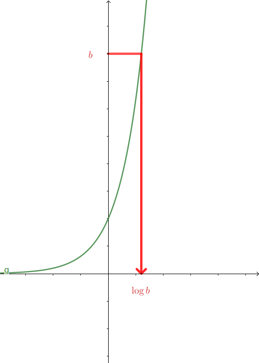
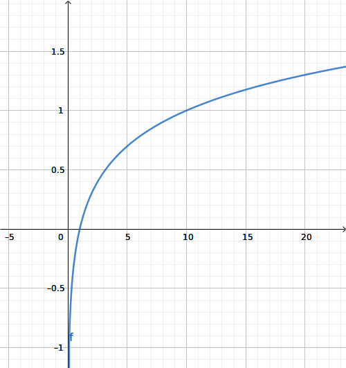

[pdf](./7_fonction_logarithme_decimal.pdf)

# Fonction logarithme décimal

## 1. Définition et propriétés


Soit la fonction $g$ définie sur $\mathbb{R}$ par $g(x) = 10^x$.

L'équation $10^x = b$, avec $b > 0$ admet une unique solution dans $\mathbb{R}$

Cette solution se note $\log b$.


#### Définition



On appelle **logarithme décimal** d'un réel strictement positif $b$, l'unique solution de l'équation $10^x=b$.

On la note $\log b$.

La **fonction logarithme décimal** est définie sur $]0;+\infty[.$



#### Propriétés



1. Pour tout $b > 0$, $10^x=b \Longleftrightarrow x = \log b$
2. $\log 10^x = x$
3. $10^{\log x} = x,$ pour tout $x > 0$



---

## 2. Représentation graphique



La fonction logarithme décimal est croissante sur $]0; +\infty[$




#### Valeurs remarquables



$\log 1 = 0$, $\log 10 = 1$, $\log \dfrac{1}{10}=-1$



## 3. Propriétés algébriques

#### Le logarithme transforme les produits en somme



Pour tout $a > 0$ et $b > 0$ on a : $\log(ab)=\log(a) + \log(b)$



#### Exemple

Simplifier $A = \log(2 - \sqrt{2}) + \log(2 + \sqrt{2})$


$$A = \log(2 - \sqrt{2}) + \log(2 + \sqrt{2}) = \log\left( (2-\sqrt{2})(2+\sqrt{2})  \right)$$

$$A = \log\left( 2^2 -\sqrt{2}^2  \right) = \log(4 - 2) = \log(2)$$

#### Le logarithme transforme les quotients en soustraction



Pour tout $a > 0$ et $b > 0$ on a : $\log\left(\dfrac{a}{b}\right) = \log(a) - \log(b)$



#### Exemple

Simplifier $B = \log(50) - \log(10)$.


$$B = \log(50) - \log(10) = \log\left( \dfrac{50}{10} \right) = \log\left( 5 \right)$$


#### Le Logarithme "sort" les puissances



Pour tout $a > 0$ et $n \in \mathbb{R}$, on a $\log (a^n) = n \log (a)$



#### Exemple

Simplifier $C = 2 \log 5 - 4 \log 3 + \log 2$


$$C = 2 \log 5 - 4 \log 3 + \log 2 = \log 5^2 - \log 3^4 + \log 2$$

$$C =\log \left( \dfrac{5^2 \times 2}{3^4} \right) = \log\left( \dfrac{50}{81} \right)$$


## 4. Équations et inéquations

Le logarithme permet de résoudre certaines équations et inéquations.

1. Résoudre $5^x=33$
2. Résoudre dans $]0; +\infty[$ l'inéquation $x^4 < 12$
3. 5 évolutions successives de $t$% correspondent à une augmentation de 25%. Déterminer le taux moyen.

**Réponses**

### 1. Résoudre $5^x=33$


On applique le $\log$ à gauche et à droite :

$$5^x = 33 \Longleftrightarrow \log(5^x) = \log(33) \Longleftrightarrow x\log(5) = \log(33) \Longleftrightarrow x = \dfrac{\log(33)}{\log(5)}$$


### 2. Résoudre dans $]0; +\infty[$ l'inéquation $x^4 < 12$


On applique le $\log$ de chaque côté -- C'est une fonction croissante qui conserve l'ordre.

$$x^4 < 12 \Longleftrightarrow \log(x^4) < \log(12)$$

$$\Longleftrightarrow 4 \log x < \log 12 \Longleftrightarrow \log x < \dfrac{\log 12}{4}$$

$$\Longleftrightarrow \log x < \log 12^{\frac{1}{4}}$$

On se débarasse du log en appliquant $x \mapsto 10^x$ qui est aussi une fonction croissante.

$$\Longleftrightarrow \log x < \log 12^{\frac{1}{4}} \Longleftrightarrow 10^{\log x} < 10^{\log 12^{\frac{1}{4}}}$$

$$\Longleftrightarrow x < 12^{\frac{1}{4}}$$

On peut remarquer la simplicité de l'expression finale :

$$x^4 < 12\Longleftrightarrow x < 12^{\frac{1}{4}}$$

L'ensemble des solutions est $\left] 0; 12^{\frac{1}{4}}\right[$


### 3.  Déterminer le taux moyen si 5 évolutions successives de $t$% correspondent à une augmentation de 25%.


Pour un prix $P$, les cinq évolutions correspondent à $P \times \left(1 + \dfrac{t}{100}\right)^5 = P \times 1.25$

On peut simplifier $P$ immédiatement et on doit résoudre :

$$\left(1 + \dfrac{t}{100}\right)^5 = 1.25$$

On applique le même procédé qu'au dessus : appliquer le log et le simplifier ensuite :

$$\left(1 + \dfrac{t}{100}\right)^5 = 1.25 \Longleftrightarrow \log \left(1 + \dfrac{t}{100}\right)^5 = \log 1.25$$

$$\Longleftrightarrow 5 \log \left(1 + \dfrac{t}{100}\right) = \log 1.25 \Longleftrightarrow  \log \left(1 + \dfrac{t}{100}\right) = \dfrac{1}{5}\log 1.25$$
$$\Longleftrightarrow \log \left(1 + \dfrac{t}{100}\right) = \log 1.25^{\frac{1}{5}} \Longleftrightarrow 1 + \dfrac{t}{100} = 1.25^{\frac{1}{5}} \Longleftrightarrow \dfrac{t}{100} = 1.25^{\frac{1}{5}} - 1$$
$$\Longleftrightarrow t = 100 \times \left(1.25^{\frac{1}{5}} - 1 \right) \approx 4.564$$

Le taux d'évolution annuel moyen est donc d'environ 4.564%.


