[pdf](./8_stats_a_2_variables.pdf)

# Statistiques à deux variables

## 1. Nuage de points



Une **série statistique** est composée de plusieurs valeurs similaires. Lorsque ces valeurs sont des _paires
de nombres_ on parle de série à **deux variables**.



On représente alors graphiquement ces valeurs en traçant **un nuage de points**.



#### Définition



On appelle nuage de points, l'ensemble des points $M_i$ de coordonnées $(x_i;y_i)$. 



#### Exemple

On étudie la part de la dépense de consommation alimentaire dans le revenu disponible brut des ménages français de 1980 à 2010 (source : \textsc{Insee}).

| Année        | 1980 | 1985 | 1990 | 1995 | 2000 | 2005 | 2010 |
|--------------|------|------|------|------|------|------|------|
| Dépenses (%) | 18,9 | 19,4 | 18,7 | 17,8 | 17,6 | 17,1 | 16,6 |

On représente le nuage de points en prenant en $x$ les années et en $y$ les dépenses :

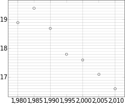

---

## 2. Point moyen et droite d'ajustement

#### Point moyen



Soit une série statistique à deux variables $x$ et $y$ de moyennes $\bar{x}$ et $\bar{y}$. 

Le point $G$ de coordonnées $(\bar{x};\bar{y})$ avec 
$$\bar{x}=\frac{1}{n}\sum_{i=1}^{n}{x_i} \quad\text{ et }\quad \bar{y}=\frac{1}{n}\sum_{i=1}^{n}{y_i}$$ 
est appelé le \emph{point moyen} du nuage.



#### Exemple


Dans la série des ménages le points moyen a pour coordonnées :

$$x_G = \dfrac{1980 + 1985 + 1990 + 1995 + 2000 + 2005 + 2010}{7} = 1995$$

$$y_G = \dfrac{18.9 + 19.4 + 18.7 + 17.8 + 17.6 + 17.1 + 16.6}{7} \approx 18$$

Donc le point moyen est $G(1995, 18)$.


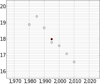

---

## 3. Droite d'ajustement

#### Droite d'ajustement



Toute droite passant par le point moyen du nuage et "résumant approximativement" le nuage est appelée 
_droite d'ajustement_ du nuage de points.



### 1. Au jugé



On trace "au jugé" une droite passant par le point moyen du nuage qui semble résumer le nuage de points. C'est une méthode simple mais qui dépend de la droite tracée.



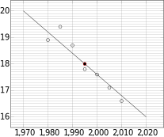

### 2. Interpolation et extrapolation



En utilisant une droite d'ajustement on peut prédire des valeurs manquantes.

* Lorsque la valeur à prédire est _entre_ les valeurs extrèmes, on parle d'_interpolation_
* Lorsque la valeur à prédire est _en dehors_ des valeurs extrèmes, on parle d'_extrapolation_



#### Exemples

D'après la figure précédente :

1. Interpoler la consommation des ménages en 2002
2. Extrapoler la consommation des ménages en 1970 puis en 2020.



1. En 2002 on lit approximativement 17.4% (d'alimentaire dans la consommation des ménages)
2. En 1970, on lit environ 20% et en 2020 on lit environ 16.2%.


### 3. Méthode des moindres carrés et droite de régression linéaire


La méthode des moindres carrés consiste à chercher la meilleure droite d'ajustement possible
selon un critère particulier.

L'objectif est de minimiser _l'aire_ des carrés entre un points du nuage et le point
de la droite ayant la même abscisse.


#### Droite de regression



Il existe _une_ droite qui minimise ces aires, elle est appelée **droite de regression linéaire**

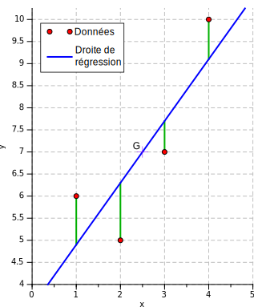



Donner la droite de régression c'est _écrire son équation sous la forme $y=ax+b$._



#### Numworks

La calculatrice Numworks permet de dessiner les nuages de points et d'obtenir la droite de régression.


Menu **Regression**, saisir les valeurs en $X$ et $Y$.
Monter, aller sur **Stats**, descendre jusqu'à **Régression** et lire $a$ et $b$.


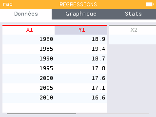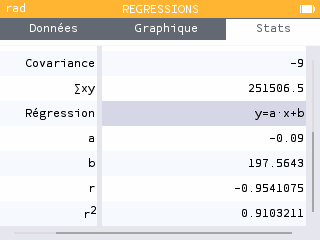

On peut maintenant tracer et on a tout sur un seul écran !

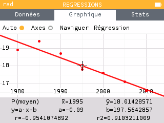

Pour l'exemple précédent (_consommation des ménages_), on lit :

* Droite de regression : $y = -0.09x + 197.56$ 

#### Coefficient de corrélation linéaire



Le nombre $r$, appelé _coéfficient de corrélation linéaire_, est un indicateur de la qualité de cette regression.


Il doit être proche (_très proche_) de 1 si la droite monte, de -1 si la droite descend.

Pour l'exemple précédent (_consommation des ménages_), on lit :

* Coéfficient de corrélation linéaire : $r = -0.954$.

Ce n'est pas mauvais... mais on étudiera des régressions avec $r\approx \pm 0.99$


#### Utiliser la droite de régression linéaire


Pour estimer (interpoler ou extrapoler) une nouvelle valeur, il suffit d'utiliser l'équation $y=ax+b$ et de remplacer $x$ par la nouvelle valeur.


#### Exemple

Toujours avec la consommation des ménages on a lu $y=-0.09x + 197.564$

1. Extrapoler la part de l'alimentaire en 1970.
2. Extrapoler la part de l'alimentaire en 2020.
2. Peut-on prédire quand la part d'alimentaire dans la consommation devrait passer sous les 15% ?



1. Pour estimer la consommation des ménages en 1970, on fait : $y = -0.09 \times 1970 + 197.564 =20.264$.\
    On estime qu'en 1970, la part de l'alimentaire dans la consommation était de 20.26%
2. Pour estimer la consommation des ménages en 2020, on fait : $y = -0.09 \times 2020 + 197.564 =15.764$.\
    On estime qu'en 2020, la part de l'alimentaire dans la consommation était de 15.76%
3. Cette fois, il faut faire attention ! Ce 15% est une _ordonnée_. On part donc de $y=15$ et
    on cherche l'abscisse correspondant sur la droite.

    * _Graphiquement_

        La figure précédente ne fait pas apparaître ce point, on peut changer les axes :

        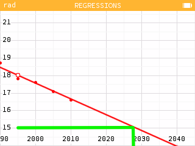

        On lit $x=2028$ et $y=15$.

    * _Par le calcul_,

        on résout :
        $$-0.09x + 197.564 = 15 \Longleftrightarrow -0.09x = 15 - 197.564$$
        $$\Longleftrightarrow -0.09x=-182.564 \Longleftrightarrow x= \dfrac{-182.564}{-0.09} \approx 2028.48$$

        C'est bien entre 2028 et 2029 que la part de l'alimentaire dans la consommation des ménages devrait passer sous les 15%.


---

## 4. Transformation des données

Il arrive que certains nuages aient une "forme particulière"... qui n'est pas rectiligne.

Considérons la production d'énergie renouvelable depuis 1940, exprimée en megawatt.

| Année | 1950  | 1960  | 1980  | 1990 | 2000  | 2010  | 2020  | 2030  |
|-------|-------|-------|-------|------|-------|-------|-------|-------|
| $x_i$ | 10    | 20    | 30    | 40   | 50    | 60    | 70    | 80    |
| $y_i$ | 1.628 | 2.653 | 4.322 | 7.03 | 11.46 | 18.68 | 30.42 | 49.56 |

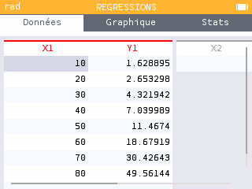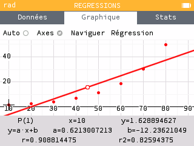


Le nuage n'est pas rectiligne mais _courbe_ et présente une évolution _exponentielle_.

On est tenté de le rectifier avec la fonction log.

Voici ce qu'on obtient avec la transformation $Z = \log(Y)$


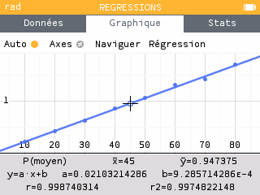


On constate que le nuage est _plus rectiligne_ et que le coefficient de corrélation linéaire est plus proche de 1.

La regression linéaire de ce nuage est donc meilleure que celle du nuage initial.


#### Application 
Extrapoler la valeur de $Y$ pour $X=90$

1. On donne d'abord la valeur de $Z$ correspondant en utilisant la regression $z = 0.021x+0.0009286$

2. On effectue la transformation _inverse_ de $Z = \log(Y) \Longleftrightarrow 10^Z = Y$


1. $z = 0.021 \times 90 + 0.0009286 \approx 1.8909286$
2. On remplace et $y = 10^{1.8909286} \approx 77.89$


