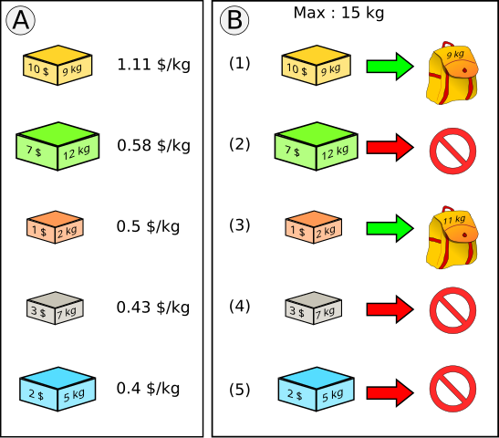
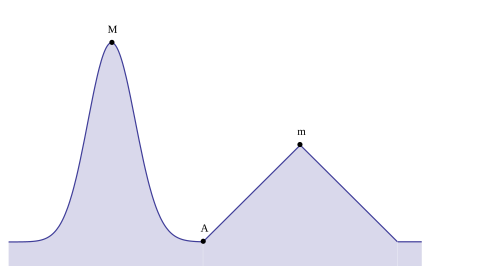
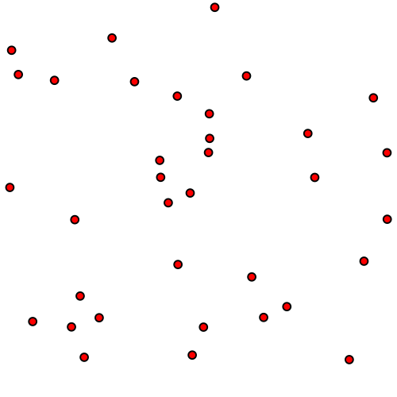
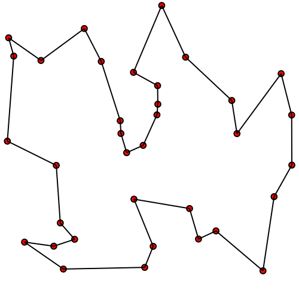

[pdf](./glouton_resume.pdf)

---

## Algorithmes gloutons : présentation


Classe d'algorithmes qui sert à résoudre des problèmes **d'optimisation.**

Optimisation :

> Parmi un ensemble de réponse possible, on fabrique la meilleure possible selon un critère.

Démarche gloutonne :

> À chaque étape, on choisit l'élément le meilleur _sans tenir compte des choix passés_.

Problème :

> La démarche gloutonne est simple mais ne trouve pas toujours la meilleure solution.


## Rendu de monnaie 

_Illustrons la démarche avec un problème simple._

On considère une somme à rendre, `S = 49` et un jeu de pièces `pieces = [1, 2, 5, 10]`.

On suppose disposer d'une infinité de chaque pièce.

Comment rendre la monnaie **en minimisant le nombre de pièces rendues ?**.

Ici les solutions :

- 1, 1, ..., 1 (49 fois)
- 2, 2, ..., 2 (24 fois), 1

conviennent mais _ne sont pas optimales._ 

La solution est bien sûr : 10, 10, 10, 10, 5, 2, 2 qui n'utlise que 7 pièces.


Démarche gloutone :

Tant qu'il reste un montant à rendre, je rends la plus grande pièce possible


- elle aboutit toujours,
- elle ne donne pas toujours le nombre optimal de pièces.

Exemple :

49 à rendre avec les pieces `[1, 2, 5, 10]`

1. `49`. Je rends `10`. Il reste `39`
2. `39`. Je rends `10`. Il reste `29`
3. `29`. Je rends `10`. Il reste `19`
3. `19`. Je rends `10`. Il reste `9`
4. `9`. Je ne peux plus rendre `10`. Je rends `5`. Il reste `4`.
5. `4`. Je ne peux plus rendre `5`. Je rends `2`. Il reste `2`.
6. `2`. Je rends `2`. il reste `0`.

Ici l'algorithme renvoie la solution optimale. Ce n'est pas toujours le cas.

Par exemple avec `49` à rendre avec les pièces `[1, 2, 12, 20]` :

- l'algorithme glouton renvoie : 20, 20, 2, 2, 2, 2, 1 (7 pièces) 
- alors que la solution optimale est : 12, 12, 12, 12, 1 (**5 pièces**).

### Remarques

1. On donne généralement les pièces par _ordre croissant_. Il faut donc commencer avec la _dernière pièce_ et _reculer_. 
2. Si on cherche une solution optimale parmi toutes les solutions, la démarche générale consiste à tester tous les cas (méthode par _force brute_) et demande énormément de calculs : coût _exponentiel_ en le nombre de pièces.

### Version Python 


```python
def rendu_monnaie(montant: int, pieces: list) -> list:
    """
    Renvoie les pièces à rendre obtenues en suivant l'algorithme glouton.
    On cherche à rendre un nombre minimal de pièces.

    préconditions: 
    - on doit pouvoir rendre exactement la monnaie avec ces pièces
    - les pièces sont rangées par ordre croissant
    """
    a_rendre = []
    i = len(pieces) - 1
    while montant > 0:
        piece = pieces[i]
        if piece <= montant:
            a_rendre.append(piece)
            montant = montant - piece
        else:
            i = i - 1
    return a_rendre
```



def rendu_monnaie(montant: int, pieces: list) -> list:
    """
    Renvoie les pièces à rendre obtenues en suivant l'algorithme glouton.
    On cherche à rendre un nombre minimal de pièces.

    préconditions: 
    - on doit pouvoir rendre exactement la monnaie avec ces pièces
    - les pièces sont rangées par ordre croissant
    """
    a_rendre = []
    i = len(pieces) - 1
    while montant > 0:
        piece = pieces[i]
        if piece <= montant:
            a_rendre.append(piece)
            montant = montant - piece
        else:
            i = i - 1
    return a_rendre


print(49, rendu_monnaie(49, [1, 2, 5, 10, 20]))
print(49, rendu_monnaie(49, [1, 2, 12, 20]))



### Remarque finale 

Un jeu de pièces et dit _canonique_ si la méthode gloutonne renvoie toujours la meilleure solution. C'est le cas des euros.

## Démarche gloutonne générale 

### Exposé du problème

Les algorithmes dits _gloutons_ (en anglais **greedy algorithm**)
servent à résoudre certains problèmes d'**optimisation**.

Un problème d'optimisation : on cherche à construire une solution à un
problème qui optimise une **fonction objectif**. Un problème
d'optimisation se définit comme :

- un ensemble fini d’éléments, $E$,
- une solution au problème est construite à partir des éléments de
  $E$ : c’est par exemple une partie de $E$ ou un multi-ensemble
  d’éléments de $E$ ou une suite (finie) d’éléments de $E$ ou une
  permutation de $E$ qui satisfait une certaine contrainte.
- à chaque **solution** $S$ est associée une fonction objectif
  $v(S)$ : on cherche donc une solution qui maximise (ou minimise)
  cette fonction objectif.


Le principe d’une méthode gloutonne :

- Avaler tout ce qu’on peut = Construire au fur et à mesure une
  solution en faisant les choix qui paraissent optimaux localement

On procède de façon séquentielle, en faisant à chaque étape le choix qui semble localement le meilleur.

- On ne revient jamais en arrière.
- Il s'agit d'une progression _descendante_, à chaque étape on fait
  un choix puis on résout un problème plus petit issu de ce choix.


### Le schéma de la méthode gloutonne

Il est basé sur un critère local de sélection des éléments de $E$ pour
construire une solution optimale. En fait, on travaille sur l’objet
"solution partielle" - "début de solution"- et on doit disposer de :

- `select` : qui choisit le meilleur élément restant selon le critère glouton.
- `complete?` qui teste si une solution partielle est une solution (complète).
- `ajoutPossible?` qui teste si un élément peut être ajouté à une
  solution partielle, i.e. si la solution partielle reste un début de
  solution possible après l’ajout de l’élément. Dans certains cas,
  c’est toujours vrai !
- `ajout` qui permet d’ajouter un élément à une solution si c’est possible.


```
Algorithme glouton
// on initialise l’ensemble des "briques" élémentaires des solutions.
Ens.init() ;

// on initialise la solution :
// ensemble (ou suite) "vide" ou..
Sol.Init() ;

tant que (Non Sol.complete ?() et Ens.NonVide ?()) faire
    //on choisit x selon critère glouton
    x ← Ens.select()
    si Sol.ajoutPossible(x) alors
        Sol.ajout(x)
    fin si
    //dans certains problèmes,
    si CertainesConditions alors
        Ens.retirer(x) ;
    // selon les cas, x considéré une fois ou plus
    fin si
fin tant que 
// la Solution partielle est a priori complète
renvoyer Sol ;
```

## Exemples de problèmes s'abordant avec une méthode gloutonne :

### Le problème du _cambrioleur_ ou du _sac à dos_ 

On dispose d'objets ayant : une _valeur_ et une _masse_ ainsi que d'un sac disposant d'une _capacité_ à ne pas dépasser.

L'objectif est de choisir la combinaison d'objets qui :

- puissent entrer dans le sac sans que _la masse totale ne dépasse la capacité_,
- fournisse le _montant total maximal_

On peut choisir différentes heuristiques gloutonne (= critère de choix d'un objet) :

- maximiser la valeur de l'objet : je prends toujours l'objet de valeur maximale qui entre dans le sac,
- minimiser la masse : je prends toujours l'objet le plus léger qui entre dans le sac,
- maximiser la valeur massique : je prends toujours l'objet dont le ratio $\dfrac{\text{valeur}}{\text{masse}}$ est maximal et qui entre dans le sac,


Ces heuristiques conduisent à différentes solutions... qui n'est parfois pas la meilleure !

#### Exemple :



Les deux phases de l'algorithme glouton. 
- À gauche : tri des boîtes par ordre d'intérêt (ici en dollars par kilogramme). 
- À droite : insertion dans l'ordre des boîtes, si cela est possible. On obtient ici une solution de 11 \\$ pour 11 kg alors que la solution optimale est de 12 \\$ et 14 kg.

Remarque :

De manière générale la seule approche qui donne toujours la bonne réponse est la force brute.

### Recherche du point le plus haut 



En partant du point $A$ et en cherchant à monter selon la plus forte pente, un algorithme glouton trouvera le maximum local $m$, mais pas le maximum global $M$.

### Décomposition d'un entier dans une base

_Déjà rencontré dans les chapitres sur le binaire, l'hexadécimal !_

Pour obtenir les chiffres d'un entier naturel $n$ en base  $b$ on peut chercher le nombre de fois que la plus grande puissance de $b$ inférieure à $n$ est contenue dans $n$, ce qui donne le premier chiffre, et recommencer avec le nombre obtenu en retranchant ces puissances.

La méthode gloutonne trouve la solution optimale (il n'y en a qu'une)

### Voyageur de commerce (_Travelling salesman problem_)

On cherche un chemin parmi un ensemble de points qui :

- parte d'un point,
- visite une fois chaque point,
- revienne au point de départ,
- **minimise la distance totale parcourue**

Par exemple avec ces points :

 

Voici la solution :



La solution gloutonne consiste à choisir le point le plus proche (selon une distance à définir) du point courant (parmi ceux qu'on n'a pas encore visité).

C'est un problème très difficile à résoudre exactement et la méthode gloutonne ne renvoie généralement pas la meilleure.

### Autres problèmes étudiés en terminale :

- La recherche d'un chemin de longueur minimale entre deux points avec l'algorithme de Dijkstra,
- La compression sans perte avec le codage de Huffman
