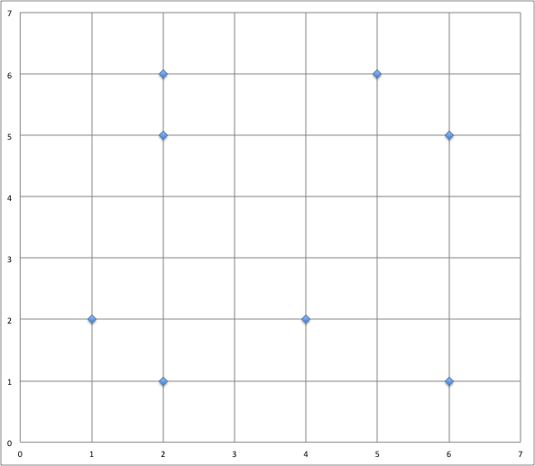

### pdf : [pour impression](./2_td.pdf)

## 1. Trouver la classe avec les k plus proches voisins

Supposons que l’on a un problème de classification qui consiste à déterminer la classe d’appartenance de nouvelles instances $X_i$. Le domaine de valeurs des classes possibles est ${1, 2, 3}$.

Selon la base de connaissance suivante, déterminez à la main (ou à l'aide d'un tableur) la classe de l’instance $X_6$, dont les valeurs pour les attributs numériques $A1$ à $A5$ sont $<3, 12, 4, 7, 8>$, à l’aide de l’algorithme des k-voisins les plus proches (K-NN) avec $K=1$ puis $K=3$.

Montrez tous les calculs.

| Instances    |  A1 |  A2 |  A3 |  A4 |  A5 | Classe  |
| ------------ | --- | --- | --- | --- | --- | ------- |
| $X_1$        |  3  |  5  |  4  |  6  |  1  |  1      |
| $X_2$        |  4  |  6  | 10  |  3  |  2  |  2      |
| $X_3$        |  8  |  3  | 4   |  2  |  6  |  3      |
| $X_4$        |  2  |  1  | 4   |  3  |  6  |  3      |
| $X_5$        |  2  |  5  | 1   |  4  |  8  |  2      |

## 2. Autre exemple simple

Soit les points de coordonnées suivantes :

$A(1, 6), B(2, 6), C(3, 1), D(4, 2), E(6, 0), F(7, 5), G(7, 3), H(10, 3)$

En utilisant la distance euclidienne, quels sont les deux plus proches voisins du point $P(5,5)$ ?

## 3. Exemple tiré d'un _sujet 0_

Dans le quadrillage ci-dessous 14 points sont dessinés, dont 7 de la classe C1, avec des ronds noirs $\bullet$, et 7 de la classe C2, avec des losanges $\lozenge$. On introduit un nouveau point A, dont on cherche la classe à l'aide d'un algorithme des k plus proches voisins pour la distance géométrique habituelle, en faisant varier la valeur de k parmi 1, 3 et 5. Quelle est la bonne réponse (sous la forme d'un triplet de classes pour le triplet (1,3,5) des valeurs de k) ?


$~~~~~~$

## 4. Couleur d'un fruit

On cherche à prédire la couleur d’un fruit en fonction de sa largeur ($L$) et de sa hauteur ($H$). \
On dispose des données d’apprentissage suivantes :

| largeur | hauteur | couleur |
| ------- | ------- | ------- |
| 2       | 6       | red     |
| 5       | 6       | yellow  |
| 2       | 5       | orange  |
| 6       | 5       | purple  |
| 1       | 2       | red     |
| 4       | 2       | blue    |
| 2       | 1       | violet  |
| 6       | 1       | green   |

Ces données sont placées dans un repère ($L$ en abscisse, $H$ en ordonnée).



L’objectif ici est d’étudier l’influence des voisins sur la propriété de couleur d’un fruit.

Soit $U$ le nouveau fruit de largeur $L = 1$, et de hauteur $H = 4$.

1. Indiquez pour chaque point sa couleur.
1. Quelle est sa couleur si l'on considère 1 voisin ?
2. Quelle est sa couleur si l'on considère 3 voisins ?
3. Plutôt que le vote majoritaire, on voudrait considérer le vote des voisins pondérés par la distance. Chaque voisin vote selon un poids $w$ inversement proportionnel au carré de sa distance  : $w = 1/d^2$. \
On prend  3 voisins, quelle est la couleur de $U$ ? \
Comparez vos résultats à ceux de la question 2.

## 5. Distance sur des données non numériques

Arrivé dans la cantina de la planète Tatooine, Han Solo décide de donner des indications à Luke pour qu’il ne provoque pas les extraterrestres belliqueux. Il repère quelques caractéristiques et vous demande de l’aider à fournir des éléments à Luke pour ne pas créer de problèmes et donc pouvoir définir un extraterrestre belliqueux.

| *Couleur* | *Taille* | *Poids* | *Yeux par pair ?* | *Belliqueux* |
|-----------|----------|---------|-------------------|--------------|
| jaune     | moyenne  | léger   | non               | non          |
| jaune     | grande   | moyen   | oui               | oui          |
| vert      | petite   | moyen   | oui               | oui          |
| jaune     | petite   | moyen   | non               | non          |
| rouge     | moyenne  | lourd   | non               | non          |
| vert      | grande   | lourd   | non               | oui          |
| vert      | moyenne  | lourd   | non               | oui          |
| jaune     | petite   | léger   | oui               | oui          |


Élaborez une distance pour pouvoir mettre en œuvre KNN sur cet exemple.

## 6. Distance sur des données mixtes

Après avoir mis un place un entrepôt de données pour stocker les résultats des votes à différentes élections, l’objectif est de maintenant d’exploiter les différentes données de cet entrepôt. Différents partis politiques font donc appel à vous pour les aider à mieux comprendre leurs électeurs.

Un parti cherche à comprendre la composition des votants pour son candidat. Il fait donc appel à vos services pour identifier les différents profils des votants.

On a par exemple les deux votants suivants :

* V1 : {F ; 43 ; NON ; 55.000 ; 14% ; CONTRE}
* V2 : {M ; 38 ; NON ; 28.000 ; 14% ; POUR}

les attributs correspondent à :

* sexe : {F ; M}
* âge : {min : 18 ; max : 102 ; std : 30 ; moy : 50}
* propriétaire : {OUI, NON}
* salaire annuel imposable : {min : 412 ; max : 350.000 ; std : 30.000 ; moy : 32.000}
* taux d'imposition : {0% ; 14% ; 30% ; 41% ; 45%}
* opinion sur le nucléaire : {POUR, CONTRE, NSP}

Définissez formellement une distance permettant de considérer tous les attributs pour mettre en œuvre KNN.

Donnez la distance de V1 à V2 avec cette définition.

## 7. Implantation de $k$NN


On considère un jeu de données dont voici un extrait :

```python
animaux = [{'espece': 'crocodile', 'gueule': 0.27, 'taille': 4.79},
           {'espece': 'crocodile', 'gueule': 0.31, 'taille': 5.16},
           {'espece': 'crocodile', 'gueule': 0.25, 'taille': 4.11},
           {'espece': 'crocodile', 'gueule': 0.32, 'taille': 5.45},
           {'espece': 'crocodile', 'gueule': 0.47, 'taille': 5.71},
           {'espece': 'crocodile', 'gueule': 0.35, 'taille': 4.93},
           {'espece': 'alligator', 'gueule': 0.15, 'taille': 3.76},
           {'espece': 'alligator', 'gueule': 0.27, 'taille': 2.37},
           {'espece': 'alligator', 'gueule': 0.24, 'taille': 3.25},
           {'espece': 'crocodile', 'gueule': 0.35, 'taille': 3.85},
           {'espece': 'alligator', 'gueule': 0.19, 'taille': 3.96},
           {'espece': 'alligator', 'gueule': 0.28, 'taille': 3.05},
           {'espece': 'alligator', 'gueule': 0.28, 'taille': 2.07},
           {'espece': 'alligator', 'gueule': 0.23, 'taille': 3.35},
           {'espece': 'crocodile', 'gueule': 0.38, 'taille': 5.15},
           {'espece': 'alligator', 'gueule': 0.24, 'taille': 3.78},
           {'espece': 'alligator', 'gueule': 0.23, 'taille': 2.72},
           {'espece': 'crocodile', 'gueule': 0.40, 'taille': 4.11},
           {'espece': 'alligator', 'gueule': 0.30, 'taille': 3.09},
           ...
           {'espece': 'alligator', 'gueule': 0.21, 'taille': 2.36}]
  ```

  1. Nous allons d'abord séparer le jeu de données entre _apprentissage_
    et _test_.

    66% des données seront des données d'apprentissage, 34% des données de test.

    Proposer une fonction python qui prend en paramètre les animaux et renvoie
    deux listes : apprentissage et test, pour lesquels chaque animal est choisi
    aléatoirement.

  2. Distance euclidienne et distance de Manhattan.

    Proposer deux fonctions pour calculer ces distances entre deux données
    telles que présentées plus haut.

  3. Ecrire une fonction qui prend en entrée une donnée de test (en supposant ignorer
    l'espèce) et renvoie la liste des paires `distance, espece` pour chaque
    donnée du jeu de test.

  4. Écrire une fonction qui trie la liste précédente et ne conserve que les
    $k$ premiers éléments, selon la distance croissante. $k$ est un paramètre entier.

  5. Améliorer les deux fonctions précédentes pour donner une seule fonction
    de complexité linéaire.

  6. Écrire une fonction qui reçoit en paramètre une liste produite par la
    fonction précédente et renvoie l'espèce majoritaire.


