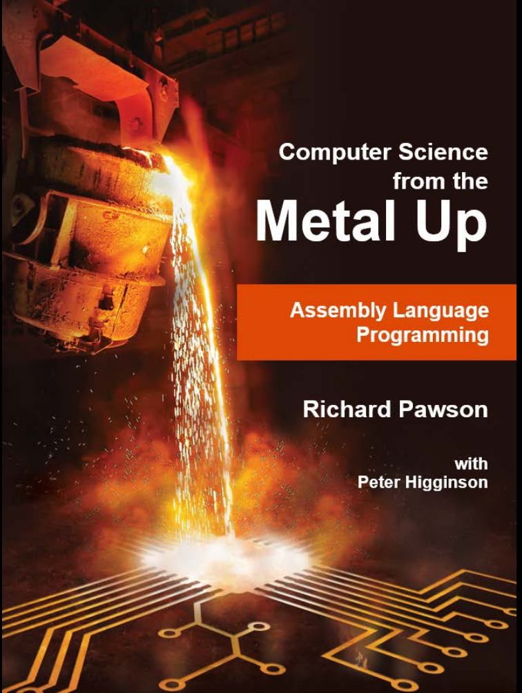
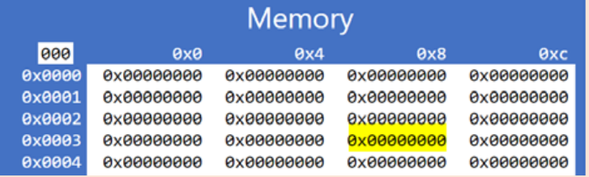
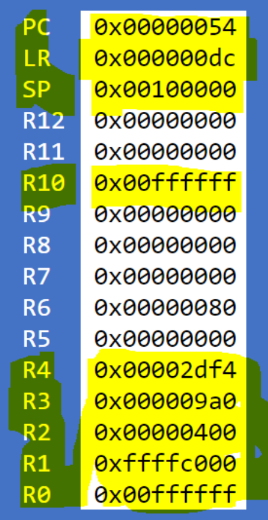
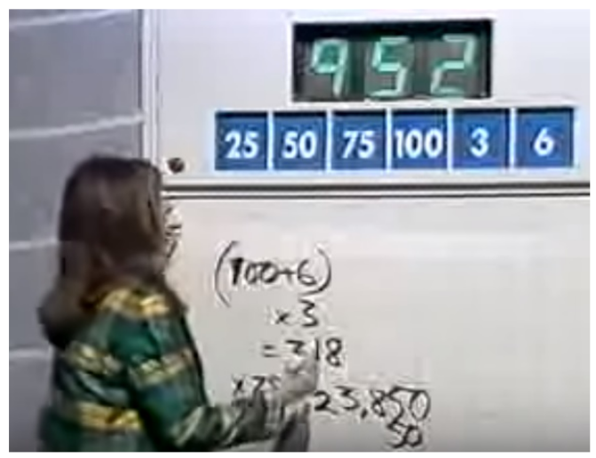

# L'informatique à partir du métal

_Richard Pawson & Peter Higginson_

_Traduction semi automatisée des premiers chapitres du livre [disponible ici](https://peterhigginson.co.uk/ARMlite/Assembly%20Language%20-%20Student%20version.pdf)_



# Fondamentaux du langage d'assemblage

---


## Chapitre 1. Introduction au langage d'assemblage et à ARMlite

Le programme listé ci-dessous est écrit en langage assembleur – il peut vous
sembler très peu familier ! Le langage d'assemblage est un langage de
programmation "de bas niveau", chaque instruction (ligne de code dans ce cas)
effectue une opération très simple, et il peut falloir de nombreuses
instructions de ce type pour correspondre à la
fonctionnalité d'une seule ligne de code dans un langage de haut niveau (tel que
Python, VB ou C#).


 <!-- begin columns block -->
```java
  MOV R1, #.PixelScreen
  MOV R2, #screen2
  MOV R6, #0
  MOV R9, #.black
  MOV R10, #.white
  MOV R3, #0
loopWhite: STR R10, [R2+R3]
  ADD R3, R3, #4
  CMP R3, #12288
  BLT loopWhite
  MOV R3, #260
randLoop: LDR R0, .Random
  AND R0, R0, #1
  CMP R0, #0
  BNE .+2
  STR R9, [R2+R3]
  BL nextCell
  CMP R3, #12032
  BLT randLoop
copyScreen2to1: MOV R3, #0
copyLoop: LDR R0, [R2+R3]
  STR R0, [R1+R3]
  ADD R3, R3, #4
  CMP R3, #12288
  BLT copyLoop
  ADD R6, R6, #1
  MOV R3, #260
nextGenLoop: MOV R5, #0
  SUB R4, R3, #256
  BL countIfLive
  SUB R4, R3, #252
  BL countIfLive
  ADD R4, R3, #4
  BL countIfLive
  ADD R4, R3, #260
  BL countIfLive
  ADD R4, R3, #256
  BL countIfLive
```
<---> <!-- magic separator, between columns -->

```java
  ADD R4, R3, #252
  BL countIfLive
  SUB R4, R3, #4
  BL countIfLive
  SUB R4, R3, #260
  BL countIfLive
  CMP R5, #4
  BLT .+3
  STR R10, [R2+R3]
  B continue
  CMP R5, #3
  BLT .+3
  STR R9, [R2+R3]
  B continue
  CMP R5, #2
  BLT .+2
  B continue
  STR R10, [R2+R3]
continue: BL nextCell
  MOV R0, #12032
  CMP R3, R0
  BLT nextGenLoop
  B copyScreen2to1
  countIfLive: LDR R0, [R1+R4]
  CMP R0, R10 //White
  BEQ .+2
  ADD R5, R5, #1
  RET
nextCell:
  ADD R3, R3, #4
  AND R0, R3, #255
  CMP R0, #0
  BEQ .-3
  CMP R0, #252
  BEQ .-5
  RET
  HALT
  .ALIGN 1024
screen2: 0
```


Chaque instruction en langage assembleur correspond à une opération exécutable
directement par les circuits électroniques du processeur. Différents
processeurs ont donc différents langages d'assemblage, bien qu'il existe de
nombreuses caractéristiques communes - le langage présenté ici est pour un 
processeur ARM 32 bits.

Un processeur ne peut pas exécuter directement le langage d'assemblage : chaque
ligne de code doit d'abord être traduite en un "code machine" - un processus
appelé "assemblage" et l'outil permettant d'effectuer la conversion est
appelé assembleur - mais chaque langage d'assemblage donne un code 32 bits.

Tout au long de ce livre, nous allons utiliser un programme en ligne appelé
ARMlite, qui simule un ordinateur simple construit autour d'une version
réduite d'un processeur ARM 32 bits :


Vous pouvez voir que l'écran est divisé en quatre zones principales :
Programme, Processeur, Mémoire et Entrée/Sortie.

La mémoire est composée de mots de 32 bits. Dans la vue ci-dessus, chaque mot
contient zéro, mais cela s'affiche sous la forme 0x00000000. Le 0x est un
préfixe standard indiquant que ce qui suit est au format hexadécimal (hex).



### Exercice 1

Accédez à la simulation via : [ARMLite](https://peterhigginson.co.uk/ARMlite/) de
préférence avec Chrome. (Tous les navigateurs modernes devraient fonctionner,
mais pas IE11).

Cliquez sur n'importe quel mot mémoire visible et tapez `101` (suivi de la touche Retour).

Quelle valeur est affichée et pourquoi ?

Sur un autre mot mémoire, saisir `0x101`

Quelle valeur est affichée et pourquoi ?

Sur un autre mot mémoire, saisir `0b101`

Quelle valeur est affichée et pourquoi ?

Si vous passez maintenant la souris (ne cliquez pas) sur l'un des mots mémoire
où vous avez entré une valeur, vous obtiendrez une "info-bulle" contextuelle.

Que vous dit l'info-bulle ?

Le sélecteur déroulant affichant `Hex` permet de changer la base dans
laquelle s'affiche. La modification de la base ne modifie pas la valeur des
données sous-jacentes.

Remplacez-le par Décimal (non signé). Collez une capture d'écran partielle
montrant les trois mots mémoire que vous avez saisis, dans leur nouveau
format.
Lorsque vous passez la souris sur l'un de ces mots, qu'est-ce qui apparaît
maintenant dans l'info-bulle ?\\
La modification de la représentation des données en mémoire modifie-t-elle également la représentation des en-têtes de ligne et de colonne (les chiffres blancs sur fond bleu) ?


### Adressage

La mémoire est disposée en quatre colonnes, uniquement pour des raisons de
commodité visuelle. Chaque mot de mémoire a une « adresse » unique - un nombre
hexadécimal à cinq chiffres. Les quatre premiers chiffres de l'adresse sont
indiqués par l'en-tête de ligne et l'adresse complète est spécifiée en ajoutant
le seul chiffre hexadécimal indiqué dans l'en-tête de colonne.
Ainsi, l'adresse du mot en _haut à gauche_ sur cet écran `0x00000` et celle
à droite est `0x001fc`


### Exercice 2

Quelle est l'adresse du mot affiché en surbrillance ?



Si l'adresse comporte cinq chiffres hexadécimaux et que chaque chiffre est de 4
bits, quelle est la plus grande adresse possible, sous forme de nombre 
hexadécimal et en décimal ?


Pourquoi les colonnes d'adresse montent-elles par sauts de quatre 
`(0x0, 0x4, 0x8, 0xc)` ? Chaque mot de 32 bits est composé de quatre 'octets' 
de 8 bits. ARMlite, comme la plupart des processeurs modernes, utilise 
"l'adressage des octets" pour la mémoire. Lors du stockage ou de la 
récupération d'un mot (ce que nous apprendrons à faire au chapitre 3), vous
ne spécifiez que l'adresse du premier des quatre octets composant ce mot.



### Qu'y a-t-il dans un mot ?

La taille d'un « mot » varie d'une machine à l'autre. Les ordinateurs modernes
ont généralement des mots de 32 ou 64 bits ; les plus anciens étaient de 16, 8
ou 4 bits. Et avant l'émergence du microprocesseur monopuce, les ordinateurs
avaient des tailles de mots personnalisées : 18,20,36,40,60…

Cependant, depuis l'avènement des puces de mémoire à semi-conducteurs, _la
mémoire_ a été mesurée et gérée en «octets», où un octet est toujours de 8 bits,
quelle que soit la taille de mot de la machine dans laquelle la mémoire sera
utilisée.




ARMlite, comme tous les ordinateurs modernes, est un «ordinateur à programme
enregistré» : la mémoire est utilisée à la fois pour stocker les instructions du
programme et les données à manipuler. Pour exécuter un programme en langage
assembleur, il est nécessaire à la fois de traduire les instructions du langage
assembleur en code machine et de charger ces codes en mémoire. Sur les anciennes
machines, il s'agissait de deux étapes distinctes : sur ARMLite, ils sont
tous les deux exécutés en une étape.


### Exercice 3

Accédez au simulateur via [https://peterhigginson.co.uk/ARMlite/](https://peterhigginson.co.uk/ARMlite/)

Cliquez sur le bouton **Modifier** (sous le programme) , puis copiez et collez le
programme complet en langage assembleur répertorié au début du chapitre, dans
cette zone. (Vous devriez pouvoir copier les deux colonnes en une seule fois,
mais si ce n'est pas possible, assurez-vous que le code de la deuxième colonne
est placé après le code de la première colonne.)

**Appuyez** ensuite sur le bouton Soumettre . Cela ne devrait pas donner d'erreurs
(si c'est le cas, vous avez mal collé le code). Avant de continuer, utilisez le
bouton Enregistrer pour enregistrer le programme dans un fichier sur votre
ordinateur local.

**Submit** a fait deux choses : d'abord, il a « assemblé » (traduit) le langage
d'assemblage en code machine ; puis il a chargé le code machine en mémoire.

Vous verrez également qu'ARMlite a maintenant ajouté des "numéros de ligne" à
votre programme. Ceux-ci ne font pas partie du langage d'assemblage (également
connu sous le nom de "code source"), mais sont là pour vous aider à naviguer et
à discuter de votre code.

Quel est le numéro de ligne le plus élevé ?

Si vous passez la souris sur l'une des lignes du code source (ce n'est qu'après
qu'il a été soumis), vous verrez une info- bulle contextuelle qui indique
l'adresse en mémoire de l'instruction de code machine correspondante.

Quelle adresse hexadécimale est donnée pour la ligne numéro 75 du code ? Collez
une capture d'écran mettant en évidence le contenu de ce mot dans la zone
mémoire.


(La raison pour laquelle il n'y a pas de code machine correspondant aux lignes
76 et 77 de la source, c'est que ces lignes ne sont pas strictement des
instructions de processeur - ce sont des instructions à l'assembleur, connues
sous le nom de 'directives assembleur'. Nous en verros plus tard,mais
ce n'est pas un point très important à comprendre.)



### Exercice 4

Appuyez sur Modifier et essayez d'insérer :

- Quelques lignes vides
- Espaces supplémentaires avant une instruction, ou juste après une virgule
  (mais pas entre d'autres caractères)
- Un commentaire sur une ligne qui lui est propre, commençant par `//` comme
  `//Mon premier programme`
- Un commentaire après une instruction mais sur la même ligne

Soumettez à nouveau le code.

Qu'est-il arrivé aux :
- Lignes vides
- Espaces supplémentaires
- Les commentaires
- Les numéros de ligne
- Le nombre total d'instructions qui finissent comme des mots en mémoire ? (Pourquoi?)

Modifiez à nouveau et supprimez la virgule de la première ligne de code. Que se
passe-t-il lorsque vous soumettez maintenant ? 

Restaurez le programme dans son état d'origine, soit en revenant à Modifier,
soit en le chargeant à nouveau et en le soumettant.


Le programme que vous avez chargé est une simulation d'une colonie d'organismes
simples, naissant, se reproduisant et finissant par mourir. (Les cellules
individuelles ne bougent jamais, mais les modèles de cellules qui naissent et
meurent donnent l'impression d'un mouvement, et de nombreux modèles
dynamiques intéressants émergent). Le code est une variante d'un programme
très célèbre appelé (Life - Game of Life - le Jeu de la Vie).



### Le jeu de la vie de Conway

Le "Jeu de la vie", également connu simplement sous le nom de "Vie" (ce n'est
pas vraiment un jeu, c'est une simulation) a été conçu par le mathématicien
britannique John Horton Conway en 1970. Au cours des 50 années qui ont suivi,
il y a eu des implémentations écrites depuis presque chaque ordinateur
fabriqué, réel et virtuel, y compris maintenant ARMlite.

Il simule la naissance, la reproduction et la mort d'organismes unicellulaires
statiques vivant en communauté. Chaque emplacement sur la grille a jusqu'à 8
voisins immédiats. (Strictement, Life devrait être joué sur un tableau infini -
l'écran ARMlite a des bords durs, et ceux-ci affectent le comportement.) Si un
organisme a plus de trois voisins vivants, il mourra de « surpopulation ». S'il
a moins d'un voisin vivant, il mourra de « solitude ». Si un emplacement vide a
trois voisins vivants, un nouvel organisme y naîtra.

Fonctionnant sur une machine rapide, une simulation de la Vie produit des
motifs d'une extraordinaire complexité. Commençant par une distribution
aléatoire d'organismes vivants, la simulation changera dynamiquement pendant de
nombreuses « générations » avant de s'installer dans un état stable composé de
groupes statiques de cellules vivantes et de certains "oscillateurs" - un groupe
qui parcourt un schéma répété.


Vous pouvez également observer des «planeurs» - de petits groupes de
cellules qui semblent se déplacer (en diagonale) sur l'écran - en fait, les
cellules ne bougent pas, mais le schéma des naissances et des décès se
répète en se déplaçant d'un carré en diagonale à chaque cycle. Vous pouvez
même observer (ou spécifier comme modèle de départ) un ou plusieurs
"pistolets planeurs" qui émettront régulièrement des planeurs, et d'autres
constructions encore plus complexes. Un canon planeur est montré sur la gauche.

La vie montre un exemple simple d '«automates cellulaires», qui
est une branche de la recherche sur les formes de vie artificielles («Une
vie»). L'initiateur de cette branche des mathématiques n'était autre que
John von Neumann, qui a également apporté d'importantes contributions
à de nombreuses autres branches des mathématiques, de l'informatique,
des prévisions météorologiques, de la conception d'armes atomiques
et de l'économie ! Von Neumann ("Johnny" pour ses amis) a postulé
l'idée d'un automate qui pourrait à la fois faire un travail utile (comme
un ordinateur) et se reproduire à partir de matières premières. Il faudrait
50 ans avant que quiconque ne parvienne à mettre en oeuvre un exemple de cela ;
celui illustré à droite.


Crédits photos et lectures complémentaires :
https://en.wikipedia.org/wiki/Conway%27s_Game_of_Life et
https://en.wikipedia.org/wiki/Von_Neumann_universal_constructor



### Exercice 5

Exécutez le programme à l'aide du bouton Exécuter  :

Vous verrez une roue dentée en rotation apparaître près des commandes
d'exécution pour indiquer que le processeur est actif.

Vous observerez également beaucoup d'activité dans « l'écran graphique » (le
plus bas des trois volets sous Entrée/Sortie). Après un court instant (quelques
secondes à quelques minutes), la colonie se stabilise.

À tout moment, vous pouvez appuyer sur le bouton Arrêter puis Exécuter à
nouveau. Étant donné que le modèle de départ des cellules est aléatoire, le
comportement sera différent à chaque fois que vous exécuterez.

Appuyez ensuite sur le bouton Pause . En plus de geler l'écran graphique et
d'arrêter la roue dentée en rotation. Vous verrez également des reflets orange
apparaître. Que pensez-vous qu'ils signifient ?

Vous pouvez continuer l'exécution en appuyant à nouveau sur play. Faites cela,
puis faites une nouvelle pause.

Que fait le fait de cliquer sur ce bouton  ?

Et celui-là  ?

Que se passe-t-il si vous cliquez plusieurs fois de suite sur ce bouton ?

Enfin, en pause, cliquez sur la ligne numéro 21 du code source, ce qui peindra
un fond rouge derrière le numéro de ligne. Cela s'appelle "définir un point
d'arrêt" et entraînera une pause du traitement lorsque le point d'arrêt est
dépassé.

Après avoir défini le point d'arrêt, continuez à courir jusqu'à ce que la pause
soit observée (presque immédiatement !). Le processeur s'est-il arrêté juste
avant ou juste après l'exécution de la ligne avec le point d'arrêt ?

À partir du point d'arrêt, vous constaterez que vous pouvez faire un seul pas
ou continuer à courir lentement ou à pleine vitesse.

Pendant la pause, vous pouvez supprimer un point d'arrêt en cliquant à nouveau
sur la ligne.


### Registres


Une autre chose que vous avez peut-être remarquée lors d'une pause, d'un pas à
pas ou d'un fonctionnement lent, ce sont les changements fréquents des valeurs
dans les « registres » - mis en évidence dans la capture d'écran ci-dessous.
Chaque registre est comme un seul mot de mémoire de 32 bits, mais avec ces
différences :



* Les registres sont beaucoup plus rapides d'accès que la mémoire principale
  (ce qui est quand même très rapide).
* Les valeurs des registres peuvent être manipulées directement par
  instructions. Pour manipuler une valeur conservée en mémoire, elle doit
  d'abord être chargée dans un registre, puis manipulée, puis (si la nouvelle
  valeur doit être conservée) stockée dans la mémoire - au même emplacement ou
  à un autre.
* Les registres ont un nom plutôt qu'une adresse. 
* ARMlite a treize registres "à usage général", nommés R0 à R12. Ceux-ci sont
  généralement utilisés pour contenir les éléments de données les plus
  fréquemment nécessaires au programme. Pour un petit programme, il est
  possible que tous les éléments de données nécessaires puissent être conservés
  dans ces registres.
* Il existe également trois registres « spéciaux », nommés PC, LR et SP.
  Ceux-ci sont généralement accessibles et manipulés par le processeur. Ils
  peuvent être accédés et même manipulés directement par les instructions du
  programme, bien qu'il y ait un risque d'interférer avec l'exécution normale
  du programme si vous ne faites pas attention.
<---> <!-- magic separator, between columns -->





Au chapitre 2, nous apprendrons à utiliser les registres à usage général.

### Le code machine est rapide


Lorsque vous avez exécuté le programme en mode lent, vous avez sans
doute observé que le programme "boucle" plusieurs fois sur les mêmes
instructions. Vous avez peut-être aussi remarqué qu'en mode lent, même si
vous l'accélérez au maximum, de nombreuses instructions sont exécutées entre
chaque mise à jour de l'écran graphique.
Vous pouvez voir le nombre total d'instructions exécutées depuis
le programme a démarré dans le champ Count , affiché en surbrillance à droite.
<--->




### Exercice facultatif

À l'aide d'un chronomètre, exécutez le programme Life pendant exactement 10
secondes avant de faire une pause, puis notez la valeur Count. Divisez-le par
10 pour obtenir une mesure approximative de la vitesse d'ARMlite, en
instructions par seconde, lors de l'exécution sur _votre navigateur et votre
ordinateur._


Selon l'ordinateur physique que vous utilisez, ARMlite peut exécuter plusieurs
millions d'instructions par seconde. Et c'est en fait très lent par rapport aux
vitesses de traitement réelles, car ARMlite est une simulation. Sous les
couvertures, ARMlite est un programme JavaScript qui interprète chaque
instruction de code machine du programme que vous "exécutez" en appels de
fonction
JavaScript. Votre navigateur, à son tour doit traduire le JavaScript dans le
code machine du processeur de votre ordinateur (qui peut être un processeur ARM
ou un processeur Intel, avec un jeu d'instructions différent).

Si vous deviez exécuter le même code machine directement sur un processeur ARM
et que l'écran graphique n'était qu'un ensemble de LED, par exemple, le
programme fonctionnerait à des milliards d'instructions par seconde - et le
modèle d'organismes se stabiliserait presque immédiatement.

### Pourquoi apprendre la programmation en langage assembleur ?

Aux débuts de l'informatique, le langage d'assemblage offrait une avancée
considérable dans l'écriture du code machine en hexadécimal ou binaire (ou,
communément, « octal »). Mais pourquoi devriez-vous l'apprendre aujourd'hui,
alors qu'il existe une multitude de langages de programmation de haut niveau ?
(En dehors du fait que vous devez apprendre un langage d'assemblage pour
réussir vos examens !)

Si vous deviez poursuivre une carrière dans l'informatique, il est possible que
vous deviez finir par écrire un langage d'assemblage, ou un langage de bas
niveau tout comme le langage d'assemblage, à un moment donné. Mais il est
également possible que vous fassiez toute une carrière dans l'informatique sans
jamais revoir le langage d'assemblage ! Ce n'est donc pas vraiment un argument
assez fort pour l'apprendre maintenant.

L'argument le plus fort pour apprendre le langage d'assemblage est qu'il vous
donnera une meilleure compréhension de ce qui se passe au niveau du processeur
lorsque vos programmes de langage de haut niveau s'exécutent. Par exemple, si
vous continuez jusqu'au chapitre 5, vous devriez comprendre pourquoi, dans un
langage de haut niveau, tout élément d'un tableau peut être accédé en temps
$O(1)$ au lieu de $O(n)$. Pour utiliser une analogie, il n'est pas nécessaire de
savoir comment fonctionne un moteur à combustion interne pour conduire une
voiture, mais la plupart des pilotes de course ont une assez bonne
compréhension de la mécanique de leur voiture, afin d'obtenir les meilleures
performances.

La dernière raison, cependant, est que l'apprentissage du langage d'assemblage
peut être très agréable. Une chose qui vous avez peut-être déjà frappé à propos
du programme Life, c'est que ce petit programme (71 instructions et chacune
n'effectuant qu'une opération très simple), produit un comportement assez
complexe et intéressant. De nombreux exemples de langage d'assemblage que vous
voyez dans les manuels ne couvrent que des exemples triviaux et, avouons-le ,
ennuyeux , tels que le tri de trois nombres dans l'ordre. Mais il est
parfaitement faisable d'écrire des programmes intéressants en langage
assembleur, et si vous suivez ce livre jusqu'au bout, vous écrirez une série de
jeux, commençant simplement, mais finissant par une complexité satisfaisante.
Vous pourrez également lire et comprendre exactement comment fonctionne le
programme Life.

## Chapitre 2 : Le compte est bon

Dans les chapitres suivants de ce livre, nous allons écrire du code en langage
assembleur pour implémenter un série de jeux. Dans ce premier chapitre,
cependant, nous allons plutôt apprendre à jouer à un jeu - un qui implique
l'écriture d'un langage d'assemblage. Le jeu est une variante du "Le compte est 
bon", que vous avez peut-être rencontré auparavant, soit à la
télévision, soit dans votre classe de mathématiques (sinon, consultez le
panneau).

Votre tâche sera globalement similaire : étant donné un ensemble de nombres de
départ et un ensemble défini d'opérations, vous devez écrire un programme court
en langage assembleur qui aboutit au nombre cible (ou aussi proche que
possible). Ne vous inquiétez pas : nous allons beaucoup nous entraîner à écrire
le langage d'assemblage et les opérations spécifiques avant de devoir jouer au
jeu. Et on ne vous demandera pas d'essayer de trouver une solution en 30
secondes !

Nous allons commencer par n'utiliser que l'addition et la soustraction. Nos
chiffres initiaux sont $100 , 25, 8, 7, 3, 1$ et notre cible est 84. C'est un
défi facile d'un point de vue mathématique : $1+8+100-25$. Voici une façon de
coder cette expression en langage assembleur :

```java
MOV R0,#1
ADD R1,R0,#8
ADD R2,R1,#100
SUB R3,R2,#25
HALT
```

Ce programme consiste en une séquence de cinq instructions, une par ligne.
Chaque instruction consiste en une « opération », représentée ici sous forme «
mnémonique » (généralement une abréviation de la description de l'instruction).
Vous avez probablement deviné que `ADD` et `SUB` sont les opérations d'addition et
de soustraction de valeurs, et que `HALT` arrête l'exécution du programme ;
MOV est l'opération de déplacement d'une valeur (ce qui signifie en fait "copier et déplacer").

Chaque opération, à l'exception de `HALT` , est suivie d'un maximum de trois
'opérandes', spécifiant à quoi l'opération s'applique dans chaque cas.
Lorsqu'il y a plusieurs opérandes, ils doivent être séparés par des virgules.

Le dernier opérande dans les quatre premières des instructions ci-dessus,
consiste en l'un de nos nombres initiaux : $1, 8, 100$ et $25$, dans chaque cas
précédé du symbole # (prononcé 'hash' - pas 'hashtag', incidemment). Dans la
programmation en langage assembleur, celles-ci sont appelées valeurs
"immédiates", ce qui signifie qu'elles sont écrites directement dans le code du
programme.

Les autres opérandes - `R0, R1, R2` et `R3` - spécifient des registres, qui sont
utilisés pour conserver les valeurs initiales, les calculs intermédiaires et le
résultat. Les registres sont la forme de mémoire la plus rapide et leur contenu
peut être manipulé directement. Dans ce chapitre, tous les calculs peuvent être
effectués en utilisant uniquement les treize registres "à usage général" (`R0` à
`R12`). Plus tard, vous apprendrez à gérer des quantités de données beaucoup plus
importantes, conservées dans la mémoire principale. Cependant, comme, sur
ARMlite, la plupart des opérations ne peuvent pas être appliquées directement
aux valeurs stockées dans la mémoire principale, vous constaterez qu'une grande
partie du langage d'assemblage la programmation consiste à "charger" des
valeurs de la mémoire dans des registres, à les manipuler dans des registres
et, le cas échéant, à stocker de nouvelles valeurs ou des valeurs modifiées
dans la mémoire. Vous constaterez également que les entrées/sorties sont
génrées de la même manière.


### Le compte est bon

"le compte est bon" est un jeu télévisé britannique de longue date, impliquant
des tâches de mots et de nombres. (Voir
https://en.wikipedia.org/wiki/countdown_(game_show) pour plus de contexte).



Dans la version originale de la partie nombres du jeu, les joueurs reçoivent un
ensemble de nombres sélectionnés au hasard. six nombres "initiaux" (dans la
plage de 1 à 100), puis un nombre cible (dans la plage de 1 à 999). Travaillant
contre la montre, ils doivent utiliser les nombres initiaux et les quatre
opérations mathématiques de base (additionner, soustraire, multiplier, diviser)
afin de produire le nombre cible - ou de s'en approcher le plus possible. (La
cible étant choisie au hasard, il n'est pas forcément toujours possible de la
faire correspondre exactement). Vous pouvez utiliser des parenthèses ou le
calcul peut être évalué comme une série d'étapes. Les nombres fractionnaires ne
sont pas autorisés - et les calculatrices non plus !

Par exemple, étant donné les nombres initiaux : 25, 50, 75 , 100, 3, 6 et le
nombre cible : 952 , il est simple d'arriver à 953 (décalé d'un seul) comme
suit :

```
6 + 3 = 9
* 100 = 900
+ 50 = 950
+ 75 / 25 = 953
```

Tous les numéros originaux ont été utilisés dans ce cas. (Les joueurs ne sont
pas tenus d'utiliser tous les numéros initiaux, mais chacun ne peut être
utilisé qu'une seule fois). Étonnamment, il est possible d'obtenir la cible
exactement, comme suit :

```
100 + 6 = 106
x3 = 318
x 75 = 23 850
- 50 = 23 800
/25 = 952
```

Plus surprenant encore, la deuxième solution a été imaginée par un concurrent
de l'émission télévisée dans le délai imparti de 30 secondes ! Vous pouvez le
regarder faire, et la réaction étonnée des présentateurs
[ici](https://www.youtube.com/watch?v=pfa3MHLLSWI).




### Exercice 6

Configurez ARMlite pour afficher les nombres au format `Decimal (Unsigned)`.
Cela facilitera les choses, dans un premier temps, données car notre jeu
fonctionnera principalement avec des nombres décimaux.

Sélectionnez Modifier pour pouvoir cliquer dans la zone de programme, puis copiez et collez le programme de cinq lignes ci-dessous
dans cette zone de programme :

```java
MOV R0,#1
ADD R1,R0,#8
ADD R2,R1,#100
SUB R3,R2,#25
HALT
```

**Soumettre**, puis **Exécuter** le programme (avec le bouton 'play'). Lorsque
le programme s'arrête (presque immédiatement), collez un extrait d'écran
indiquant uniquement la valeur de `R3`.

**Remarque** : Lorsque le programme s'est arrêté, si vous souhaitez le
relancer, vous devez cliquer sur le bouton **Arrêter** avant **Lecture**.

Que se passe-t-il si, à l'arrêt, vous appuyez sur play _sans d'abord appuyer sur stop_ ?



| Instruction      | Interprétation                                                                                                                                                   |
|------------------|------------------------------------------------------------------------------------------------------------------------------------------------------------------|
| `MOV R0,#1`      | Déplacer (copier) la valeur immédiate 1 dans le registre R0                                                                                                      |
| `ADD R1,R0,#8`   | Ajouter 8 à la valeur actuellement dans R0 et mettre le résultat dans `R1`. Notez que `R1`, ici, est appelé le 'registre de destination' pour cette instruction.
| `ADD R2,R1,#100` | Ajouter 100 à la valeur actuellement dans `R1` et mettre le résultat dans `R2`                                                                                   |
| `SUB R3,R2,#25`  | Soustraire 25 de la valeur actuellement dans `R2` et mettre le résultat dans `R3`                                                                                  |
| `HALT`           | Arrêter (temporairement) l'exécution du programme.                                                                                                               |



## Exercice 7
Si nécessaire, arrêtez le programme et utilisez cette fois le bouton Pas à pas
pour l'exécuter une instruction à la fois. Notez qu'à chaque étape, la valeur
d' un registre a changé.

Notez également que le surligneur (orange) se déplace sur les instructions en
langage d'assemblage et, simultanément, sur les instructions de «code machine»
correspondantes conservées en mémoire.

En regardant attentivement les valeurs de registre changeantes et le surligneur
de code, l'orange le surligneur indique l'instruction sur le point d'être
exécutée, ou celle qui vient d'être exécutée ?



Dans notre exemple, nous avons utilisé un registre différent pour enregistrer
chaque étape intermédiaire du calcul.

Cependant, ce n'est pas indispensable : on pourrait faire l'ensemble de ce
calcul simple à l'aide d'un seul registre, mais en changeant son contenu à
chaque étape, comme indiqué ci-dessous :

```
MOV R0,#1
ADD R0,R0,#8
ADD R0,R0,#100
SUB R0,R0,#25
HALT
```

Jusqu'à présent, dans l'exemple de code, l'opérande final pour les opérations MOV, ADD et SUB a toujours été une valeur immédiate (préfixée par #). Cependant, cet opérande peut également être spécifié comme un autre registre, comme illustré dans les exemples ci-dessous :

| Instruction    | Interprétation                                                                       |
|----------------|--------------------------------------------------------------------------------------|
| `ADD R3,R2,R1` | Additionnez les valeurs de R2 et R1, et placez le résultat dans R3                   |
| `ADD R4,#1,#2` | Cette syntaxe est invalide - seul le dernier opérande peut être une valeur immédiate |


### Multiplier et Diviser ?

Le jeu des nombres du compte à rebours ne sera pas très difficile, ni très
amusant, si nous sommes limités à opérations d'addition et de soustraction.
ARMlite n'a actuellement aucun moyen d'effectuer une multiplication ou une
division à l'aide d'une seule instruction, même sur des nombres entiers. Vous
auriez besoin d'écrire vos propres routines pour cela (il y a un exemple de
routine pour la multiplication d'entiers au chapitre 6).

Cependant, il existe plusieurs autres opérations à instruction unique que nous
pouvons appliquer au jeu "le compte est bon", et celles-ci rendront le jeu plus spécifique
au domaine de l'informatique, et plus difficile également - car elles
impliqueront de penser simultanément en décimal et en binaire (ou hexadécimal).


### Multiplicateurs matériels

Bon nombre des premiers ordinateurs électroniques numériques, tels que l'ENIAC
(photo), avaient des multiplicateurs matériels, et certains avaient des
diviseurs matériels. Cela était dû en partie au fait que la plupart des
premiers ordinateurs étaient principalement appliqués à des calculs
mathématiques complexes.


Avec la transition vers les «microprocesseurs» à puce unique, la multiplication
et la division sont passées du matériel au logiciel, sous la forme de
sous-programmes réutilisables construits à partir d'opérations d'addition, de
soustraction et d'autres opérations bit à bit.

Cependant, la taille et la puissance des microprocesseurs ont depuis
considérablement augmenté, de sorte que la plupart des processeurs modernes
disposent de circuits matériels dédiés pour effectuer la multiplication et/ou
la division, sur des entiers ou des nombres à virgule flottante. Dans ces cas,
il y aura généralement une seule instruction en langage assembleur pour
spécifier

Crédit photo et lecture complémentaires : [wikpédia](https://fr.wikipedia.org/wiki/ENIAC)


### Intructions bit à bit


Le tableau ci-dessous répertorie cinq nouvelles instructions qui manipulent des
valeurs dans des registres.


| Instruction | Exemple d'instruction | Description                                                                                                                                                                                                                     |
|-------------|-----------------------|---------------------------------------------------------------------------------------------------------------------------------------------------------------------------------------------------------------------------------|
| `AND`       | `AND R2,R1,#4`        | Effectue un ET logique bit à bit sur les deux valeurs d'entrée, en résultat dans le bit équivalent du registre de destination.                                                                                           |
| `ORR`       | `ORR R1,R3,R5`        | Comme ci-dessus mais en utilisant un OU logique                                                                                                                                                                                 |
| `EOR`       | `EOR R1,R1,#15`       | Comme ci-dessus mais en utilisant un 'OU exclusif' logique                                                                                                                                                                      |
| `LSL`       | `LSL R1,R1,#3`        | Décalage logique à gauche'. Décale chaque bit de la valeur d'entrée vers la gauche, du nombre de positions spécifié dans le troisième opérande, en perdant les bits les plus à gauche et en ajoutant des zéros à droite.        |
| `LSR`       | `LSR R1,R1,R2`        | Décalage logique vers la droite'. Décale chaque bit de la valeur d'entrée vers la droite , du nombre de positions spécifié dans le troisième opérande, en perdant les bits les plus à droite et en ajoutant des zéros à gauche. |

Celles-ci sont toutes décrites comme des opérations "bit à bit", car
elles manipulent des bits individuels dans les opérandes. Ils sont mieux
compris en visualisant les valeurs au format binaire (ou en hexadécimal si vous
êtes expérimenté dans la transformation mentale de l'hexadécimal en binaire).


### Exercice 8

Écrivez votre propre programme simple, qui commence par un MOV (comme dans
l'exemple précédent) suivi de cinq instructions, en utilisant chacune des cinq
nouvelles instructions répertoriées ci-dessus, une seule fois, mais dans
l'ordre de votre choix – plus un `HALT` à la fin, et avec les valeurs immédiates
que vous souhaitez.

Remarque : Gardez toutes vos valeurs immédiates inférieures à 100 (décimal). De
plus, lorsque vous utilisez `LSL`, ne vous déplacez pas de plus de, disons, # 8
places. L'utilisation de très grands nombres ou le déplacement de trop
d'endroits vers la gauche risque de commencer à voir des résultats négatifs, ce
qui sera déroutant à ce stade. (Nous couvrirons les nombres négatifs dans la
dernière partie de ce chapitre.)

Vous pouvez utiliser un registre de destination différent pour chaque
instruction, ou vous pouvez choisir d'utiliser uniquement `R0`, pour les
registres source et destination dans chaque cas - les deux options
fonctionneront.

Collez votre programme complet, puis parcourez le programme en complétant le
tableau ci-dessous.

Vous pouvez le faire soit en utilisant l'info-bulle, soit en changeant le
format d'affichage entre décimal (non signé) et binaire. Il n'est pas
nécessaire d'inclure les zéros non significatifs ou le préfixe `0b` dans vos
réponses, bien que vous puissiez le faire. Décrivez en mots, quel est l'effet
sur un nombre décimal d'effectuer un décalage logique vers la gauche (`LSL`) d'un
bit ? Et par deux bits ? De même, pour un décalage logique vers la droite (`LSR`)
?



| Instruction complète | Valeur décimale du registre de destination après l'exécuton | Valeur binaire du registre de destination après l'exécution de cette instruction |
|----------------------|-------------------------------------------------------------|----------------------------------------------------------------------------------|
| `MOV RO,`            |                                                             |
|                      |                                                             |
|                      |                                                             |
|                      |                                                             |
|                      |                                                             |
|                      |                                                             |
| `HALT`               |                                                             |

### Jouer le jeu

Vous êtes prêt à commencer à jouer. N'oubliez pas ces règles :
* Vous n'êtes pas obligé d'utiliser tous les chiffres initiaux, mais chacun ne
  peut être utilisé qu'une seule fois comme valeur immédiate.
* Vous pouvez utiliser autant de registres que vous le souhaitez, mais vous ne
  pouvez utiliser chaque registre qu'une seule fois
  comme registre de destination, puis une seule fois comme registre source
  (c'est-à-dire comme argument).
* Le résultat doit être visible dans un registre et doit être la bonne réponse
  _sous forme d'un nombre décimal_. Par exemple, la réponse binaire `0b...101`
  (5 en décimal) ne compterait pas comme décimal 101 !

Astuce : il peut être utile d'écrire le résultat décimal entrant dans le registre
de destination pour chaque instruction dans un commentaire.


### Exercice 9
Vos six numéros initiaux sont : 12 , 11, 7, 5, 3, 2 et votre numéro cible est : 79



### Exercice 10
Vos six numéros initiaux sont : 99,77,33,31,14,12 et votre numéro cible est : 32



### Exercice 11
Vos six nombres initiaux sont : 30,13,7,5,2,1 et votre nombre cible est : 390


### Nombres négatifs



### Exercice 12
Réglez ARMlite pour afficher les données dans le format `Decimal (signed)`

Exécutez le programme simple suivant et capturez le résultat affiché dans R1.

```java
MOV R0, #9999
LSL R1, R0, #18
HALT
```


Pourquoi le résultat est-il affiché sous la forme d'un nombre décimal négatif,
et sans relation évidente (en décimal) à 9999?

Si vous utilisez l'infobulle, vous verrez que les représentations binaires de
`R0` et `R1` sont :

```java
R0 - 0b00000000000000000010011100001111
R1 - 0b10011100001111000000000000000000
```

Comme indiqué par les points saillants ajoutés ci-dessus, le processeur a
décalé la valeur binaire dans R0 vers la gauche de 18 bits pour produire la
valeur dans R1, comme prévu.

En définissant le format d'affichage sur Décimal (signé) , nous demandons à
ARMlite d'afficher toutes les valeurs de mot sous forme de nombre décimal signé
(c'est-à-dire positif ou négatif), en interprétant leur représentation binaire
comme 32- bit complément à deux.

Tout mot où le bit le plus à gauche ou "le plus significatif" est 1, sera un nombre négatif, s'il est interprété comme un format de complément à deux 32 bits. Mais ce bit ne représente pas simplement un bit plus ou moins (comme ce serait le cas pour une représentation "signe et amplitude"). Dans le format complément à deux 32 bits, le bit le plus à gauche reçoit la valeur négative : -231 ou -2147483648. Tous les autres bits à sa droite reçoivent des valeurs positives : +230, +229
… +21 .


### Exercice 13
Basculez ARMlite pour afficher au format binaire.

Vous ne pouvez pas modifier directement les valeurs de registre, mais vous
pouvez modifier les mots mémoire. Cliquez sur le mot mémoire en haut à gauche
(adresse 0x00000) et tapez les valeurs suivantes, qui seront interprétées comme
décimales et traduites au format complément à deux 32 bits, que vous pourrez
ensuite recopier dans votre réponses.

Quelle est la représentation binaire de chacun de ces nombres décimaux signés :

```java
1
-1
2
-2
```

Essayez de repérer le motif, si vous le pouvez, avant de poursuivre votre lecture.


La méthode pour obtenir la version négative d'un nombre est la suivante :

* inverser (ou 'retourner') chacun des bits
* puis ajoutez 1 à la fin.

Nous pouvons simuler cela en introduisant une nouvelle opération `MVN`, qui
signifie 'Move NOT'. Cela fonctionne comme `MOV`, mais chacun des bits du
deuxième opérande (qu'il s'agisse d'une valeur immédiate ou de la valeur
immédiate ou de la valeur dans un registre spécifié) se voit appliquer une
opération NON logique avant d'entrer dans le registre de destination.

Dans le code suivant, les deuxième et troisième instructions implémentent la
transformation spécifiée ci-dessus :

```java
  MOV R0, #27
  MVN R1, R0
  ADD R2,R1,#1
  HALT
```
Revenez au format d'affichage du complément à deux : `Decimal (signed)`.

Vérifiez par vous-même que `R2` finit par contenir -27, s'il est présenté sous
la forme d'un décimal signé.

Vous pouvez inverser cette transformation en soustrayant un puis en inversant
tous les bits. Étonnamment, cependant, vous pourriez simplement appliquer à
nouveau la transformation d'origine :

```java
  MOV R0, #27
  MVN R1,R0
  ADD R2,R1,#1
  MVN R3, R2
  ADD R4,R3,#1
  HALT
```

Vérifiez par vous-même qu'en appliquant deux fois la même transformation, vous
revenez (en R4) à la valeur initiale de 27.

A première vue, cette transformation en deux étapes peut sembler plutôt
arbitraire. Mais ce qui est extraordinaire, c'est que ça marche. In signifie
que le processeur peut ajouter et soustraire des nombres sans avoir à se
soucier de savoir si les valeurs sont positives ou négatives pour commencer.


### Exercice 14
Exécutez ce programme :

```java
MOV R0, #27
MV R1, #-5
ADD R2, R0, R1
HALT
```

Et vérifiez par vous-même que l'ajout de -5 à 27 produit le même résultat que
la soustraction de 5 à 27.

Que se passe-t-il si vous ajoutez -49 à 27 ?


## Chapitre 3 : le NIM (les allumettes)

Dans ce chapitre, nous allons écrire un jeu très simple appelé Matchsticks. Le
jeu commence avec une pile de 15 allumettes (bien que cela puisse être
n'importe quel nombre). Les joueurs retirent à tour de rôle 1, 2 ou 3
allumettes de la pile restante. Un joueur gagne la partie en forçant son
adversaire à prendre la dernière allumette. Notre implémentation opposera un
seul joueur humain à l'ordinateur.

Pour implémenter le jeu, nous devrons apprendre à implémenter l'itération
(boucles) et la sélection (branchement) en langage assembleur. Nous devrons
également apprendre quelques modèles pour écrire du texte sur la console et
lire les entrées de l'utilisateur pendant le jeu. Pour ce faire, nous devons
d'abord comprendre le chargement et l'enregistrement de valeurs depuis/vers des
emplacements de mémoire à l'aide de LDR - 'LoaD


Register (from memory)', et STR – 'Store Register (to memory)', instructions.


### Travailler avec des adresses mémoire


### Exercice 15

Exécutez ARMlite avec le format d'affichage par défaut : `Hex` et assurez-vous
que le programme et la mémoire sont claires. (Le bouton Effacer , en bas à
droite du simulateur, le fera, si nécessaire.)

Entrez et soumettez le code suivant :

```java
MOV R0, #255
STR R0, 68
HALT
LDR R1, 72
HALT
```

Vous verrez que le code du programme a été traduit en code machine et chargé
dans les cinq premiers mots de la mémoire principale. 

Exécutez le programme et notez que lorsqu'il atteint le premier HALT, la valeur
de l'un des autres mots dans la mémoire principale aura changé. Collez une
capture d'écran de la mémoire en soulignant uniquement cet emplacement de
mémoire modifié.

Expliquez pourquoi la valeur indiquée est ce qu'elle est et où elle se trouve.

Cliquez maintenant sur l'emplacement de mémoire immédiatement à droite de celui
qui a été modifié et tapez une autre valeur décimale). Continuez à courir (en
appuyant sur l' icône de lecture ) et montrez, avec une capture d'écran
partielle, que la valeur que vous avez entrée a été copiée ("chargée") dans R1.

Pourquoi le deuxième opérande de l' instruction LDR est-il 72 et non 69 ? Que
se passe-t-il si vous le changez en 69 et que vous essayez à nouveau de courir
?


Il est très important de comprendre qu'avec le jeu d'instructions ARMlite :
* L'instruction `MOV` ne peut pas fonctionner avec des adresses mémoire – le
  deuxième opérande doit être un registre ou une valeur immédiate. (De même,
  pour `MVN`).
* L' instruction LDR ne peut pas être utilisée pour charger une valeur
  immédiate dans un registre – le deuxième opérande doit spécifier une adresse
  mémoire.

En revanche, dans certains processeurs réels, `MOV` (ou son équivalent) peut
gérer des registres, des valeurs immédiates ou des adresses mémoire. Un
avantage de la séparation forcée des rôles, comme sur ARMlite, est qu'elle
permet de rappeler au programmeur que les opérations impliquant des accès
mémoire sont plus lentes que celles qui ne fonctionnent qu'avec des registres
et/ou des valeurs immédiates.



### RISC contre CISC
Au fur et à mesure de l'évolution des premiers ordinateurs, les processeurs ont
généralement acquis des jeux d'instructions plus importants, afin de permettre
aux programmeurs d'exprimer plus facilement des algorithmes et donc d'améliorer
leur productivité.

Cependant, dans les années 1980, il a été reconnu que, puisque presque toute la
programmation était désormais effectuée dans des langages de haut niveau et
automatiquement traduite en code machine, les arguments en faveur d'une lecture
ou d'une écriture facile du langage d'assemblage machine pour les programmeurs
humains étaient beaucoup plus faibles. En réduisant le jeu d'instructions, les
processeurs pourraient être rendus plus performants. Le changement qui en a
résulté dans la conception du processeur est devenu connu sous le nom de
passage de CISC (Complex Instruction Set Computers) à RISC (Reduced Instruction
Set Computers). La plupart des processeurs modernes sont désormais considérés
comme RISC, bien qu'il n'y ait pas de définition précise de la distinction.

À l'époque du CISC, de nombreuses instructions pouvaient traiter directement
des emplacements de mémoire. Avec RISC, le modèle le plus courant est que la
plupart des instructions ne traitent que des données dans un petit ensemble de
registres, avec seulement quelques instructions spécialisées pour charger et
stocker des valeurs dans la mémoire principale.


### Étiquettes

Lors de l'écriture d'un programme en langage assembleur, il peut être assez
difficile de garder une trace de ce que les valeurs dans les registres à usage
général représentent actuellement - sans parler des adresses mémoire,
potentiellement plusieurs milliers d'entre elles. Mais c'est ce que vous deviez
faire avec les premiers assembleurs - tout ce qu'ils faisaient était de
traduire la forme "mnémonique" d'une instruction, telle que MOV R0, #32, dans
le code machine binaire correspondant : 0b11100011101000000000000000100000.
L'étape suivante a été l'introduction de «l'assembleur symbolique», qui a
permis au programmeur de définir des «symboles» (aujourd'hui, plus communément
appelés «étiquettes») pour représenter des adresses mémoire spécifiques.
Aujourd'hui, tous les assembleurs modernes ont cette capacité.

Le programme court suivant définit deux étiquettes pour les adresses mémoire,
xCoordinate et yCoordinate, et initialise ces adresses mémoire avec les valeurs
3 et 4 respectivement. Ces définitions d' étiquettes se trouvent après toutes
les instructions du programme - c'est la pratique recommandée. Une définition
d'étiquette doit avoir deux-points juste après - comme indiqué ci-dessous. Les
instructions du programme utilisent, ou "référencent", ces étiquettes, mais une
référence d'étiquette n'a pas de deux-points.

```java
    LDR R0, xCoordinate
    ADD R0, R0, #6
    STR R0, xCoordinate
    LDR R0, yCoordinate
    ADD R0, R0, #2
    STR R0, yCoordinate
    HALT
xCoordonnée : 3
yCoordonnée : 4
```

Le programmeur ne sait pas, ou dans de nombreux cas même s'en soucie, où se
trouvent exactement les valeurs, de `xCoordinate` et `yCoordinate`, car elles
peuvent toujours être référencées par l'étiquette.



### Exercice 16
Avec ARMlite en mode par défaut (hex), entrez et soumettez le code ci-dessus. 

Avant de l'exécuter, passez la souris sur les définitions d'étiquettes (dans
les deux dernières lignes) du code. L'info-bulle contextuelle vous montrera
l'adresse mémoire (en hexadécimal) à laquelle l'étiquette fait référence dans
la mémoire. Quelles sont les adresses pour `xCoordinate` et `yCoordinate` ?

Collez deux captures d'écran partielles de la zone mémoire d'ARMlite, une prise
avant l'exécution du programme et une après, dans les deux cas en mettant en
surbrillance les deux mots mémoire pour xCoordinate et yCoordinate.



Cet exemple révèle également pourquoi nous avons besoin de l' instruction HALT
. Si vous deviez supprimer le HALT , ARMlite tenterait d'exécuter le mot
suivant (qui contient la valeur de données pour xCoordinate) en tant
qu'instruction. Pour les valeurs utilisées dans notre exemple, cela échouera -
donnant une erreur "mauvaise instruction". Mais sur un vrai processeur ARM, les
valeurs de données pourraient bien correspondre à de vraies instructions et
cela entraînerait un comportement indésirable ou imprévisible.


### Programmes auto-modifiables
Lorsque l'idée de l'ordinateur à « programme enregistré » (comme nous
l'appelons maintenant) a été proposée, vers la fin de la Seconde Guerre
mondiale, l'une des motivations était qu'il serait possible pour les programmes
de créer ou de modifier délibérément des valeurs de données (en mémoire
emplacements) qui pourraient ensuite être exécutées comme des instructions de
programme - en d'autres termes, ce que nous appelons maintenant le "code
auto-modifiant". Après la guerre, Alan Turing a prévu cela comme un moyen
possible de réaliser ce que nous appellerions aujourd'hui «l'apprentissage
automatique» ou «l'intelligence artificielle».

Cependant, la plupart des premières utilisations du code auto-modifiable
étaient plus banales - y compris la possibilité de modifier, dynamiquement,
l'adresse mémoire utilisée par une instruction spécifique. Cette dernière
exigence a ensuite été rendue superflue par l'introduction de l'adressage
"indirect", que nous aborderons au chapitre 5.

Il convient également de noter qu'un assembleur, ou même un simple programme de
"chargeur", capable de lire des instructions d'un stockage externe dans la
mémoire, nécessite tous deux la capacité d'écrire des instructions de programme
dans la mémoire. Plus tard, la même chose s'appliquerait aux compilateurs. 

D'autres pionniers de l'informatique, comme Howard Aiken, qui a conçu la
machine connue sous le nom de Harvard Mark I, étaient fermement opposés à
l'idée que des programmes créent ou modifient du code. Aujourd'hui, la plupart
des processeurs modernes empêchent délibérément le code d'auto-modification en
raison des risques de corrompre accidentellement ou, dans le cas d'un
"malware", délibérément le système.


### Entrée/sortie simple 

Une partie de l'écran ARMlite est étiquetée Entrée/Sortie. Le champ le plus
haut dans cette zone est la "console" - qui peut être utilisée pour envoyer du
texte à l'utilisateur ; le deuxième champ permet à l'utilisateur d'entrer des
données lorsque le programme le demande.

ARMlite utilise `STR` et `LDR`, ainsi que des étiquettes, pour gérer l'interaction
avec ces champs à l'écran. L'ensemble de ce concept est connu sous le nom
d'"E/S mappées en mémoire".

Nous présenterons ces idées en commençant l'écriture du jeu Matchsticks. Nous
adopterons une approche « itérative » du développement : écrire un peu plus de
fonctionnalités à chaque itération. Voici l'itération 1 :


```java
//R0 - allumettes restantes
//R1 - utilisé pour écrire des messages
//R2 - numéro à supprimer
    MOV R0, #15
    STR R0, .WriteUnsignedNum
    MOV R1, #msg1
    STR R1, .WriteString
    MOV R1, #msg2
    STR R1, .WriteString
    LDR R2, .InputNum
    SUB R0, R0, R2
    HALT
msg1 : .ASCIZ "restant\n"
msg2 : .ASCIZ "Combien voulez-vous supprimer (1-3) ?\n"
```

Notez ce qui suit :

* Le programme commence par des commentaires (rendus en vert, ci-dessus) qui
  définissent, si possible, les usages des registres dans le code. Il s'agit
  d'une pratique recommandée.
* `msg1` et `msg2` (abréviation de 'message') sont des étiquettes définies par
  l'utilisateur pour les emplacements de mémoire, comme nous utilisé
  auparavant, mais au lieu de définir un ou plusieurs mots, chacun définit une
  chaîne ASCII. `.ASCIZ` est une autre 'directive assembleur' signifiant 'ASCII,
  terminé par un zéro'. L'octet zéro est ajouté à la chaîne, de sorte
  qu'ARMlite sache où se termine la chaîne. Chaque caractère sera stocké sous
  la forme d'un seul octet, donc quatre pour un mot.
* L'instruction `MOV R1, #msg1` ne charge pas le contenu de msg1 dans R1. Le
  chargement de données depuis la mémoire nécessiterait une instruction `LDR`,
  mais ce ne serait pas possible dans ce cas car le contenu de msg1 ne
  rentrerait pas dans un seul registre. Au lieu de cela, `MOV R1, #msg1` déplace
  la valeur immédiate du label `msg1` dans `R1`, c'est- à-dire l'adresse en mémoire
  où commence le contenu de msg1 .
* `.WriteSignedNum` est une étiquette similaire, mais le point devant indique
  qu'il s'agit d'une étiquette reconnu par l'assembleur ARMlite - plutôt qu'une
  étiquette définie par l'utilisateur telle que msg1. L'assembleur traduit
  cette étiquette en adresses de mémoire réelles à utiliser au moment de
  l'exécution, bien que les emplacements de mémoire réels utilisés pour
  l'entrée/la sortie soient délibérément en dehors de la plage que vous pouvez
  afficher dans la zone Mémoire de la simulation. Au moment de l'exécution,
  lorsqu'une valeur est écrite dans l'emplacement mémoire correspondant à
  `.WriteSignedNum`, ARMlite sait que cela doit être écrit sur la console,
  traduit en une représentation décimale signée
* `.WriteString` est une autre étiquette du système ARMlite, qui écrit une chaîne
  entière au lieu d'un seul caractère. `R0` ne peut pas contenir la chaîne, car
  pas plus de quatre caractères ASCII peuvent tenir dans un registre, donc à la
  place, `R0` contient l'adresse en mémoire où ARMlite peut trouver le début de
  la chaîne (la fin étant définie par l'octet zéro).
* Chaque utilisation de `.WriteString` est donc précédée d'une instruction
  précisant l'adresse de début de la chaîne recherchée dans un registre, par
  exemple : MOV R0, #msg2. Cela peut être articulé comme "Déplacer vers `R0`, une
  valeur immédiate étant l'adresse dans laquelle msg2 sera traduit par
  l'assembleur".
* `LDR R2, .InputNum` est un autre exemple d'E/S mappées en mémoire d'ARMlite.
  Lorsqu'elle est exécutée, cette instruction demandera à l'utilisateur
  d'entrer un nombre dans le champ de saisie, et celui-ci sera ensuite chargé
  dans R2, comme s'il était chargé directement à partir d'une adresse mémoire.
* `\n` est appelé un 'caractère d'échappement'. Lors de la sortie sur la console,
  cela se traduira par une nouvelle ligne. (Cette même syntaxe est reconnue
  dans de nombreux langages de haut niveau lorsqu'elle est utilisée dans des
  chaînes).


### Exercice 17
Exécutez le programme ci-dessus et exécutez-le. Lorsque vous êtes invité à
entrer, entrez 1, 2 ou 3. Lorsque le programme s'arrête, capturez une capture
d'écran partielle montrant la console et indiquant la valeur dans `R0` qui
devrait être le nombre de correspondences restantes (affichées en hexadécimal).



### Branchement 

Pour le moment , imaginons qu'il n'y ait qu'un seul joueur (jeu pas très
intéressant !). Nous voulons que le programme tourne en boucle, affichant le
nombre d'allumettes restantes. Dans la programmation en langage d'assemblage
ARMlite, le moyen le plus simple d'implémenter une boucle consiste à utiliser
l' instruction B qui signifie 'Branch' suivie de détails sur l'endroit où nous
voulons rebrancher (ou avancer). Le moyen le plus clair de spécifier la
destination de la branche consiste à utiliser une étiquette définie par
l'utilisateur, par exemple, `loop` : comme indiqué ci-dessous :

```java
//R0 - allumettes restantes
//R1 - utilisé pour écrire des messages
//R2 - numéro à supprimer
  MOV R0, #15
loop : STR R0, .WriteUnsignedNum
  MOV R1, #msg1
  STR R1, .WriteString
  MOV R1, #msg2
  STR R1, .WriteString
  LDR R2, .InputNum
  SUB R0, R0, R2
  B loop
  HALT
msg1 : .ASCIZ "restant\n"
msg2 : .ASCIZ "Combien voulez-vous supprimer (1-3) ?\n"
```

Notez également que le fait de spécifier l'emplacement vers lequel se brancher
en tant qu'étiquette signifie que nous n'avons pas à nous soucier de modifier
l'adresse lorsque nous insérons ou supprimons des instructions.


### Exercice 18
Apportez les modifications indiquées ci-dessus et exécutez le programme pour
vérifier par vous-même ce qu'il fait maintenant.

Pourquoi la définition de `loop` a-t-elle été placée sur la seconde instruction
et non sur la première ? (Si vous n'êtes pas sûr, essayez de le changer et
d'exécuter à nouveau le programme). Même en tant que version solo du jeu,
pouvez-vous identifier deux graves lacunes de la fonctionnalité ?


Plusieurs des lacunes actuelles nécessitent une sorte de fonctionnalité de
"sélection" - également connue, dans le contexte de la programmation en langage
assembleur, sous le nom de "branchement conditionnel". Ceux-ci fonctionnent
comme l'instruction `B`, mais le branchement n'est effectué que lorsque
certaines conditions sont remplies. Il existe quatre versions de la branche
conditionnelle à notre disposition à ce stade :


* `BEQ` - 'Branche si égal'
* `BGT` - 'Branche si supérieur à'
* `BLT` - 'Branche si moins de'
* `BNE` - 'Branche si pas égal' 

_Branche si est égal ... à quoi ?_ pourriez-vous dire. Ces instructions de
branchement conditionnel sont conçues pour suivre une instruction `CMP` qui
compare deux valeurs, par exemple :

* `CMP R0,R1` compare les valeurs dans deux registres
* `CMP R3,#16` compare la valeur d'un registre à une valeur immédiate

CMP fonctionne un peu comme SUB - il soustrait la seconde opérande du premier -
mais il n'affecte pas le résultat à un registre de destination, le résultat est
immédiatement rejeté. 

La seule mémoire qu'il conserve du résultat est conservée dans les drapeaux d'état, qui sont affichés sur ARMlite (en surbrillance, à droite).

```java
            NZCV
Status bits 0000`
```


Le bit N indique que le résultat de la comparaison était négatif et Z qu'il était nul.

(Les bits C et V signifient Carry et oVerflow. D'une manière générale, ils sont
utilisés pour signaler quand le résultat d'une opération n'est pas correct, car
le résultat correct ne rentrerait pas dans 32 bits. Nous n'en aurons pas besoin
pour l'instant.)

La modification en surbrillance ci-dessous introduit une nouvelle étiquette,
entrée : et une comparaison, suivies immédiatement d'une branche conditionnelle
vers l'entrée. L'effet est que si le joueur entre une valeur supérieure à 3,
elle sera ignorée et il sera simplement demandé au joueur d'entrer à nouveau un
nombre :

```java
//R0 - allumettes restantes
//R1 - utilisé pour écrire des messages
//R2 - numéro à supprimer
  MOV R0, #15
boucle: STR R0, .WriteUnsignedNum
  MOV R1, #msg1
  STR R1, .WriteString
  MOV R1, #msg2
  STR R1, .WriteString
entree: LDR R2, .InputNum
  CMP R2, #3
  BGT enree
  SUB R0, R0, R2
  B boucle
  HALT
msg1 : .ASCIZ "restant\n"
msg2 : .ASCIZ "Combien voulez-vous supprimer (1-3) ?\n"
```



### Exercice 19
Effectuez les modifications ci-dessus et testez le programme.

Maintenant, en référence aux quatre instructions de branchement conditionnel
possibles répertoriées ci-dessus, ajoutez d'autres instructions pour appliquer
la règle selon laquelle le nombre ne peut pas être inférieur à 1.

Testez votre programme.

Essayez d'entrer un nombre négatif, le code empêche-t-il cela ?

Enfin, jouez le jeu jusqu'à ce qu'il ne reste plus qu'une ou deux parties ou
moins. Que se passe-t-il si le joueur tente ensuite de supprimer plus de matchs
qu'il n'en reste ? Pouvez-vous trouver un moyen d'empêcher cela?

Collez une capture d'écran montrant la version finale du code, en mettant en
évidence les nouvelles instructions que vous avez ajoutées.


Nous devons maintenant introduire le lecteur automatisé (ordinateur). Pour
commencer, nous demanderons à l'ordinateur de prendre 1, 2 ou 3 allumettes,
choisies au hasard, mais pas plus que le nombre restant. Nous pourrions écrire
notre propre générateur de nombres pseudo-aléatoires, mais ARMlite offre un
moyen prêt à l'emploi de charger un nombre aléatoire à partir d'un générateur
de nombres aléatoires. Dans l'extrait de code suivant :


* `select : LDR R2`, .Random demande à ARMlite de charger un motif
  aléatoire de 32 bits dans R2
* `AND R2, R2 #3`, supprime tous sauf les 2 bits les moins significatifs
  (c'est-à-dire réduit la plage à 0-3)
* `CMP R2, #0` si le choix est zéro...
* `BEQ select`… choisir à nouveau
* `CMP R2, R0` si le choix est supérieur au nombre d'allumettes restantes...
* `BGT select` … choisir à nouveau
* `BEQ select` ou si le choix signifiait supprimer toutes les allumettes. choisir à nouveau

Notez qu'à la fin du code, nous avons une instruction CMP suivie de deux
instructions de branchement conditionnel différentes.

Cela fonctionne parce que ces instructions de branchement conditionnel se
réfèrent toujours au résultat de la comparaison la plus récente - ce dernier
n'a pas besoin d'être l'instruction immédiatement avant le branchement.

Nous sommes maintenant prêts à essayer l'ensemble du programme (_NDT: le code
ci-dessous n'est pas traduit, il diffère légèrement des versions ci-dessus._) :

```java
//R0 - remaining matchsticks
//R1 - used for writing messages
//R2 - number to remove
  MOV R0, #15
loop:
  STR R0, .WriteUnsignedNum //Print remaining matchsticks
  MOV R1, #msg1
  STR R1, .WriteString
//Computer's turn
select: LDR R2, .Random
  AND R2, R2, #3
  CMP R2, #0
  BEQ select
  CMP R2, R0
  BGT select
  BEQ select
cont: STR R2, .WriteSignedNum
  MOV R1, #msg4
  STR R1, .WriteString
  SUB R0, R0, R2
//Print remaining matchsticks
  STR R0, .WriteUnsignedNum
  MOV R1, #msg1
  STR R1, .WriteString
//Check for computer win
  CMP R0, #1
  BEQ computerWins
//Player's turn
  MOV R1, #msg2
  STR R1, .WriteString
input: LDR R2, .InputNum
  CMP R2, #3
  BGT input
  CMP R2, #1
  BLT input
  CMP R2, R0
  BGT input
  SUB R0, R0, R2
  CMP R0, #1
  BEQ playerWins
  b loop
playerWins: MOV R1,#msg3
  STR R1, .WriteString
  HALT
computerWins: MOV R1,#msg5
  STR R1, .WriteString
  HAT
msg1: .ASCIZ "remaining\n"
msg2: .ASCIZ "How many do you want to remove (1-3)?\n"
msg3: .ASCIZ "You win!\n"
msg4: .ASCIZ "taken by computer. "
msg5: .ASCIZ "Computer wins! \n"
```


### Exercice 20
Entrez et exécutez le programme complet, plus d'une fois.

Capturez une capture d'écran partielle montrant la console à la fin du jeu où
vous avez gagné, et une où l'ordinateur a gagné.

Il existe en fait une stratégie très simple qui est garantie de gagner si vous
faites le premier coup, et qui a de très grandes chances de gagner même si vous
êtes le deuxième joueur à condition que votre adversaire ne joue pas la même
stratégie (comme actuellement, où l'ordinateur sélectionne 1 à 3 allumettes au
hasard).

Pouvez-vous élaborer la stratégie gagnante?



### Exercices optionnels pour améliorer/étendre le jeu

Si vous avez du temps disponible, essayez de modifier et/ou d'étendre le programme pour obtenir les résultats suivants :

* Lorsque le jeu est terminé, revenez au début pour rejouer automatiquement
* Soit à tour de rôle pour jouer en premier, soit choisir qui commence au
  hasard, à chaque tour
* Modifiez le nombre de départ d'allumettes de 15 à un nombre aléatoire
* Conservez les scores du nombre de fois où l'ordinateur et le joueur ont gagné
* Trouvez et implémentez un algorithme plus intelligent pour que l'ordinateur
  puisse jouer au jeu. (Notez qu'en suivant l'algorithme optimal, il est
  toujours possible pour le premier joueur de garantir une victoire).


---

_NDT_ : Ici s'arrête cette douloureuse traduction... Elle couvre largement les
besoins du programme de Première NSI. Le livre va plus loin et je vous
encourage à en poursuivre [la lecture en
anglais.](https://peterhigginson.co.uk/ARMlite/Assembly%20Language%20-%20Student%20version.pdf)
