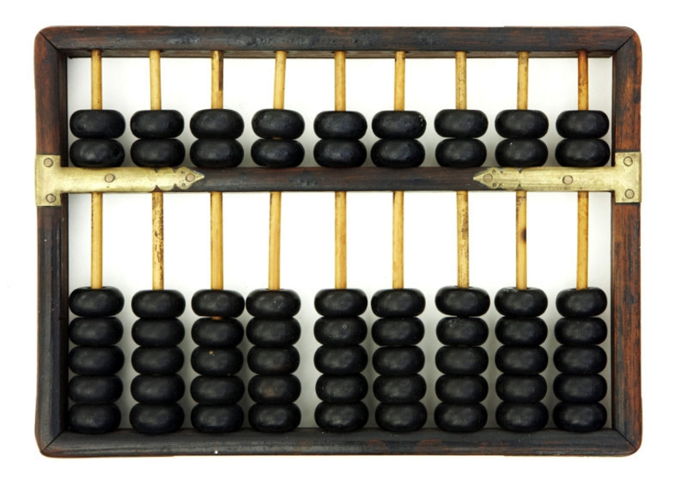
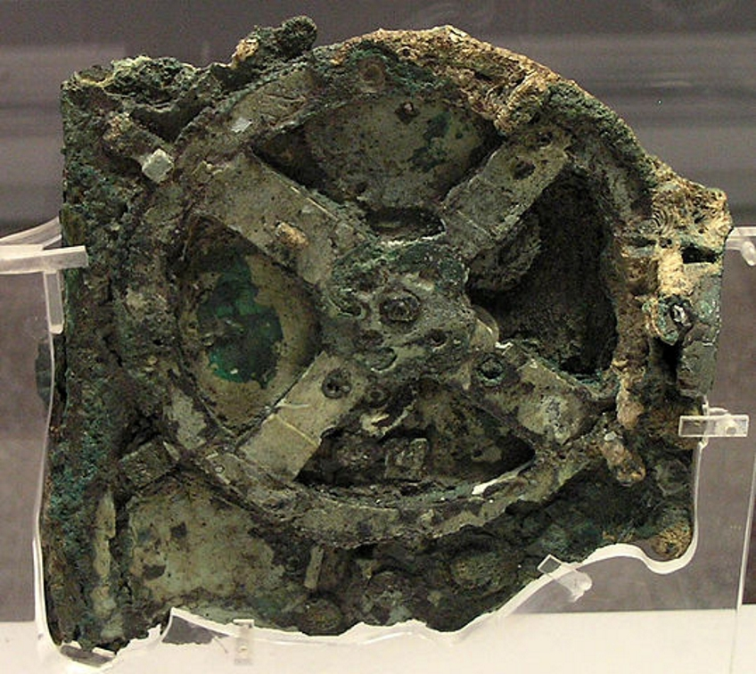
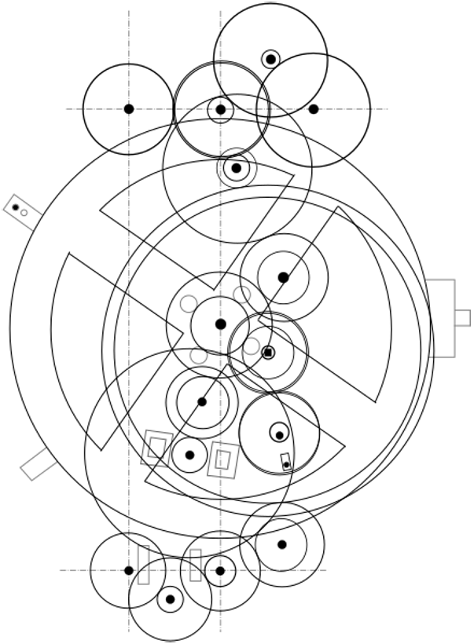
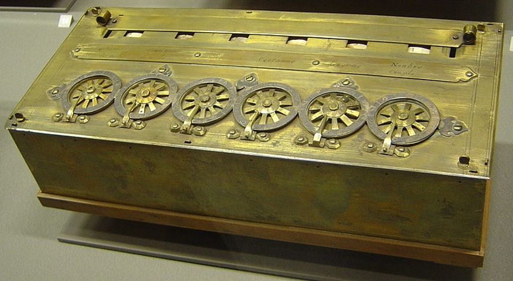
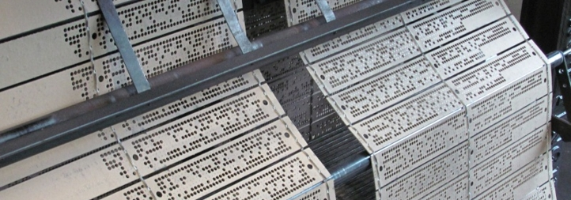
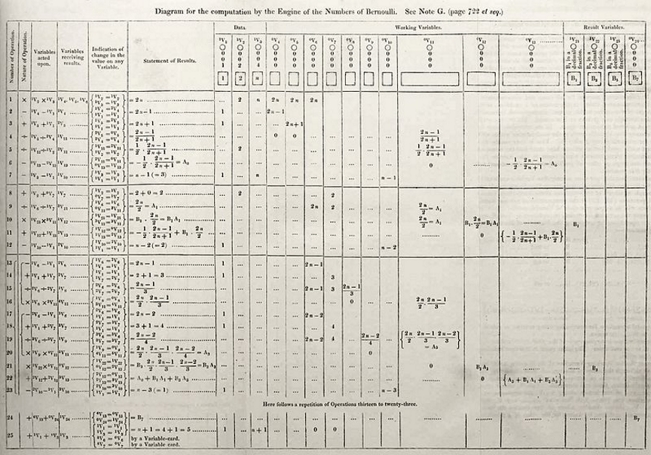
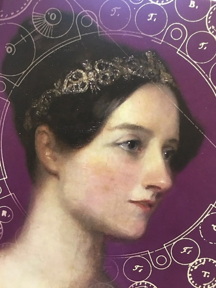
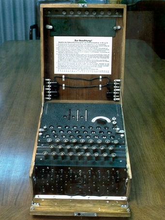
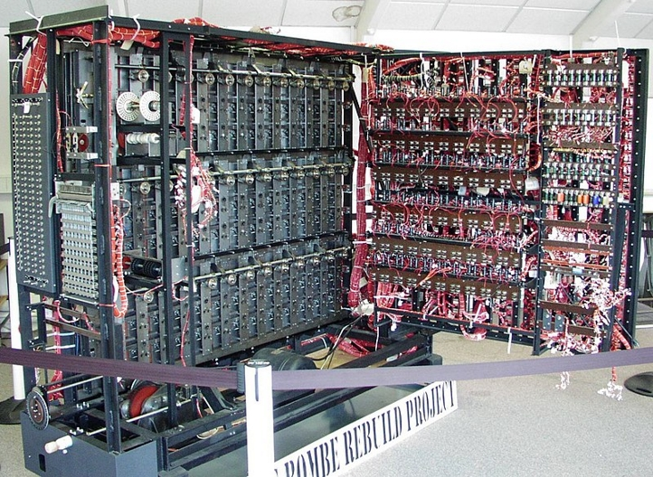
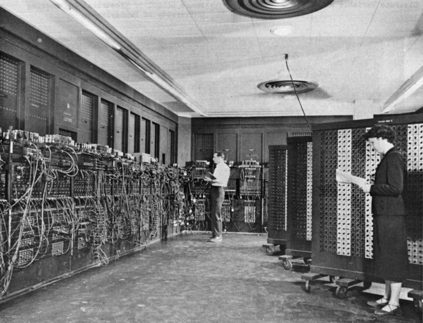

**pdf : [diapos](./1_intro-Beamer.pdf), [impression](./1_intro-Article.pdf)**

## Architecture des machines : le modèle de Von Neumann

### Un esprit universel
**John Von Neumann** : mathématicien, informaticien, ingénieur... Participa au projet Manhattan (première bombe atomique) et à l'ENIAC

En 1944, il propose un modèle _d'architecture_ novateur qui sert toujours de base à l'architecture des ordinateurs actuels.

### Modèle de Von Neumann



* **Processeur** : composé de deux unités
* **Unité de commande** : contrôle la séquence d'instructions
* **Unité arithmétique** : exécute les instructions
* **Mémoire** : contient les données et **les programmes**. 
    mémoire _volatile_ (qui s'efface après redémarrage, mais rapide)
    et de _masse_ (stockage)
* **Entrées** : clavier, cartes perforées, etc.
* **Sorties** : affichage, imprimante, écran

La nouveauté principale est de regrouper les _programmes_ et les _données_ dans une seule
mémoire. Les programmes _deviennent des données_ qu'on peut manipuler.


## Historique de la machine

Avant d'entrer dans le détail, bref historique

### Préhistoire informatique

* Compter : les doigts, les orteils et des outils.
* Concevoir des machines pour réaliser des calculs (_calculi_ mot latin qui signifie "cailloux").
    **Exemple** : Le _boulier_, découvert indépendamment par de nombreuses civilisations

### Antiquité : naviguer

La machine d'Anticythère, découverte en 1900 et datant de -87 avant J.-C.  servait à calculer les positions astronomiques et donc à **naviguer**

Elle démontre que :

* Calculer a toujours été une entreprise importante
* L'homme s'est toujours montré d'une très grande ingéniosité pour y parvenir

_Cette machine a été retrouvée dans un bateau assez quelconque, elle laisse supposer que ce genre d'appareil était courant..._

### Renaissance : Blaise Pascal

**Blaise Pascal**. Scientifique et penseur français du XVIIe siècle

* En physique : le _théorème de Pascal_ qui exprime les variations de pression dans un fluide
* En mathématiques : _calcul infinitésimal_, _raisonnement par récurrence_ etc.
* En philosophie et littérature : les _Pensées_ (1669)
* En ingénierie : la _Pascaline_. Première machine à calculer. Inventée à 19 ans pour aider son père devant remettre en ordre les recettes fiscales d'une province.

###  La pascaline

### Gottfried Wilhelm Leibniz

**Leibniz** (1646 - 1716) est un penseur allemand fait progresser la philosophie, les mathématiques, la physique et l'ingénierie autant que Pascal.

Il améliore la Pascaline et redécouvre le système **binaire**.

Néanmoins on n'utilisera réellement le binaire qu'après 1945.

### Premières machines programmables : métiers à tisser

**Joseph Marie Jacquard** (1752-1834) améliore des principes déjà existants pour concevoir une machine à tisser utilisant les cartes perforées de **Jean-Baptiste Falcon.**

Les métiers Jacquard sont encore utilisés dans le médical pour réaliser des coudières, genouillères et prothèses d'artères.

### Machine à calculer programmable

**Charles Babbage** constatant que les erreurs de calculs dans les tables conduisent à de nombreuses catastrophes invente en 1833 le concept de _machine (Difference Engine 1)_ permettant d'automatiser le calcul.

Il correspond ensuite avec **Ada Lovelace** (comtesse et fille du poète Lord Byron). Elle conçoit les premiers programmes pour cette machine. Elle est vue comme la première programmeuse du monde.

Trop complexe, trop coûteuse la machine de Babbage ne verra jamais le jour.

### Ada Lovelace

### Électricité

La révolution industrielle de la fin du XIXe siècle conduit à l'apparition de l'électricité et des moteurs qui améliorent les machines à calculer.

Par exemple, aux USA, **Herman Hollerith**, conçoit une machine qui divise par deux le temps nécessaire au recensement de la population. Sa société fusionnera pour devenir IBM.

### XXe siècle : un essor fulgurant

* Avant 1936 : première machine capable de _parallélisme_
* 1936 : **Alonzo Church** et **Kurt Gödel** fournissent un cadre théorique et Alan Turing propose un concept théorique de machine qui est encore utilisé.
* Seconde guerre mondiale. L'information est chiffrée et circule alors massivement via les ondes radio et le télégraphe. Le déchiffrement devient un enjeu mondial.
Citons Enigma, utilisée par les allemands, déchiffrée par Turing grâce à _la bombe_.

**Enigma**

**La bombe**

### ENIAC

Les machines sont encore colossales !

* ENIAC : 30 tonnes, 167 m$^2$, 160 kW pour 100 kHz et 100 000 additions par secondes.

* Programme sur cartes perforées, entièrement électronique. Servant au calcul balistique. Programmé par six femmes.

* Calcul d'une trajectoire d'une table de tir. Comparatif :

| Méthode                     | Durée  |
|-----------------------------|--------|
| Homme à la main             | 2,6 j  |
| Avec une machine à calculer | 12 h   |
| Model 5 (concurrent ENIAC)  | 40 min |
| ENIAC                       | 3 s    |
| PC ~2000                    | 30 µs  |

**l'ENIAC : un monstre**

---

## Le modèle de Von Neumann en détail

### Modèle de Von Neumann

* **Processeur** : composé de deux unités
* **Unité de commande** : contrôle la séquence d'instructions
* **Unité arithmétique** : exécute les instructions
* **Mémoire** : contient les données et **les programmes**. 
    mémoire _volatile_ (qui s'efface après redémarrage, mais rapide)
    et de _masse_ (stockage)
* **Entrées** : clavier, cartes perforées, etc.
* **Sorties** : affichage, imprimante, écran

### Principe général

L'ordinateur effectue des instructions en séquence.

Chaque instruction se découpe en trois parties :

* fetch (_récupérer_)
* read (_lire_)
* execute (_exécuter_)

C'est tout ce que fait un procésseur... mais il le fait 4 milliards de fois par seconde.

### Unité de commande

Elle contrôle les instructions réalisées par la machine.

C'est elle qui récupère les instructions et les décode.

Elle s'occupe donc des parties "fetch" et "read"

### Unité arithmétique et logique

Elle s'occupe de réaliser les _calculs_ à effectuer.

On a déjà rencontré un petit morceau d'unité arithmétique : l'additionneur 1 bit.

### Mémoire

Dans la mémoire on trouve à la fois les programmes et les données.

C'est la nouveauté majeure de ce modèle. Voir ainsi les programmes permet
de les modifier comme le reste des données. On peut ainsi créer des programmes
sur sa propre machine... ce que nous faisons en permanence en NSI d'ailleurs :)

### Entrées et sorties

L'interface du processeur. Sur un processeur moderne ce sont les broches.

### L'apport de von Neumann

John von Neumann élabore son modèle pour concevoir l'EDVAC, en juin 1945.

Dans ce modèle il est le premier à utiliser **une seule mémoire pour enregistrer les programmes et leurs données**.

Il reprend d'autres concepts comme la séparation entre la mémoire et le processeur.

En traitant les _instructions_ de la même manière que les _autres données_, il permet de concevoir des programmes
qui créeent d'autres programmes. Cette idée est à l'origine des _compilateurs_ et des _interpréteurs_.
