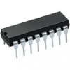
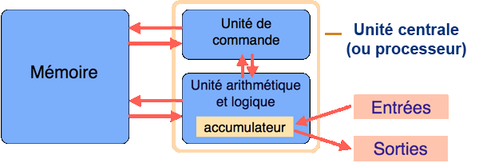

**pdf [diapos](./2_composants-Beamer.pdf), [impression](./2_composants-Article.pdf)**

## Un ordinateur utilise uniquement des "1" et des "0"

### Le transistor

Le **transistor** est un composant électronique qui sert d'interrupteur logique.

On le contrôle pour qu'il _arrête ou laisse passer_ le courant.

 

### Le circuit intégré

Il est composé de milliers de **transistors**

L'agencement de ces transistors permet de réaliser les portes logiques et d'autres circuits.

### Principe du transistor

Les transistors se comportent comme des interrupteurs : soit
le transistor laisse passer le courant électrique (interrupteur fermé),
soit il ne le laisse pas passer (interrupteur ouvert).

Le courant passe ou le courant ne passe pas.

### Du courant au binaire

L'ordinateur fonctionne uniquement avec deux états : "haut" et "bas":

* état "haut" symbolisé par le chiffre "1"
* état "bas" par le chiffre "0".

D'où le binaire.

### Opérations booléennes

Le transistor est l'élément de base des circuits logiques.

_Un circuit logique permet de réaliser une opération booléenne._ 

Ces opérations booléennes sont directement liées à l'algèbre de Boole

### Une opération booléenne : le OU logique

Table de vérité porte "OU" (cf partie _données : opération booléennes_) :
<!--  -->
<!-- | E1  | E2  | S   | -->
<!-- |---- |---- |---  | -->
<!-- | 0   | 0   | 0   | -->
<!-- | 0   | 1   | 1   | -->
<!-- | 1   | 0   | 1   | -->
<!-- | 1   | 1   | 1   | -->

## La mémoire vive et le processeur

### combinaisons de circuits logiques,

En combinant plusieurs fois le type de circuit décrit ci-dessus, réalise des circuits 
capable d'opérations plus complexes.\
$n$ additionneurs 1 bit $\rightarrow$ additionneur $n$ bits.

* à la base nous avons
le transistor. Une combinaison de transistors (sous forme de circuit
intégré) permet d'obtenir des circuits logiques,

* la combinaison de
circuits logiques permet d'obtenir des circuits plus complexes (par exemple
l'additionneur), et ainsi de suite...

* Au sommet de cet édifice : la mémoire vive (RAM) et le microprocesseur (CPU).

### La mémoire vive RAM (Random Access Memory)

Permet de stocker des données et des programmes.

La mémoire stocke les données (les bits), sous forme
d'états électriques (ce sont des circuits logiques !)

**Attention :** la mémoire ne gère pas les bits 1 par 1 mais _mot par mot_.

Un _mot_ pouvant mesurer 1 octet (8 bits), 2 octets... jusqu'à 8 octets, selon l'architecture du processeur.

Ainsi, dans un processeur moderne (64 bits), la mémoire est manipulée 64 bits à la fois.

### La mémoire vive

### Mémoire = série de cellules

Chaque cellule est capable de stocker 1 mot.

Chacune de ces cellules possède une _adresse_.

On peut accéder **directement** à une cellule par son adresse (Random Access)

### Opérations de la mémoire

### Deux opérations **lecture / écriture**.

* **Lecture :** lire l'octet situé à l'adresse mémoire XXXXX
* **Écriture :** écrire un octet donné à l'adresse mémoire YYYYY

**La mémoire vive est _volatile_**

Une cellule de mémoire doit être alimentée pour conserver son information.

**La mémoire vive est _relativement rapide_**

* Mémoire vive : de 10 à 100 ns
* disque dur : environ 1 ms ($10 000$ à $100 000$ fois plus lent...)

**Attention** il existe de plus petites mémoires entre le processeur et la RAM (registre, cache), 
beaucoup plus rapides.

### Ancien modèle de mémoire

1 bit d'une cellule est l'association d'un transistor et d'un condensateur.

**Condensateur** : composant électronique qui peut être soit chargé (on stocke alors
un "1"), soit déchargé (on stocke alors un "0").

Un condensateur doit être alimenté électriquement afin de conserver cette
charge.

### Modèle récent de mémoire

Circuit de type "bascule".

circuit de type bascule, permet de stocker 1 bit : combinaison de portes logiques.

### Conserver des données

Il faut faire appel à d'autres types de mémoires pour **conserver les données** : les mémoires de
stockage (disques dur).

## CPU (Central Processing Unit) : le microprocesseur

Le microprocesseur est le "cœur" d'un ordinateur : les instructions
sont exécutées au niveau du CPU.

### processeurs : 3 parties

-   les registres mémorisent de l'information (donnée ou
    instruction) au sein même du CPU.
-   L'unité arithmétique et logique (UAL ou ALU en anglais) est chargée
    de l'exécution de tous les calculs
-   L'unité de commande permet d'exécuter les instructions (les programmes)

## Le bus

Les données doivent circuler entre les différentes parties d'un ordinateur

Comment circulent ces données ?

Le système permettant cette circulation est appelé **bus**.

**3 grands types de bus :**

-   Le bus d'adresses
-   Le bus de données
-   Le bus de contrôle permet de spécifier le type d'action

## Le modèle de Von Neumann

* **Processeur** : composé de deux unités
* **Unité de commande** : contrôle la séquence d'instructions
* **Unité arithmétique** : exécution de ces instructions
* **Mémoire** : contient les données et **les programmes**
* **Entrées** : clavier, cartes perforées, etc.
* **Sorties** : affichages, imprimantes, écran
