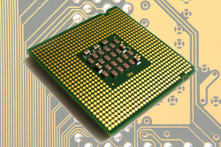

### PDF : [pour impression](./2_composants-Article.pdf), [diapos](./2_composants-Beamer.pdf)

# Un ordinateur utilise uniquement des "1" et des "0"

## Le transistor

Le transistor est un composant électronique qui sert d'interrupteur logique.

On le contrôle pour qu'il arrête le courant ou laisse passer le courant.

### 

## Le circuit intégré

Il est composé de milliers de transistors

### Un circuit intégré 

## Principe du transistor

Les transistors se comportent comme des interrupteurs : soit
le transistor laisse passer le courant électrique (interrupteur fermé),
soit il ne le laisse pas passer (interrupteur ouvert).

Le courant passe ou le courant ne passe pas.

## Du courant au binaire

L'ordinateur fonctionne uniquement avec deux états :

On parle d'un état "haut" et d'un état "bas".

* état "haut" symbolisé par le chiffre "1"
* état "bas" par le chiffre "0".

On travaille donc uniquement avec 2 chiffres, d'où le binaire.

## Opérations booléennes

Le transistor est l'élément de base des circuits logiques.
_Un circuit logique permet de réaliser une opération booléenne._ Ces opérations
booléennes sont directement liées à l'algèbre de Boole

## Une opération booléenne

cf partie _données : opération booléennes_

Table de vérité porte "OU" :

| E1  | E2  | S   |
|---- |---- |---  |
| 0   | 0   | 0   |
| 0   | 1   | 1   |
| 1   | 0   | 1   |
| 1   | 1   | 1   |

# La mémoire vive et le processeur

## combinaisons de circuits logiques,

En combinant plusieurs fois le type de circuit décrit ci-dessus, on
obtient des additionneurs capables d'additionner des nombres sur X
bits.

* à la base nous avons
le transistor, une combinaison de transistor (sous forme de circuit
intégré) permet d'obtenir des circuits logiques,

* la combinaison de
circuits logiques permet d'obtenir des circuits plus complexes (apr exemple
l'additionneur), et ainsi de suite...

* Au sommet de cet édifice (on pourrait parler de poupée russe), nous
allons trouver la mémoire vive (RAM) et le microprocesseur (CPU).

## La mémoire vive RAM (Random Access Memory)

Permet de stocker des données et des programmes.

La mémoire stocke les données (les bits), sous forme
d'états électriques (ce sont des circuits logiques !)

Attention : la mémoire ne gère pas les bits 1 par 1, _mais 8 par 8_ (octets) !

## La mémoire vive

### Mémoire = série de cellules

Chaque cellule est capable de stocker 1 octet.

Chacune de ces cellules possède une _adresse_.

### Deux opérations **lecture / écriture**.

* **Lecture :** lire l'octet situé à l'adresse mémoire XXXXX
* **Écriture :** écrire un octet donné à l'adresse mémoire YYYYY

## La mémoire vive est _volatile_

### Ancien modèle

1 bit d'une cellule est l'association d'un transistor et d'un condensateur.

**Condensateur** : composant électronique qui peut être soit chargé (on stocke alors
un "1"), soit déchargé (on stocke alors un "0").

Un condensateur doit être alimenté électriquement afin de conserver cette
charge.

Toutes les données présentes en mémoire sont perdues en cas de coupure de
courant.

## La mémoire vive est _volatile_

### Modèle récent

Circuit de type "bascule".

circuit de type bascule, permet de stocker 1 bit : combinaison de porte logique.

## Conserver des données

Il faut faire appel à d'autres types de mémoire : les mémoires de
stockage : le disque dur

# CPU (Central Processing Unit) : le microprocesseur

microprocesseur 

Le microprocesseur est le "cœur" d'un ordinateur : les instructions
sont exécutées au niveau du CPU.

## processeurs : 3 parties

-   les registres mémorisent de l'information (donnée ou
    instruction) au sein même du CPU.
-   L'unité arithmétique et logique (UAL ou ALU en anglais) est chargée
    de l'exécution de tous les calculs
-   L'unité de commande permet d'exécuter les instructions (les programmes)

# Le bus

## Le bus

Comment circulent les données ?

Les données doivent circuler entre les différentes parties d'un ordinateur

Le système permettant cette circulation est appelé bus.

**3 grands types de bus :**

-   Le bus d'adresse
-   Le bus de données
-   Le bus de contrôle permet de spécifier le type d'action

## Le bus

### bus 

# Le modèle de Von Neumann

## Modèle de Von Neumann

### 

* **Processeur** : composé de deux unités
* **Unité de commande** : contrôle la séquence d'instruction
* **Unité arithmétique** : exécution de ces instruction
* **Mémoire** : contient les données et **les programmes**
* **Entrées** : clavier, cartes perforées, etc.
* **Sorties** : affichages, imprimantes, écran
