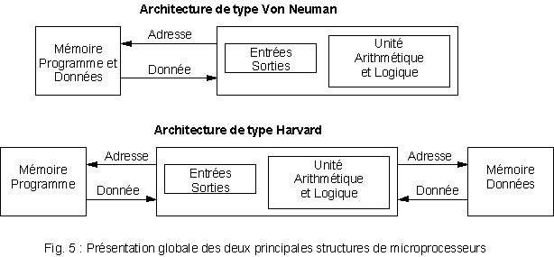

### Application : extrait du sujet de bac [polynésie 2021, partie architecture](./polynesie_2021_archi.pdf)

---

[pdf](./6_comparaison_archi.pdf)

---

## L'architecture des microprocesseurs

Nous avons rencontré l'architecture de Von Neumann.

Dans celle-ci, la mémoire **est unique**. Elle permet d'enregistrer à la fois
les instructions et les données.

Ce n'est pas la seule architecture employée actuellement.

Il existe aussi l'architecture de Harvard dont l'usage est généralement reservé aux microcontrôleurs.

## Architecture de Harvard

$\;$

## Comparaison à l'architecture de Von Neumann

* l'architecture de Von Neumann n'utilise qu'une seule mémoire pour enregistrer ses programmes et ses données.
* l'architecture de Harvard utilise deux mémoires différentes (et donc deux bus différents).

## Programme se modifiant lui même

L'intérêt majeur de l'archicture de Von Neumann est de pouvoir modifier (installer, effacer, mettre à jour etc.) les programmes qui sont traités comme des _données_.
C'est indispensable pour disposer d'un système d'exploitation complet.

Généralement, la mémoire "programme" d'une architecture de Harvard est une ROM (Read Only Memory). Le programme ne peut se modifier lui même. Cela empêche les mises à jour des programmes autrement qu'en mettant la ROM à jour (flashage). On ne peut utiliser d'OS grand public sur une architecture de Harvard.

## Est-ce mieux ?

Cela dépend des contextes !

* L'architecture de Von Neumann est plus souple, on peut l'employer avec peu d'instructions, beaucoup d'instructions, peu de mémoire, beaucoup de mémoire...
* L'architecture de Harvard est spécifique et demande d'anticiper l'usage durant la phase de conception du processeur. Si on ne tire pas partie de cette simultanéité, alors elle ne fait que compliquer le développement.

Notons que les deux familles de processeurs qu'on rencontre dans la majorité des machines modernes grands publics (ARM vs x86 ou, pour simplifier, Mobile vs PC) ont un nombre d'instructions très différent.

Les processeurs ARM disposent de peu d'instructions contrairement aux processeurs x86 qui en ont beaucoup.
L'architecture de Von Neumann permet de modéliser ces deux types de processeurs facilement.

C'est la raison pour laquelle on réserve l'architecture de Harvard à des
contextes très spécifiques.

## Est-ce utilisé ? Microcontôleur vs Microprocesseur

Pour faire très simple :

* les deux architectures sont utilisées
* parfois dans un seul processeur

Dans les "ordinateurs" (smartphone, PC, Mac, Consoles etc.) on utilise
des micro**processeurs**. Ils doivent être disposés sur une carte comportant les autres éléments : mémoire, entrées sorties etc. 
Dans cette situation on emploie l'archicture de Von Neumann.

Dans les machines spécifiques (contrôleurs embarqués dans les micro-ondes, enceintes,
puces wifi, contrôleur d'une pompe à injection etc.) l'usage est spécifique
et on utilise des micro**contrôleurs**. La quantité de mémoire nécessaire est
bien moindre et ces machines n'évoluent généralement pas. Il est plus simple
de les remplacer directement. On emploie alors une architecture de Harvard
afin d'accélérer les traitements particuliers.

### Qu'est-ce qu'un **microcontrôleur** ?

Un microcontrôleur (en notation abrégée µc, ou uc ou encore MCU en anglais) est
un circuit intégré qui rassemble les éléments essentiels d'un ordinateur :
processeur, mémoires (mémoire morte et mémoire vive), unités périphériques et
interfaces d'entrées-sorties. Les microcontrôleurs se caractérisent par un plus
haut degré d'intégration, une plus faible consommation électrique, une vitesse
de fonctionnement plus faible (de quelques mégahertz jusqu'à plus d'un
gigahertz) et un coût réduit par rapport aux microprocesseurs polyvalents
utilisés dans les ordinateurs personnels.

$\:$

Par rapport à des systèmes électroniques à base de microprocesseurs et autres
composants séparés, les microcontrôleurs permettent de diminuer la taille, la
consommation électrique et le coût des produits. Ils ont ainsi permis de
démocratiser l'utilisation de l'informatique dans un grand nombre de produits
et de procédés.

Les microcontrôleurs sont fréquemment utilisés dans les systèmes embarqués,
comme les contrôleurs des moteurs automobiles, les télécommandes, les appareils
de bureau, l'électroménager, les jouets, la téléphonie mobile, etc.

### Rappels : microprocesseur

Ils disposent de mémoire en dehors du cache présent sur la puce.

L'ordinateur boot à l'aide d'un petit programme en mémoire ROM, charge ses programmes
dans la RAM qui contient aussi les données. Les programems sont exécutés depuis
la mémoire qui occupe généralement quelques gigaoctets.

Cela engendre un problème appelé "von Neumann bottleneck", la vitesse de transfert
entre la mémoire et le CPU étant limitée. L'usage de la mémoire est limité
par ce goulot d'étranglement. Cela ralenti considérablement l'exécution de tâches
très simples sur de grandes quantités de mémoire (ajouter 1 à 3000 nombres différents).

Depuis la fin des années 70 de nombreuses solutions sont mises en oeuvre
pour améliorer l'architecture de Von Neumann (utilisation du cache, anticiper
le résultat d'une instruction, concentrer la mémoire à proximité du CPU etc.)

L'utilisation de l'architecture de Harvard est une réponse à ce problème.

### Mais... ça vaut le coup d'avoir une seule mémoire ?

Considérer les programmes comme des données est ce qui permet de développer
des programmes. Sans ça, il n'est pas possible d'assembler, de compiler,
de lier, de charger les programmes. Il n'y a donc pas de langage informatique,
seulement des instructions qu'on suit les unes à la suite des autres.

Ainsi, on programme les microcontrôleurs depuis un ordinateur. Une fois
le programme écrit il est traduit en code machine spécifique au microcontroleur
et chargé dans celui-ci.

### TLDR

Les microprocesseurs peuvent modifier leurs propres programmes. En conséquence
ils sont universels et peuvent exécuter n'importe quel programme.

Les microcontroleurs ne peuvent modifier leurs programmes. Ils font généralement
une seule chose mais très vite... ou alors en consommant très peu de ressources.

## Marchés

Marché des microprocesseurs en 2020 : 2.3 milliards d'unités produites

| Segment     | Unités produites |
|-------------|------------------|
| Smartphones | 1800 millions    |
| Laptops     | 166 millions     |
| Tablettes   | 137 millions     |
| Desktop     | 88 millions      |

Marché des microcontrôleurs en 2020 : 27 milliards d'unités produites...
soit _douze fois plus_.

| Segment | Pourcentage |
|---------|-------------|
| 32 bits | 40%         |
| 16 bits | 24%         |
| 8 bits  | 33%         |
| divers  | 3%          |

Dernières donnée : dans une voiture moderne, on trouve une centaine de microcontroleurs... mais aussi des microprocesseurs.

## Historique

Le nom de l'architecture de Harvard vient du nom de l’université Harvard où une telle architecture a été mise en pratique pour la première fois avec le Mark I en 1944.

## Usage de l'architecture de Harvard

### Processeur de signal numérique (_DSP_) 

Un DSP (de l'anglais « Digital Signal Processor », qu'on pourrait traduire par
"processeur de signal numérique" ou "traitement numérique de signal") est
un microprocesseur optimisé pour exécuter des applications de traitement
numérique du signal (filtrage, extraction de signaux, etc.) le plus rapidement
possible.

Les DSP sont utilisés dans la plupart des applications du traitement numérique
du signal en temps réel. On les trouve dans les modems (modem RTC, modem ADSL),
les téléphones mobiles, les appareils multimédia (lecteur MP3), les récepteurs
GPS... Ils sont également utilisés dans des systèmes vidéo, les chaînes de
traitement de son, partout où l'on reçoit un signal complexe que l'on doit
modifier à l'aide du filtrage.

### Signal ?

Si l'informatique ne traite que des 1 et des 0, le monde qui nous entoure
est différent. L'information (la voix, la lumière, le rayonnement) circule
sous la forme d'ondes (éléctromagnétique pour la lumière, la radio etc., mécanique
pour le son). Afin de capter ces ondes (photographie, microphone, téléphone
analogique) ou de les émettre (écran, enceintes) il convient de transformer
ce signal analogique (ondes) en numérique (0/1) et inversement.

Par opposition à un traitement de texte ou une base de donnée, le traitement
du signal nécessite beaucoup d'opérations mathématiques

|                  | **Manipulation des données**  | **Calculs mathématiques**     |
|------------------|-------------------------------|-------------------------------|
| **Applications** | Traitement de texte           | Simulation                    |
|                  | base de données               | Signal                        |
| **Opérations**   | Mouvent de données (`A <- B`) | Addition (`C <- A + B`)       |
|                  | Conditions (`Si A=B...`)      | Multiplication (`C <- A + B`) |

## Intérêt

## Nombre de cycles nécessaires pour réaliser une opération courante

L'architecture de Von Neumann n'emploie qu'un bus, c'est une contrainte supplémentaire :
les opérations doivent être planifiées car elles ne peuvent être réalisées en même
temps. Ainsi `c = a + b` nécessite de :

* lire la valeur de `a`,
* lire la valeur de `b`,
* calculer `a + b`,
* écrire la valeur de `c`.

L'architecture de Harvard permet d'accéder à la fois aux données et aux instructions simultanément.

Ainsi, `c = a + b` nécessite de :

* lire la valeur de `a`,
* lire la valeur de `b` **ET** calculer `a + b` en même temps,
* écrire la valeur de `c`.

La différence est modeste, mais répétée des milliards de fois par seconde...

## Conclusion

Spécialiser les machines permet de les rendre plus rapides ou plus économes.
En contrepartie, on perd la souplesse d'usage et on complexifie leur conception.

Selon qu'on souhaite créer un processeur généraliste, capable d'écrire un programme
et de l'optimiser et surtout de faire n'importe quoi (microprocesseur) ou un
processeur spécifique dont la fonction est généralement unique
(microcontroleur) on privilégie une architecture (Von Neumann) ou une autre
(Harvard).

