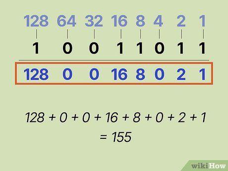
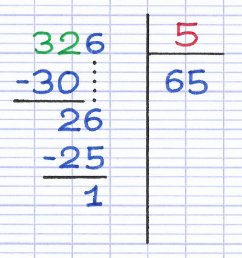
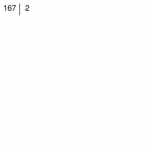

# Représenter des entiers en machine : le système binaire

pdf [pour impression](/uploads/docsnsi/donnees_qkzk_img/binaire_print.pdf) et [diaporama](/uploads/docsnsi/donnees_qkzk_img/binaire_slides.pdf)

## Binaire

### Différentes bases

Dans la vie courante on utilise la base 10.

En informatique on rencontre d'autres manières de représenter les nombres :

* binaire
* complément à 2
* octal
* hexadécimal etc.
* nombres à virgules flottantes


Quand on creuse, c'est encore plus complexe. Par exemple le langage Rust utilise 14 types différents pour représenter les nombres !

Pourquoi autant ?

Définir plusieurs types permet d'économiser de l'espace mémoire :

- `u8` est un type d'entiers positifs occupant 8 bits donc s'étant de 0 à $2^8 - 1 = 255$
- `u64`, la même chose mais de 0 à $2^{64} - 1$.
- `i8` cette fois on s'autorise des nombres négatifs, toujours sur 8 bits, de $-2^7=-128$ à $2^7 - 1 = 127$.
- etc.

Cette complexité supplémentaire offre une connaissance précise de la représentation en mémoire.

En Python, par contre, on se situe beaucoup plus haut : les entiers n'ont pas de limite de taille et peuvent être positifs ou négatifs. Il est impossible de savoir précisemment comment un entier sera représenté en mémoire sans entrer dans les détails du code.


### Système de représentation par position

Qu'on utilise la base 10, 2, 8, 16 ou autre, on emploie toujours
_la numération par position._



**Représentation par position** : La position d'un chiffre définit la valeur associée à ce chiffre.


### Numération par position

**Exemple** : En base 10 :

$$345 = 3\times100 + 4\times10 + 5 = 3\times 10^2 + 4\times10^1+5\times10^0$$

Le $3$ de $345$ représente donc $300$, le $4$ représente $40$ etc. On a pourtant $3 < 4$...


En binaire, on a deux chiffres. Chaque chiffre est un _bit_ (=**bi**nary digi**t**).

$$0b1101 = 1 \times 2^3 + 1\times 2^2 + 0\times2^1 + 1\times2^0 = 13$$

Afin d'indiquer une représentation binaire on utilise $0b$ avant le nombre ou $_2$ après le nombre :

$$0b1101 = 1101_2 = 13$$



### Les puissances de 2

Les puissances de 10 c'est facile : 1, 10, 100, 1000 etc. mais celles de 2 demandent un effort.


| $n$   | 0   | 1   | 2   | 3   | 4    | 5    | 6    | 7     | 8     | 9     | 10     | 11     | 12     | 13     | 14      |
| :---: | :-: | :-: | :-: | :-: | :--: | :--: | :--: | :---: | :---: | :---: | :----: | :----: | :----: | :----: | :-----: |
| $2^n$ | 1   | 2   | 4   | 8   | 16   | 32   | 64   | 128   | 256   | 512   | 1024   | 2048   | 4096   | 8192   | 16384   |


**Conseil :** retenez les par coeur en jouant à [2048](https://play2048.co/).

### Vocabulaire 


- _bit_ : symbole 0 ou 1. Ce sont les _chiffres_ de la représentation binaire.
- _octet_ :, en anglais _byte_, bloc de 8 bits. La _mémoire_ de l'ordinateur n'est pas capable de lire 1 bit à la fois. Elle répond avec des _blocs_ d'un ou de plusieurs octets. 


Exemples :

- 2MB = 2 Mega bytes = 2 Mega Octets = $2 \times 10^6$ octets = $16\hspace{2mm}000\hspace{2mm}000$ bits.
- $0b1101\hspace{1mm}1001 = 217$. Ce nombre a 8 bits et occupe un octet en mémoire.

---

## Du binaire au décimal.


Pour convertir un entier donné en binaire on le lit depuis la droite et on fait la somme des puissances de 2 où se situent les 1.

$0b10011$ = 1 + 2 + 0 + 0 + 16 = 19.

Autre notation : $10011_2 = 19_{10}$


Autre exemple :

La représentation décimale de $0b101010$ est

$$0\times2^0+1\times2^1+0\times2^2+1\times2^3+0\times2^4+1\times2^5$$
$$=2+8+32$$
$$=42$$

Encore un :

$0b1001\hspace{1mm}1011 = 2^7 + 2^4+2^3+2^1+2^0 = 128 + 16 + 8 + 2 + 1 = 155$




### Exercice 1

* Donnez les valeurs entières représentées par $0b0100$, $0b10101$, $0b101$,
$0b0101$ et $0b00101$.

* Trier par ordre croissant $0b11$, $0b100$, $0b111$ et $0b1000$.


---

## Du décimal au binaire.

Deux algorithmes majeurs.

* Facile _de tête_ : soustraire des puissances de 2.
* Facile _à programmer_ : les divisions successives.


### Décimal au binaire avec les puissances de 2.

Écrire 57 en base 2 (=donner sa représentation binaire).

* $32<57<64$.

    Donc on fait $57 = 32 + 25 = 2^5 + 25$. On a un chiffre 1 à la position 6.

* $16<25<32$. 

    Donc on fait $25 = 16 + 9 = 2^4 + 9$. On a un chiffre 1 à la position 5.

* $8<9<16$. 

    Donc on fait $9 = 8 + 1 = 2^3 + 1$. On a un chiffre 1 à la position 4.

* $1=2^0$. 

    On peut s'arrêter dès qu'on atteint une puissance de 2. On a un chiffre 1 à la position 1.

$$57 = 0b111001$$


$$57 = 32 + 16 + 8 + 1 = 0b111001$$



_Autre exemple :_

$$123 = 64 + 59 = 64 + 32 + 27$$
$$123 = 64 + 32 + 16 + 11$$
$$123 = 64 + 32 + 16 + 8 + 3$$

$$123 = 64 + 32 + 16 + 8 + 2 + 1 = 0b1111011$$



### Du décimal au binaire avec les divisions successives

_La méthode précédente est très facile à mettre en oeuvre de tête. Elle est moins simple à **programmer** que la suivante._

### Rappel : division euclidienne





**Algorithme des divisions successives**

1. On divise par 2 **jusqu'à ce que le quotient soit 0**
2. Les restes successifs sont les bits qu'on lit en montant de droite à gauche : 


Remarque : _Le diviseur est toujours 2 donc le reste est toujours 0 ou 1. Le reste est $0$ si $n$ pair et $1$ si $n$ est impair_.


Exemple : 167 en binaire

 

$$167 = 0b1010\hspace{1mm}0111$$


### Exercice 2

Donner les représentations binaires de :

- 14
- 78
- 31
- 32

---


## Binaire en Python


Python dérivant du langage C, les nombres en binaire sont notés `0bxxxx`

Python converti naturellement un entier **d'une base *b* vers le décimal** avec `int(nombre, b)`

La conversion **vers le binaire** se fait avec `bin` et renvoie une _chaîne de caractères_.

```python
>>> 0b111011
59
>>> a = '0b11'
>>> int(a, 2)
3
>>> b = 10
>>> bin(b)
'0b1010'
```


Faites bien attention :

* `0b111011` est un `int` qu'on a écrit sous forme binaire et dont la valeur est 59.
* `"0b111011"` est une `str` qu'on peut _convertir_ en entier avec `int`.

### Les nombres en mémoire


**ATTENTION** En mémoire, ce sont des entiers encodés en binaire.

```python
>>> 4 + 5
9
```

Ainsi, pour réaliser l'opération `4+5` Python converti d'abord en binaire,
additionne puis converti en décimal pour afficher `9`.


---

## Taille des nombres

<!-- Complément info : convertisseur binaire à la main, algo à la main -->

### Taille d'un nombre en binaire

Le **nombre de bit** d'un entier nous indique l'espace mémoire _minimal_ qu'il
faudra pour le stocker.

$123 = 0b111\hspace{1mm}1011$ il faut au moins 7 bits pour stocker ce nombre.

Les machines utilisent des blocs de taille 1 octet (=8 bits) et ce nombre entre dans un octet.

### Taille et opérations


Si $x$ occupe `n` bits et $y$ occupe `p` bits alors :

* **SOMME**  : $x + y$ occupe au plus `max(n, p) + 1` bits,
* **PRODUIT** : $x \times y$ occupe au plus `n + p` bits.

| Nombre         	| $x$ 	| $y$ 	| $x+y$                	| $x\times y$     	|
|----------------	|-----	|-----	|----------------------	|-----------------	|
| Nombre de bits 	| $n$ 	| $p$ 	| $\leq max(n, p) + 1$ 	| $\leq n + p$     	|


### HP : Le logarithme binaire




En mathématique, la fonction $\ln$ pour _logarithme népérien_ ou _logarithme naturel_
est une fonction ayant d'importantes propriétés.

Rendue populaire par Napier, elle a permis de considérablement simplifier les calculs à la main.

_Vous verrez en mathématiques qu'elle permet de transformer les produits en somme : $\ln (a \times b) = \ln a + \ln b$_

Une de ses propriétés est de donner une mesure du nombre de chiffres d'un nombre dans une base :

Si $t$ est la taille de $x$ en base $b$ alors $$\frac{\ln(n)}{\ln(b)} \leq t < 1 + \frac{\ln(n)}{\ln(b)}$$


Pour nous, cela se traduit ainsi :



En notant $\log_2 (n) = \frac{\ln n}{\ln 2}$ et $\lceil x \rceil$ l'arrondi supérieur de $x$ :

Le nombre de bits d'un entier $n$ est $\lceil \log_2(x + 1) \rceil$.




### Octets 

Un octet est un bloc de 8 bits. Il y a donc $2^8=256$ octets différents, de 0 à 255. 


$2^8$ : deux (le nombre de symboles) à la puissance 8 (le nombre de "cases").

Par exemple, pour des nombres décimaux occupant 6 chiffres au plus, il y a $10^6$, un million, de valeurs.



Quelques valeurs remarquables parmi les 255 :

- $0b0000\hspace{1mm}0000 = 0$, le plus petit octet
- $0b0000\hspace{1mm}0001 = 1$
- $0b0000\hspace{1mm}0010 = 2$
- $0b0000\hspace{1mm}0100 = 4$
- $0b0000\hspace{1mm}1000 = 8$
- $0b0001\hspace{1mm}0000 = 16$
- $0b0010\hspace{1mm}0000 = 32$
- $0b0100\hspace{1mm}0000 = 64$
- $0b1000\hspace{1mm}0000 = 128$
- $0b1111\hspace{1mm}1111 = 255$, le plus grand octet.

---

## Conclusion 


La notation positionnelle en base 2, appelée _notation binaire_ permet de représenter tous les entiers naturels avec les symboles 0 et 1 (appelés _bits_).

Un bloc de 8 bits est un _octet_, il y a 256 octets, de 0 à 255 ou de $0b0000\hspace{1mm}0000$ à $0b1111\hspace{1mm}1111$.

Pour convertir du binaire au décimal, on compte les bits présents de la droite vers la gauche et on double la puissance à chaque étape. $0b1011 = 1 + 2 + 0 + 8 = 11$

Pour convertir du décimal au binaire on peut :

- de tête, soustraire des puissances de 2 : $55 = 32 + 16 + 8 + 1 = 0b11\hspace{1mm}1001$
- dans une machine, diviser successivement par 2 et remonter les restes, qui forment les bits.
    
     

    $167 = 0b1010\hspace{1mm}0111$

- Lorsqu'on ajoute 2 nombres en binaire, l'espace nécessaire à la somme est $\leq$ à la plus grande des deux taille augmentée de 1. (7 bits et 8 bits donnent 8 ou 9 bits)
- Lorsqu'on multiplie deux nombre, la taille du produit est la somme des tailles (7 bits fois 5 bits donnent 12 bits).

Python : 

- accepte les _entiers_ notés en binaire `0b111000` et `56` représentent le même nombre, 
- du binaire au décimal `int("0b111000", 2) -> 56` (on obtient un `int`),
- du décimal au binaire `bin(56) -> "0b111000"` (on obtient une `str`)


