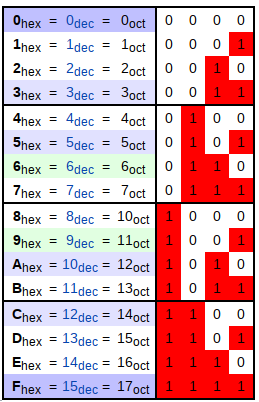
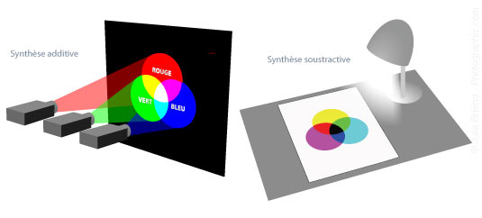
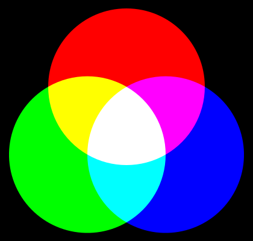
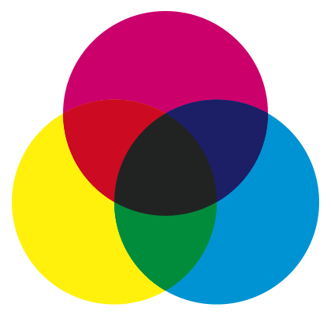
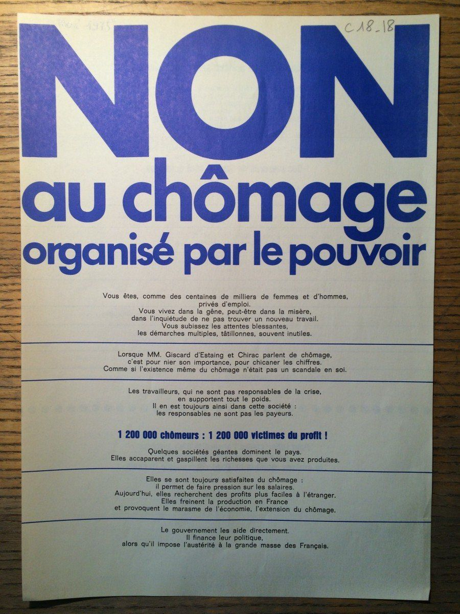
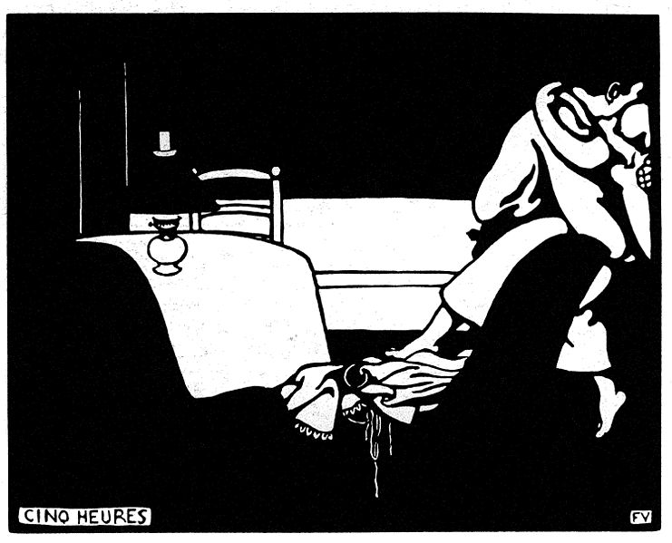

[pdf](./hexa_cours.pdf)

---


## Hexadécimal


Les nombres en binaires sont longs.
On utilise la base 16 pour les manipuler plus facilement.
$16=2^4$, c'est avantageux.

Le principe reste la notation positionnelle déjà abordée en binaire et utilisée en décimal.


### Chiffre hexadécimaux

On utilise 16 chiffres :

|   Hexa  	| 0 	| 1 	| 2 	| 3 	| 4 	| 5 	| 6 	| 7 	| 8 	| 9 	|  A 	|  B 	|  C 	|  D 	|  E 	|  F 	|
|:-------:	|:-:	|:-:	|:-:	|:-:	|:-:	|:-:	|:-:	|:-:	|:-:	|:-:	|:--:	|:--:	|:--:	|:--:	|:--:	|:--:	|
| Décimal 	| 0 	| 1 	| 2 	| 3 	| 4 	| 5 	| 6 	| 7 	| 8 	| 9 	| 10 	| 11 	| 12 	| 13 	| 14 	| 15 	|


### 16 chiffres : 0 1 2 4 5 6 7 8 9 A B C D E F


**Je répète : il y a 16 chiffres en hexadécimal : 0 1 2 4 5 6 7 8 9 A B C D E F**

**3** est un chiffre en hexadécimal. Il vaut 3 en décimal.\
**A** est un chiffre en hexadécimal. Il vaut 10 en décimal.\
**F**  est un chiffre en hexadécimal. Il vaut 15 en décimal.



**il y a 16 chiffres en hexadécimal : 0 1 2 4 5 6 7 8 9 A B C D E F**

Quels sont les chiffres hexadécimaux :

**0 1 2 4 5 6 7 8 9 A B C D E F**

**A** est un chiffre hexadécimal qui vaut dix.

**E** est un chiffre hexadécimal qui vaut quatorze.


_Apprenez le, on vous le demandera en devoir._



### Notations

On rencontre plusieurs formats selon le contexte :

| Maths       	| Python   	| CSS     	|
|-------------	|----------	|---------	|
| $A3BC_{16}$ 	| `0xA3BC` 	| `#A3BC` 	|


## Conversions avec Python 


```python 
>>> 0xc0ffee                      # un entier noté en hexadécimal 
12648430
>>> hex(424242)                   # représentation hexa d'un entier 
'0x67932'
>>> int("0x123456789ABCDEF", 16)  # de l'hexa au décimal
81985529216486895
```


### Exercice 1 

Répondre dans la cellule de code ci-dessous :


a = 0xAAB2CD

# Afficher la représentation décimale de a

# Afficher la représentation binaire de a

b = 0b1100_1011_0110_1101

# Afficher la réprésentation décimale de b 

# Afficher la représentation hexadécimale de b 

c = "0x12ABDF"

# Convertir c en sa valeur décimale et l'afficher 

# Afficher la représentation binaire de c



---

## Représenter facilement des octets

Pour la machine, l'unité de stockage la plus petite n'est pas le bit mais l'octet.

_On ne peut pas écrire un bit en mémoire, on doit **écrire au moins un octet à la fois**_.

### Comment représenter facilement un octet ?

256 octets possibles donc 256 symboles. Difficile.

Mais  $256 = 16^2$ : on peut utiliser 2 symboles en base 16.


**Un octet est représenté par 2 chiffres hexadécimaux**


Ainsi, lorsqu'on lit depuis la mémoire `0xA4` cela représente _un octet_ valant 164.

L'interprétation dépend du contexte (caractère ? nombre ? ou tout autre chose...)

### Exercice 2 

1. Sur 2 chiffres hexadécimaux, quel est le plus petit grand qu'on puisse écrire ? 
2. Combien y-a-t-il d'octets différents ?
3. Sans calcul, déterminer l'entier associé à `0xFF`.

---

## Conversions

### Hexadécimal -> binaire

Convertir un binaire en hexa est facile.


**Chaque paquet de 4 bits donne un chiffre hexa :**

```
binaire:  1010 0011 1011 1100
décimal:    10    3   11   12
hexa   :     A    3    B    C
```

`0b 1010 0011 1011 1100 = 0xA3BC`


Pour aller vite on peut utiliser une table



### Exercice 3 

Convertir en hexadécimal les nombres suivants :

1. `a = 0b 1101`
2. `b = 0b 0101`
3. `c = 0b 1101 0101`
4. `d = 0b 1010 0101`

### Hexadécimal -> décimal

_Approche similaire à la conversion binaire -> décimal_

Pour convertir $4D5_{16}$ de l'hexa. vers le décimal,\
on commence par le dernier chiffre :

* $5 \times 16^0$ et on recule :
* $D \times 16 = 13 \times 16^1$ ($D$ correspond au nombre 13)
* $4 \times 16^2$

$$4D5_{16} = 5 \times 16^0 + 13\times 16^1 + 4\times 16^2 = 1~237_{10}$$

### Exercice 4 

Convertir en décimal les nombres hexadécimaux suivants :

1. `a = 0xFD`. Vérifier en vous souvenant que `0xFF = 255`
2. `b = 0xADF`
3. `c = 0xD78`

### Décimal -> hexadécimal

_Approche similaire à la conversion décimal -> binaire_

Divisions entières successives par **16** _jusqu'à trouver 0_.\
Les **restes** donnent les chiffres dans l'ordre **inverse**

$$959 = 59 \times 16 + 15  \longrightarrow F$$
$$59 = 3 \times 16 + 11    \longrightarrow B$$
$$3 = 0 \times 16 + 3  \longrightarrow 3$$
$$959_{10} = 3BF_{16}$$

### Exercice 5 

Donner la représentation hexadécimale des nombres suivants :

_Essayez de le faire de tête ! Vous en êtes tous capables._

1. 255 
2. 128 
3. 127 
4. 64
5. 67

### Python

```python
>>> int('3BF', 16)
959
>>> hex(959)
'0x3bf'
>>> 0xA3BC # c'est un entier pas une chaîne !!!
41916
>>> 0xa3bc # majuscule ou minuscule
41916
```

---

## Les couleurs

En informatique on distingue

* les couleurs à l'écran : synthèse additive
* les couleurs imprimées : synthèse soustractive




### Synthèse additive



* En **synthèse additive** on utilise 256 niveaux de couleur pour les composantes Rouge, Vert et Bleu.
* Chaque niveau de couleur est codé sur un octet.

Par exemple :

`#FF0080` : `FF` rouge à fond, `00` pas de vert, `80` bleu à moitié :\
un joli rose, noté parfois : `rgb(255, 0, 128)`


Quelques exemples :

~~~
blanc #FFFFFF     noir    #000000
rouge #FF0000     jaune   #FFFF00
vert  #00FF00     cyan    #00FFFF
bleu  #0000FF     magenta #FF00FF
~~~

Il convient d'être capable de _vaguement_ reconnaître une couleur à partir de sa valeur :

```
??? #FF8800 ???
```



<div style="background-color:#FF8800; text-align: center; height=30px;">
De l'orange...
</div>

- rouge : 0xFF = 255 = à fond,
- vert : 0x80 = 128 en décimal (voir plus haut), à moitié,
- bleu : 0x00 

On a bien de l'orange.


### Exercice 6

_Une pensée pour les daltoniens._ Je sais, c'est pas facile. Si les noms n'ont pas toujours beaucoup de sens, les représentations ne sont que des symboles. Certes <span style="background-color: red;">ROUGE</span> et <span style="background-color: green;">VERT</span> vous sont peut-être indiscernables, mais `0xFF0000` et `0x00FF00` ne devraient pas poser de problème.


1. Les colonnes du tableau ci-dessous on été mélangées ! Réorganiser correctement. 

  De tête et au jugé, associer les représentations hexa aux représentations RGB aux noms :

  | Hexa       | RGB                | Couleur |
  |------------|--------------------|---------|
  | `0x0000ff` | rgb(255,0,255)     | noir    |
  | `0x00ff00` | rgb(255,255,0)     | rouge   |
  | `0x000000` | rgb(255, 255, 255) | blanc   |
  | `0xffff00` | rgb(0,0,0)         | magenta |
  | `0xff00ff` | rgb(0,0,255)       | vert    |
  | `0xff0000` | rgb(0,255,0)       | bleu    |
  | `0xffffff` | rgb(0,255,255)     | jaune   |
  | `0x00ffff` | rgb(255, 0, 0)     | cyan    |

_On pourra vérifier les réponses avec le [color picker de google](https://www.google.com/search?q=%23ff00ff), le plus simple d'emploi à mes yeux. Il suffit de chercher une couleur hexadécimale pour le faire apparaître._

2. Donner, approximativement, une représentation hexa d'une couleur avec : rouge à moitié, vert à moitié, aucun bleu.

  Quel nom porte-t-elle ?

  
  <div style="background-color: olive;">Olive</div>
  <div style="background-color: #808000;">#808000</div>
  

3. Le marron, c'est marrant. À l'aide du color-picker : choisir la couleur #FF8000 rencontrée plus tôt.

  - Dans HSL, réduire la valeur de L : 50%, 40%, 30%, 20%,...
  - Recommencer mais faites augmenter : 50%, 60%, 70% etc.

  Comment se déplace le cercle blanc représenté dans le color-picker ?

  Commenter l'affirmation : "Le marron c'est de l'orange foncé."


### Nombre de couleurs RGB


Dans ce modèle (1 octet par niveau de rouge / vert / bleu), on peut représenter : $256^3 = 16^6= 2^{24} = 16 777 216$ de couleurs.

Le résultat n'a pas grande importance, la méthode si.



### Synthèse soustractive

* En **synthèse soustractive** on utilise souvent **CMJN** :\
  cyan, magenta, jaune et noir.

* Le niveau de noir permet d'économiser les encres et améliore le rendu.\
  On a développé de nombreuses méthodes.





Afin d'économiser les coûts, les imprimeurs utilisent le moins de couleurs possible.

Les tracts qu'on distribue n'en utilisent souvent que 2 !



On réalise par exemple des aplats (_surface de couleur uniforme, qui ne varie ni en luminosité, ni en pureté_).



Lorsqu'on veut imprimer davantage de couleurs, il faut :

* du papier de meilleure qualité,
* des encres différentes,
* plusieurs passages dans la machine, voire plusieurs machines.

Pour aller un peu plus loin, [cette vidéo](https://www.youtube.com/watch?v=h6_vRSoTqPY) pour enfant avec accent québéquois.



---

## Le contenu d'un fichier

Un fichier en machine n'est pas toujours lisible directement.

Ouvrir une _image_ avec un lecteur de _texte_ produit un résultat décevant.\
Comment lire facilement les octets qui la constituent ?


```bash
$ hexdump img/ff0080.jpg | head
0000000 d8ff e0ff 1000 464a 4649 0100 0101 4800
0000010 4800 0000 e2ff 8823 4349 5f43 5250 464f
0000020 4c49 0045 0101 0000 7823 636c 736d 1002
0000030 0000 6e6d 7274 4752 2042 5958 205a df07
0000040 0b00 0a00 0c00 1200 3800 6361 7073 6e2a
0000050 7869 0000 0000 0000 0000 0000 0000 0000
0000060 0000 0000 0000 0000 0000 0000 d6f6 0100
0000070 0000 0000 2dd3 636c 736d 0000 0000 0000
0000080 0000 0000 0000 0000 0000 0000 0000 0000
*
```


### Que fait la commande ?

```bash
hexdump img/ff0080.jpg | head
```

* `hexdump` : renvoie les octets d'un fichier sous forme hexadécimale
* `img/ff0080.jpg` : l'image avec la couleur rose vue plus tôt
* `| head` : ne garder que le début du fichier

### Comment lire le résultat ?

* Première colonne : position dans le fichier
  ```
  0000000
  0000010   <--- Cette ligne commence à l'octet x10
  0000020
  0000030
  ```

* `0000020 4c49 0045` :

  | Position 	| `x20` 	| `x21` 	| `x22` 	| `x23` 	|
  |:--------:	|:-----:	|:-----:	|:-----:	|:-----:	|
  |  Contenu 	| `x4c` 	| `x49` 	| `x00` 	| `x45` 	|
  |  Contenu 	| `76`     	| `73`     	| `0`      	| `69`     	|

Le contenu de mon image .jpg est donc _un nombre énorme_ encodé en binaire, que la machine interprète à l'aide d'un programme et affiche à l'écran.

En insistant un peu, on peut consulter tous les octets des fichiers.

C'est parfois le seul moyen de comprendre ce qui se cache dans un encodage inconnu.

## Complément

Un petit script [pgzero](https://pygame-zero.readthedocs.io/en/stable/) pour [afficher des couleurs aléatoires.](./random_color.py)
