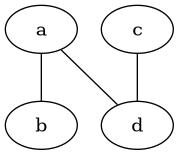

[pdf](./tableau_2d_comprehension_resume.pdf)

## Structures imbriquées

Il est possible d'imbriquer plusieurs structures les unes dans les autres :





### `list` de `list`

```python 
>>> tab2d = [["a", "b"], ["c", "d"]]
>>> tab2d
[['a', 'b'], ['c', 'd']]
>>> tab2d[0]
['a', 'b']
>>> tab2d[0][1]
'b'
>>> for ligne in tab2d:
...     for elt in ligne:
...         elt
...         
'a'
'b'
'c'
'd'
```

<--->
### `list` de `dict`
```python 
>>> amis = [
...     {"nom": "Pierre", "age": 12}, 
...     {"nom": "Fanny", "age":13}
... ]
>>> amis[0]
{'nom': 'Pierre', 'age': 12}
>>> amis[1]["age"]
13
>>> for ami in amis:
...     ami["nom"]
...     
'Pierre'
'Fanny'
```


On rencontre des situations plus exotiques, par exemple :



On peut représenter un réseau :
```python 
>>> reseau = {
...    "a": ["b", "d"],
...    "b": ["a"],
...    "c": ["d"],
...    "d": ["a", "c"]
... }
>>> "d" in reseau["a"]
True
```

<--->

Ou décrire un objet complexe :
```python 
>>> meteo = {
...     "longitude" : 2.3488,
...     "latitude": 48.8534,
...     "description": "Beau temps",
...     "temperatures": [18, 20, 22, 24,
...                      30, 28, 26, 24],
... }
>>> max(meteo["temperatures"])
30
```






## Compréhension 

Python permet de créer des listes et des dictionnaires par compréhension :



```python 
>>> def f(x):
...     return 3 * x + 1 
...
>>> vals = []
>>> for x in range(4):
...     vals.append(f(x))
...
>>> vals 
[1, 4, 7] 
```

<--->
est équivalent à :
```python 
>>> def f(x):
...     return 3 * x + 1
...
>>> vals = [f(x) for x in range(3)]
>>> vals 
[1, 4, 7]
```


---


### Avec un filtre 

```python 
>>> notes = [2, 4, 18, 16, 6]
>>> mauvais = [n for n in notes if n < 10]
>>> mauvais
[2, 4, 6]
```
<--->

```python 
>>> notes = [2, 4, 18, 16, 6]
>>> mauvais = []
>>> for n in notes:
...     if n < 10:
...         mauvais.append(n)
>>> mauvais
[2, 4, 6]
```


--- 




### Compréhensions imbriquées 

```python 
>>> mult = [i * n for i in range(3)
...         for n in range(4)]
>>> mult
[0, 0, 0, 0, 0, 1, 2, 3, 0, 2, 4, 6]
```

<--->
D'abord la boucle sur i ensuite celle sur n. Equivaut à :

```python 
>>> mult = []
>>> for i in range(3):
...     for n in range(4):
...         mult.append(i * n)
...         
>>> mult
[0, 0, 0, 0, 0, 1, 2, 3, 0, 2, 4, 6]

```


--- 

### Dictionnaires par compréhension




```python 
>>> amis = ["Pierre", "Paul", "Fanny"]
>>> longueurs = {a: len(a) for a in amis}
>>> longueurs
{"Pierre": 6, "Paul": 4, "Fanny": 5}
```

<--->
Equivaut à :

```python 
>>> amis = ["Pierre", "Paul", "Fanny"]
>>> longueurs = {}
>>> for a in amis:
...     longueurs[a] = len(a)
...
>>> longueurs
{"Pierre": 6, "Paul": 4, "Fanny": 5}
```



