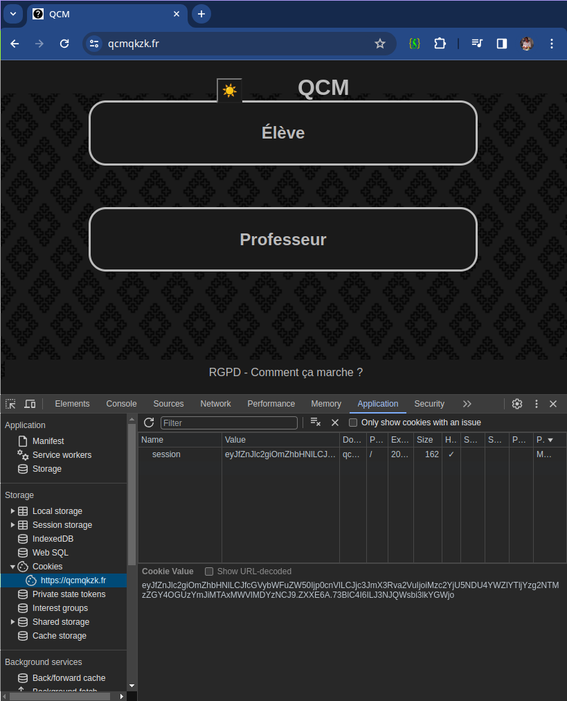

# Qu'est-ce qu'un cookie ?

## Une introduction

[Vidéo de la CNIL](https://video.cnil.fr/w/oZnjFZXdwn24YFfdApCAfP)

## Définitions de [MDN](https://developer.mozilla.org/fr/docs/Web/HTTP/Cookies)

Un cookie HTTP est une donnée de petite taille envoyée par le serveur au navigateur web de l'utilisatrice ou de l'utilisateur. Le navigateur peut alors enregistrer le cookie et le renvoyer au serveur lors des requêtes ultérieures.

Généralement, un cookie HTTP sert à indiquer que deux (ou plusieurs) requêtes proviennent du même navigateur où une personne est connectée. Il permet de mémoriser des informations d'état alors que le protocole HTTP est sans état.

Les cookies ont trois usages principaux :

- La gestion de session

  Connexions aux sites, chariots d'achats, scores de jeux, ou toute autre chose que le serveur devrait mémoriser

- La personnalisation

  Les préférences et autres éléments de configuration

- Le pistage

  L'enregistrement et l'analyse du comportement de la personne visitant le sites

  (...)

## Création des cookies

Le client émet une requête HTTP vers un serveur.

Celui-ci peut attacher un cookie à sa réponse. Ce sont des paramètres `Set-Cookie` qui doivent être émis dans l'entête de la réponse du serveur.

Le navigateur enregistre ce contenu dans un fichier.

Il se charge alors d'envoyer les cookies dans l'entête des futures requêtes à ce même serveur.

Les cookies peuvent contenir une date d'expiration ouLes cookies sont donc des fichiers texte qui contiennent une ou plusieurs informations, généralement sous la forme de paires "clé=valeur". une durée de vie. Passé ce délai, ils ne pourront plus être envoyés.

Les cookies sont donc des fichiers texte qui contiennent une ou plusieurs informations, généralement sous la forme de paires "clé=valeur".

## Un exemple

Voici le contenu d'une _réponse_ contenant un cookie :

```http
HTTP/2.0 200 OK
Content-Type: text/html
Set-Cookie: delicieux_cookie=choco
Set-Cookie: savoureux_cookie=menthe

[contenu de la page]
```

Lors des _requêtes_ suivantes émises par le navigateur on retrouvera ce cookie :

```http
GET /page_exemple.html HTTP/2.0
Host: www.example.org
Cookie: delicieux_cookie=choco; savoureux_cookie=menthe
```

## Consulter les cookies sur un client

### Dans chrome

1. F12 pour ouvrir l'interface de développement
2. Onglet "Application"
3. Dans Storage, déplier les cookies. Vous voyez alors tous les cookies émis par ce serveur



### Dans Firefox

Vous pouvez activer l'inspecteur de stockage dans les outils de développement de Firefox et ouvrir le niveau Cookies dans la hiérarchie de l'onglet Stockage.

## Peut-on se passer des cookies ?

Difficilement.

C'est généralement le seul moyen dont dispose le développeur pour maintenir une session. HTTP n'étant pas un protocole connecté.

Les cookies sont parfois utilisés d'une manière discutable notamment pour proposer des publicités ciblées. De nombreuses solutions existent pour limiter ce ciblage (navigateur spécialisé, extensions du navigateur etc.).

Cette technologie n'est pas la meilleure pour _stocker des données_. Un développeur chevronné privilégiera le "[Web Storage](https://developer.mozilla.org/fr/docs/Web/API/Web_Storage_API)" ou "[IndexedDB](https://developer.mozilla.org/fr/docs/Web/API/IndexedDB_API)".
