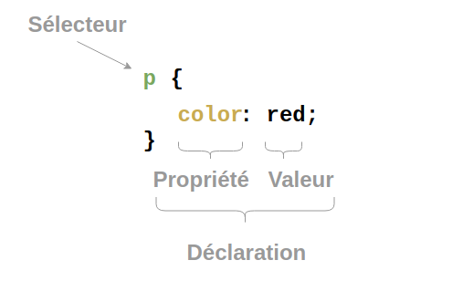
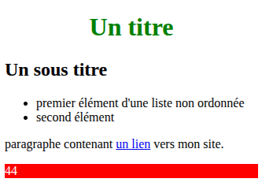

[pdf](./ihm_resume.pdf)

## Le WEB

Le WEB, pour "World Wide Web", a été développé
au CERN (Conseil Européen pour la Recherche Nucléaire) par le
Britannique Sir Timothy John Berners-Lee et le Belge Robert Cailliau au
début des années 90.

Tim Berners-Lee invente le système hypertexte et le premier navigateur.

Le web se base sur trois choses : le protocole HTTP
(HyperText Transfert Protocol), les URL (Uniform Resource Locator) et le
langage de description HTML (HyperText Markup Language).

### Web != internet

* **internet** : réseau mondial de machines inter connectées.
* **web** : http + url + html. Les pages qu'on peut visiter dans le navigateur.

Par exemple, envoyer un email depuis sa machine n'utilise pas le web mais un
autre protocole (smtp).

## URL

Une URL (_Uniform Ressource Locator_) indique l'adresse d'une ressource.
On emploie une arboresence (fichier dans un dossier dans un dossier etc.)
La base de l'arbre est la racine notée `/`


### Chemin absolu, chemin relatif

* Chemin absolu : depuis la racine. Exemple : `/dossier2/dossier3/fichier3.jpg`
* Chemin relatif : depuis l'endroit où on se trouve. Exemple, depuis `dossier2` : `dossier3/fichier3.jpg`
* Pour remonter d'un étage dans un chemin relatif : `..`

## HTML et CSS


* HTML : format pour représenter une page web. Langage de balises permettant de structurer une page et d'inclure des ressources. Ce n'est pas un langage de programmation.
<--->
* CSS : langage permettant de mettre en forme une page web. Syntaxe différente de l'html.

$~${width=300px}


### Exemple



$~$ 

**style.css**

~~~css
h1 {
  color: green;
  text-align: center;
}

.rouge {
  color: white;
  background-color: red;
}

#agerobert {
  font-weight: bold;
}
~~~

<--->


**index.html**

~~~html
<!DOCTYPE html>
<html lang="fr">
  <head>
    <meta charset="utf-8">
    <title>nom de la fenêtre</title>
    <link rel="stylesheet" href="style.css">
    <script src="monage.js"></script>
  </head>
  <body>
    <h1>Un titre</h1>
    <h2 class=rouge>Un sous titre</h2>
    <ul>
      <li>1er d'une liste non ordonnée</li>
      <li>2nd</li>
    </ul>
    <p>
      paragraphe contenant
      <a href="https://qkzk.xyz">un lien</a>
      vers mon site.
    </p>
    <div class="rouge">
      <p id=agerobert>mon age</p>
    </div>
  </body>
</html>
~~~


* Le titre (dans la page) est en couleur verte.
* Le sous-titre et la dernière div sont en blanc sur fond rouge.
* Le texte "mon age" est en gras.


---


On peut construire l'arborescence d'une page web :

~~~
html
  |_ head
  |   |_ meta
  |   |_ title
  |   |_ link
  |   |_ script
  |_ body
      |_ h1
      |_ h2
      |_ ul
      |  |_ li
      |  |_ li
      |_ p
      |  |_ a
      |_ div
         |_ p
~~~

## JavaScript

### Présentation

HTML et CSS sont accompagnés du langage de programmation JavaScript. 
JavaScript (aucun rapport avec Java) est :

* le seul langage que les navigateurs (chrome, firefox etc.) puissent exécuter.
* un langage de script (comme Python) dont la syntaxe dérive du C (des `{}` partout)

Créé comme un gadget dans les 90's, devenu le langage préféré des développeurs et le langage le plus utilisé dans le monde.

JavaScript permet d'exporter les gros calculs sur la machine **DU CLIENT** et économise les ressources du serveur.

Sans JavaScript pas d'internet moderne, de jeux, de réseaux sociaux, de vente en ligne etc.

### JavaScript côté client

Côté client, JavaScript est exécuté par le navigateur. Il est très limité.
Il ne peut pas accéder aux fichiers de la machine (sinon imaginez le
désastre : vous accédez à un site qui efface vos fichiers sans vous prévenir !).

On charge un fichier JS depuis une page web avec la balise `<script>`

### Quelques éléments. Le fichier `monage.js`

~~~javascript
var nom = "Robert"; // var : on crée une variable. ; fin d'instruction. // commentaire.
for (var k = 0; k < 3 ; k++){
  console.log("bonjour !"); // une boucle de k = 0 à k = 2. On écrit dans la console, rien dans la page
}
function calculAge(anneeNaissance, anneeCourante){
  // une fonction qui renvoie le résultat d'un calcul
  return anneeCourante - anneeNaissance;
}
document.getElementByID('agerobert').innerHTML = calculAge(1515, 2019);
// on cherche dans le document...
// l'élément dont l'id est 'agerobert'
// on change son contenu html (.innerHTML)...
// à la place on met la valeur de retour de la fonction
// il est sacrément vieux Robert...
~~~

### JavaScript côté serveur

Node.js est un serveur web très populaire tournant en JavaScript.

### JavaScript sur le bureau

Electron est un environnement de fenêtres s'appuyant sur chrome et qui s'exécute sur la machine du client. VsCode, Discord et beaucoup d'applications s'en servent. En gros, c'est chrome sans les menus en haut.

## Modèle client-serveur

Dans un réseau, on distingue généralement le serveur (qui fournit une ressource)
du client (qui consomme la ressource).

* vous ouvrez le navigateur... et tapez `http://qkzk.xyz`
* votre machine se connecte au serveur...
* qui envoie une page web `index.html`...
* votre navigateur (le client) la décode et l'affiche.

Ces échanges sont formatés et se déroulent comme un dialogue. Chaque étape d'une connexion réseau se déroule généralement ainsi.

### Serveur

Un site web important aura besoin de plusieurs machines qui exécutent toutes
le même programme. Cela lui permet de traiter des dizaines de milliers de
connexion par seconde.

Les serveurs sont généralement spécialisés. Ils ne font qu'une seule chose,
le plus efficacement possible.

### Modèle P2P

Certains réseaux dits "de pair à pair" mettent toutes les machines à égalité.

Le réseau n'est plus centré autour d'un serveur mais est un maillage de machines
qui sont toutes serveur et client.

Citons par exemple : les DNS (qui traduisent qkzk.xyz en 185.199.110.15), le
réseau local de la Nintendo 3DS, les cryptomonnaies (bitcoin, ethereum etc.) et
bien sûr bittorent...


## Protocole HTTP

HTTP (_HyperText Transfert Protocol_): protocole d'échange de documents sur internet.

Protocole "haut niveau" : il n'a pas besoin de savoir si vous êtes connecté en ethernet (câble RJ45), en wifi ou en 4G pour échanger des informations. Google affiche la même page que vous ayez activé le wifi ou non.

Les échanges HTTP se font par des requêtes du client auxquelles le serveur
répond.

Une réponse ne contient qu'un document. Donc, s'il y a une page contenant 122 images il faut... 123 requêtes et 123 réponses.

### Requête : client -----> serveur

Une requête, c'est DU TEXTE qui contient :

-   la méthode employée pour effectuer la requête
-   l'URL de la ressource
-   la version du protocole utilisé par le client (souvent HTTP 1.1)
-   le navigateur employé (Firefox, Chrome) et sa version
-   le type du document demandé (par exemple HTML)
-   ...

Voici un exemple de requête HTTP :

    GET /mondossier/monFichier.html HTTP/1.1
    User-Agent : Mozilla/5.0
    Accept : text/html

la méthode est ici GET.

### Méthodes

Il en existe beaucoup : GET, HEAD, POST, OPTIONS, CONNECT, TRACE, PUT, PATCH, DELETE

Presque toujours GET, parfois POST. Très rarement les autres.

-   GET : Demande une ressource. Elle est sans effet sur la ressource.
-   POST : Transmet des données via un élément de l'entête appelé "form" qui se comporte comme un dictionnaire.


### Réponse : serveur ------> client


Une fois la requête reçue, le serveur va renvoyer une réponse. Elle peut contenir _un_ document. Exemple :

~~~html
HTTP/1.1 200 OK
Date: Thu, 15 feb 2019 12:02:32 GMT
Server: Apache/2.0.54 (Debian GNU/Linux) DAV/2 SVN/1.1.4
Connection: close
Transfer-Encoding: chunked
Content-Type: text/html; charset=utf-8
<!doctype html>
<html lang="fr">
<head>
<meta charset="utf-8">
<title>Voici mon site</title>
</head>
<body>
 <h1>Hello World! Ceci est un titre</h1>
<p>Ceci est un <strong>paragraphe</strong>. Avez-vous bien compris ?</p>
</body>
</html>
~~~

La description de la réponse est ce qui précède `<!doctype html>`

* le serveur renvoie du code HTML, encodé en utf-8
* HTTP/1.1 formaté en HTTP/1.1
* 200 OK : le code réponse signifiant que tout va bien

### Codes d'états HTTP courants 

- 2xx : Réussite..
- 200 OK – Tout fonctionne. Code le plus courant signifiant que la requête a réussi
- 3xx : redirections
- 301 Déplacé définitivement – Cela signifie qu’une page a été déplacée de manière permanente vers un nouvel emplacement. Redirige alors les utilisateurs vers cet emplacement.
- 4xx : Erreurs du client
- 403 Interdit – Un 403 dit que le serveur a compris la demande mais ne la répondra pas, généralement en raison d’un manque d’autorisations.
- 404 Not Found – 404 signifie que le serveur n’a pas pu trouver la page demandée.
- 5xx : Erreurs côté serveur
- Erreur de serveur interne 500 : une erreur 500 vous indique que quelque chose d’inattendu s’est produit sur le serveur.


## Créer un serveur web en Python avec Flask

Tous les langages modernes permettent de créer des serveurs web.
Servir une page = la rendre accessible à d'autres machines de votre réseau.

Python propose plusieurs serveurs :

* un natif (sans librairie extérieure) mais pauvre,
* Flask : léger et modulaire (on installe des librairies supplémentaires pour les opérations spécifiques),
* Django : lourd et puissant (tout est déjà dedans).

On utilise **Flask**.

### Exemple

~~~python
from flask import Flask

app = Flask(__name__)

@app.route('/')
def index():
  return "<p>Tout fonctionne parfaitement</p>"

app.run(debug=True)
~~~

Lancez le script et vous avez une page web à l'adresse `http://localhost:5000`

**Détaillons :**

~~~python
from flask import Flask
~~~

Nous importons la bibliothèque Flask

~~~python
app = Flask(__name__)
~~~

Nous créons un objet app : cette ligne est indispensable.

~~~python
@app.route('/')
~~~

Décorateur. La fonction qui suit sera exécutée si un client se connecte à la
racine du site.

~~~python
def index():
  return "<p>Tout fonctionne parfaitement</p>"
~~~

Cette page renvoie du texte, le contenu de la page.

```python 
app.run(debug=True)
```

Lance le serveur en mode debug (il affiche des messages d'erreurs) qui attend indéfiniment les requêtes.


[Exemple](./ex.zip)

### Exemple plus élaboré. Méthode POST pour remplir un formulaire et l'afficher.

3 fichiers sont nécessaires : 

```
|_ views.py
|_ templates
    |_ index.html 
    |_ resultat.html
```

Les fichiers html doivent être dans un dossier `templates`


**templates/index.html**

~~~html
<!doctype html>
<html lang="fr">
   <head>
       <meta charset="utf-8">
       <title>Le formulaire</title>
   </head>
   <body>
       <form action="http://localhost:5000/resultat" method="form">
               <label>Nom</label> : <input type="text" name="nom" />
               <label>Prénom</label> : <input type="text" name="prenom" />
               <input type="submit" value="Envoyer" />
       </form>
   </body>
</html>
~~~

**templates/resultat.html**

~~~html
<!doctype html>
<html lang="fr">
   <head>
       <meta charset="utf-8">
       <title>Résultat</title>
   </head>
   <body>
       <p>Bonjour {{prenom}} {{nom}}, j'espère que vous allez bien.</p>
   </body>
</html>
~~~

**templates/views.py**

~~~python
from flask import Flask, render_template, request

app = Flask(__name__)

@app.route('/')
def index():
 return render_template('index.html')

@app.route('/resultat',methods = ['POST'])
def resultat():
  result=request.form
  n = result['nom']
  p = result['prenom']
  return render_template("resultat.html", nom=n, prenom=p)

app.run(debug=True)
~~~

Attention à

1. `result=request.form` suivi de `n = result['nom']`. Le formulaire se manipule comme un `dict`.
2. `render_template` dans le script Python. Il sert un fichier HTML
      en remplaçant du contenu par les variables `nom=n` et `prenom=p`
3. Aux `{{ }}` dans `resultat.html`. `{{ prenom }}` sera remplacé par le contenu
    de la variable prénom.
4. Au trajet de l'information : formulaire (POST) -> serveur (`result.args`) -> réponse

Lorsqu'on l'exécute :

```
$ python views.py
 * Serving Flask app 'views'
 * Debug mode: on
WARNING: This is a development server. Do not use it in a production deployment. Use a productio
n WSGI server instead.
 * Running on http://127.0.0.1:5000
Press CTRL+C to quit
 * Restarting with stat
 * Debugger is active!
 * Debugger PIN: 123-203-043
127.0.0.1 - - [22/Jun/2025 08:25:19] "GET / HTTP/1.1" 200 -
127.0.0.1 - - [22/Jun/2025 08:25:19] "GET /favicon.ico HTTP/1.1" 404 -
127.0.0.1 - - [22/Jun/2025 08:25:23] "POST /resultat HTTP/1.1" 200 -
```

1. Le serveur est accessible à l'adresse "127.0.0.1:5000" (réservé au réseau local)
2. Un client venant de 127.0.0.1 s'est connecté à `/` via GET. Réponse 200 OK, page renvoyée 
3. Le même client a demandé le fichier `favicon.ico` (icône de la barre d'onglets) sans succès (404)
4. Toujours le même a accédé à /resultat via POST. Succès.

[Formulaire complet](./form.zip)
