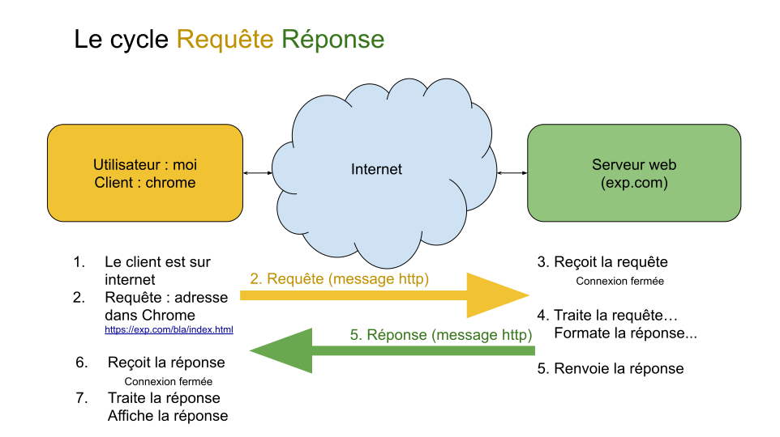

[pdf](./imh_resume_url_http.pdf)

---

# URL

## Définition

Une URL (Uniform Resource Locator) permet d'identifier une ressource sur un réseau.

Dans le navigateur, l'url est indiquée dans la _barre d'adresse._

Elle est composée de plusieurs partie. Par exemple "https://qkzk.xyz/docs/nsi/cours_premiere/programmation/comparaison/"

* **https://** est le protocole employé,
* **xyz** est le domaine racine,
* **qkzk.xyz** est le domaine,
* **docs** est le premier dossier,
* **nsi** est un sous dossier de ce premier dossier etc.

Les fichiers sont classés dans une structure en arborescence.

L'URL peut se terminer par un nom précis de fichier (`index.html`) ou non.

## Adresse IP et nom de domaine.

La domaine peut généralement être remplacé par une adresse IP.

Par exemple : [145.242.11.26](http://145.242.11.26) pointe vers le même site que [impots.gouv.fr](http://impots.gouv.fr)

C'est le _serveur DNS_ (domain name serveur) qui traduit cette adresse IP en nom de domaine.

Attention, certains domaines utilisent des adresse IPv6 plus longues. Par exemple pour google.com : `2a00:1450:4007:811::200e` (sur 16 octets, 128 bits).

## Chemin absolu, chemin relatif

Pour se déplacer dans une arborescence on peut employer deux méthodes :

1. Depuis son point de départ : **chemin relatif**

    Depuis _dossier1_ vers _fichier6.html_ : `../dossier2/dossier4/fichier6.html`

    `../` permet de remonter d'un dossier. On utilise des `/` entre les dossiers et sous dossiers.

2. Depuis n'importe quel point : **chemin absolu**

    `nom_domaine.extension/dossier2/dossier4/fichier6.html`

Les deux approches conduisent (normalement) au même point.

# Protocole HTTP

## Définition : Protocole

Un **protocole** est un ensemble de règles qui permettent à deux ordinateurs de communiquer ensemble. HTTP (HyperText Transfer Protocol) permet au client d'effectuer des requêtes à destination d'un serveur web. En retour le serveur web envoie une réponse.

* HTTP est le "messager" du web.

* HTTP est protocole "application" (on verra plus tard, mais c'est le plus haut niveau) basé sur TCP/IP

  * TCP permet de découper les paquets et de s'assurer qu'ils sont arrivés
  * IP donne une adresse aux machines sur un réseau

* HTTP est utilisé pour échanger des données et fournir des contenus : images, vidéos, textes (pages web) etc.

* HTTP est un protocole client / serveur.

    * Le client (généralement le navigateur) émet une requête,
    * Le serveur renvoie une réponse à la requête.

## Quelques détails sur HTTP

1. C'est un **protocole sans connexion** (connectionless) : après émission d'une requête, la connexion est fermée (contrairement à un jeu en ligne où la connexion est maintenue durant la partie). Le serveur réétabli la connexion pour envoyer la réponse. Et il ferme la connexion.
2. HTTP **peut envoyer n'importe quel type de données** tant que les deux ordinateurs sont capables de les lire. Le plus souvent : texte, image, vidéos etc. mais pas que !
3. HTTP est un **protocole "sans état"** (stateless) : le client et le serveur se connaissent que durant l'émission d'une requête ou la réception d'une réponse. Ensuite pour se parler à nouveau, ils doivent fournir à nouveau l'information.

Moins important :

1. HTTP a été crée en 1991 par Tim Berners Lee pour transférer des pages web,
2. HTTP a rapidement évolué et a été massivement adopté dans les années 90.

## Cycle requête / réponse HTTP

**Le client envoie une requête, le serveur renvoie une réponse.**

## Requête HTTP

Exemple de requête HTTP  :

-   la méthode employée pour effectuer la requête
-   l'URL de la ressource
-   la version du protocole utilisé par le client (souvent HTTP 1.1)
-   le navigateur employé (Firefox, Chrome) et sa version
-   le type du document demandé (par exemple HTML)
-   ...

Ce qui donne (client vers serveur) :

    GET /mondossier/monFichier.html HTTP/1.1
    User-Agent : Mozilla/5.0
    Accept : text/html

Ici :

* la méthode est `GET`,
* L'URL visée sur le serveur est `/mondossier/monFichier.html`
* le protocole est HTTP version 1.1 (la plus courante),
* Le navigateur est Mozilla 5.0 (firefox...),
* On attend une réponse en texte formaté en HTML.

### Méthode employée

Il existe de nombreuses méthodes HTTP (parfois appelées _verbes_) :

* GET
* POST
* HEAD
* PUT
* DELETE
* CONNECT
* OPTIONS
* TRACE
* PATCH

On utilisera principalement les deux premières :

* **GET** : demande une représentation d'une ressource : obtenir une page web, un fichier, une donnée.
* **POST** : envoie une entité vers la ressource : soumettre des données au serveur.

## Réponse HTTP du serveur à une requête

Un exemple de réponse

~~~html
HTTP/1.1 200 OK
Date: Thu, 15 feb 2019 12:02:32 GMT
Server: Apache/2.0.54 (Debian GNU/Linux) DAV/2 SVN/1.1.4
Connection: close
Transfer-Encoding: chunked
Content-Type: text/html; charset=UTF-8
<!DOCTYPE html>
<html lang="fr" dir="ltr">
  <head>
    <meta charset="utf-8">
    <title>mon super site</title>
  </head>
  <body>
    <h1>Jean Raoul, chef cuisinier</h1>
    
Ma recette favorite : le cassoulet

  </body>
</html>
~~~

### Quelques détails :

* Première ligne : `HTTP/1.1 200 OK` version de HTTP et code réponse.
    Parmi les codes courant on trouve :

    * **200 : succès de la requête,**
    * 301, 302 : redirection,
    * 401 : utilisateur non authentifié,
    * **403 : accès refusé,**
    * **404 : ressource introuvable,**
    * **500, 503 : erreur serveur,**
    * 504 : le serveur n'a pas répondu.

    [Liste complète des codes](https://fr.wikipedia.org/wiki/Liste_des_codes_HTTP)

* Troisième ligne : `Server: Apache/2.0.54 (Debian GNU/Linux) DAV/2 SVN/1.1.4`

    Le type de serveur web et des informations sur son système

* Quatrième ligne : `Connection: close`

    La connexion est fermée après chaque requête terminée. C'est normal.

* Cinquième et sixième lignes :

    `Transfer-Encoding: chunked`

    `Content-Type: text/html; charset=UTF-8`

    Le contenu est découpé en plusieurs paquets, c'est du texte formaté en HTML et encodé en utf-8.

* Le corps du message est ce qui suit.

Souvenons nous que cette réponse est en fait une série de bit que le client interprète comme une réponse HTTP. Ce sont des _bits_ qui transitent sur le réseau.

### Contenu de la page.

Le contenu "habituel" d'une page web :

~~~html
<!DOCTYPE html>
<html lang="fr" dir="ltr">
  <head>
    <meta charset="utf-8">
    <title>mon super site</title>
  </head>
  <body>
    <h1>Jean Raoul, chef cuisinier</h1>
    
Ma recette favorite : le cassoulet

  </body>
</html>
~~~

Il est généralement envoyé en réponse à une requête (GET, POST) APRES l'entête dans le CORPS de la requête

## Etapes supplémentaires du protocole HTTPS

**HTTPS** pour **SECURED** HTTP

1. Demande du client d'établir une **connexion sécurisée** (http**s** ...)
2. Réponse du serveur : OK. Il fournit un **certificat** prouvant son identité
3. **Le client** (généralement le navigateur) **vérifie le certificat et affiche à côté de l'adresse une information à l'utilisateur** sur ce certificat (valide, invalide, périmé etc.)
3. Les échanges sont maintenants **chiffrés** grâce à une **clé publique et une clé privée** (chiffrement asynchrone)

## Etablir une connexion HTTP dans un langage de programmation

L'usage courant est d'employer un navigateur (chrome, firefox) pour faire des requêtes HTTP. Elles sont alors cachées à l'utilisateur.

**Un développeur peut écrire lui même ses requêtes et les exécuter**. Python (et presque tous les langages modernes) permet d'établir facilement une connexion HTTP.

C'est une méthode courante pour faire communiquer directement les machines. Chaque fois que vous entendez parler _d'API REST_ ou _d'API HTTP_ c'est ce qui est fait.

**API** : _Application Programming Interface_ (interface de programmation d'application). Nom générique pour désigner l'ensemble des méthodes par lequel un logiciel offre ses services à d'autres logiciels.

En Python 2 lignes suffisent pour obtenir une réponse HTTP et la traiter ensuite.

~~~python
>>> import requests # librairie qui gère les connexion HTTP
>>> reponse = requests.get("http://qkzk.xyz")
>>> # on établi une connexion avec mon site
~~~

Le code réponse et l'entête :

~~~python
>>> reponse
<Response [200]>
>>> # la connexion est établie correctement (200 signifie OK)
>>> reponses.headers # detail de la reponse du serveur
{'Server': 'GitHub.com', 'Content-Type': 'text/html; charset=utf-8',
'Last-Modified': 'Wed, 09 Oct 2019 16:10:57 GMT', 'ETag': 'W/"5d9e0691-e152"',
'Access-Control-Allow-Origin': '*', 'Expires': 'Sat, 12 Oct 2019 09:20:09 GMT',
'Cache-Control': 'max-age=600', 'Content-Encoding': 'gzip',
# réponse tronquée
}
~~~

Le contenu de la réponse :

~~~python
>>> reponse.content
b'<!DOCTYPE html>
<html lang="en">
<head>
<meta name="generator" content="Hugo 0.57.2" />
<meta charset="UTF-8">
<meta name="viewport" content="width=device-width, initial-scale=1.0">
<title>accueil| qkzk</title> ...'
# tronqué. La suite est le contenu complet de la page d'accueil du site...
</body></html>'
~~~

La requête transmise par _le client_ lui même au serveur :

~~~python
>>> reponse.request
<PreparedRequest [GET]>
>>> reponse.request.headers
{'User-Agent': 'python-requests/2.22.0',
'Accept-Encoding': 'gzip, deflate',
'Accept': '*/*',
'Connection': 'keep-alive'}
~~~

Dans cet exemple :

* **L'utilisateur** : moi. Je suis celui qui a tapé les commandes
* **Le client** : Python
* **Le serveur**: Github (qui heberge mon site) et a répondu à la requête

---

Le _résumé_ est long... mais contient beaucoup d'exemples.
