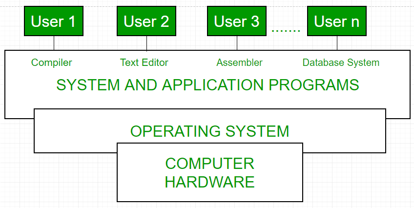

[pdf](./cours_linux_complet.pdf)

# Linux et les systèmes libres

- Linux ou GNU/Linux est une famille de systèmes d'exploitation _open source_ de
  type UNIX fondé sur le noyau Linux, crée en 1991 par Linus Torvald.

- Un système d'exploitiation est de "type UNIX" s'il se comporte comme un système
  UNIX. Parmi les caractéristiques principales on trouve :

  - multi-utilisateur et multitâche
  - sécurisé vis-à-vis des manipulations illicites des utilisateurs (ex: un
    utilisateur "standard" ne peut effacer de fichier système)
  - disposant d'un système de fichiers abouti (d'ailleurs UNIX voit ses
    périphériques et ses processus comme des fichiers !)

- UNIX était un système d'exploitation apparu dans les années 60, crée au
  Bell-Labs par Ken Thompson, Dennis Ritchie et Brian Kernighan.

  Les deux premiers sont d'ailleurs les inventeurs du langage C (parent
  de la majorité des langages modernes) qu'ils ont développé pour programmer
  UNIX.

- La majorité des "machines" modernes (téléphones, serveurs, super ordinateurs,
  informatique embarquée etc.) fonctionnent avec un système de type UNIX :
  MacOS, iOS, Android, Linux, NetBSD etc.

- L'exception notable concerne les PC personnels et de bureau qui fonctionnent
  majoritairement sous windows.

## Quelques infos sur Linux

En 2020 le noyau Linux comportait 30 millions de lignes de code. Environ 4000
développeurs contribuent chaque année à son développement et proposent, en moyenne 75000 contributions par an.
L'intégralité du code source est consultable sur [github](https://github.com/torvalds/linux).

C'est le projet open source le plus abouti : non seulement en nombre de contributeurs mais aussi en terme d'impact.

## Le shell

### 1. Le terminal

Quelle que soit la déclinaison de Linux, on trouve une application "terminal"
qu'on peut lancer et un interpréteur de commandes avec lequel on interagit.
Par défaut on trouve souvent Bash (_Bourne Again Shell_).

Le terminal fonctionne avec le principe REPL : Read Eval Print Loop.

1. **Read**. L'utilisateur tape une commande qui est lue par l'interpréteur,
2. **Eval**. Cette commande est exécutée et retourne une chaîne de caractères,
3. **Print**. La chaîne de caractères est affichée à l'écran,
4. **Loop**. On recommence.

### 2. Les commandes de base

Toutes ces commandes acceptent de nombreuses options dont on peut consulter
la documentation en tapant `man ls` par exemple pour la commande `ls`. Celle-ci
comporte des options pour affiche les fichiers cachés `ls -a` ou encore pour
afficher les détails et permissions d'un fichier `ls -l`

| Commande | Description                                                        |
| -------- | ------------------------------------------------------------------ |
| `cd`     | _Change Directory_ Se déplacer dans l'arborescence                 |
| `ls`     | _List_ Affiche le contenu du répertoire courant                    |
| `cp`     | Copier des fichiers ou des répertoires                             |
| `mv`     | Déplacer ou renommer des fichiers ou des répertoires               |
| `rm`     | Effacer des fichiers ou des répertoires                            |
| `cat`    | Visualiser le contenu d'un fichier                                 |
| `echo`   | Afficher un message ou le contenu d'une variable                   |
| `touch`  | Créer un fichier vide ou réinitialiser le _timestamp_ d'un fichier |

### 3. Les répertoires fondamentaux

Dans un système UNIX, on dispose d'une **arborescence de fichiers** ancrée sur
`/`, la "racine" (_root_) du système de fichiers. Voici quelques points d'entrée
de cette arborescence :

```
/
+-- bin     ← Commandes de base du système
+-- dev     ← Fichiers représentant les dispositifs matériels (devices) du système
+-- etc     ← Fichiers de configuration du système
+-- home    ← Répertoire d'accueil (HOME) des utilisateurs
+-- lib     ← Librairies
+-- mnt     ← Points de montage (clés usb etc.)
+-- proc    ← État du système et de ses processus
+-- root    ← Répertoire de l'administrateur système
+-- run     ← Variables d'état du système depuis le boot
+-- sys     ← Informations sur le noyau et les périphériques
+-- usr     ← Logiciels installés avec le système, base de données etc.
+-- var     ← Données fréquemment utilisées et modifiées
```

Les adresses des fichiers et dossiers sont séparées par des `/`

Par exemple : `/home/quentin/boulot/NSI/devoirs/DS1.pdf`

Sous UNIX, les adresses sont sensibles à la casse (`a != A`).

### 4. Quelques mots sur BASH

Bash (acronyme de Bourne-Again shell) est un interpréteur en ligne de commande
de type script. C'est le shell Unix du projet GNU.

**Usage**

Comme tous les interpréteurs en ligne de commande de type script, Bash exécute
quatre opérations fondamentales :

- Il fournit une liste de commandes permettant d'opérer sur l'ordinateur
  (lancement de programmes, copie de fichiers, etc.) ;
- Il permet de regrouper ces commandes dans un fichier unique appelé script ;
- Il vérifie la ligne de commande lors de son exécution ou lors d'une
  éventuelle procédure de vérification et renvoie un message d'erreur en cas
  d'erreur de syntaxe ;
- En cas de validation, chaque ligne de commande est interprétée, c'est-à-dire
  traduite dans un langage compréhensible par le système d'exploitation, qui
  l'exécute alors.

Les scripts sont de courts programmes généralement faciles à construire. Bash
offre un service de gestion de flux, c'est-à-dire qu'il permet que le résultat
d'un script (la sortie) soit transmis à un autre script (l'entrée). De cette
façon, les scripts peuvent être « chaînés », chacun effectuant une seule tâche
bien délimitée.

Les scripts peuvent être exécutés manuellement par l'utilisateur ou
automatiquement par le système. Par exemple, dans la distribution GNU/Linux
Ubuntu, le répertoire `resume.d` contient un certain nombre de scripts qui
s'exécutent automatiquement lors du redémarrage du système, c'est-à-dire après
la fin de la mise en veille de celui-ci. Ces scripts servent à relancer les
différents programmes interrompus par la mise en veille.

**Fonctionnement**

Bash est un shell qui peut être utilisé soit en mode interactif, soit en mode
batch :

- mode interactif : Bash attend les commandes saisies par un utilisateur puis
  renvoie le résultat de ces commandes et se place à nouveau en situation
  d'attente.
- mode batch : Bash interprète un fichier texte contenant les commandes à
  exécuter.

# Arborescence et flux

_Observons quelques moyens de naviguer dans l'arborescence d'un système UNIX,
puis voyons comment manipuler les entrées/sorties et les redirections_

## 1. Navigations et entrées / sorties en shell BASH

### 1. Naviguer dans une arborescence, les chemins

- Pour aller dans son HOME en utilisant un "chemin absolu", c'est-à-dire un
  chemin depuis la racine, l'utilisateur `bob` peut faire : `cd /home/bob/`
- Il peut aussi utiliser le raccourci `~`, et faire `cd ~` ou plus simplement `cd`
- Pour chaque utilisateur, `~` désigne son répertoire personnel.
- Pour remonter dans le répertoire parent, on utilise `cd ..` et on désigne
  le répertoire courant avec un point "`.`"
- Ainsi, si on veut copier le fichier `toto` qui se trouve dans le répertoire
  parent vers le répertoire courant, on tape : `cp ../toto .`
  Nous utilisons cette fois un chemin "relatif" qui part de la position actuelle.

### 2. Entrées et sorties

- **Entrées**\
   La commance `read` permet d'effectuer une saisie utilisateur.

  ```bash
  read var # Saisie de var (stdin)
  echo $var # Réaffichage, remarquez le $ qui précède le nom d'une variable
  ```

- **Sorties**\
   Une commande affiche normalement son résultat sur la sortie standard
  _stdout_.\
   On peut aussi envoyer ce résultat de commande vers un fichier.

  _Exemple :_ `echo "Bonjour" > salut.txt` envoie le mot "Bonjour" dans le
  fichier `salut.txt` qui est crée (ou réinitialisé s'il existait
  préalablement), puis, si on tape `echo "Tout le monde" >> salut.txt`, on
  ajoute une nouvelle ligne au fichier existant qui contient maintenant
  2 lignes.

- **Sortie d'erreur**\
   Les sorties d'erreur ne s'affichent pas sur la sortie standard, il existe
  un troisième flux, le flux de sortie d'erreur dénommé _stderr_

  Par exemple, s'il n'y a pas de fichier `toto` dans le répertoire courant,
  la commande :

  ```bash
  cat toto
  ```

  déclenche une erreur indiquant que le fichier `toto` n'existe pas.
  Si on ajoute :

  ```bash
  cat toto 2>/dev/null
  ```

  on effectue la même commande, mais on redirige vers le périphérique "null"
  les éventuelles sorties d'erreur pour qu'elles ne s'affichent pas.

### 3. Les filtres, tubes et redirections

- Unix permet aussi l'utilisation de **filtres** comme

  - `grep` pour afficher les lignes qui contiennent un mot clé ;
  - `wc` pour compter des lignes ou des caractères ;
  - `sort` pour trier ;
  - `cut` pour extraire des colonnes dans un fichier ;
  - `tr` pour transposer ou supprimer des caractères.

- Ces filtres s'utilisent généralement avec des tubes (_pipes_) notés "`|`".

  _Exemple :_

  ```bash
  cat monfic | wc -l
  ```

  compte le nombre de lignes dans le fichier `monfic` et :

  ```bash
  cat monfic | sort > fictrie
  ```

  trie les lignes du fichier `monfic` selon l'ordre lexicographique puis
  place le résultat correspondant dans le fichier `fictrie`

## 2. Scripts BASH

- Une suite de commandes permet à l'administrateur d'automatiser certaines
  tâches, on parle alors de "scripts", stocké dans un fichier d'extension
  "`.sh`". Les arguments du script peuvent être invoqués avec `$1, $2` etc.,
  leur nombre avec `$#` et leur liste avec `$*`.

- Voici, par exemple un script `efface.sh` qui, au lieu d'effacer le fichier
  qu'on passe en argument, le déplace dans un dossier "poubelle" à la racine
  du HOME et l'utilisateur (la première ligne indique l'interpréteur utilisé).

  ```bash
  #! /bin/bash
  # Ce script a un argument : un nom de fichier
  #  - crée si besoin un répertoire poubelle dans le répertoire HOME
  # de l'utilisateur
  #  - déplace le fichier donné en argument dans ce répertoire
  # poubelle
  # vérifie d'abord si ce dossier existe dans ~ :
  if [ -d ~/poubelle ]
  then
      echo "Le répertoire poubelle existe déjà dans votre Home."
  else # sinon, on le crée
      mkdir ~/poubelle
      echo "Repertoire poubelle inexistant. Il est crée."
  fi
  # On déplace dans poubelle le fichier donné en argument
  mv $1 ~/poubelle
  ```

# Droits et permissions sous UNIX

_Le système de droits et de permissions sous UNIX est aspects fondamentaux
de la gestion de la sécurité du système._

## Droits et groupes

### 1. Le monde selon UNIX

Unix sépare le monde en trois catégories du point de vue des **droits** :

- L'utilisateur (user) ;
- Le groupe (group) ;
- Le reste du monde (others).

### 2. Exemple de lecture de droits

- En utilisant la commande `ls -l monfic.sh` par exemple, on obtient :

```
-rwxr--r-- 1 roza   staff   0   6 mai 11:56 monfic.sh
```

- La partie `-rwxr--r--`, indiquant les droits du fichier, se lit en omettant
  le tiret du début, puis en décomposant en trois parties :
  - `rwx` (utilisateur) ;
  - `r--` (groupe) ;
  - `r--` (autres).
- Chaque partie est elle-même composée de trois lettres :

  - droit de lecture `r` ;
  - droit d'écriture `w` ;
  - droit d'exécution `x` : on peut exécuter le fichier en l'invoquant par
    son nom, dans cet exemple `./monfic.sh`.

- On sait donc que `monfic.sh` est accessible en lecture au groupe "Staff" et
  aux autres.
- On sait en outre que le fichier appartient à l'utilisateur "`roza`".

### 3. Les droits d'un répertoire

Créons un répertoire `www` dans notre HOME et lisons les droits
correspondants avec la commande `ls -l www`, on obtient par exemple :

```bash
drwxr-xr-x  2 roza  staff   64 6 mai 14:17 www
```

Le `d` initial signifie qu'il s'agit d'un répertoire.

**Remarque :** le droit `x` pour un répertoire est le droit de traverser ce
répertoire.

## 2. Changer des droits

### 1. La commande `chmod`

Seul le propriétaire d'un fichier (ou l'utilisateur "root") peut changer ses
permissions d'accès. Il le fait avec la commande `chmod` dont voici quelques
exemples d'utilisation.

| Droits                                                   | Syntaxe                 |
| -------------------------------------------------------- | ----------------------- |
| Donner les droits de lecteure au groupe `g`              | `chmod g+r monfic.sh`   |
| Donner les droits d'écriture au propriétaire `u`         | `chmod u+w monfic.sh`   |
| Retirer les droits d'exécution aux autres (_others_) `o` | `chmod o-x monfich.sh`  |
| Donner les droits d'exécution à tous                     | `chmod ugo+x monfic.sh` |

**Remarque :** On peut aussi utiliser `a` (all) à la place de `ugo`.

### 2. Droits symboliques et numériques

Il est également possible d'utiliser un codage octal (base 8) pour les droits.

- L'écriture symbolique : ` rwc r-x r-w`
- Correspond à l'écriture binaire `111 101 101` soit `755` en octal

Par exemple `chmod 755 monfic.sh` donne les droits `-rwxr-xr-x` au fichier `monfic.sh`.

### 3. Lancement d'un script et fichiers exécutables

- On peut lancer un script (ou autre) en l'invoquant par son nom s'il est exécutable.
  On précise parfois que le script est dans le répertoire courant en le précédant
  d'un `./` devant son nom :

  ```bash
  ./monfic.sh
  ```

- Si le script n'est pas exécutable on peut toujours le lancer en tapant :

  ```bash
  source monfic.sh
  ```

- Ces deux méthodes ne sont pas équivalentes : dans le premier cas, un nouveau
  `shell` est crée tandis que dans le second, les commandes du script
  s'exécutent dans le `shell` courant.

**Remarque :** Tous les fichiers exécutables posent des problèmes potentiels
de sécurité, tout fichier exécutable pouvant se transformer en éventuel
"cheval de Troie" (logiciel malveillant). Dans un site web par exemple, les
fichiers HTML, CSS, images, JavaScript ou PHP n'ont pas à être exécutables,
le droit de lecture suffit.

## Similitudes et différences des noyaux Linux et Windows

### Qu'est-ce que le noyau ?

Le noyau est une partie fondamentale de tout système d'exploitation. Le profane
moyen est parfaitement inconscient de son existence. Des millions de personnes
utilisent un ordinateur chaque jour sans comprendre comment il fonctionne
réellement. En général, seul un programmeur a affaire au noyau directement.
L'installation d'un pilote de périphérique ou la configuration d'un protocole
réseau est probablement la chose la plus proche que la plupart des gens auront
jamais du noyau. Le noyau est le cœur du système d'exploitation au niveau le
plus bas et le plus élémentaire. Sa fonction est vitale pour pratiquement
toutes les opérations. Le noyau est à un système d'exploitation ce que le
moteur est à une voiture. Sans le noyau, nous ne pourrions rien faire ou
presque avec notre ordinateur.

### Similitudes

Les noyaux Linux et Windows contrôlent tous deux le logiciel système de bas
niveau et les interactions avec le matériel de l'ordinateur via la couche
d'abstraction matérielle (HAL). De cette manière, le noyau maintient le reste
du système d'exploitation indépendant du matériel, ce qui permet une plus
grande portabilité. Les noyaux des systèmes d'exploitation sont écrits dans un
langage de haut niveau appelé C. Le langage C a été choisi parce qu'il a été
porté sur pratiquement toutes les plates-formes matérielles existantes. La
portabilité est importante pour les programmeurs et les sociétés de logiciels
car elle signifie moins de travail, moins de temps et moins de dépenses. Les
deux noyaux gèrent des éléments tels que les pilotes de périphériques, la mise
en cache, la mémoire virtuelle, les protocoles réseau, les systèmes de
fichiers, la création et la fin des processus et les appels système. L'objectif
d'un noyau est similaire d'un système à l'autre, mais l'approche peut être très
différente d'un système d'exploitation à l'autre.

### Le noyau sous Linux

Le noyau Linux désigne tout ce qui s'exécute en mode noyau et se compose de
plusieurs couches distinctes. À la couche la plus basse, le noyau interagit
avec le matériel via le HAL. Au niveau intermédiaire, le noyau UNIX est divisé
en 4 zones distinctes. La première des quatre zones gère les périphériques de
caractères, les ATS bruts et cuits et la gestion des terminaux. La deuxième
zone gère les pilotes de périphériques réseau, les protocoles de routage et les
sockets. La troisième zone s'occupe des pilotes de périphériques de disque, des
caches de page et de tampon, du système de fichiers, de la mémoire virtuelle,
du nommage et du mappage des fichiers. La quatrième et dernière zone s'occupe
de la répartition, de l'ordonnancement, de la création et de la fin des
processus, ainsi que de la gestion des signaux. Au-dessus de tout cela, nous
avons la couche supérieure du noyau qui comprend les appels système, les
interruptions et les pièges. Ce niveau sert d'interface à chacune des fonctions
de niveau inférieur. Un programmeur utilise les différents appels système et
les interruptions pour interagir avec les fonctionnalités du système
d'exploitation.

### Le noyau et le "mode noyau" de Windows

Le noyau du système d'exploitation Windows est quelque peu différent de celui
de LINIX car Microsoft a adopté une approche quelque peu différente de la
conception du noyau. Le terme "Kernel mode" fait référence non seulement au
noyau lui-même mais aussi au HAL et à divers services système. Cela inclut le
HAL (hal.dll) à la couche inférieure, suivi du noyau à la deuxième couche. La
troisième couche est le noyau. Au-dessus (quatrième niveau), nous avons divers
gestionnaires pour les objets, les processus, la mémoire, la sécurité, le
cache, le Plug in Play (PnP), l'alimentation, la configuration et les E/S. Le
système de fichiers et Win32 GDI se trouvent également à ce niveau. La plupart
des éléments de ce quatrième niveau sont appelés collectivement l'exécutif
Windows (ntoskrnl.exe). Au sommet et à la cinquième couche du mode Kernel se
trouvent les services système.

## Résumé

Comme vous pouvez le constater, les systèmes d'exploitation Linux et Windows
ont tous deux un noyau qui remplit des fonctions similaires. Cependant, les
deux noyaux sont conçus de manière très différente. Dans le monde de
l'informatique, il existe de nombreuses façons d'atteindre les mêmes objectifs.

Sunil Yadav

## Compléments sur l'OS

Un système d'exploitation agit comme un intermédiaire entre l'utilisateur d'un
ordinateur et le matériel informatique. L'objectif d'un système d'exploitation
est de fournir un environnement dans lequel un utilisateur peut exécuter des
programmes de manière pratique et efficace.

Un système d'exploitation est un logiciel qui gère le matériel informatique. Le
matériel doit fournir des mécanismes appropriés pour assurer le bon
fonctionnement du système informatique et empêcher les programmes de
l'utilisateur d'interférer avec le bon fonctionnement du système.

### Système d'exploitation - Définition :

- Un système d'exploitation est un programme qui contrôle l'exécution des
  programmes d'application et agit comme une interface entre l'utilisateur d'un
  ordinateur et le matériel informatique.

- Une définition plus courante est que le
  système d'exploitation est le seul programme fonctionnant à tout moment sur
  l'ordinateur (généralement appelé le noyau), tous les autres étant des
  programmes d'application.

- Un système d'exploitation s'occupe de l'allocation
  des ressources et des services, tels que la mémoire, les processeurs, les
  périphériques et les informations. Le système d'exploitation comprend en
  conséquence des programmes destinés à gérer ces ressources, tels qu'un
  contrôleur de trafic, un ordonnanceur, un module de gestion de la mémoire, des
  programmes d'E/S et un système de fichiers. Fonctions du système d'exploitation

### Le système d'exploitation remplit quatre fonctions :

1. Commodité : Un système d'exploitation rend un ordinateur plus pratique à
   utiliser.
2. Efficacité : Un système d'exploitation permet d'utiliser efficacement
   les ressources du système informatique.
3. Capacité d'évolution : Un système
   d'exploitation doit être construit de manière à permettre le développement, le
   test et l'introduction efficaces de nouvelles fonctions du système sans
   interférer avec le service.
4. Débit : Un système d'exploitation doit être
   construit de manière à offrir un débit maximal (nombre de tâches par unité de
   temps).

### Principales fonctionnalités du système d'exploitation :

- Gestion des ressources : Lorsque l'accès parallèle se produit dans le système
  d'exploitation, c'est-à-dire lorsque plusieurs utilisateurs accèdent au
  système, le système d'exploitation fonctionne comme un gestionnaire de
  ressources, sa responsabilité est de fournir du matériel à l'utilisateur. Il
  diminue la charge dans le système.

- Gestion des processus : Elle comprend
  diverses tâches comme la planification, la fin du processus. Le système
  d'exploitation gère plusieurs tâches à la fois. Ici, l'ordonnancement du CPU
  signifie que toutes les tâches sont effectuées par les nombreux algorithmes
  utilisés pour l'ordonnancement.

- Gestion du stockage : Le mécanisme du système
  de fichiers utilisé pour la gestion du stockage. NIFS, CFS, CIFS, NFS, etc.
  sont des systèmes de fichiers. Toutes les données sont stockées sur différentes
  pistes de disques durs qui sont toutes gérées par le gestionnaire de stockage.
  Il comprend les disques durs.

- Gestion de la mémoire : Fait référence à la
  gestion de la mémoire primaire. Le système d'exploitation doit garder la trace
  de la quantité de mémoire utilisée et par qui. Il doit décider quel processus a
  besoin d'espace mémoire et combien. Le système d'exploitation doit également
  allouer et désallouer l'espace mémoire.

- Gestion de la sécurité/confidentialité : La confidentialité est également assurée par le système d'exploitation au
  moyen de mots de passe afin que les applications non autorisées ne puissent pas
  accéder aux programmes ou aux données. Par exemple, Windows utilise
  l'authentification Kerberos pour empêcher tout accès non autorisé aux données.

Le système d'exploitation des processus en tant qu'interface utilisateur :

- Utilisateur
- Système et programmes d'application
- Système d'exploitation
- Matériel

Tout ordinateur polyvalent se compose d'un matériel, d'un système
d'exploitation, de programmes système et de programmes d'application. Le
matériel se compose de la mémoire, de l'unité centrale, de l'unité logique, des
dispositifs d'entrée/sortie, des dispositifs périphériques et des dispositifs
de stockage. Le programme système se compose de compilateurs, de chargeurs,
d'éditeurs, de systèmes d'exploitation, etc. Le programme d'application est
constitué de programmes commerciaux, de programmes de base de données.



Chaque ordinateur doit disposer d'un système d'exploitation pour exécuter
d'autres programmes. Le système d'exploitation coordonne l'utilisation du
matériel entre les différents programmes système et les programmes
d'application pour les différents utilisateurs. Il fournit simplement un
environnement dans lequel d'autres programmes peuvent effectuer un travail
utile.

Le système d'exploitation est un ensemble de programmes spéciaux qui
s'exécutent sur un système informatique et lui permettent de fonctionner
correctement. Il effectue des tâches de base telles que la reconnaissance des
entrées du clavier, le suivi des fichiers et des répertoires sur le disque,
l'envoi de données à l'écran et le contrôle des périphériques. Le système
d'exploitation est conçu pour servir deux objectifs fondamentaux :

1. Il contrôle l'allocation et l'utilisation des ressources du système
   informatique entre les différents utilisateurs et tâches.
2. Il fournit une interface entre le matériel informatique et le programmeur qui simplifie et
   rend possible le codage, la création, le débogage des programmes d'application.

Le système d'exploitation doit prendre en charge les tâches suivantes :

1. Fournir les moyens de créer, modifier les programmes et les fichiers de données
   à l'aide d'un éditeur.
2. Accès au compilateur pour traduire le programme utilisateur du langage de haut niveau au langage machine.
3. Fournir un programme de chargement pour déplacer le code du programme compilé vers la mémoire de
   l'ordinateur pour son exécution.
4. Fournir des routines qui gèrent les détails de la programmation des E/S.

### Gestion du système d'E/S -

Le module qui garde la trace de l'état des périphériques est appelé le contrôleur de trafic d'E/S.
Chaque périphérique d'E/S possède un gestionnaire de périphérique qui réside
dans un processus distinct associé à ce périphérique. Le sous-système d'E/S se
compose de

- Un composant de gestion de la mémoire qui comprend la mise en mémoire tampon,
  la mise en cache et le spooling.
- Une interface générale de pilote de périphérique. Des pilotes pour des
  périphériques matériels spécifiques.

### Assembleur -

L'entrée d'un assembleur est un programme en langage d'assemblage.
La sortie est un programme objet plus des informations qui permettent au
chargeur de préparer le programme objet pour l'exécution. Il fut un temps où le
programmeur informatique avait à sa disposition une machine de base qui
interprétait, par le biais du matériel, certaines instructions fondamentales.
Il programmait cet ordinateur en écrivant une série de uns et de zéros (langage
machine), qu'il plaçait dans la mémoire de la machine.

### Compilateur -

Les langages de haut niveau - par exemple FORTRAN, COBOL, ALGOL
et PL/I - sont traités par des compilateurs et des interprètes. Un compilateur
est un programme qui accepte un programme source dans un "langage de haut
niveau" et produit un programme objet correspondant. Un interprète est un
programme qui semble exécuter un programme source comme s'il s'agissait d'un
langage machine. Le même nom (FORTRAN, COBOL, etc.) est souvent utilisé pour
désigner à la fois un compilateur et le langage qui lui est associé.

### Loader -

Un Loader est une routine qui charge un programme objet et le prépare
pour l'exécution. Il existe différents schémas de chargement : absolu,
relocalisation et liaison directe. En général, le chargeur doit charger,
relocaliser et lier le programme objet. Le chargeur est un programme qui place
les programmes en mémoire et les prépare à l'exécution. Dans un schéma de
chargement simple, l'assembleur produit la traduction en langage machine d'un
programme sur un périphérique secondaire et un chargeur la place dans le noyau.
Le chargeur place en mémoire la version en langage machine du programme de
l'utilisateur et lui transfère le contrôle. Puisque le programme du chargeur
est beaucoup plus petit que celui de l'assembleur, ceux-ci rendent plus de
noyau disponible pour le programme de l'utilisateur.

### Histoire du système d'exploitation -

Le système d'exploitation a évolué au fil
des ans. Le tableau suivant montre l'histoire du système d'exploitation.

| Génération | Année       | Dispositif électronique utilisé | Types de dispositif OS |
| ---------- | ----------- | ------------------------------- | ---------------------- |
| Première   | 1945-55     | Tubes à vide                    | Cartes à fiches        |
| Deuxième   | 1955-65     | Transistors Systèmes            | par lots               |
| Troisièm   | 1965-80     | Circuits intégrés (IC)          | Multiprogrammation     |
| Quatrième  | Depuis 1980 | Intégration à grande échelle PC |

### Types de systèmes d'exploitation -

- Système d'exploitation par lots -- Séquence de travaux dans un programme sur
  un ordinateur sans interventions manuelles.

- Système d'exploitation à temps partagé - permet à de nombreux utilisateurs de
  partager les ressources de l'ordinateur. (Utilisation maximale des
  ressources).
- Système d'exploitation distribué- gère un groupe d'ordinateurs différents et
  les fait apparaître comme un seul ordinateur.
- Système d'exploitation réseau- les ordinateurs fonctionnant sous différents
  systèmes d'exploitation peuvent participer à un réseau commun (Il est utilisé
  à des fins de sécurité).
- Système d'exploitation en temps réel - signifie des applications pour fixer
  les délais.

Voici quelques exemples de systèmes d'exploitation

- Windows (basé sur une interface graphique, PC)
- GNU/Linux (personnel, stations de travail, ISP, serveur de fichiers et
  d'impression, client/serveur à trois niveaux)
- macOS (Macintosh), utilisé pour les ordinateurs personnels et les
  stations de travail d'Apple (MacBook, iMac).
- Android (Système d'exploitation de Google pour les smartphones/tablettes/smartwatches)
- iOS (système d'exploitation d'Apple pour iPhone, iPad et iPod Touch)

source : geekforgeeks

D'autres [cours sur l'OS, en anglais](https://www.geeksforgeeks.org/introduction-of-operating-system-set-1/?ref=lbp)
