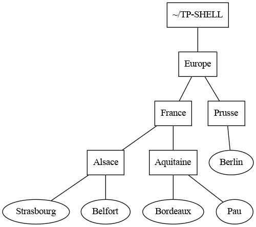

[python]: https://docs.python.org/3/tutorial/datastructures.html
[python-tutor]: http://pythontutor.com/visualize.html#mode=edit
[laurent bloch]: https://laurentbloch.net/MySpip3/IMG/pdf/histsys-screen-20200727.pdf
[bash]: https://fr.wikipedia.org/wiki/Bourne-Again_shell
[linux]: https://fr.wikipedia.org/wiki/Linux
[freebsd]: https://fr.wikipedia.org/wiki/FreeBSD
[macos]: https://fr.wikipedia.org/wiki/MacOS
[windows]: https://fr.wikipedia.org/wiki/Microsoft_Windows
[unix]: https://fr.wikipedia.org/wiki/Unix
[url]: https://fr.wikipedia.org/wiki/Uniform_Resource_Locator

# Se tester

## 1. BASH

1. Que fait la commande `ls -al` ?
2. Que fait la commande `mv` ?
3. La commande `ls -l toto.sh` affiche :

   ```
   -r-x-r--r-- 1   john    staff   128     18 mai 11:56 toto.sh
   ```

   a. À qui appartient ce fichier ?
   b. Qui peut écrire dans le fichier ?
   c. Qui peut le lire ?
   d. Qui peut l'exécuter ?

4. Logé sous Linux, dans un terminal on tape `cd` pour se placer dans HOME.
   Quelle commande doit-on ensuite taper pour déplacer dans le répertoire
   courant le fichier `exo1.py` qui se trouve dans `Documents/python` sachant
   que `Documents` est dans HOME ?

## 2. Se déplacer dans le système de fichiers

Observer l'arborescence suivante :


1. Proposer une commande qui permette de se déplacer du répertoire HOME de
   Alice à celui de Bob :
   a. en utilisant un chemin relatif ;
   b. en utilisant un chemin absolu.
2. Alice est à la racine `/`. Proposer trois commandes qui peuvent lui
   permettre de se déplacer dans son répertoire d'accueil (HOME).
3. Bob est dans son HOME. Aidez-le à :
   a. lister le contenu de son HOME ;
   b. lister le contenu de son HOME y compris les fichiers et répertoires cachés.
   c. lister le contenu du répertoire share sans quitter son HOME.

## 3. Créer une arborescence et se déplacer dedans

1. Créer dans le repertoire d'accueil l'arborescence ci-dessous dans laquelle
   A, B, C, D, E, F et G sont des répertoires :

   ```
   A
   +-- B
   |   |
   |   +-- D
   |   |
   |   +-- E
   +-- C
       |
       +-- F
       |
       +-- G
   ```

2. Quelle commande Unix permet de créer des fichiers vides ?
   Créer deux fichiers vides appelés "un" et "deux" dans votre
   répertoire d'accueil.
3. Quelle commande permet de copier des fichiers ou répertoires ? Colier le
   fichier "un" dans le répertoire "A" en lui donnant le nom "trois".
4. Comment réaliser la copie précédente en utilisant un chemin relatif si vous
   êtes ;
   a. dans le répertoire A ?
   b dans le répertoire B ?
5. Si votre nom d'utilisateur est `alice`, comment réaliser cette copie
   en utilisant un chemin absolu ?
6. Comment renommer le fichier "trois" en "quatre" ?

## 4. Mettre en majuscule

1. Expliquer ce que fait la commande suivante (respecter les espaces) :

   ```bash
   echo 'bonjour' | tr [a-z] [A-Z]
   ```

   Remarque : Consultez la page de manuel (`man tr`)
   [correspondante](http://www.linux-france.org/article/man-fr/man1/tr-1.html).

2. Écrire un script à un argument qui met en majuscule l'unique argument fourni.

## 5. Tester l'existence d'un fichier et en afficher le contenu

1. Quelle option de la commande `echo` faut-il utiliser pour rester sur la même
   ligne ?\
   [manuel d'echo](http://www.linux-france.org/article/man-fr/man1/echo-1.html)
2. Comment faut-il faire pour afficher un message sur plusieurs lignes avec
   cette même commande ?
3. Rappeler la commande permettant de lire au clavier et de stocker le résultat
   dans une variable bash.
4. Comment affiche-t-on le contenu d'un fichier sur le terminal ?
5. Pour tester l'existence d'un fichier, en BASH on utilise le test suivant :

   ```bash
   fic='monfic'
   if [ -f $fic ]
       then
           echo "Le fichier $fic existe"
       else
           echo "Le fichier $fic n\'existe pas !"
   fi
   ```

   Écrire un script qui demande à l'utilisateur de saisir un nom de fichier,
   teste si ce fichier existe, puis en affiche son contenu dans le terminal.

## 6. Lire les droits d'un fichier

Pour chacun des fichiers suivants, répondre aux deux questions :

```
-rwx------  1 alice     etu     43M     14 jui 11:55 fichier1
-rw-r--r--  1 roza      staff   54K     14 jui 11:56 fichier2
-rwx--x--x  1 bob       admin    3M     14 jui 11:57 fichier3
-r-xr-----  1 john      john     1B     14 jui 11:55 fichier4
```

1. Donner le nom de l'utilisateur auquel il appartient, les droits qu'il a
   sur le fichier, ceux du groupe et des autres
2. Quel est l'équivalent octal du droit correspondant ?

## 7. Rendre exécutable un fichier

1. Rappeler la commande qui permet de rendre exécutable un fichier pour tous
   les utilisateurs?
2. Rappeler la manière de tester l'existence d'un fichier.
3. Utiliser ces connaissances pour construire un script `rendExecutable` à un
   argument qui teste si cet argument désigne un fichier existant, et le
   rend exécutable si besoin.

   Pour tester si un fichier est exécutable, on peut utiliser le test
   similaire ;

   ```bash
   if [ -x $fic ]
       then
           echo "Le fichier $fic est exécutable"
       else
           echo "Le fichier $fic n'est pas exécutable !"
   fi
   ```

## 8. Rendre exécutable plusieurs fichiers

1. Rappeler comment on accède à la liste des arguments d'un script.
2. Comment parcourir cette liste dans un script ?
3. Utiliser ce parcours pour proposer un script `ajouteDroits.sh` qui attend
   en entrée une liste de fichiers et les rend tous exécutables (si besoin).

## 9. Arborescence

Sans toucher le clavier, décrire l'effet de chacune des commandes suivantes, en supposant qu'elles sont enchaînées dans l'ordre :

```shell
user:~$ cd ~
user:~$ mkdir sandbox
user:~$ cd sandbox/
user:~/sandbox$ mkdir nsi
user:~/sandbox$ cd nsi
user:~/sandbox/nsi$ touch TP_shell
user:~/sandbox/nsi$ chmod ugo=rw-rw-rw- TP_shell
user:~/sandbox/nsi$ cd ..
user:~/sandbox$ mkdir maths
user:~/sandbox$ mkdir maths/premiere
user:~/sandbox$ touch maths/TP_proba
user:~/sandbox$ ls maths
```

## 10. Arborescence, bis

_exercice du manuel de première NSI chez Ellipses_

Sans toucher le clavier dessiner l'arborescence du répertoire `~/test` après l'exécution dans l'ordre de la séquence de commandes ci-dessous :

```shell
user:~$ mkdir sandbox
user:~$ cd sandbox/
user:~/sandbox$ mkdir a b c d
user:~/sandbox$ touch a/t.txt d/foo.txt
user:~/sandbox$ cd c
user:~/sandbox/c$ mkdir ../b/e f g
user:~/sandbox/c$ cd ..
user:~/sandbox$
user:~/sandbox$ cp */*.txt c/g
user:~/sandbox$ rm -rf d
```

## 11. _QCM de type E3C 2_

1. Dans un système Linux, on dispose d'un répertoire racine contenant deux
   répertoires `documents` et `sauvegardes`. On se trouve dans le répertoire
   documents où figure un fichier `NSI.txt`.

   Quelle commande permet de créer une copie nommée `NSI2.txt` de ce fichier
   dans le répertoire sauvegardes ?

   **Réponses**

   **A)** `cp NSI.txt NSI2.txt`

   **B)** `cp NSI.txt sauvegardes/NSI2.txt`

   **C)** `cp NSI.txt ../NSI2.txt`

   **D)** `cp NSI.txt ../sauvegardes/NSI2.txt`

2. À partir du dossier `~/Doc/QCM`, quelle commande permet de rejoindre le
   dossier `~/Hack/Reponses` ?

   **Réponses**

   **A)** `cd Hack/Reponses`

   **B)** `cd /Hack/Reponses`

   **C)** `cd ~/Hack/Reponses`

   **D)** `cd ../../Hack/Reponses`

3. Sous Linux, les droits d'accès à un fichier dont le propriétaire est
   Joseph sont les suivants : `-rwxr-xr--`

   Laquelle des affirmations suivantes est **fausse** ?

   **Réponses**

   **A)** Joseph a l'autorisation de lire ce fichier

   **B)** les membres du groupe de Joseph ont l'autorisation de lire ce fichier

   **C)** tous les utilisateurs ont l'autorisation de lire ce fichier

   **D)** les membres du groupe de Joseph ont l'autorisation de modifier ce
   fichier

4. Dans la console Linux, quelle commande faut-il exécuter pour effacer le
   fichier `test0.csv` ?

   **Réponses**

   **A)** `rm test0.csv`

   **B)** `cp test0.csv`

   **C)** `ls test0.csv`

   **D)** `mv test0.csv`

5. Dans un terminal, on exécute la suite de commandes système suivante :

   ```shell
   cd ~
   cd seances/tp
   mv exercice.txt ./../../exercice.txt
   ```

   Où se trouve finalement placé le fichier exercice.txt ?

   **Réponses**

   **A)** dans le répertoire `~/seance/tp`

   **B)** dans le répertoire `~/seance`

   **C)** dans le répertoire `~`

   **D)** dans le répertoire `/home`

6. Pour renommer un fichier `text1.txt` en `text1.old` dans un même répertoire,
   quelle commande faut-il utiliser ?

   **Réponses**

   **A)** mv text1.txt ../text1.old

   **B)** mv text1.txt text1.old

   **C)** cp text1.txt text1.old

   **D)** lns text1.txt text1.old

7. Sous Unix, que fait la commande suivante ? `ls --a /home/pi >> toto.txt`

   **Réponses**

   **A)** elle liste uniquement les répertoires cachés du répertoire /home/pi

   **B)** elle liste tous les fichiers du répertoire /home/pi et enregistre le
   résultat dans un fichier toto.txt

   **C)** elle liste tous les fichiers des répertoires de /home/pi et de
   toto.txt

   **D)** elle liste tous les fichiers du répertoire courant et enregistre le
   résultat dans un fichier /home/pi/toto.txt

8. Par quelle ligne de commande peut-on créer, sous le système
   d'exploitation Linux, trois répertoires nommés : JAVA, PYTHON et PHP ?

   **Réponses**

   **A)** `mkdir JAVA, PYTHON, PHP`

   **B)** `mk -dir JAVA PYTHON PHP`

   **C)** `mkdir JAVA PYTHON PHP`

   **D)** `mk dir JAVA PYTHON PHP`

9. À partir du répertoire `~/Perso/Doc` quelle commande permet de rejoindre
   le répertoire `~/Public` ?

   **Réponses**

   **A)** `cd ./Public`

   **B)** `cd ../Public`

   **C)** `cd ././Public`

   **D)** `cd ../../Public`

10. Dans la console Linux, quelle commande faut-il exécuter pour obtenir la
    documentation sur la commande `pwd` ?

    **Réponses**

    **A)** man pwd

    **B)** cd pwd

    **C)** mkdir pwd

## 11. _Exercice du livre Parlez-vous Shell ? de Thomas Hugel chez Ellipses_



On se place dans le répertoire personnel de l'utilisateur représenté par le raccourci `~`.

1. Dans son répertoire personnel, créer le répertoire `TP-SHELL` puis entrer dans ce répertoire.
2. Créer le répertoire `Europe` et changer de répertoire courant pour `Europe`.
3. Écrire une suite de commandes qui permet de construire l'arborescence ci-dessus sans quitter le répertoire `Europe`. Les fichiers apparaissant avec des rectangles sont des répertoires et les autres sont des fichiers.
4. Créer dans `~` une copie de tout le répertoire `Europe` avec ses sous-répertoires et nommer cette copie `Vieille-Europe`. Les modifications qui suivent devront être faites dans `Europe`.
5. Appliquons le traité de Francfort de 1871. Se placer dans le répertoire `Prusse` et déplacer `Belfort` dans `France` puis déplacer `Alsace` dans `Prusse`.
   Revenir dans `Europe` et renommer `Prusse`en `Allemagne`.
6. Depuis `Europe`, afficher le contenu de `Bordeaux` puis détruire ce fichier.
7. Appliquons le traité de Versailles de 1919. Depuis `France`, ramener `Alsace` en `France` puis détruire `Vieille-Europe`.

# Exercices plus avancés

## 12. Flux d'entrée / sortie et redirections, filtres et pipeline

- Par défaut, chaque programme (dont les commandes _shell_) exécuté dans un _shell_ [UNIX][unix] admet trois canaux, ou flux, de communication avec l'extérieur :

  - Un canal d'entrée nommé _entrée standard_ (_stdin_ en anglais) qui par défaut est le texte saisi au clavier dans le terminal.
  - Un canal de sortie nommé _sortie standard_ (_stdout_ en anglais) qui par défaut est l'écran du terminal.
  - Un canal d'erreur nommé _erreur standard_ (_stderror_ en anglais) qui par défaut est l'écran du terminal.

- On peut modifier l'entrée ou la sortie standard d'une comande pour lire ou écrire sur d'autres canaux que ceux par défaut (fichiers ou flux réseaux au lieu de clavier / écran ). Pour rediriger un flux vers l'entrée ou la sortie standard d'une commande on utilise des _opérateurs de redirection_ :

| Opérateur | Redirection                       |
| --------- | --------------------------------- |
| `>`       | sortie standard                   |
| `>>`      | sortie standard en ajout à la fin |
| `<`       | entrée standard                   |

- Par exemple, si on veut écrire le contenu du répertoire courant dans un fichier `contenu.txt`, on redirige la sortie standard de `ls` vers un fichier `contenu.txt` au lieu de l'écran du terminal :

  ```sh
  user:~$ ls > contenu.txt
  ```

- Et si on veut compter le nombre de mots dans un texte, on redirige son entrée standard vers le contenu de `texte.txt` au lieu du clavier :

  ```sh
  user:~$ wc -m < texte.txt
  ```

- On peut enchaîner les commandes en _pipeline_ : la sortie standard d'une commande est raccordée à l'entrée standard d'une commande suivante à l'aide d'un _pip_ symbolisé par le caractère `|` :

  ```sh
  commande_debut | commande_fin
  ```

- Si on veut intercaler une commande entre les deux, elle doit envoyer son entrée standard sur sa sortie standard : de telles commandes qui servent de traitements intermédiaires entre le début et la fin d'un pipeline sont appelées _filtres_. On peut ainsi réaliser en un une ligne de commande des traitements complexes.

  ```sh
  commande_debut | filtre1 | filtre2 | ... | commande_fin
  ```

- Le tableau ci-dessous donne quelques exemples de filtres, d'autres options sont disponibles pour chaque commande.

  | Commande        | Action                                                                                           |
  | --------------- | ------------------------------------------------------------------------------------------------ |
  | `cat`           | copie son entrée standard sur sa sortie standard sans modification                               |
  | `sort`          | trie les lignes de son entrée standard par ordre alphabétique                                    |
  | `sort -r`       | trie les lignes de son entrée standard par ordre alphabétique inverse                            |
  | `sort -n`       | trie les lignes de son entrée standard par ordre numérique                                       |
  | `cut -d : -f 5` | sélectionne le 5 eme champ de chaque ligne de son entrée standard découpée selon le délimiteur : |
  | `wc -l`         | compte les lignes de son entrée standard                                                         |
  | `wc -w`         | compte les mots de son entrée standard                                                           |
  | `wc -m`         | compte les caractères de son entrée standard                                                     |
  | `uniq`          | supprime les lignes considérées comme des doublons                                               |
  | `head -n5`      | affiche les cinq premières lignes de son entrée standard                                         |
  | `head -n-5`     | affiche tout sauf les cinq dernières lignes de son entrée standard                               |
  | `tail -n5`      | affiche les cinq dernières lignes de son entrée standard                                         |
  | `tail -n+5`     | affiche tout sauf les cinq premières lignes de son entrée standard                               |


## 13. _Exercice du manuel de première NSI de Thibault Balabonski chez Ellipses_

Le fichier `/etc/passwd` contient la liste des utilisateurs locaux de la machine.
Pour chaque question, on recherchera éventuellement dans le manuel avec la commande `man command` les options pertinentes des commandes proposées.

1. Afficher les 5 premières lignes du fichier `/etc/passwd`.
2. Afficher la page du manuel de la commande `tac` puis utiliser cette commande pour afficher `/etc/passwd` à l'envers.
3. Trier le fichier `/etc/passwd` avec la commande `sort`. Quel ordre est utilisé ?
4. Les champs de chaque ligne de `/etc/passwd` sont séparées par le caractère `:`. Trier le fichier selon le troisième champ. Quel ordre est utilisé ?
5. Trier `/etc/passwd` selon le troisième champ avec l'ordre numérique.

## 14. exercice

1. Ouvrir un terminal et choisir comme répertoire courant `~/TP-SHELL`.
2. Créer un un répertoire `carnet` puis entrer dans ce répertoire.
3. Consulter l'aide de la commande `wget` avec `wget --help` ou `man wget` puis télécharger le fichier d'[URL][url] :
   <https://gitlab.com/frederic-junier/nsi-public/-/raw/master/Premiere/Systeme/TP2/contacts-1000.csv>

4. Afficher les 3 premières lignes de `contacts-1000.csv`, puis ses 3 dernières lignes puis son nombre de lignes. Chaque ligne contient un nom de contact et une adresse mail séparés par le caractère `,`.
5. Écrire une commande qui affiche les 10 premières lignes du contenu de `contacts-1000.csv` classé par ordre alphabétique croissant.
6. Écrire une commande qui trie `contacts-1000.csv` par ordre alphabétique croissant puis recopie ce contenu dans le fichier `contacts-1000-alpha.csv`.
7. Écrire une commande qui filtre les lignes de `contacts-1000.csv` en sélectionnant uniquement le champ nom puis qui classe ces noms par ordre alphabétique croissant.
8. Compléter la commande précédente pour qu'elle supprime les doublons et affiche devant chaque nom le nombre de doublons, c'est-à-dire d'adresses mails du contact.
   On consultera la page de manuel de la commande `uniq` pour sélectionner la bonne option.
9. Modifier la commande précédente pour que les contacts soient classés par nombre décroissant d'adresses mails et que le tout soit redirigé vers un fichier `top-mails.txt`.

## 15. Recherches

Le _shell_ [BASH][bash] fournit de nombreuses commandes pour rechercher des informations dans le système de fichiers.

- Pour une recherche sur les fichiers, on peut utiliser la commande `find` qui permet d'effectuer une recherche par nom parmi de nombreuses options :

  | Commande                         | Action                                                                                                             |
  | -------------------------------- | ------------------------------------------------------------------------------------------------------------------ |
  | `find -name photo.png`           | recherche les fichiers nommés photo.png dans le répertoire courant et tous ses sous-répertoires                    |
  | `find -iname photo.png`          | idem mais insensible à la casse                                                                                    |
  | `find -name photo.png ~/sandbox` | recherche les fichiers nommés photo.png dans le répertoire ~/sandbox et tous ses sous-répertoires                  |
  | `find -name '\*.png' ~/sandbox`  | recherche les fichiers dont le nom se termine par `.png` dans le répertoire ~/sandbox et tous ses sous-répertoires |

- Par exemple, si on veut rechercher le fichier 'ducotedechezswann.txt' dans son répertoire personnel :

  ```sh
  user:~$ find -name 'ducotedechezswann.txt'
  ./Git/Gitlab/frederic-junier/Premiere-NSI/ducotedechezswann.txt
  ./NSI/TP/ressources/ducotedechezswann.txt
  ```

- Pour une recherche sur un contenu de fichier, on peut utiliser la commande `grep` qui permet d'effectuer une recherche d'un fragment de texte dans les fichiers donnés en argument. Par défaut `grep` affiche chaque ligne de fichier où le fragment apparaît.

  | Commande                             | Action                                                                                           |
  | ------------------------------------ | ------------------------------------------------------------------------------------------------ |
  | `grep 'fragment texte' fichier`      | recherche les occurences de 'fragment texte' dans fichier                                        |
  | `grep -c 'fragment texte' fichier`   | affiche juste le nombre d'occurences de 'fragment texte' dans fichier                            |
  | `grep -r 'fragment texte' rep`       | recherche les occurences de 'fragment texte' dans le répertoire rep et tous ses sous-répertoires |
  | `grep -r -l -i 'fragment texte' rep` | idem mais n'affiche que les noms de fichiers et insensible à la casse                            |

- Par exemple si on veut compter le nombre d'occurences de 'swann' dans le texte 'unamourdeswann.txt' :

  ```sh
  user:~$ grep -i -c 'swann' ducotedechezswann.txt
  685
  ```

## 16. find

Ouvrir un terminal avec la page de manuel de la commande `find` obtenue avec `man find`.

Ouvrir un autre terminal pour traiter les questions suivantes.

1. Écrire une commande qui affiche tous les fichiers d'extension `.py` contenus dans son répertoire personnel ou ses sous répertoires.
2. Compléter la commande précédente pour afficher le nombre des fichiers trouvés.
3. Compter de même le nombre de fichiers d'extension `.py` dans le répertoire `/usr/share`.
4. Écrire une commande qui compte le nombre total de répertoires contenus dans son répertoire personnel `~` et tous ses sous-répertoires.
5. Écrire une commande qui compte le nombre de fichiers qui ne sont pas des répertoires et qui ont été créés dans son répertoire personnel et tous ses sous-répertoires dans les dix dernières minutes.

## 17. Gutenberg

Le projet Gutenberg met à disposition des utilisateurs des textes du domaine public en format numérique (`txt`, `epub` ...)
sous licence libre (voir [The Gutenberg License](https://www.gutenberg.org/wiki/Gutenberg:The_Project_Gutenberg_License)).

Le texte brut du "Tour du monde en 80 jours" écrit par Jules Verne est disponible à partir de l'[URL][url] <http://www.gutenberg.org/ebooks/800.txt.utf-8>.

1.  Ouvrir un terminal _shell_ et choisir comme répertoire courant `~/TP-SHELL`.
2.  Créer un un répertoire `Phileas` puis entrer dans ce répertoire.
3.  Consulter l'aide de la commande `wget` avec `wget --help` ou `man wget` puis télécharger le fichier contenant le texte du "Tour du monde en 80 jours" au format `txt`.

    ```sh
    user:~/TP-SHELL/Phileas$ ls
    800.txt.utf-8
    ```

4.  Renommer le fichier en `tour-du-monde-80-jours.txt`.

    ```sh
    user:~/TP-SHELL/Phileas$ ls
    tour-du-monde-80-jours.txt
    ```

5.  Afficher le nombre de lignes, le nombre de mots, le nombre de caractères et le nombre d'octets de `tour-du-monde-80-jours.txt` avec des options bien choisies de la commande `wc`. Comment peut-on expliquer que le nombre de caractères est inférieur au nombre d'octets ? Vérifier l'encodage du fichier avec la commande `file tour-du-monde-80-jours.txt`.
6.  Les commandes `du` et `zip` permettent respectivement d'afficher la taille d'un fichier et de compresser un fichier. Consulter leurs pages de manuel avec `man du | less` et `man zip | less`. La commande `less` est un _pager_ qui permet d'afficher une page à la fois dans le terminal.

    - Afficher la taille du fichier en kilo-octets avec la commande `du -h tour-du-monde-80-jours.txt`.
    - Compresser la fichier avec la commande `zip`. Quel est le taux de compression ?
    - Avec la commande `head`, afficher les dix premières lignes des fichiers `tour-du-monde-80-jours.txt` et `tour-du-monde-80-jours.zip`. Que peut-on remarquer ?

7.  Consulter la page de manuel de la commande `tac` avec `man | less tac`. En une seule commande, créer un fichier `tour-du-monde-80-jours-inverse.txt` où toutes les lignes du fichier initial sont recopiées à l'envers.
8.  Dans `tour-du-monde-80-jours.txt`, avec la commande `grep` et des options bien choisies :

    - Compter le nombre d'occurences du mot `phileas`. On doit trouver 330.
    - Afficher le numéro de ligne du fragment de texte "\*\*\* START OF". Vérifier avec un éditeur de textes.
    - Afficher le numéro de ligne du fragment de texte "\*\*\* END OF". Vérifier avec un éditeur de textes.
    - En une seule commande, créer un fichier texte `tour-du-monde-80-jours-brut.txt` qui contient toutes les lignes comprises entre celles commençant par `*** START OF` et `*** END OF`, les deux bornes exclues.
