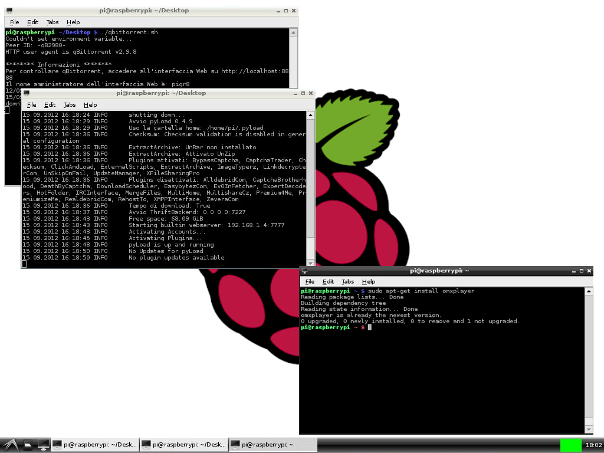

### pdf [pour impression](/uploads/docsnsi/architecture/linux/tp_debian.pdf)

Linux : première partie {#linux--première-partie}
=======================

### Réponses attendues à ce TP

1.  Vous allez compléter la section **Liste des commandes rencontrées**,
    en décrivant les actions des commandes listées. Chaque commande qui
    y figure est présentée dans le TP.

    Ouvrez un fichier dans un éditeur de texte et remplissez le au fur et à mesure.

*Exemple* :

-   `ls` : liste les fichiers du dossier courant
-   `cd` : change le dossier courant

Faîtes le au fur et à mesure sans quoi vous perdrez le fil.

1.  D'autres questions sont posées, ne portant pas sur des commandes.
    Vous devez y répondre après votre liste.

Introduction à Linux avec la clé USB Débian "Corsair"
-------------------------------------------------------

**Linux** est le noyau d'un système d'exploitation (OS) dont
**debian** est une distribution.

-   C'est un système d'exploitation libre dont il existe de nombreuses
    variantes fonctionnant elles-mêmes sur le noyau linux (ubuntu,
    centOS, archlinux, manjaro ).
-   Linux est un dérivé d'UNIX, système crée dans les années 70, codé
    en langage C (crée à cette occasion). Ces deux "logiciels" : C et
    UNIX constituent à la fois le langage le plus important de
    l'histoire informatique (la majorité des langages actuels dérivent
    du C et la majorité des machines professionnellent tournent sur un
    dérivé d'UNIX).
-   UNIX et ses dérivés sont présents partout : tous les smartphones
    fonctionnent sur un de ses dérivés (Linux pour android, bsd pour
    iOS) ainsi que les mac.
-   On peut faire tourner un dérivé d'UNIX sur n'importe quelle
    machine : une caméra IP, par exemple, est généralement un ordinateur
    fonctionnant sur linux...
-   Il existe des versions payantes de Linux (pour les professionnels),
    **debian** est un système d'exploitation gratuit et reconnu par les
    professionnels pour sa grande stabilité. Il n'est pas rare de
    rencontrer un serveur debian fonctionnant sans redémarrer depuis
    plusieurs années...

**Debian Corsair**

-   Est un projet d'un lycée de Dunkerque visant à enseigner Linux et
    pouvant fonctionner sur la majorité des ordinateurs.

-   Le système fonctionne en mode "live" ("vif" en français) c'est
    à dire sans être installé sur le disque de la machine. On boote sur
    la clé USB après avoir réglé son BIOS pour qu'il démarre depuis une
    clé USB. Et c'est tout ce qu'il y à faire.

    *Attention* cependant, tout ce que vous écrivez sur la clé est
    conservé. Il faudra faire garde aux enregistrements, ils ne sont
    généralement pas écrits sur le disque dur de la machine hôte.

**Usage courant de Linux**

Ce TP vise à vous présenter l'envers du décor. C'est une formation
d'informatique, pas une initiation à l'usage courant de Linux. Dans la
vie de tous les jours, avoir un PC qui fonctionne sous Linux ne change
presque rien... Tous les logiciels "modernes" ou presque sont
présents et la seule "difficulté" vient d'essayer de jouer aux
jeux-vidéos.

Maintenant c'est parti.

Avant de commencer : état de la machine. {#avant-de-commencer--état-de-la-machine}
----------------------------------------

Pour accéder au système vous avez :

1.  Éteint le PC.
2.  Branché la clé USB, idéalement sur un port USB 3.0
3.  Relancé le PC
4.  **CHEZ VOUS OUVERT LE BIOS** (F2, DEL, F10 etc. C'est affiché sur l'écran de
    démarrage)
    
    **EN SALLE 213** Il suffit _normalement_ d'appuyer sur F12 et de choisir "USB KEY (non UEFI)"
    Le "non UEFI" est important.
5.  Changé la priorité de démarrage pour booter sur une clé USB. Le
    second choix doit être le disque dur local.
6.  Enregistré ce réglage et redémarré.
7.  Vous arrivé sur un bureau différent, sans devoir vous authentifier.
    Tout est bon !

Après ce TP. {#après-ce-tp}
------------

Chez vous seulement, en 213 il n'y a rien à faire.

1.  Éteindre le PC,
2.  Retourner dans le BIOS
3.  **Changer l'ordre de démarrage : booter sur le disque dur en premier**
4.  Enregistrer, redémarrer. Il doit booter sur l'ancien système.

Accéder à une machine
---------------------

On doit distinguer plusieurs manières d'accéder à une machine et de
l'employer :

1.  Locale ou distante
2.  Graphique ou ligne de commande

### Accès local

C'est la situation courante : **vous êtes devant un ordinateur qui est
raccordé à un moniteur et dispose de périphériques (clavier, souris)**

après l'avoir démarré vous avez, sur l'écran, son interface.

### Accès distant

La machine distante (serveur) est raccordée à un réseau dont votre
machine (client) fait partie.

Vous êtes devant le client et accédez au serveur **par le réseau.**

On emploie de nombreux protocoles pour y parvenir, parmi lesquels SSH,
RDP et VNC. À noter, il est possible d'utiliser un serveur dans le
navigateur Chrome et d'y acccéder par ce même navigateur sur le client.

Bref, les solutions ne manquent pas.

### Interface graphique (GUI) / Interface en ligne de commande (CLI) {#interface-graphique-gui--interface-en-ligne-de-commande-cli}

-   L'interface **graphique**, notée GUI (Graphical User Interface) est
    celle à laquelle vous êtes habitué : fenêtre, menus, clic clic
    clic...
-   L'interface **en ligne de commande**, notée CLI (Command Line
    Interface) parfois appelée shell, terminal ou tty est l'interace
    courante d'un serveur distant : 

    * on tape des commandes (READ),
    * l'ordinateur évalue la réponse (EVAL), 
    * l'affiche (PRINT) 
    * recommence (LOOP)

    (principe du REPL déjà évoqué).

Contrairement à ce qu'on pourrait croire, la plus puissante et pratique
des manières d'utiliser un système UNIX est l'interface en ligne de
commande.

Accès local et graphique
------------------------

**Dans un premier temps nous allons travailler en mode "graphique".**

Vous devriez vite réaliser que ça ne change pas grand chose. 

---

Nous allons faire un passage en revue des éléments importants d'un
système UNIX.

Résumons :

-   La machine : Raspberry pi ou votre ordinateur habituel
-   Son système d'exploitation : Raspbian ou Debian.

Debian est un OS, basé sur LINUX. Linux n'est que le noyau (kernel)
du système. Il vérifie les principes d'UNIX.

Debian ajoute de nombreux logiciels et outils et forme un système
complet.

Quand c'est le cas et que le système est libre, on devrait employer le
terme GNU/Linux

**Graphiquement, Linux est très variable**

Debian Corsair utilise le *desktop environment* **Cinnamon**.

Cela signifie qu'en remplaçant Cinnamon par un autre environnement de
fenêtres on obtient des fenêtres totalement différentes... mais les
logiciels ne changent pas. Seulement l'allure et le comportement des
fenêtres. Bref, c'est pour le confort.

Gestionnaire de fichiers et arborescence
----------------------------------------

**A faire**

1.  Lancez le gestionnaire de fichier (icone Dossier Personnel).

2.  **Cliquez sur l'icône : "basculer le mode de navigation" :**


La barre d'adresse change et on lit : `/home/user`

C'est votre dossier personnel.

La clé debian corsair étant configurée de manière identique pour tout le
monde, ce dossier porte le nom générique "user". Généralement il porte
le nom de l'utilisateur courant : `/home/quentin`, par exemple.

1.  Cliquez maintenant sur le dossier **système**. Votre adresse est
    maintenant `/`.

L'arborescence d'un système UNIX débute à un dossier appelé racine et
noté / Il contient tous les autres (en fait, tout le système).

1.  Naviguer jusqu'au dossier `/home/user` en tapant l'adresse dans la
    barre d'adresse.

2.  Revenez à la racine, dans le dossier `/`

On y trouve différents dossiers :

    bin  boot  dev  etc  home  lib   man  media  mnt
    opt  proc  root  run  sbin  srv  sys   usr  var

Ce sont les mêmes dossiers dans tous les systèmes UNIX 

------------------------------------------------------------------------

Présentons rapidement ces dossiers

-   **`/bin`** : pour *binaries* (programmes compilés). Contient les
    programmes utilitaires courants (`ls`, `cp` etc.)

-   **`/boot`** : contient les fichiers nécessaires au démarrage de la
    machine

-   **`/dev`** : pour *devices* (appareil). Ce dossier contient les
    fichiers représentant les éléments matériels de la machine. Dans les
    systèmes UNIX chaque composant matériel est représenté par un
    fichier dans /dev. Par exemple, les disques de stockage sont dans
    /dev/sda, /dev/sdb etc. (Storage Device). Si un disque a plusieurs
    partitions, elles sont numérotées : /dev/sda1 etc. C'est un
    fonctionnement très différent de ce qu'on rencontre sous windows où
    fichiers, matériels et services sont séparés.

    **Pour simplifier : UNIX voit tous les éléments matériels comme des
    fichiers**

-   **`/etc`** : contient les fichiers de configurations des éléments
    principaux. Par exemple, `/etc/wpa_supplicant/wpa_supplicant.conf`
    contient les informations permettant de se connecter à un réseau
    Wi-Fi (SSID, type d'encryption, login, password).

-   **`/home`**: contient les dossiers des utilisateurs. Chaque compte
    crée sur la machine se voit attribuer un dossier dans `/home`.

    Par exemple `/home/pi` contient les fichiers de l'utilisateur pi :
    ses documents et ses configurations perso

    L'administrateur d'une machine est l'utilisateur `root` (racine)
    et il dispose de son propre dossier `/root`.

-   **`/lib`** : pour *libraries*. Contient les librairies essentielles.
    Une librairie est un ensemble de programmes, de fichiers qui peuvent
    être utilisés par plusieurs programmes. Plutôt que de les intégrer
    dans chaque programme qui s'en sert, on les range dans une
    librairie. Sous windows les librairies sont généralement des
    fichiers `*.dll`

-   **`/media`** et **`/mnt`** sont les *points de montage* des
    partitions auxquelles on peut accéder de manière temporaire ou via
    le réseau. Prenons l'exemple d'une clé USB.

    Chaque disque de stockage est référencé par
    `/dev/sda, /dev/sdb, /dev/sdc` etc.

    Quand on branche la clé, elle apparait d'abord dans /dev, par
    exemple en /dev/sdc. On ne peut malheureusement pas y accéder
    directement (ce ne sont que des 0 et 1).

    Ensuite, selon la manière dont est configuré le système, il *monte*
    cette clé dans un dossier. Généralement on verra apparaître un
    dossier `/media/USBKEY` et celui-ci apparaitra dans le gestionnaire
    de fichier avec une icone indiquant que c'est un disque qu'on peut
    retirer.

    Si vous cliquez sur l'icone "Ejecter", le système va simplement
    *démonter* ce disque et effacer le dossier dans /media. Elle
    apparaît toujours dans /dev/sdc mais on ne peut plus y accéder dans
    l'explorateur de fichiers.

    Tous les disques sont montés de façon similaire lorsque la machine
    démarre.

-   **`/opt`** : contient les programmes installés manuellement sur la
    machine. Tout ce qui n'est pas propre au système (mais est installé
    proprement) finit dans /opt

-   **`/proc`** : les informations sur les processus. On a dit plus haut
    qu'un élément matériel pouvait être vu comme un fichier (dans
    /dev). Les programmes en cours d'exécution sont appellés
    *processus* et apparaissent dans /proc. Répétons donc :

    **Pour simplifier : UNIX voit tous les processus comme des
    fichiers**

-   **`/sbin`** : pour *system binaries* : les programmes permettant de
    lancer le système une fois le noyau lancé.

-   **`/srv`** : les données des services. Souvent vide.

-   **`/sys`** : encore un dossier similaire à /dev ou /proc. Celui là
    contient les informations relatives au matériel généralement plug
    and play et au système d'exploitation et au kernel (le noyau du
    système) lui même.

-   **`/tmp`** : les fichiers temporaires.

-   **`/usr`** : un dossier qui contient des sous dossiers non
    critiques. On y retrouve `/usr/bin` : exécutables moins importants,
    `/usr/include` : les entêtes des programmes C (`#include stdio`)
    qu'on retrouve au début des programmes en C etc.

-   **`/var`** : un dossier pour les fichiers succeptibles de changer
    régulièrement, par exemple.

    -   **`/var/log`** : les journaux enregistrant le déroulement des
        programmes
    -   **`/var/www`** : la racine d'un site web servi par le logiciel
        Apache *etc.*

------------------------------------------------------------------------

**Résumons :**

-   Votre système d'exploitation : **debian "corsair"**,
-   Qui fonctionne sur un noyau Linux, dérivé d'UNIX.
-   UNIX est utilisé partout. Toute machine (ou presque) qui n'est pas
    sous windows, tourne sous UNIX.
-   L'arborescence d'un système UNIX représente tout le système (les
    disques, les fichiers, les processus etc.)
-   Elle débute à `/` (la racine)
-   `/home/quentin` est mon dossier personnel
-   `/dev` : dossiers des trucs "physiques", `/home` : les
    utilisateurs `.../bin/` les exécutables. `/etc` les réglages. Le
    reste n'est que "rarement" accédé directement par l'utilisateur.
-   L'utilisateur `root` est le "super utilisateur". Il a son propre
    dossier personnel appelé `/root`

------------------------------------------------------------------------

**Une question importante maintenant :**

Si UNIX est employé partout et comporte partout la même structure,
**comment partager une machine entre de multiples utilisateurs et les
empécher de détruire accidentellement le système ?**

Droits et permissions d'un fichier
-----------------------------------

Les utilisateurs d'une machine UNIX n'ont pas tous les mêmes droits.
Chaque fichier se voit attribuer un lot de règles qui définissent ces
permissions.

1.  Rendez vous dans /etc et regardez les propriétés du fichier
    `/etc/debian_version` (clic droit, propriétés, permissions).

Qui est le propriétaire ? Quel est le groupe d'utilisateurs à qui ce
fichier appartient ?

On distingue ensuite trois accès possibles : **Lire, Écrire, Exécuter**

-   Qui peut lire ce fichier ?
-   Qui peut le modifier ?
-   Qui peut l'exécuter ?

Exécuter signifie qu'on peut le lancer comme un programme et qu'il va
réaliser quelque chose.

Ce principe est une grande force d'UNIX. Chaque utilisateur est limité
dans ses pouvoirs. Seul le super utilisateur `root` peut accéder et
modifier tous les fichiers. C'est la raison pour laquelle on n'utilise
que très rarement l'utilisateur `root` : une erreur est vite arrivée.


1.  Rendez-vous dans `/home/user`

Ouvrez les propriétés d'une des images présentes dans le dossier.

Comparez avec les permissions du fichier précédent. À qui appartient ce
fichier ? Quelles permissions pouvez-vous modifier ?

1.  Pour s'assurer que vous avez bien compris : localiser l'exécutable
    `ls`. Il est dans `/bin`. C'est un programme d'usage courant,
    peut-être la commande qu'on tape le plus souvant. `ls` (list)
    renvoie la liste des éléments d'un dossier.

Selon vous, qui en est le propriétaire ? Qui peut le lire ? Qui peut le
modifier ? Qui peut l'exécuter ?

Vérifier sur le fichier lui même.

------------------------------------------------------------------------

Terminal
--------

Nous allons maintenant découvrir le terminal. 

Le terminal est l'outil le plus puissant d'UNIX et l'objectif de ce
premier TP est de vous familiariser à son emploi.

Cela ne fonctionnera que si vous prenez le temps de travailler
directement dans la console. Les commandes sont simples mais difficiles
à retenir si vous ne les utilisez jamais...

------------------------------------------------------------------------

Ouvrez un terminal (icone noire avec *\>\_*).




Vous êtes accueilli par un **prompt (\$)** qui vous indique où écrire.

Chaque commande est exécutée par entrée et son résultat s'affiche à la
suite. UNIX remonte aux années \~60 et, à cette époque, l'espace
mémoire était très onéreux. Les commandes sont donc COURTES. Les plus
courantes font 2 lettres.

Commençons par les deux plus importantes.

### Obtenir de l'aide avec \--help et man

Le shell, n'est pas crée pour un enfant de 4 ans comme l'interface de
windows. Il suppose déjà une certaine familiarité avec l'informatique.

En particulier, tout est décrit en détail, il ne faut pas avoir peur de
lire ni de se tromper (en étant prudent). Il faut TOUJOURS lire les
sorties, en particulier quand elles contiennent une erreur.

``` {.bash}
$ ls --help
$ man ls
```

Pourquoi le `$` ? Il indique qu'on est devant une commande système, à
exécuter dans un terminal. C'est le même principe que d'indiquer `>>>`
avant une commande Python. On préciser au lecteur où travailler.

Et donc, que doit-on faire pour obtenir l'aide de `ls` ?

1.  Ouvrir un terminal
2.  taper `ls --help` puis ENTRÉE

*Remarque :* on dit que `--help` est un paramètre de la commande `ls`.
Les commandes UNIX acceptent généralement le paramètre `-h ou --help`.

------------------------------------------------------------------------

### Dans toute la suite du TP, pour chaque nouvelle commande, vous lirez d'abord l'aide rapide, avec \--help puis survolerez le manuel avec man

C'est un reflexe à adopter avant toute utilisation d'une nouvelle
commande. Si vous voulez apprendre, il faut déjà comprendre ce qu'il
est possible de faire.

### Naviguer dans la console

------------------------------------------------------------------------

### Lister les documents avec ls : list {#lister-les-documents-avec-ls--list}

-   La première commande `$ ls --help` vous affiche un résumé de l'aide
    de la commande `ls`.

-   La seconde ( `$ man ls` ) affiche le manuel de `ls`. On quitte une
    page de documentation avec le raccourci clavier `q`.

    L'équivalent sous DOS (cmd de windows) de `$ ls` est `dir`

Lister les dossiers du dossier racine avec `$ ls /` Liste les fichiers,
y compris ceux qui sont cachés et afficher une liste avec des nombres
qu'on comprend avec `$ ls -lah ~`

**La syntaxe d'une commande bash.** Elle se généralement présente ainsi
: `$ commande -parametres dossiers/fichiers`

Par exemple : `$ ls -lah /home/pi`

-   La commande est `ls`
-   Les paramètres sont `-lah` : **l** présenter une liste détaillée,
    **a** tous les fichiers, y compris ceux cachés, **h** lisible par un
    **humain**
-   Le dossier est `/home/pi`

Cette commande liste donc les fichiers, y compris ceux cachés du dossier
`/home/pi`

------------------------------------------------------------------------

### Se déplacer avec `cd` : change directory, se repérer avec pwd {#se-déplacer-avec-cd--change-directory-se-repérer-avec-pwd}

**pwd** affiche le dossier courant, cd permet de se déplacer

```bash
$ cd /home/pi
$ cd /
$ cd ~
$ cd ..
$ cd ../bin
$ cd -
```

Tester ces différentes commandes. Quel est le dossier dont le nom résumé
est `~` ?

Le shell de linux utilise un interpréteur en ligne de commande appellé
BASH. Il en existe d'autre (zsh etc.) mais BASH est le plus courant.

Dans bash on peut tout programmer : exécuter des scripts qui nettoient
vos dossiers, se connecter à tel site et le télecharger en entier,
savoir quels sont les processus qui tournent et consomment le plus de
mémoire. On peut absolument TOUT faire dans bash.

Les commandes les plus délicates (ie. qui modifient le système) sont
réservées à l'utilisateur `root` ou à un groupe d'utilisateurs
bénéficiant des mêmes droits (sudo).

Nous allons maintenant créer des dossiers, des fichiers et les effacer.

**Deux dossiers particuliers de l'arborescence UNIX**

Dans chaque dossier on trouve un lien vers deux dossiers particuliers :

-   `..` remonte d'un dossier dans l'arborescence. Si je suis dans
    `/home/user` alors `cd ..` m'envoie dans dans `/home`
-   `.` désigne le dossier courant. Donc exécuter `cd .` ne fait rien.
    Présenté comme cela c'est inutile ! On emploie cependant `cd .`
    pour mettre à jour des variables d'environnement. Nous en
    reparlerons plus tard...
-   Raccourcis. Le dossier de l'utilisateur est raccourci en `~` par
    bash. Si vous changez d'utilisateur (ce qui arrive régulièrement
    quand on installe un système, par exemple) vous pouvez vous repérer
    facilement.

**Résumé : navigation**

-   `ls /home/user` : liste les fichiers du dossier `/home/user`
-   `cd /` : me déplace vers `/`
-   `pwd` : affiche le dossier courant (pour savoir où on est)
-   `..` désigne le dossier parent, `.` désigne le dossier courant et
    `~` est le dossier personnel de *l'utilisateur* courant.

------------------------------------------------------------------------

### Modifier des fichiers dans la console

### Créer un dossier avec `mkdir`, créer un fichier vide avec `touch`

La commande permettant de créer un dossier est `mkdir` (make directory).
Pour créer un fichier vide on emploie `touch`.

Créer les dossiers

    /home/user/essai
    /home/user/bonjour
    /home/user/bonjour/raymond

Dans le dossier `raymond` créer le fichier `recette.txt`. Créer ensuite
les fichiers `telephone.txt` et `adresse.txt` avec la commande
`touch telephone.txt` etc.

------------------------------------------------------------------------

### Éditer un texte avec nano (éditeur minimaliste)

Il existe de nombreux éditeurs de texte en ligne de commande. Les plus
connus sont `vi` et `emacs`.

Nous n'utiliserons *aucun des deux*.

-   `vi` est très puissant (truc de fou) mais dispose de raccourcis
    claviers qui prendraient 3 heures à exposer. Retenez cependant que
    pour quitter `vi` il faut taper les touches **`:q ENTREE`**
-   `emacs` est très puissant, moins effayant mais finit par ressembler
    à une usine à gaz : emacs fait tout, y compris le café.

Nous nous contenterons de `nano`


On reconnait `nano` à la barre du haut et aux raccourcis claviers du
bas.

Le symbole `^` désigne la touche CTRL ou CMD sous mac. Donc CTRL + X
permet de quitter `nano`.

Vous allez donc éditer votre recette avec
`$ nano /home/user/bonjour/raymond/recette.txt`

**Utiliser l'autocomplétion (tab) pour éviter de taper les noms
complets.**

par exemple, `nano /home/user/bon` TAB va compléter jusque /bonjour.

Dans nano il n'y a que 2 raccourcis à connaitre :

-   ctrl + C s'il vous affiche des messages bizarres.
-   ctrl + X pour quitter. ctrl + X, oui : enregistre (yes si linux est
    en anglais), ctrl + X, non : n'enregistre pas.

Vous apprendrez les autres si nécessaire (Je sais aussi rechercher du
texte avec ctrl + w, le reste m'est inutile.

Ajoutez votre recette préférée et enregistrez la.

------------------------------------------------------------------------

### Copier avec cp, déplacer/renommer avec mv

**cp** permet de copier un fichier vers une autre destination.

Rendez vous dans le dossier `/home/user/bonjour`

Copier votre recette dans le même dossier sous le nom `recette2.txt`

    $ cp recette.txt recette2.txt

**mv** permet de déplacer un fichier et donc, indirectement, de le
renommer.

Renommer votre seconde recette en recette3.txt

    $ mv recette2.txt recette3.txt

La copie de votre recette s'appelle maintenant `recette3.txt`

Vérifiez avec `ls` que tout va bien.

------------------------------------------------------------------------

### Effacer des fichiers, des dossiers avec rm

Pour effacer un fichier, on utilse `rm` (remove)


**Attention, il n'y a AUCUNE CONFIRMATION dans UNIX.**

-   Si vous effacez n'importe quoi et plantez le système, il faut tout
    réinstaller.

-   ***Et vous avez immédiatement 0 au TP.***

-   Ainsi que deux heures durant lesquelles vous viendrez refaire des
    clés usb :)

Si vous êtes dans le dossier /raymond,

    $ rm recette.txt

va effacer votre fichier. Sinon, il faut spécifier l'adresse complète :

    $ rm /home/pi/bonjour/raymond/recette.txt

Pour effacer tous les éléments d'un dossier courant, on peut utiliser
un "joker" : `*` (=n'importe quoi)

Par exemple, depuis /raymond, `$ rm *.txt` efface tous les fichiers qui
se terminent par .txt

Pour effacer un dossier on peut utiliser `rm -rf nom_du_dossier`. Par
exemple ..../raymond et tout ce qu'il contient :

-   L'option `r` de `rm` : récursive, pour parcourir récursivement
    jusqu'à épuisement
-   L'option `f` de `rm` : "force" : efface sans rien demander.

Donc `rm -rf /home/user/bonjour` efface tous les dossiers et leurs
contenus à partir de `bonjour`, inclu.

    $ rm -rf /home/pi/bonjour/raymond

On peut aussi utiliser **rmdir** pour effacer des dossiers mais personne
ne s'en sert.

------------------------------------------------------------------------

### Quelques commandes pratiques : {#quelques-commandes-pratiques-}

-   **clear** : vider la console (en fait descendre de quelques lignes)
-   **cat** : afficher le contenu d'un fichier. Ce n'est pas
    exactement ce que fait `cat` mais pour l'instant, vous pouvez le
    comprendre ainsi. Testez `$ cat /home/user/bonjour/recette.txt`
-   **tail** : afficher la fin d'un fichier. Par exemple un journal
    d'enregistrement qui pèse 20 mo mais dont seule la fin vous
    intéresse. En particulier, `tail -f nomdufichier` permet à
    l'affichage d'être mis à jour si le fichier est édité.
-   **top** : affiche la liste des programmes qui tournent sur la
    machine et permet de trier, comme dans le gestionnaire de tâches,
    selon le processeur, la mémoire etc. Taper q pour quitter.
-   **less** : affiche un contenu en mode "paginé". Si une commande
    renvoie 200 pages de texte, less permet de n'afficher qu'une page
    à la fois.
-   **uptime** : depuis combien de temps tourne la machine ? Quelle est
    sa "charge" moyenne ?
-   **whoami** : qui est l'utilisateur courant ?
-   **w** : "Who ? What ?" Qui est connecté, que fait-il ?


------------------------------------------------------------------------

### D'autres commandes qu'on utilise parfois : {#dautres-commandes-quon-utilise-parfois-}

Que font les commandes **date, cal, du, df, which** et **who** ?

------------------------------------------------------------------------

Je rappelle aux impatients qu'il faut remplir au fur et à mesure la
liste des commandes.

### Connaître les processus avec `ps`, arrêter un processus avec kill, filtrer avec `grep`

Nous allons apprendre tout ça en même temps. Avant de se lancer, il faut
que vous connaissiez deux notions

-   Entrée et sortie standard
-   Tuyautage (pipe) des commandes

Ce qui a fait le succès d'UNIX est la possibilité d'enchainer des
programmes très simples pour faire faire des choses très évoluées.

Par exemple, on peut, en quelques caractères savoir quels sont les
scripts Python qui tournent et ensuite en une ligne les tuer.

Quand on sépare deux commandes par un pipe `|` (alt-gr + 6), la sortie
standard de l'une est envoyée dans l'entrée standard de l'autre.
Quand on sépare une commande et un fichier de \>\>, le résultat de la
commande est ajoutée à la fin du fichier.

Essayons.

-   `ps` renvoie la liste des processus qui tournent sur le machine.
    `ps -ef` est ce qu'on emploie souvent. Essayez.

Problème ? Ca prend des pages !

-   Première solution : \| more ou \| less. Je n'entrerai pas dans les
    nuances (less est mieux que more), mais testez `ps -ef | more` et
    `ps -ef | less` (quitter avec q, naviguer avec les touches
    habituelles)

-   grep permet de filtrer un résultat.

Donc, `ps -ef | grep root` va afficher tous les programmes qui tournent
et font apparaître le mot `root` quelque part.

1.  Créer un fichier vide processus.txt et y écrire tous les processus
    tournant actuellement sur la machine contenant le mot `/bin/`
2.  Nous allons créer un problème parfois difficile à résoudre... et le
    résoudre rapidement.
    -   Créer un fichier vide `boucle.py`
    -   avec `nano` éditer ce fichier et y ajouter une boucle infinie :

    ```python
    from time import sleep
    while True:
        sleep(10)
        print("robert le hardi")
    ```

    Enregistrer et quitter (Ctrl + x, oui)
3.  Exécuter `python boucle.py` et votre programme tourne indéfiniment.
    Pour l'arrêter c'est facile : ctrl + c
4.  Imaginons maintenant **que vous n'ayez pas la main sur le programme !** Il tourne en arrière plan et ne pouvez faire ctrl + c...

Relancer la boucle infinie et ouvrir un deuxième terminal.

-   Dans le premier terminal, lancer le programme et laisser le
    programme tourner. À partir de maintenant, vous ne toucherez plus à
    ce terminal. Nous allons tuer le programme en 2 commandes depuis un
    autre terminal.

-   Dans le second terminal, filtrer, parmi les processus en cours, les
    scripts python :  `

    ```sh
    $ ps -ef | grep python 
    ```

    Parmi les
    résultats vous devriez voir votre programme. Repérez le numéro qui
    apparaît juste après votre nom d'utilisateur

    Exemple : `pi 838 839 0 14:21 ? 00:00:11 python boucle.py`

    C'est le PID de votre processus (process identifier). Chez moi 838.
    Vous pouvez alors, depuis le second terminal, tuer votre programme
    avec

        $ kill 838

    *Je précise à Einstein qu'il faut remplacer 838 par le numéro
    affiché sur son écran, que je ne peux deviner.*

    Vous devriez avoir une confirmation du style
    `[1]+  Terminated              python boucle.py` et voir votre
    programme s'arrêter dans le premier terminal.

    Si jamais un programme résiste, vous pouvez insister avec `kill -9` (à
    éviter pour beaucoup de raisons que je n'aborderai pas) ou, si vous
    n'avez pas les droits, essayer un `sudo kill` ...

------------------------------------------------------------------------

### Consulter l'état du réseau avec ip a, ifconfig et ping

-   Pour obtenir les informations réseau d'une machine, il existe de
    nombreuses commandes. La plus courante est ifconfig mais elle est
    dépréciée ; cela signifie qu'elle finira par ne plus être
    installée.

    On privilégie donc **ip a**. Essayez et trouvez l'adresse ip et
    l'adresse mac de votre raspberry

-   Pour vérifier si on peut communiquer avec une machine on utilise
    `ping`. Ping permet de savoir si la machine et joignable et combien
    de temps mettent les paquets à faire un aller-retour. Le moyen le
    plus rapide de tester la connection à internet est de faire un ping
    à google avec :

    ```sh
    $ ping google.com
    ```


    Utilisez le raccourci clavier ctrl + c pour l'arrêter.

------------------------------------------------------------------------

Installer des programmes, des paquets, des librairies python
------------------------------------------------------------

Les distributions linux comportent généralement un **gestionnaire de paquets.**

C'est une suite de programme qui permet d'installer, desinstaller,
configurer des programmes automatiquement.

Les variantes de débian en comportent 3 qui sont complémentaires :
**dpkg, apt et aptitude.**

Trois ? Oui, car elles ne jouent pas le même rôle.

-   **dpkg** est à privilégier quand on doit installer et manipuler à la
    main. Elle ne fait rien d'autre que ce que vous lui demandez et
    installe ce qui est précisé, desinstalle exactement ce que vous
    demandez et voilà. On l'emploie quand on ne peut faire autrement.

-   **apt** et **aptitude** sont rivales (oui, oui les développeurs se
    battent pour proposer les meilleurs outils possibles)

En 2019, apt a repris l'ascendant sur aptitude (c'est pas moi qui le
dis, perso je m'en moque). On installe donc un programme avec

    $ sudo apt-get install nomduprogramme

Et il s'installe tout seul, **précédé de toutes ses dépendances.**

On desinstalle et nettoie avec

    $ sudo apt-get purge nomduprogramme
    $ sudo apt-get autoclean

Le principe d'un gestionnaire de paquet est de garder, sur la machine,
une liste des fichiers qu'on peut installer via ces commandes.

On met cette liste à jour avec

    $ sudo apt-get update

Pour chercher si un programme existe (ou retrouver son nom précis, ou
trouver tous les jeux de poker) on peut chercher :

    $ apt-cache search tetris
    $ apt-get install tint

`tint` étant le dernier nom de la liste :)

Avouez que ça change quand même de windows où :

-   chaque installation demande de passer par google
-   il faut naviguer sur un site à la noix avec des pubs, des faux liens
    et que sais-je encore
-   d'installer à la main... pour s'apercevoir qu'il manque un
    fichier... qu'on doit trouver et installer...
-   de desinstaller à la main ou via les menus qui échouent souvent etc.

Deux lignes viennent remplacer tout ce bidule.

Plusieurs inconvenients aux gestionnaires de paquets :

-   Il n'y a pas tout
-   Il faut parfois ajouter les sources à la main
-   Chaque distribution a son propre gestionnaire (pacman dans archlinux
    par exemple)
-   Quand ça échoue ça peut s'avérer complexe

------------------------------------------------------------------------

Pour les librairies python on utilise pip (Package Installer for Python)
qui fait la même chose :

D'abord on install pip :

    $ sudo apt-get install python-pip

Ensuite on peut installer des librairies :

    $ sudo pip install pygame

On teste que tout va bien :

    $ python3
    Python 3.7.4 (default, Oct  4 2019, 06:57:26)
    [GCC 9.2.0] on linux
    Type "help", "copyright", "credits" or "license" for more information.

    >>> import pygame
    pygame 1.9.4
    Hello from the pygame community. https://www.pygame.org/contribute.html

Et pour désinstaller :

    $ sudo pip uninstall pygame

Si vous voulez un truc pour Python 3 en particulier, utiliser pip3. Et
voilà.

------------------------------------------------------------------------

Je ne m'étendrai pas sur `git` qui vous permettra, au passage, de
télécharger les codes sources de programmes et permet de contribuer à un
projet sur GitHub mais vous devriez commencer à comprendre :

**Sous linux, il est rare (mais ça arrive) qu'on doive installer à la
main. On préfère laisser un gestionnaire de paquets s'en charger.**

Toutes les distributions "avancées" ont un client graphique pour leur
gestionnaire de paquet.

En pratique, sur un poste personnel qu'on utilise couramment, il est
commode de l'employer. Pour configurer un serveur, c'est parfois
impossible.

------------------------------------------------------------------------

### Droits d'utilisation : les permissions {#droits-dutilisation--les-permissions}

Nous avons vu plus tôt que chaque fichier comporte des droits
d'utilisation dont le nom précis est **permissions**.

Je ne vous ferai pas entrer dans les subtilités mais seulement efleurer
le concept.

L'intérêt est double

1.  la sécurité.

2.  multi utilisateur : partager les ressoruces.

#### 1. La sécurité {#1-la-sécurité}

Un programme qui tourne sur la machine, même lancé par le super
utilisateur root ne peut faire que ce à quoi il est autorisé. Ainsi, si
un utilisateur standard installe par mégarde un programme malveillant,
celui-ci sera vite limité dans son pouvoir de nuisance. Raison pour
laquelle on rencontre beaucoup moins de virus sous Linux que sous
windows.

C'est ce principe qui permet d'avoir 1500 utilisateurs sur une énorme
machine en même temps, comme dans les universités. Ils ne peuvent pas
détruire grand chose.

Presque aucun utilisateur (même les gens paranos) n'installe
d'antivirus sous linux.

*Attention cependant. Si vous avez plusieurs boots sur une même machine
(linux + windows), un antivirus sous linux permettra de repérer
facilement des virus sous windows...*

#### 2. multi utilisateur {#2-multi-utilisateur}

En donnant automatiquement des droits à chaque utilisateur on s'assure
que la machine est utilisable simplement. Ajouter un nouvel utilisateur
est facile et celui-ci ne peut faire n'importe quoi sur la machine. Il
ne peut accéder aux fichiers personnels d'un autre utilisateur, il ne
peut effacer les fichiers systèmes.

#### Revenons à nos moutons : les permissions {#revenons-à-nos-moutons--les-permissions}

    $ cd /etc
    $ ls -l

Et vous avez, à gauche les droits de chaque fichier et dossier.

Par exemple : drwxr-xr-x ou -rw-rw-rw-

-   On sépare en 4 morceaux ce code :

    La première lettre est `d` ou `-` : dossier ou non

    Ensuite par paquet de trois : rwx ou des -

    Par exemple r-x ou \--x etc.

    Chaque fois qu'une lettre apparait, l'utilisateur PEUT le faire.
    Chaque fois qu'un tiret apparait, il ne peut pas.

    rwx : il peut lire, écrire, exécuter. (**R**ead, **W**rite,
    e**X**ecute)

    r-x : il peut lire et exécuter, pas écrire etc.

-   Il y a 3 paquets, ce sont les droits du *propriétaire*, du *groupe*
    et des *autres*.

En détail pour le premier résultat dont les droits sont `drwxr-xr-x`

-   d : C'est un dossier
-   rwx : le propriétaire peut lire, écrire, exécuter
-   r-x : le groupe peut lire et exécuter
-   r-x : les autres aussi.

Et voilà.

Recommençons à examiner les résultats de `ls -l`

Cette fois regardons les colonnes 3 et 4. Imaginons trouver

    -rw-r--r-- 1 vivek webusers 14814 2006-07-26 13:25 working-nixcraft.txt

vivek est le propriétaire du fichier

webusers est un groupe

La première série de trois lettres (apres d) pour vivek, la seconde pour
webusers.

**Quelques bricoles à connaître :**

-   root peut tout faire. Ne donnez pas le mdp `root` d'une machine à
    quelqu'un.
-   On peut "passer root" avec `su` suivi du mdp root. La console fait
    alors apparaître le prompt \#.
-   `su pi` ou `exit` pour revenir à l'utilisateur pi. La console fait
    alors apparaître le prompt \$.
-   `sudo nomdecommande` permet d'exécuter une commande en mode root
    (si l'utilisateur fait partie du groupe sudo) Le mdp à taper est
    celui de l'utilisateur, pas celui de root.
-   Les utilisateurs sont référencés dans /etc/passwd
-   Les mot de passes sont dans /etc/shadow (depuis des années ils sont
    hashés, vous ne pouvez pas donc vous en servir)
-   Les groupes sont dans /etc/group
-   On change le propriétaire d'un fichier avec
    `chown tony bonjour.txt` : tony devient propriétaire du fichier
    bonjour.txt
-   On change le groupe d'un fichier avec
    `chown tony:ftpusers bonjour.txt` : le fichier appartient au groupe
    ftpusers
-   On change les permissions d'un fichier avec
    `chmod 764 nomdefichier`

### Changer les permissions avec chmod

Le principe est celui d'utiliser une base octale... et surtout de
donner la somme des droits par utilisateur

-   1er chiffre : le propriétaire

-   2nd chiffre : le groupe

-   3eme chiffre : les autres

On ajoute les trois chiffres.

retenons :

-   r (Read) : 4
-   w (Write) : 2
-   x (eXecute) : 1
-   refuser un droit : 0

Tous les droits : 4 + 2 + 1 = 7

Donner tous les droits à tlm : `chmod 777 bonjour.txt`

Pour seulement lire et exécuter : 4 + 0 + 1 = 5.

Le propriétaire peut tout faire, le groupe lire et exécuter et les
autres rien : `chmod 750 bonjour.txt`

Et inversement, quels seront les droits du fichier après cette commande
:

``` {.bash}
$ chmod 745 bonjour.txt
```

# Accès distant en mode texte avec ssh

**Remarque avant de se lancer**

Cette partie est plus difficile à mettre en oeuvre sur votre PC que sur
un raspberry.

-   Si vous êtes sous Debian Corsair (avec votre PC), on laisse tomber
    pour l'instant.

-   Si vous êtes devant un Raspberry Pi, on va essayer !

------------------------------------------------------------------------

`ssh` pour **Secured SHell** est une commande permettant d'accéder à un
terminal sur une machine distante.

Deux prérequis : l'adresse ip de la machine distante et que ssh soit en
écoute.

### Remarque préliminaire

SSH est, comme tout programme écoutant sur le réseau, un danger pour la
sécurité de votre machine. Si vous achetez un rapsberry ou installez
linux, ssh est désactivé par défaut. Une fois activé, assurez-vous
d'avoir un mot de passe fort.

Il est très simple de scanner les ports et d'entrer discrètement sur
une machine et la combinaison `pi raspberry` est testée par tous les
scripts cherchant à pénetrer automatiquement un réseau...

*Donc, j'insiste parce que vraiment !!! Si vous achetez un raspberry et
commencez à bidouiller, la première chose à faire et de change le mot de
passe par défaut !!!*

### ssh depuis windows avec putty

Il est possible d'utiliser la console bash ou powershell mais putty
reste couramment employé.

Dans Putty, saisir l'ip du raspberry, assurez vous d'être en ssh et se
connecter avec Open.


Un terminal s'ouvre, tapez les identifiants habituels. Et voilà, vous
avez le contrôle de votre machine.

Si vous avez vraiment [du mal avec les
ordinateurs](https://www.youtube.com/watch?v=fCXxO1pKwe0). Mettez vos
écouteurs d'abord. *Le type a 8 ans et il y parvient donc je pense que
c'est à votre portée :)*.

Quelques [détails sur
Putty](http://marc.terrier.free.fr/docputty/chapter02.html), qui est
plus puissant qu'il n'en a l'air.

### ssh sous UNIX ou via powershell, bash @ windows etc. {#ssh-sous-unix-ou-via-powershell-bash--windows-etc}

La commande est simplement : `ssh pi@192.168.0.15` si c'est votre nom
d'utilisateur et adresse ip. Il ne reste plus qu'à taper le mot de
passe.

Je n'entre pas dans les détails mais il est possible d'établir une clé
permettant d'authentifier une machine. On dispose alors d'un terminal
permettant d'éviter de brancher clavier, souris, écran sur la machine.

Déplacer un fichier avec filezilla
----------------------------------

Filezilla est un client FTP (File Transfer Protocol) libre et disponible
sur toutes les plateformes.

Pour copier un fichier sur une machine distante, mille méthodes
existent. La plus simple reste d'utiliser un client ftp car linux
propose facilement un serveur ftp avec ssh.

Dans filezilla, par exemple on choisit **sftp** (s pour secured) car
c'est une connexion à travers un tunnel ssh.

**Remarque** en pratique les vrais de vrais font en une ligne la copie
d'un fichier avec `scp` (secure copy)

    $ scp ~/monscript.py pi@192.168.0.15:/home/pi/mes_sources/

et son exécution avec ssh :

    $ ssh pi@192.168.0.15 python ~/mes_sources/monscript.py

ce qui, une fois tapé les commandes pour la première fois, permet
d'aller très vite.

Accès graphique avec VNC
------------------------

VNC, RDP etc. permettent d'ouvrir une fenêtre GUI sur la machine
distante. On dispose alors de l'environnement fenétré habituel. Ne
revez pas, ça rame presque toujours.

Il faut : un serveur vnc sur l'hôte, un client vnc de l'autre côté. Je
ne vois pas vraiment l'intérêt pour nous, mais vous savez que ça
existe.


RQ. Cela peut être très pratique pour administrer un PC windows à
distance. Depuis chez vous (client) vers chez un parent peu versé dans
l'informatique (serveur) vous pouvez alors résoudre ses problèmes.
C'est amusant, la première fois.

[Un tutoriel trouvé en 4 secondes et que je n'ai pas
lu](https://raspbian-france.fr/vnc-raspberry-pi/)

------------------------------------------------------------------------

Et je pense qu'on a enfin fait le tour des fonctions *de base* d'un
terminal UNIX.

Je vous passe tout le reste mais retenez :

-   on peut TOUT faire dans un terminal. C'est généralement plus
    rapide, dès qu'on sait ce qu'on fait.
-   L'aide est votre amie. Lisez là.
-   Si vous ne trouvez pas, demandez à google. Les développeurs plus
    agés ont appris comme vous et répondu à toutes les questions simples
    ainsi qu'à la majorité des questions élaborées.
-   N'hésitez pas à poser des questions sur internet. Commencez par
    chercher la réponse d'abord sous peine de vous faire envoyer
    paitre.

Vos réponses :

RÉPONSES Liste des commandes rencontrées : {#réponses-liste-des-commandes-rencontrées-}
==========================================

Naviguer
--------

-   `ls` : liste les fichiers du dossier courant
-   `ls -lah` : affiche aussi les fichiers cachés, avec les détails et
    les tailles dans des unités compréhensibles
-   `cd` :
-   `pwd` :

Créer, effacer
--------------

-   `cp` :
-   `mv` :
-   `touch` :
-   `mkdir` :
-   `rm` :

Utilitaires
-----------

-   `clear` :
-   `cat` :
-   `top` :
-   `less` :

Processus
---------

-   `ps` :
-   `ps -ef`
-   `grep`
-   `ps -ef | grep bidule`
-   `kill` :

Réseau et accès distant
-----------------------

-   `ip a` :
-   `ping` :
-   `ssh` :
-   `ssh pi@192.168.1.1` :

Permissions, utilisateurs
-------------------------

-   `chmod` :
-   `chmod +x` :
-   `chmod 755` :
-   `su` :
-   `sudo commande` :
-   `chown` :

La suite est pour vous :)

------------------------------------------------------------------------

Ici s'arrête la première partie du TP Linux.

La suite concerne les processus, les entrées / sorties et les
redirections.

Linux, deuxième partie. Compléments {#linux-deuxième-partie-compléments}
===================================

Processus {#processus}
---------

Qu'est ce qu'un *processus* ?

Reprenons :

-   un *programme* n'est que du texte. Par exemple un script python ou
    un fichier compilé comme celui qui se trouve dans `/usr/bin/ls`

    Faîtes `$ cat /usr/bin/ls` pour vous en convaincre.

-   un *processus* est un *programme en cours d'exécution*. A tout
    moment, votre machine fait tourner plusieurs centaines de processus.
    Même s'il ne se passe rien. On en obtient la liste avec la commande
    `$ ps`

-   Qui fait "tourner" ces processus ? le *processeur* de votre
    machine. C'est une ressource d'un processus. Comme le sont les
    données, par exemple.

Cet ensemble de processus est administré par le *système
d'exploitation.*

Processus parent
----------------

### Boot

Lors du démarrage de votre machine, des programmes "noyaux" (kernel)
sont exécutés. Ce sont eux qui font le lien entre les éléments matériels
de la machine. Par exemple ils détectent votre carte graphique et lui
envoient des informations à afficher. Ils détectent aussi les disques
présents dans la machine, les périphériques (clavier, souris, écran
etc.) et chargent les bons pilotes.

### init

Jusque là, aucun processus ne tourne encore. Le premier processus lancé
est *init*. Il est le processus parent de tous les autres.

Dans les machines récentes, *init* est remplacé par *systemd* mais cela
n'a guère d'importance pour nous. Que font *init* et *systemd* ?

Ils lancent chacun des processus suivants. Tous les processus tournant
sur votre machine ont pour ancetre *init* ou *systemd*.

La commande `$ pstree` affiche l'arborescence des processus qui
tournent actuellement.

Executer la commande `$ pstree | less`

Faîtes q pour quitter ou page-down pour avancer d'une page.

Remarquons qu'elle n'affiche pas tout, seulement les branches les plus
hautes de l'arbre. On remarque aussi que certains processus sont lancés
plusieurs fois.

### multitâche

Même si nos ordinateurs disposent de plusieurs coeurs de processeurs
(intel vend un processeur Xenon a 32 coeurs, par exemple), ce n'est pas
vraiment ce qui rend nos systèmes multitâches.

*Multitâche* : cela signifie qu'on peut réaliser plusieurs actions en
même temps. Comme rafraîchir une page web tout en formattant une carte
SD.

En pratique, notre système d'exploitation décide de la cadence à
suivre. Il commande le processeur et lui fait réaliser les actions de
certains processus dans un certain ordre. On parle d'*ordonnancement*
des processus.

Admettons que trois processus soient lancés process1, process2 et
process3.

-   process1 nécessite l'accès à un fichier local sur le disque dur
    (opération lente), 3 millions de cycles de calcul qui utilisent 200
    mo de RAM, et un affichage dans la console
-   process2 nécessite 1 million de cycles de calcul, l'accès à une
    ressource distante sur le réseau, 300 mo de RAM et écrit ensuite son
    résultat dans un fichier local
-   process3 nécessite 5 millions de cycle de calcul, 100 mo de RAM et
    affiche son résultat dans la console.

L'ordonnancement de ces processus peut se faire de différentes manières
: chacun sur un fil d'exécution séparé et en même temps (parallèle) et
sur des coeurs de processeurs différents, les unes apres les autres
(séquentielle) ou en utilisant de manière régulière le même coeur de
processeur.

La durée d'exécution totale peut varier considérablement, l'usage de
la mémoire aussi.

Par exemple, en cas d'ordonnancement en parallèle, la mémoire utilisée
est 600 mo = 200 + 300 + 100. En séquentiel, une fois que le premier
processus a terminé, sa mémoire est libérée, on n'utilisera jamais plus
de 300 mo,

Selon l'usage de machine (un serveur avec des centaines d'utilisateurs
? un super calculateur réservé pour une durée spécifique ? un PC gaming
?) l'ordonnancement sera différent.

Dans le premier cas on va chercher à équilibrer les ressources entre les
utilisateurs. Si François lance un gros calcul, il ne faut pas que
Pierre se retrouve devant une machine totalement figée.

Dans le second cas, on va optimiser la charge du processeur. Inutile de
dépenser une fortune pour alimenter et refroidir un super calculateur
pour qu'il attende qu'un utilisateur appuie sur ENTREE !

Dans le troisième cas, certains processus (par exemple le moteur du jeu
vidéo) seront prioritaires (ou devraient l'être).

### Un exemple vaguement détaillé

Imaginons une situation courante. Je souhaite reprendre mon travail de
recherche sur le web portant sur les processus. J'ai éteint mon PC hier
soir après avoir fermé l'onglet de cette page et un onglet avec un
webmail dans chrome.

1.  Je démarre la machine. Mon bios (petit programme présent sur la
    carte mère) se lance et, d'après sa configuration, décide de booter
    sur le disque dur SSD Samsung EVO 256 go.
2.  Le bios détecte le boot loader GRUB sur ce disque et l'exécute.
3.  GRUB détecte une partition linux bootable contenant une distribution
    Debian. Il repère aussi, sur un autre disque, une partition windows.
    Il me propose alors de choisir.
4.  Je choisis de booter sous linux. Il lance alors le démarrage de ce
    système.
5.  Le noyau linux est exécuté et détecte les éléments matériels
    (disques, cartes, périphériques etc.), charge les pilotes et, si
    tout va bien, lance init (ou systemd)
6.  Le premier processus est lancé (init ou systemd) il suit alors un
    fichier de configuration qui lui indique quels processus lancer (par
    exemple un gestionnaire de fenêtre et un serveur graphique pour
    avoir des menus) mais certainement une centaine d'autres
    (bluetooth, gestionnaire d'imprimantes, gestionnaire de réseau
    etc.). Je vois apparaitre un menu me proposant de m'identifier.
7.  Je m'identifie sur la machine. D'autres processus sont lancés
    (affichage de mon fond d'écran etc.). Après quelques secondes, je
    peux lancer les programmes présents sur ma machine.
8.  Je lance Chrome qui m'affiche une fenêtre me proposant de réouvrir
    les onglets fermés la veille. Enfin ! (cela m'a pris 30 secondes,
    c'était très long...). J'accepte.
9.  Chrome lance alors 2 autres versions de lui même, filles de la
    première, m'affichant toutes les pages.
10. Ces deux onglets se chargent "en même temps." En pratique, ils se
    lancent étape par étape et cette simultanéité n'est qu'une
    illusion.
11. Une erreur survient dans chrome, tous mes onglets sont plantés ! La
    fenêtre se fige et je ne peux plus cliquer nulle part ! Quel est,
    selon toute vraisemblance, le processus fautif ? De toute évidence,
    le processus *Chrome* parent de tous les autres ou alors un
    processus parent de chrome. Vous pouvez vérifier, chrome est lancé
    par *systemd* lui même.
12. J'ouvre un terminal (encore un processus...) et avec *killall
    chrome* j'arrête tous les processus chrome en une fois. systemd
    m'obéit fidélement et tue les processus s'appelant Chrome. La
    fenêtre se ferme et je peux recommencer.

Tuer, à l'ancienne, un processus défectueux. {#tuer-à-lancienne-un-processus-défectueux}
---------------------------------------------

Reprenons un exercice déjà vu dans le premier TP.

Voici un script Python qui ne fait pas grand chose mais tourne
indéfiniment.

``` {.python}
#!/usr/bin/env python

from time import sleep
while True:
    print("Tu es comme le H de Hawaii")
    print("Tu sers à rien")
    sleep(10)
```

Remarquez bien la première ligne. Elle indique au shell quel programme
employer pour exécuter ce fichier source.

1.  Créer un fichier appelé `hawaii.py` contenant ce bel extrait de code
    dans votre dossier utilisateur (dont les raccourci est `~`) :

    ```sh
    cd
    nano hawaii.py
    ```

Coller le code avec MaJ + inser (ou un clic sur la molette)

Ensuite, CTRL + X, oui (ou yes, c'est selon...) Entrée.

1.  Lui donner les droits d'exécution : `$ chmod +x hawaii.py`
2.  Exécuter le script avec :

    ```sh
    $ ./hawaii.py
    ```

Il n'est pas utile de préciser qui appelle le fichier, le shell va
trouver tout seul en lisant la première ligne du code.

Pour l'arrêter normalement, il suffit de faire "CTRL + C"... mais
laissez le tourner.

1.  Ouvrir un autre terminal et vérifier qu'un processus Python tourne
    bien :

    ```sh
    $ ps - ef | grep Python
    ```

Voici un exemple de sortie pour cette commande :

```sh
pi   2272  2255  0 oct.15 pts/2   00:00:49 /usr/bin/python /home/pi/hawaii.py
```

Revenons en détail sur la sortie de `ps -f`

```sh
$ ps -f
UID        PID  PPID  C STIME TTY          TIME CMD
quentin  15769  3826  0 10:15 pts/0    00:00:00 bash
quentin  17689 15769  0 10:43 pts/0    00:00:00 ps -f
```

`ps -f` affiche les infos des processus tournant dans la session
courante (le terminal). Donc il en trouve deux : `bash` qui est le
terminal et ... lui même !

Repérer les trois premières informations :

-   **UID** nom de l'utilisateur qui a lancé le process : quentin
-   **PID** correspond au numéro du processus : 15769
-   **PPID** correspond au numéro du processus parent : 3826

Recommencer avec `$ ps -ef | grep python`

On cherche cette fois tous les processus tournant en ce moment et on
n'affiche que les lignes contenant le mot `python`

-   Quel est le PID du script hawaii ?
-   Et celui du parent ?
-   Pourquoi voit-on toujours une ligne supplémentaire ?

1.  Tuer le processus avec :

    ```sh
    $ kill 2272
    ```

Vérifier que le script a cessé de tourner dans le premier terminal.

Le processus parent a-t-il été tué ? Mais qui est le processus parent
???

1.  Cherchons le processus parent : 

    ```sh
    ps -ef | grep 2255 
    ```

    Remplacez, bien sûr, 2255 par le PPID obtenu à la question 4.

    Alors, qui est le processus parent ?

2.  Relancer votre script depuis le premier terminal de la même manière.

3.  Depuis le second terminal, le tuer avec `$ pkill python`

    Vérifier à nouveau.

4.  Avantages et inconvénients de `kill` et `pkill` ?

Entrées et sorties standard
---------------------------

On l'a dit plus haut, le succès planétaire d'UNIX et de ses dérivés
(linux, osx, android) vient de la gestion des entrées et sorties.

Entrons (un peu) dans le détail.


Sous unix chaque processus dispose de trois "descripteurs de flux" :
l'entrée standard, la sortie standard et la sortie d'erreurs.

Généralement : le clavier et l'écran.

Mais pas forcement ! On peut rédiriger les uns et les autres vers
d'autres processus.

En combinant (parfois très astucieusement) ces entrées et sorties on
conçoit des programmes complexes à partir de briques très simples.

### Exemples

Partons d'un exemple historique :

**Repérer les fautes d'orthographes les mots mal orthographiés dans les
fichiers texte "foo.txt et "bar.txt"**

```sh
$ cat foo.txt bar.txt | spell -french | sort > err.txt
```

1.  `cat foo.txt bar.txt` : ouvre les deux fichiers et lit leur contenu.
    Envoie vers la sortie standard...
2.  `cat ... | spell` : redirige la sortie standard de `cat` vers
    l'entrée standard de `spell`
3.  `spell -french` : l'entrée de `spell` est maintenant le contenu des
    deux fichiers. `spell` compare les mots de son entrée à ceux d'un
    dictionnaire (la liste des mots de la langue française). Il renvoie
    les mots de l'entrée qui ne sont pas dans le dictionnaire vers sa
    sortie standard.
4.  `spell ... | sort` : la sortie de spell est renvoyée vers `sort` qui
    trie par ordre alphabétique.
5.  `sort > err.txt` : redirige la sortie de `sort` vers `err.txt`

On a donc, en une ligne, relevé tous les mots mal orthographiés des deux
fichiers foo.txt et bar.txt dans un nouveau fichier err.txt

Un autre exemple en détail :

```sh
$ ls | grep "conf$"
```

On redirige la sortie de `ls` vers `grep`.

Ici on affiche tous les fichiers dont le nom se temine par *conf*.


### Résumé des redirections

-   `$ commande > fichier` : redirige la sortie standard dans le fichier
    *`$ commande >> fichier` : la même chose mais ajoute à la fin du
    fichier
-   `$ commande1 | commande2` : redirige la sortie standard de commande1
    vers l'entrée standard de commande2
-   `$ commande < fichier` : redirige le fichier vers l'entrée standard

Les plus couramment utilisées sont, dans cet ordre :

-   `|`
-   `>>`
-   `>`

### Erreurs

Il existe aussi d'autres moyens de rediriger les sorties d'erreurs :

-   `com 2>&1` : redirige la sortie des
    erreurs de `com` vers la sortie
    standard de `com`,
-   `com1 | com2 ` : redirige la sortie
    standard de la commande `com1` vers
    l'entrée standard de `com2`.
-   `com1 |& com2` : branche ("connecte"
    selon le manuel bash) la sortie standard et la sortie d'erreur de
    `com1` sur l'entrée de
    `com2`

Exercice sur les redirections
-----------------------------

Vous répondrez dans la cellule ci-dessous en copiant les commandes
employées

1.  J'aimerais afficher la liste des fichiers de `/bin`... mais je
    sais qu'il en a 4374 sur mon système actuel... Utiliser une
    rediction pour les afficher page par page. On pourra relire la
    documentation de `less`
2.  Ecrire une commande d'une ligne qui envoie cette liste de fichiers
    (tout d'un coup) dans le fichier `/home/pi/contenu_dossier.txt`
3.  Utiliser une redirection pour écraser ce contenu en le remplaçant
    par celui du dossier `/dev`
4.  Toujours avec une redirection, ajouter le contenu de `/lib` à la fin
    du même fichier.
5.  Utiliser `cat`, `grep` et une redirection pour trouver dans le
    fichier, les lignes contenant la chaîne `ls`

### Réponse à l'exercice sur les redirections

Tapez vos commandes, ligne par ligne, entre les séries de `~~~`


Alias, liens symboliques et variables d'environnement
------------------------------------------------------

On aborde ici des notions qui ne s'éclairent qu'avec de l'usage
courant d'un système unix

### Alias

C'est un raccourci vers une commande, généralement plus complexe,
qu'on enregistre en mémoire

`$ alias` affiche la liste des raccourcis en mémoire

et

`alias psg='ps -ef | grep python'` crée un raccourci, appelé, `psg` qui
va exécuter la commande `ps -ef | grep python`

Donc, chaque fois que j'exécuterai `psg` je verrai apparaître la liste
des processus python qui tournent en ce moment.

### Liens

On doit distinguer deux types de liens, les **liens symboliques** et les
**liens physiques.**

-   Un lien *physique* crée une flêche entre un fichier existant et une
    nouvelle adresse. Cela sert à faire apparaitre un fichier, déjà
    existant, dans un autre dossier.

C'est pratique pour développer en utilisant un fichier de configuration
déjà existant mais devant être présent dans tel dossier sans devoir en
faire une copie. Les usages sont rares car il existe un inconvénient
majeur... *supprimer un des fichiers ne fait pas disparaitre
l'autre*... mais éditer un fichier modifie l'autre en même temps
(c'est le même fichier, il apparait à deux endroits).

-   Un lien *symbolique* fait la même chose mais n'est qu'un
    raccourci. C'est en fait un fichier qui ne contient que le
    raccourci. Le principe est similaire à ceux des raccourcis sous
    windows. On s'en sert très souvent.

On crée des liens *symboliques* avec :

    $ ln -s dossier/fichier_existant nom_du_lien

Admettons que j'ai régulièrement besoin de naviguer jusqu'à un disque
dur situé sur une autre machine pour regarder une série :
/mnt/nfs/media/video/Series/Game\_of\_Thrones/Season\_8/

Plutôt que de taper
`cd /mnt/nfs/media/video/Series/Game_of_Thrones/Season_8/` à chaque fois
(ou de double cliquer sur 7 dossiers), je peux créer un lien symbolique
une fois dans mon dossier personnel :

    $ cd ~
    $ ln -s /mnt/nfs/media/video/Series/Game_of_Thrones/Season_8/  got
    $ cd got

Je peux vérifier que je suis bien arrivé à destination :

    $ pwd
    /mnt/nfs/media/video/Series/Game_of_Thrones/Season_8/

Linux affiche clairement ce que font les liens symboliques :

    $ cd ~
    $ ls -l
    lrwxrwxrwx  1 quentin quentin      53  6 juin  11:37  got -> /mnt/nfs/media/video/Series/Game_of_Thrones/Season_8/

Et pour l'effacer :

    $ rm got

n'efface que le lien et pas le dossier d'origine.

On peut faire des liens vers des fichiers ou des dossiers.

### Variables d'environnement

On l'a dit tout au début, bash est un interpréteur de commande. C'est
un *langage de commandes* qui interprète donc des commandes qu'on lui
passe.

Dans ce langage, on dispose aussi de variables d'environnement qui sont
notées `$quelquechose`

Par exemple :

-   `$HOME` contient l'adresse du dossier de l'utilisateur,
-   `$PWD` l'adresse du dossier courant,
-   `$PATH` la liste des adresses où chercher les commandes à exécuter.

Donc, quand j'exécute `ls` bash va chercher dans `$PATH`
après un programmé nommé `ls`. S'il le trouve, il l'exécute avec comme
paramètre `$PWD`, le dossier courant. La commande exécutée est donc
`\usr\bin\ls \home\pi`

**Attention :** il ne faut pas confondre le **prompt :**
`pi@raspberry : ~ $` souvent résumé en `$` quand on introduit linux et
qui présente l'endroit où sont tapées les commandes dans le terminal
avec les **variables shell** qui sont généralement précédées d'un **\$**.

En pratique avec les variables d'environnement.

Il y a deux usages "courants".

1.  L'écriture de scripts bash. On peut stocker un résultat, accèder à
    un paramètre etc via des variables. `$0` désigne le nom du
    programme, `$1` le premier paramètre etc.
2.  L'installation d'un nouveau programme. Il arrive qu'un nouveau
    programme ne s'installe pas où on s'attendait et que son chemin ne
    figure pas dans `$PATH$`. On peut alors modifier le path directement
    dans bash et l'enregistrer dans un fichier de configuration.
