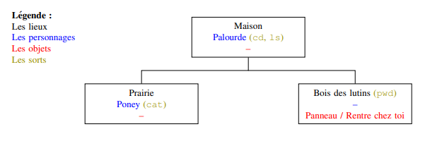

## Terminus

**Terminus** est un jeu gratuit permettant de se familiariser avec le shell UNIX.

Dans ce TP vous allez decouvrir un certain nombres de commandes UNIX, utilisable dans le Shell (ou encore dans un terminal) en ´
jouant a un jeu en ligne : TERMINUS.


## Jouer 

Vous trouverez ce jeu [ici](http://luffah.xyz/bidules/Terminus/)

## Travail à faire :

1. Construire un plan des salles du jeu, à l'image de celui-ci :
     
2. Finir le jeu

### Commandes utilisées

```bash
$ cat fichier               # affiche le contenu d'un fichier
$ ls  [dossier]             # affiche le contenu d'un dossier
$ cd dossier                # se déplace dans le dossier
$ pwd                       # affiche l'adresse du dossier courant
$ help                      # affiche l'aide courante (spécifique au jeu)
$ man commande              # affiche l'aide d'une commande
$ mv objet destination      # déplace `objet` vers sa `destination`
$ ./executable              # pour exécuter une commande présente dans un dossier
```
