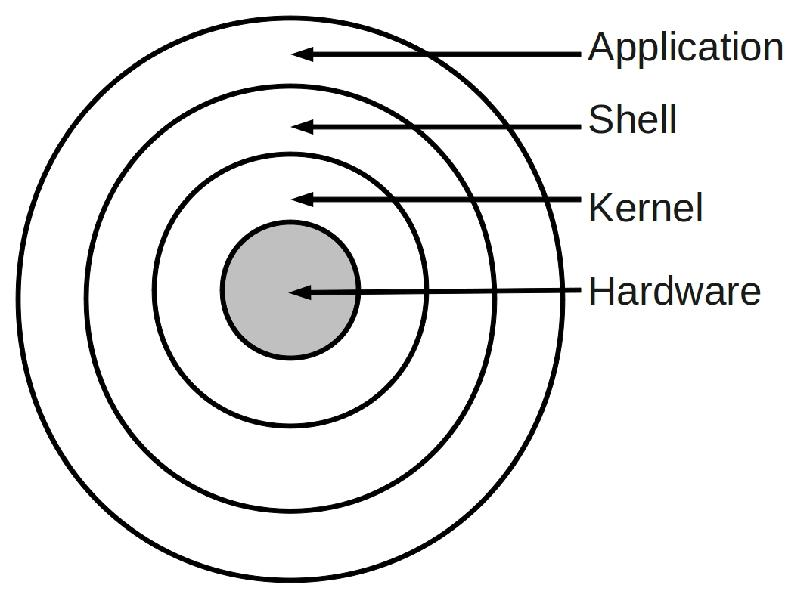
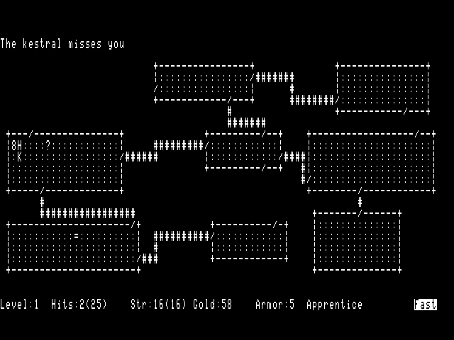
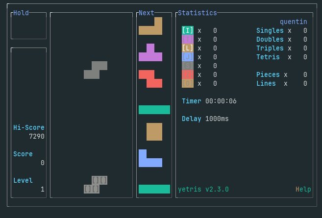
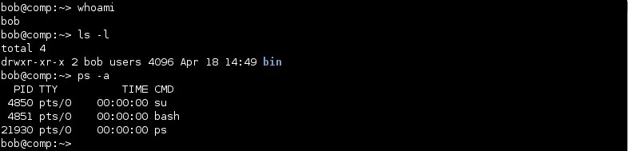

# Résumé 

## Système d'exploitation


Le systèmes d'exploitations (OS) sont des logiciels spécialisés qui servent
d'intermédiaire entre le matériel et l'utilisateur.

Ils rendent l'utilisation du matériel possible et sûre.

Les grandes _familles_ de systèmes d'exploitation modernes sont UNIX et Windows.


## 3 concepts clé

### La mémoire virtuelle

Lorsque plusieurs application tournent en même temps, elles se partagent la mémoire. Afin d'éviter qu'elles n'écrivent toutes au même endroit, l'OS utilise la mémoire virtuelle. Plutôt que de laisser une application écrire où elle veut, elle donne une nouvelle adresse aux emplacements mémoire retient dans une table les adresses virtuelles employées. Ainsi plusieurs applications peuvent tenter d'écrire à l'adresse "2" en même temps sans que cela n'occasionne de collision.

 

### L'ordonnancement des instructions

Les coeurs de processeur ne peuvent traiter qu'une instruction à la fois. Mais chaque application qui fonctionne nécessite de très nombreuses instructions à exécuter. Afin de permettre à plusieurs applications d'avancer régulièrement et ainsi de ne pas paralyser le système, l'OS utilise un logiciel appelé ordonnanceur (_scheduler_ en anglais). Celui-ci change d'application régulièrement via un procédé appelé _changement de contexte_. Ainsi les applications avancent régulièrement et cela fournit l'_illusion du multitâche._

 

Ces notions sont étudiées plus en détail en terminale.

### Les interruptions matérielles

Comment rendre compatibles des milliers de variantes d'un même type de matériel (comme un microphone, un clavier, une imprimante, une carte graphique...) qui communiquent différemment avec la machine sans devoir rééecrire les logiciels pour chacun de ces périphériques ?

On emploie les _appels système_. L'OS contient des _pilotes_ (_drivers_ en anglais) dont le rôle est d'assurer la communication avec le matériel. Ainsi, l'application "Téléphone" de votre smartphone n'a rien à savoir du microphone installé dans votre smartphone. C'est l'OS qui s'assure de cette liaison.

D'autre part, comment écouter le microphone ?


Lorsque vous passez un appel, "Téléphone" (l'application elle même) demande d'écouter les signaux émis par le microphone (qui transforme le son de votre voix en signaux électriques à destination du smartphone). Lorsqu'un signal est émis, l'OS émet une _interruption_ traitée par l'ordonnanceur (voir plus haut). L'OS se charge alors d'exécuter le pilote du microphone pour convertir ce signal electrique en données utilisable par l'application elle même.

Pas besoin d'écrire des milliers de versions de l'application, il suffit de connaître les appels systèmes en question.

Mais qui écrit les pilotes ? Souvent le fabriquant lui même, parfois des développeurs du noyau.

### Autres rôles de l'OS

Le système d’exploitation :

- fournit une interface entre l’humain et la machine
- gère les ressources de l’ordinateur (mémoire, processeur, périphériques, énergie …)
- gère les utilisateurs ainsi que leurs droits d’accès
- est indépendant du matériel
- rend concret ce qui ne l’est pas (un fichier est par essence abstrait mais nous le considérons bel et bien comme une entité concrète.)


### Les couches d'un OS

On rencontre, du plus bas au plus haut niveau :

- Le matériel (hardware) : signaux électriques -> 010111000111
- Le noyau (kernel) : proche du métal. Lance la machine, gère la carte graphique, le réseau etc.
- La coquille (shell) : programme qui permet d'exécuter des utilitaires et d'intéragir (via les fenêtres ou le terminal)
- les applications comme ls ou firefox : les programmes qu'on fait tourner grâce au shell



## Linux

Les deux grandes familles d'OS grand public sont Windows (vous connaissez) et UNIX.

Linux fait partie de la "famille" UNIX comme OSX (Macintosh), iOS (iPhone) ou BSD (surtout employé dans les serveurs).

Linux est un _noyau_ de système d'exploitation associé à une multitude de distributions différentes. L'ensemble forme GNU/Linux, une multitude d'OS différents partageant le même noyau mais fournissant des fonctionnalités différentes.

On trouve Linux dans presque _toutes_ les machines : votre switch, votre smartphone, le routeur de l'étage, un chromecast, la voiture de vos parents, le serveur qui héberge ce site etc.

Par exemple, les puces réseau des smartphone font tourner un ordinateur qui utilise Linux. Donc si vous avez un android... il y a 2 noyaux linux qui tournent en permanence dessus. 

C'est un noyau Open Source (concept développé POUR Linux) et Linux est le plus grand projet open source. C'est un des plus grands projets mondiaux.
Votre smartphone utilise ~4 millions de lignes de code du noyau...

Linux a été créée en 1991 par Linux Torvald qui s'en occupe toujours à cette date. La majorité du code Linux est écrit en C.

Le projet UNIX lui même remonte aux années 1970. On a inventé le langage C pour ce projet.

### Le shell

- On s'intéresse (un peu) au matériel dans la partie [_architecture_](../../architecture/),
- Le noyau est (à juste titre) totalement hors programme,
- Les applications, vous commencez à connaître grâce à Python...

Penchons-nous sur le Shell.

C'est l'interface gérée par l'OS entre le noyau et les applications.

Il permet de "lancer" des applications via une interface soit graphique soit textuelle. Cela permet, par exemple, de communiquer en mode texte avec une machine distante et d'en prendre le contrôle.

Donc, certaines applications :

- utilisent des fenêtres graphique (chrome, firefox, sublime text, thonny etc.). On parle de GUI (Graphical User Interface),
- utilisent une interface textuelle (CLI Command Line Interface ou TUI Terminal User Interface).
    La distinction entre CLI et TUI tient au fait qu'en mode CLI (comme avec `ls`), vous tapez une commande et obtenez une réponse, tandis qu'en mode TUI (comme avec `top`), l'application dessine des fenêtres dans la console.

_Il y a même des jeux dans le terminal : ci-dessous une version de Rogue, remontant aux années 80_



_Ou yetris, un peu plus récent :_

 

Un peu de vocabulaire :

- **Shell** : Un shell Unix est un _interpréteur de commandes_ destiné aux systèmes d'exploitation Unix qui permet d'accéder aux fonctionnalités internes du système d'exploitation. Il se présente sous la forme d'une CLI accessible depuis la console ou un terminal
- **Terminal** : point d’accès de communication entre l'homme et un ordinateur central ou un réseau d'ordinateurs. il désigne par abus de langage une fenêtre d'invite de commande donnant accès à un shell Unix.
- **Console** : périphérique informatique de télécommunications des entrées-sorties d'un système de traitement de l'information. C'est généralement un terminal dédié uniquement à l'envoi et au retour des commandes.


Mais alors, qui dessine les fenêtres ?

Un gestionnaire de fenêtre exécuté par le terminal et qui va lancer / arrêter les applications de l'utilisateur.

### Commandes de base du shell 



On peut taper des commandes dans le shell et tout contrôler d'une machine. Pour les informaticiens, c'est un mode d'utilisation courant et très puissant.

Voici les commandes de base permettant de manipuler des fichiers :


### Naviguer

* `ls` : liste les fichiers du dossier courant
* `ls -lah` : affiche aussi les fichiers cachés, avec les détails et les tailles dans des unités compréhensibles
* `cd` : change le dossier courant. `cd ~` vous envoie dans votre dossier. `cd ..` remonte d'un étage. `cd /` vous mène à la racine.
* `pwd` : (print working directory) : affiche l'addresse du dossier courant.

### Créer, effacer

* `cp` : Copie un fichier de départ vers une nouvelle destination `cp cassoulet.txt /home/robert/recettes/` va ajouter le fichier cassoulet.txt au dossier recettes.
* `mv` : Déplace un fichier. On peut le déplacer dans un dossier, ou lui attribuer un nouveau nom au passage.
* `touch` : Accède aux propriétés d'un fichier. Si un fichier existant est fourni, sa date d'édition est mise à jour. S'il n'existe pas il est crée.
* `mkdir` : "MaKe DIRrectory". Crée un dossier. `mkdir -p dir1/dir2/dir3` pour créer les dossiers intermédiaires si nécessaire.
* `rm` : Efface un dossier. Avec `rm -r` on efface récursivement et avec l'option `f` on "force". Danger : pas de confirmation sous UNIX.

### Utilitaires

* `clear` : Descend la console d'une centaine de lignes (vide le terminal...).
* `cat` : Concaténer. Nombreux usages, le plus courant est d'afficher le contenu d'un fichier dans la console.

## Le système de fichier UNIX 

Linux, qui dérive d'UNIX, reprend le principe du système de fichiers.

Une idée **majeure** est que tout le matériel et toutes les applications sont présentées comme des fichiers.

Je peux :

- consulter l'état d'un programme en cours d'exécution en lisant des fichiers,
- accéder aux bits émis par un périphérique USB en lisant un fichier,
- imprimer un pdf en écrivant dans le fichier de l'imprimante,
- produire du son en écrivant dans le fichier de la carte son sur laquelle est branchée l'enceinte,
- envoyer des informations à un programme en cours d'exécution en écrivant dans un fichier,
- lire un fichier... en lisant un fichier.

Cela fournit une interface commune à tous les périphériques et programmes en cours d'exécution.

Certains de ces fichiers ne correspondent donc pas à un "fichier" du disque dur.


### Arborescence UNIX 

On retrouve la même arborescence sur toutes les machines UNIX. C'est très commode !

```sh
/           - root, la racine du système
+-- bin     - Commandes de base du système
+-- dev     - Fichiers représentant les dispositifs matériels (devices) du système
+-- etc     - Fichiers de configuration du système
+-- home    - Répertoire d accueil (HOME) des utilisateurs
+-- lib     - Librairies partagées entre les programmes
+-- mnt     - Points de montage (clés usb etc.)
+-- proc    - Etat du système et de ses processus
+-- root    - Répertoire de l administrateur système
+-- run     - Variables d etat du système depuis le boot
+-- sys     - Informations sur le noyau et les périphériques
+-- usr     - Logiciels installés avec le système, base de données etc.
+-- var     - Données fréquemment utilisées et modifiées
```

Les adresses des fichiers et dossiers sont séparées par des `/`

Par exemple : `/home/quentin/boulot/NSI/devoirs/DS1.pdf`


### Le système de permissions

Chaque fichier de l'arborescence appartient à _un utilisateur_  et _un groupe_. Souvent groupe = utilisateur mais pas toujours en ce qui concerne le matériel. Par exemple `bluetooth` est le groupe des utilisateurs qui ont accès au périphériques... utilisant le bluetooth.

Chaque fichier a 3 types de permissions :

- `r` (Read) : peut-on lire son contenu ?
- `w` (Write) : peut-on écrire dedans ?
- `x` (eXecute) : peut-on l'exécuter ou, pour un dossier, le traverser ?

... pour 3 types de personnes :

- le propriétaire,
- le groupe,
- tout le monde.

Par exemple, avec `ls -lah` :

```
% ls -lah
total 4K
drwxr-xr-x   3 quentin quentin 4,0K  9 déc.   2024 .
drwxr-xr-x  18 quentin quentin 4,0K  7 juin  09:43 ..
-rw-r--r--   1 quentin quentin    0 16 déc.   2023 bonjour.txt
-rwxr-xr-x   1 quentin quentin    0 16 déc.   2023 programme_cool
drwxr-xr-x   2 quentin quentin 4,0K  5 mai   18:16 dossier1
```

Donc ici :

- `quentin quentin` "quentin" (moi, héhé) possède tous ces fichiers dont le groupe s'appelle aussi "quentin"

**.** est un lien vers le dossier courant (voir tout en bas à quoi ça sert),

**..** est un lien vers le dossier parent,

**bonjour.txt** (`-rw-r--r--`):  

- `-`   : fichier normal,
- `rw-` : JE peux lire et écrire, pas l'exécuter.
- `r--` : mon groupe peut lire,
- `r--` : tout le monde peut lire.

**programme_cool** (`-rwxr-xr-x`)

- `-` : fichier normal 
- `rwx` : Je peux lire, écrire et l'exécuter,
- `r-x` deux fois : mon groupe et les autres utilisateurs peuvent le lire et l'exécuter.

**dossier1** (`drwxr-xr-x`)

- `d` : c'est un dossier,
- `rwx` : je peux consulter son contenu, y modifier les fichiers, le traverser,
- `r-x` deux fois : mon groupe et les autres utlisateurs peuvent consulter son contenu et le traverser.

On change les permissions avec `chmod`.

Par exemple, après avoir compilé avec `gcc` un code source `snake.c` écrit en C, on obtient un fichier `snake`... qu'il faut _rendre exécutable_ avant de l'exécuter :

```sh 
$ gcc -o snake snake.c 
$ chmod +x snake 
$ ./snake
```

Le `./` avant `snake` force le shell à chercher dans le dossier courant plutôt que de me dire qu'il ne connait pas ce fichier.
