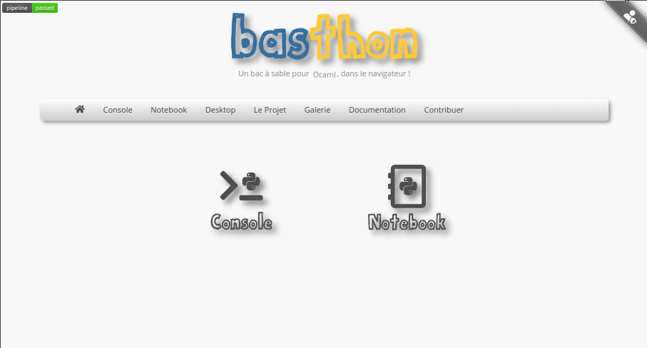
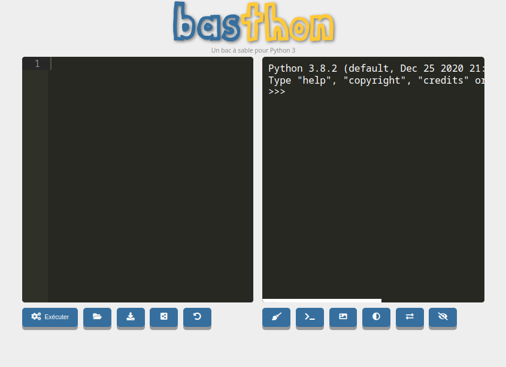
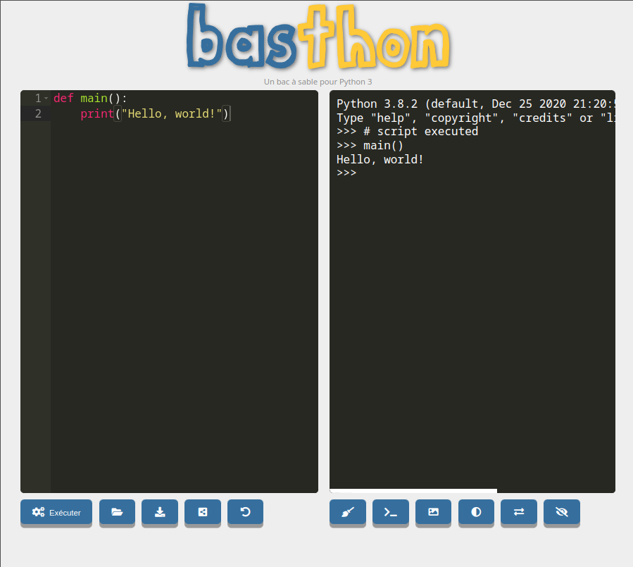
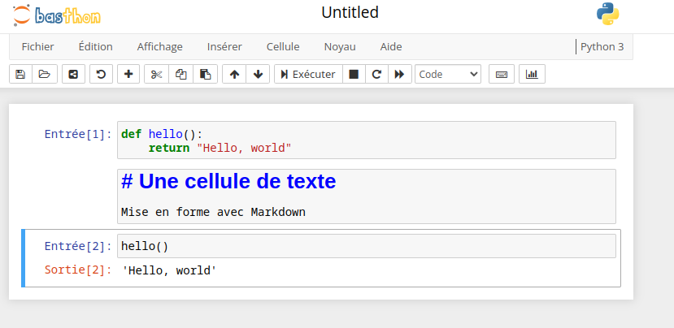

[pdf](./basthon.pdf)

# Basthon

Basthon est un éditeur de code en ligne qui permet d'exécuter plusieurs langages dont Python.



Basthon propose :

- un éditeur de code,
- un interpréteur,
- un éditeur et serveur de notebook jupyter.

Basthon permet d'exécuter des scripts python relativement élaborés sans installer quoi que ce soit.

Ce n'est pas suffisant en toute circonstance et il y a des limites mais cela vous permet de travailler sur n'importe quel ordinateur disposant d'un accès à internet et d'un navigateur relativement récent.

## Basthon "Console"



- à gauche une fenêtre d'édition,
- à droite un interpréteur

Les boutons sont assez intuitifs pour que je n'ai pas à les présenter.

Retenez qu'on peut exporter ou charger un fichier assez facilement et que certaines librairies sont déjà présentes.

Basthon, comme d'autres outils utilise une technologie appelée "Web Assembly" qui permet d'exécuter n'importe quel programme, écrit dans n'importe quel langage, dans le navigateur.

C'est une construction délicate, difficile et de nombreux bugs persistent. Cependant, globalement ça marche.

```python
def main():
    print("Hello, world")
```



Dans l'éditeur (à gauche) on a crée une fonction puis exécuté le script.

Dans l'interpréteur (À droite) on peut voir que la fonction est chargée en mémoire et accessible.

## Basthon notebook



Le serveur de Notebook de Basthon permet d'exécuter des calepins jupyter dans différents langages.
Pour des questions de commodité nous utiliserons plutôt Google Colab mais cela reste un excellent outil.
