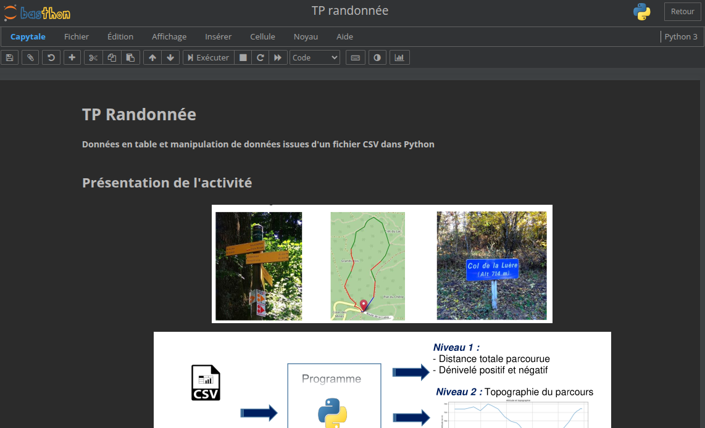
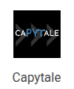

## Capytale

 

## Qu'est-ce ?

Capytale est la combinaison d'un serveur de calepins (_jupyter notebook_) et d'un gestionnaire de devoirs.

C'est donc un outil très similaire à Google Colab. Un énoncé pour l'un est utilisable dans l'autre.

Il permet d'envoyer des sujets à une classe, de collecter les copies et de les évaluer.

Les sujets prennent la forme de calepins dans lesquels vous pouvez ajouter des cellules de deux types :

- Cellules de texte dans lesquelles écrire l'énoncé, les explications et des réponses texte,
- Cellules de code (Python mais pas que !) dans lesquelles on peut écrire du code et l'exécuter.

## Accéder à Capytale via l'ENT 

 

L'application Capytale est accessible directement via l'ENT. Vos travaux sont donc naturellement associés à vos noms et prénoms et il vous suffit de vous connecter.

